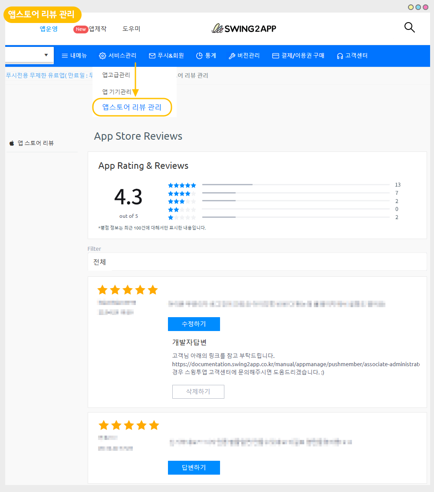
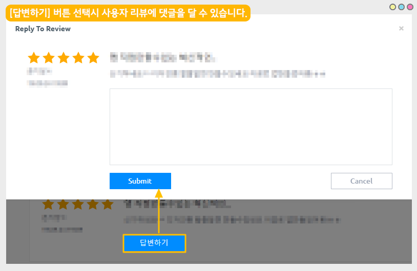

# 스윙투앱 업데이트

<figure><figcaption></figcaption></figure>

**\[업데이트 내용]**

#### 앱스토어 리뷰 관리 페이지 오픈

<figure><figcaption></figcaption></figure>

##  **앱스토어 리뷰 관리 페이지 오픈**

<figure><figcaption></figcaption></figure>

**앱스토어에 출시된 앱의 평가와 리뷰를 볼 수 있는 앱스토어 리뷰 관리 페이지가 새롭게 오픈 되었습니다.**&#x20;

앱스토어에서 제공하는 리뷰 API를 스윙투앱에 연동하여 개발이 완료되었습니다.

앞으로 앱스토어 리뷰도 스윙투앱에서 쉽고 간편하게 이용할 수 있습니다.&#x20;

<mark style="color:blue;">**앱스토어 리뷰 관리란?**</mark>

앱스토어의 경우, 애플 개발자 계정으로 로그인 된 아이폰 기기에서만 앱 리뷰에 대한 댓글 작성이 가능합니다.

따라서 사용자 계정이 아닌 스윙투앱 계정으로 앱스토어에 등록된 앱은 리뷰 확인 및 댓글 작성이 불가했습니다.&#x20;

불편하신 사항을 수렴하여 업데이트를 완료했으며, 이제 스윙투앱에서 제공하는 앱스토어 리뷰 관리 페이지에서 앱 평가 점수와 사용자 리뷰를 확인하고 댓글까지 직접 작성할 수 있습니다.

리뷰에 대한 댓글을 작성하여 제출하면 앱스토어에 연동되며, 아이폰에서 즉시 입력된 댓글을 확인할 수 있습니다.&#x20;

###  **이용 조건**

\*앱스토어 리뷰 관리 페이지는 먼저 앱스토어에 앱이 출시 되어있어야 이용 가능하며, 아래 조건에 해당하는 분들만 이용 가능합니다.

**1)일반 프로토타입 앱 이용시**

확장형 이상(확장형 이용권, 프리미엄 이용권 해당)의 이용권을 구매하신 분들에게만 제공됩니다. (기본형, 알뜰형 등의 상품은 이용 불가)

**2)푸시앱 이용시**

푸시 무제한 유료앱 이용시에만 이용 가능합니다. (기본형 이용권은 이용 불가)

<mark style="color:red;">\*웹뷰앱은 이용 불가합니다.</mark>

구매하신 이용권 상관없이 웹뷰앱에서는 제공이 되지 않습니다.

###  **이용방법**

<figure><figcaption></figcaption></figure>

[앱운영 – 서비스관리 – 앱스토어 리뷰 관리](http://www.swing2app.co.kr/view/apple\_app\_store\_review\_list) 메뉴 이동하시면 확인 가능합니다.

1\)앱스토어 리뷰 페이지에서는 해당 앱에 매겨진 평균 평점과 별점 표시

2\)해당 앱에 작성된 리뷰 글을 모두 모두 볼 수 있습니다.

3\)리뷰글에 댓글을 달면(답변하기 버튼), 바로 앱스토어 및 아이폰으로 연동이 되어 보여집니다.

4\)필터 기능을 이용하여 별점 별 5점, 4점, 3점 .... 등을 선택해서 볼 수 있습니다.

\*평점 정보는 모든 히스토리를 다 불러오지는 못하고 최근 100건에 대해서만 표시됩니다.

\*5점 만점이며 해당 앱에 매겨진 평점이 표시됩니다.

<mark style="color:blue;">**답변 작성하기**</mark>

<figure><figcaption></figcaption></figure>

사용자가 작성한 리뷰글에 댓글을 달 수 있어요.

\[답변하기] 버튼 선택하여, 내용을 입력 후 \[Submit] 버튼을 선택합니다.

작성된 댓글은 즉시 앱스토어에 연동되어, 아이폰에서 입력된 댓글을 확인할 수 있습니다.

### .png) 안내사항


1\)앱스토어에 앱이 출시된 경우에만 이용 가능합니다.&#x20;

무료버전앱 혹은 유료앱이지만 플레이스토어만 출시해서 이용하시는 분들은 해당 기능 접근이 불가합니다.&#x20;

2\)스윙투앱 계정이 아닌, 사용자의 애플 개발자 계정으로 등록하신 분들도 이용 가능합니다.

앱스토어 리뷰 관리 페이지에서 보다 편하게 리뷰 확인 및 댓글 입력이 가능합니다.

3\)앱에 달린 리뷰가 없을 경우 아무 내용도 표시 되지 않습니다.

4\)평점 정보는 모든 히스토리를 다 불러오지는 못하고 최근 100건에 대해서만 표시됩니다.


<figure><figcaption></figcaption></figure>

