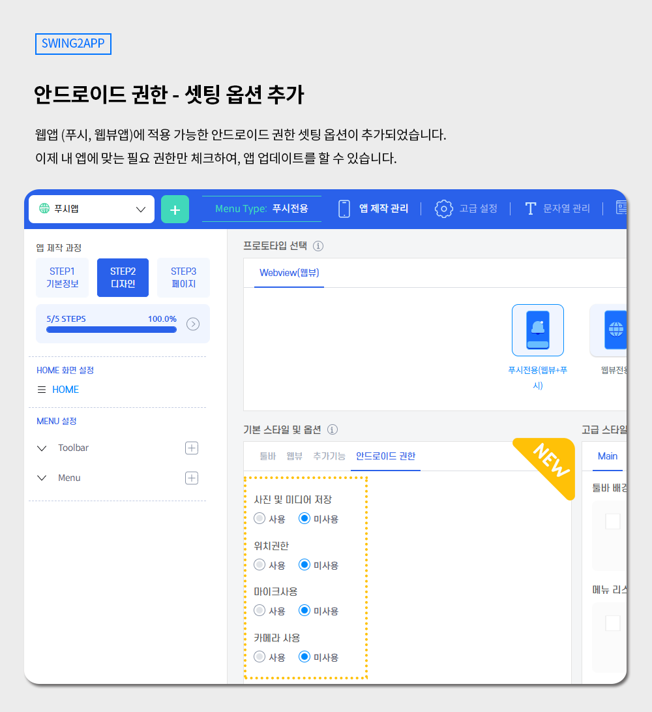
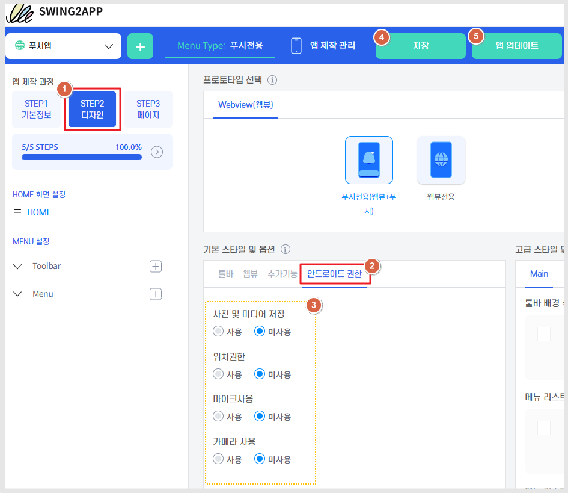
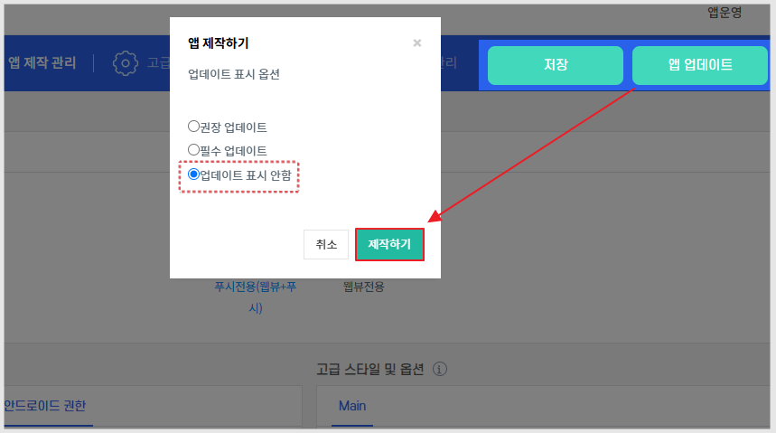

# 스윙투앱 업데이트

**\[업데이트 내용]**

**안드로이드 권한 셋팅 기능 신규 출시 - 웹앱 대상**

***

##  **안드로이드 권한 셋팅 기능 신규 출시**&#x20;

<figure><figcaption></figcaption></figure>

**어떤 내용인가요?**

안드로이드에서는 앱 이용시, 앱에서 어떤 권한이 필요한지를 체크하게 되는데요.

일반적으로 위의 권한이 앱에서 셋팅이 되어 제공되고 있습니다.


\-사진 및 미디어 (읽기/저장)

\-위치 권한 (지도, 내 위치 허용)

\-마이크 사용 (파일 첨부 - 영상 녹화시 이용)

\-카메라 사용(파일 첨부- 사진 촬영시 이용)


**위의 권한은 웹뷰, 푸시앱제작시 필수로 제공되어 제작이 되었습니다.** <mark style="color:red;">\*일반 프로로타입앱은 사용 불가</mark>

위의 기능은 기존에는 고정값으로 저희가 소스 내에 권한을 셋팅해서 제공했기 때문에 사용자분들이 직접 설정이 불가했는데요.

이제 사용자분들이 직접 권한 값을 셋팅할 수 있도록 제작 화면에 기능을 추가해놓았습니다.&#x20;

앱 마다 사용하는 권한이 다른 만큼 내 앱에 맞는 권한을 체크하여 제작할 수 있습니다.


활용 예시) 우리 앱은 정보를 제공하는 앱이라서 사용자 위치를 수집할 필요가 없어요. 위치 권한을 사용하지 않아요 → "위치 권한" 미사용으로 체크할 수 있습니다.

이렇게 미사용으로 체크하면, 앱 설치시 권한 팝업 안내가 뜨지 않구요.&#x20;

플레이스토어 제출시에도 문제없이 심사 받을 수 있습니다.


***

###  **이용방법 : 웹뷰, 푸시앱에만 해당 됩니다.**&#x20;

<figure><figcaption></figcaption></figure>

앱제작 STEP2디자인 - 기본 스타일 및 옵션: 안드로이드 권한 선택 - 각 권한별 사용 or 미사용으로 체크 - 저장 - 앱 업데이트 버튼 선택

<figure><figcaption></figcaption></figure>

사용자들에게는 업데이트 된 기능이 없으므로, 업데이트 유형은 "업데이트 표시 안함"으로 체크해고 제작해주세요.

\*반드시 업데이트를 해주셔야 반영됩니다.

\*플레이스토어에 출시된 분들은, 새로 제작된 버전으로 플레이 콘솔 프로덕션에도 앱을 제출해주셔야 합니다. (업데이트 제출)

###  안내사항


접근 권한 제어, 브랜드 관리 기능은 모두 아래의 사용 조건에 충족해야 이용이 가능합니다.

해당 기능은 일반 프로토타입 앱에서는 이용이 불가합니다.&#x20;

**\*푸시앱, 웹뷰앱과 같은 웹앱에서만 사용 가능합니다.**

일반 프로토타입앱은 제작 시스템에 따라 권한이 꼭 제공이 되어야 합니다. \*사용자가 임의적으로 권한을 삭제하거나 변경할 수 없습니다.

이용에 참고 부탁드립니다.


***

