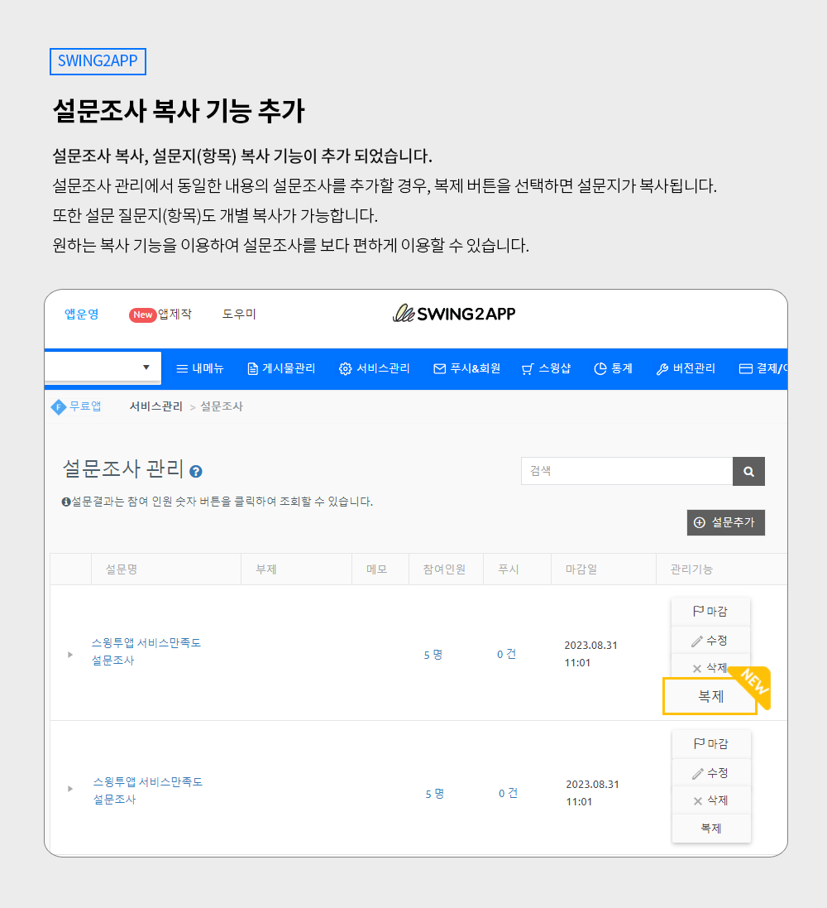
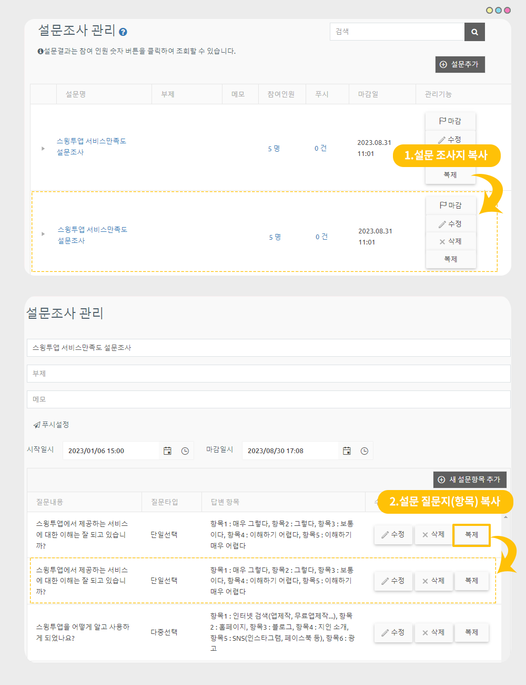

# 스윙투앱 업데이트

<figure><figcaption></figcaption></figure>

**\[업데이트 내용]**

1.설문조사 – 설문지 복사&질문 복사 기능 업데이트\

\*이번 업데이트 된 기능은 일반 프로토타입 앱에서 이용 가능한 기능입니다.

웹뷰앱, 푸시앱 이용자분들은 해당 사항 없습니다.

<figure><figcaption></figcaption></figure>

##  설문지 복사 기능 출시

<figure><figcaption></figcaption></figure>

**설문지 복사, 설문지 항목(질문) 복사 기능이 추가되었습니다.**

설문조사 관리에서 동일한 내용의 설문조사를 추가할 경우, 복제 버튼을 선택하면 설문지가 복사합니다.

또한 설문지 개별 질문지(항목)도 복사가 가능합니다.

동일 내용의 설문지를 만들거나 동일 질문을 추가할 경우 복사 기능을 이용하여 보다 편하게 이용할 수 있습니다.

\

###  **이용방법**

<figure><figcaption></figcaption></figure>

\*별도 앱 업데이트 없이 바로 이용 가능합니다.

[앱운영→ 서비스관리→ 설문관리](https://www.swing2app.co.kr/view/survey) 이동

설문지를 아직 만들지 않았다면 \[설문추가] 버튼을 선택해서 설문조사지를 먼저 만들어주세요.

\-설문조사지를 만든 후 \[복제]버튼을 확인할 수 있습니다.

\-질문 복사는 설문지를 선택하면 설문지 상세 페이지로 이동하며, 각 질문(항목) 별로 \[복제]버튼을 확인할 수 있습니다.

복제 버튼 선택시 리스트 가장 아래에 복사된 글이 생성됩니다.

설문조사 이용방법은 아래 매뉴얼을 확인해주세요.



### .png) 안내사항


​1)앱운영에서 제공되는 기능으로 별도 앱 업데이트 없이 바로 이용 가능합니다.

2\)설문지가 있어야 복사 기능 이용이 가능하므로, 설문지가 없을 경우 먼저 만들어서 이용해주세요.

3\)해당 기능은 일반 프로토타입으로 제작한 앱만 이용 가능한 기능이며, 웹사이트를 연결한 웹뷰앱, 푸시앱은 해당 사항 없습니다


<figure><figcaption></figcaption></figure>

