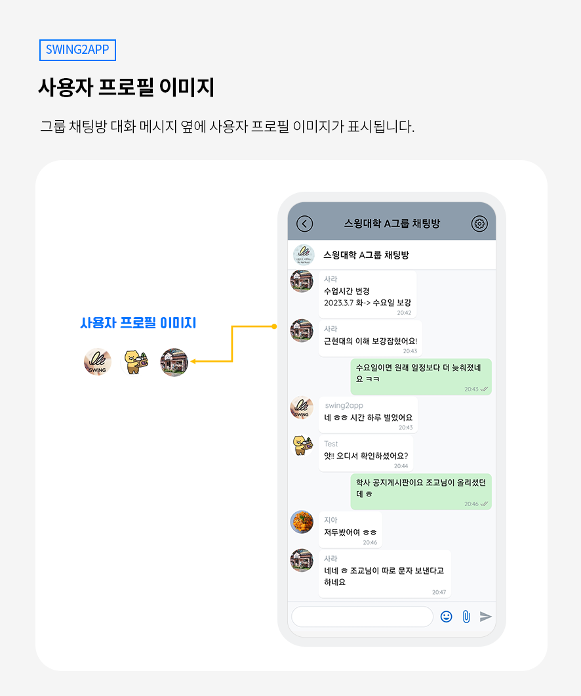

# 스윙투앱 업데이트

<figure><figcaption></figcaption></figure>

<mark style="color:blue;">**그룹채팅 기능이 새롭게 업데이트 되었습니다! (기능 다수 업데이트)**</mark>

\
사용자와 관리자와 다수 구성원의 채팅이 가능한 그룹채팅!

그룹채팅은 2023년 상반기 업데이트 오픈 목표로 총력을 기울였는데요.&#x20;

드디어 사용자분들께 그룹채팅 업데이트 소식을 전달해드릴 수 있게 되었습니다.

이전의 그룹채팅과는 완전히 달라진! 다양한 기능 개발 및 개선 작업이 이루어졌습니다.&#x20;

그룹채팅에서 어떤 기능들이 추가되고, 새로워졌는지 확인해주세요!

<figure><figcaption></figcaption></figure>

###  **1.이전 대화목록 확인 가능**

그룹채팅의 업데이트 기능 중 가장 큰 개선 사항은!&#x20;

채팅방에 접속해 있지 않아도, 다른 사용자들이 나눈 대화목록을 확인할 수 있습니다.&#x20;

업데이트 전 그룹채팅은 채팅방에 접속하지 않았을 때는 다른 사용자들이 주고 받은 대화목록을 확인할 수 없었어요.

그러나 업데이트 이후, 채팅방에 접속한 상태가 아니라도 사용자들이 채팅방에서 주고 받은 대화목록을 확인할 수 있습니다.

\*이전 대화 목록 확인은, 앱 설치 및 실행 후 최초 한번이라도 그룹채팅방에 접속한 이력이 있어야 이용 가능합니다.&#x20;

###  **2.프로필 이미지 생성**

<figure><figcaption></figcaption></figure>

사용자 프로필 이미지가 신규 추가되었습니다.&#x20;

대화 메시지 옆에 프로필 이미지가 표시됩니다.&#x20;

여러 명의 사용자가 들어와서 채팅을 하는 공간이기 때문에 보다 쉽게 사용자를 구분할 수 있습니다.&#x20;

단, 사용자가 프로필 이미지를 등록하지 않을 경우 기본 셋팅 이미지로 보여집니다.&#x20;

\

###  **3.채팅 알림 푸시 개선**

<figure><figcaption></figcaption></figure>

채팅방 대화시 메시지 외에 이미지, 이모티콘 입력시 푸시 알림 발송이 들어오지 않는 문제를 개선했습니다.

이제 채팅 메시지 뿐만 아니라 이미지, 첨부파일, 이모티콘 발송시 모두 푸시 알림 발송이 들어오도록 개선되었습니다.

\

###  **4.이모티콘, 파일 첨부 버튼 추가**

<figure><figcaption></figcaption></figure>

메시지 입력란에 이모티콘 버튼과 파일 첨부 버튼이 추가되었습니다.

핸드폰 모바일에서 사용되는 다양한 이모티콘을 입력할 수 있구요.&#x20;

파일 첨부-이미지 파일부터 pdf, word 등 다양한 문서의 파일유형도 첨부 가능합니다.&#x20;

\

###  **5.메시지 수정, 삭제 기능 추가**

<figure><figcaption></figcaption></figure>

메시지 수정 기능 및 삭제 기능을 추가했습니다.

메시지 발송 후 잘못된 내용은 수정하고, 삭제할 수 있습니다.&#x20;

내가 작성한 메시지 탭 한 뒤→ 체크 버튼 선택→ 수정하기 or 삭제하기를 이용할 수 있습니다.&#x20;

\

###  **6.메시지 읽음 처리 기능 추가**

<figure><figcaption></figcaption></figure>

내가 보낸 채팅 메시지를 다른 사용자들이 읽었는지 확인할 수 있는 읽음 처리 표시 기능이 추가되었습니다.&#x20;

단, 읽음처리가 숫자로 카운팅 되는 방식은 아닙니다.&#x20;

\*채팅방에 접속된 모든 구성원이 메시지 확인시→ 체크 표시가 파란색으로 표시

\*다 읽지 않은 메시지는→ 체크 표시가 회색으로 표시 됩니다.&#x20;

\

###  **7.답장 기능 추가**&#x20;

<figure><figcaption></figcaption></figure>

특정 사용자에게 답장을 하고 싶을 경우 사용자 메시지란에 답장을 선택해서 메시지를 보낼 수 있습니다.

메시지 탭 한 뒤→ 체크 버튼 선택→ 답장 선택→ 해당 메시지에 대한 답장을 작성해서 보낼 수 있습니다.&#x20;

### &#x20; **8.메시지 신고하기**

<figure><figcaption></figcaption></figure>

사용자들이 글을 입력하고, 대화를 할 수 있는 커뮤니티 공간에는

사용자 제작 컨텐츠(UGC) 정책에 따라 신고하기 기능이 제공되어야 하죠.&#x20;

채팅방에서도 메시지에 대한 신고 기능을 추가했습니다.

메시지 탭 한 뒤→ 체크 버튼 선택→ 신고하기 기능을 이용할 수 있습니다.&#x20;

\*신고가 들어간 글은 스윙투앱 대시보드에서 관리자가 확인 가능합니다.

다만, 신고글 확인은 아직 오픈이 되지 않았습니다. 오픈이 완료되면 서비스관리→ 앱 신고 관리 페이지에서 확인이 가능합니다.&#x20;

\

###  **9.이미지 보기, 다운로드 기능**

<figure><figcaption></figcaption></figure>

대화그룹채팅방에 등록된 이미지를 선택하면 다운로드, 미리보기 버튼이 생성됩니다.

다운로드 버튼 선택시 핸드폰 내에 이미지를 저장할 수 있구요.

미리보기 선택시 새로운 웹 페이지 창으로 이미지 확인이 가능합니다.

\

###  **10.GIF 움짤 이미지 등록 개선**

<figure><figcaption></figcaption></figure>

움짤 이미지.gif 이미지는 기존 그룹채팅방에서는 등록이 불가했지만,업데이트 된 그룹채팅방에서는 움짤 이미지 등록이 가능합니다.

\

###  **11.채팅방 속도 개선**

대화내용을 불러오는 속도, 메시지 수신 속도 등의 전반적인 기능 속도를 개선하였습니다.&#x20;

\

###  **12.대화목록 저장기간**&#x20;

그룹채팅은 현재 베타 오픈 기간으로 현재는 저장기간을 따로 두지 않고 있습니다.\_유료 사용자에 한함

단, 정식 오픈 후 유료앱 이용자도 이용권별로 등급을 기간 차등이 있을 예정입니다.

데이터 저장기간은 다시 공지 드리겠습니다.&#x20;

\*무료 사용자의 대화목록 데이터 저장기간은 3개월입니다.&#x20;

***


<mark style="color:blue;">**안내사항**</mark>

****

1\)그룹채팅 신규 기능은 앱 업데이트 해야 반영이 됩니다. \*앱제작 화면 이동 – 앱 업데이트 선택

2023년 2월 이후 새로 제작된 앱은 자동으로 해당 기능으로 반영되어 앱 이용 가능

2023년 2월 이전에 제작된 앱은 업데이트를 해주세요.

기존 앱이 스토어(플레이스토어, 앱스토어)에 출시된 상태라면, 새로 제작된 버전으로 앱 업데이트를 해야 합니다.

2\)그룹채팅 기능은 스윙투앱 일반 프로토타입(슬라이드, 푸터, 탑 등)으로 제작된 앱에서만 제공되는 앱 기능입니다.

웹사이트를 연결한 웹뷰, 푸시앱은 그룹채팅 이용이 불가합니다.&#x20;

3\)사용자들 역시 앱을 업데이트 해야 위에서 안내 드린 신규 기능들을 이용할 수 있습니다.

예를 들어, 업데이트 하지 않은 사용자는 이전 기능을 이용하고 있기 때문에 이전 대화 목록 등 메시지 확인이 불가하며 신규 적용된 모든 기능 이용이 불가합니다.&#x20;

4\)그룹채팅은 계속해서 추가적으로 기능들이 개선되고 업데이트 되고 있습니다.

문제가 있거나 개선이 필요한 기능은 문의게시판을 통해 피드백 주시면 계속해서 보안 할 수 있도록 하겠습니다.&#x20;


****

<figure><figcaption></figcaption></figure>
