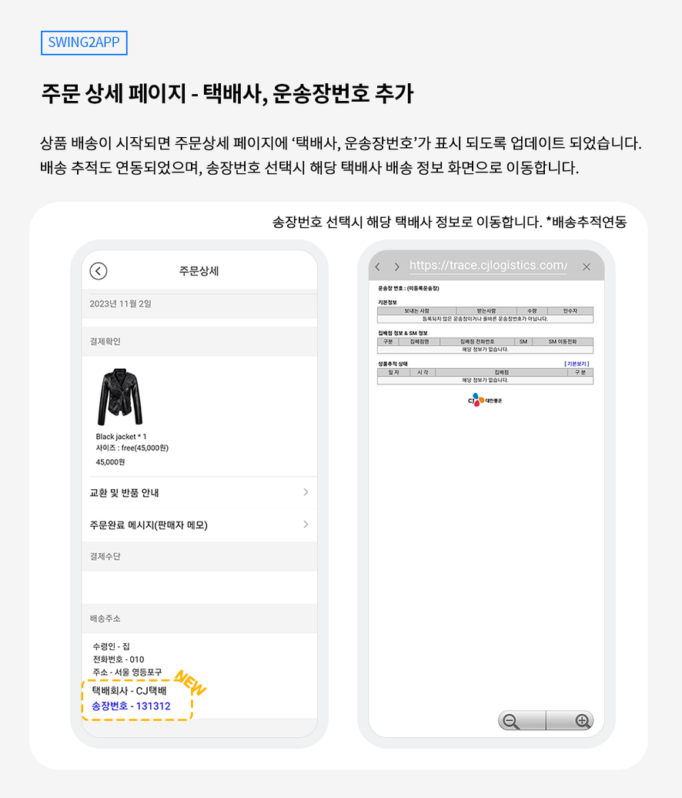
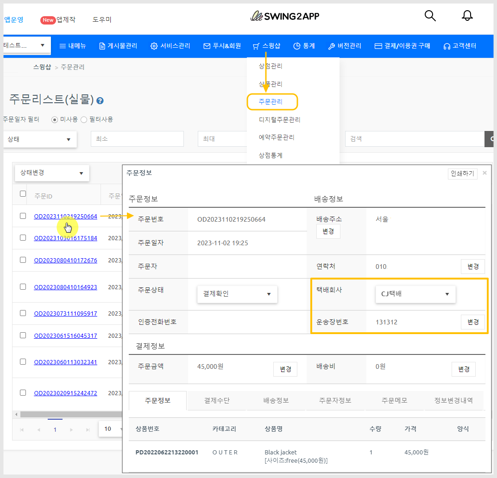
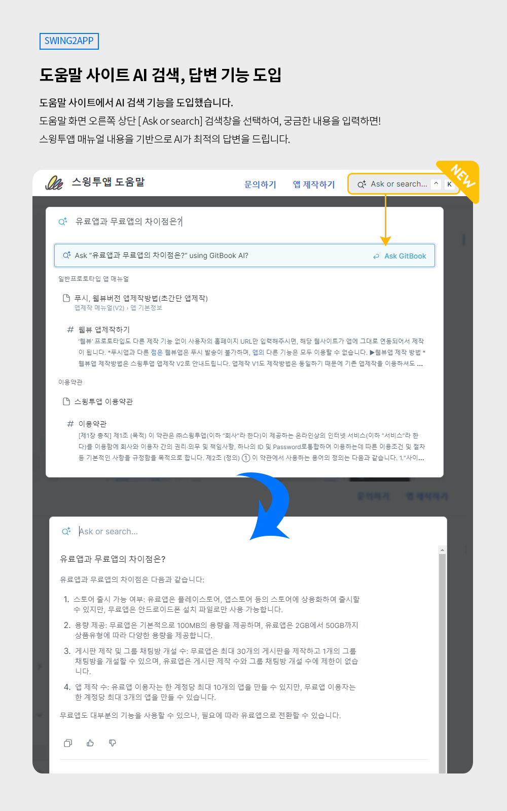
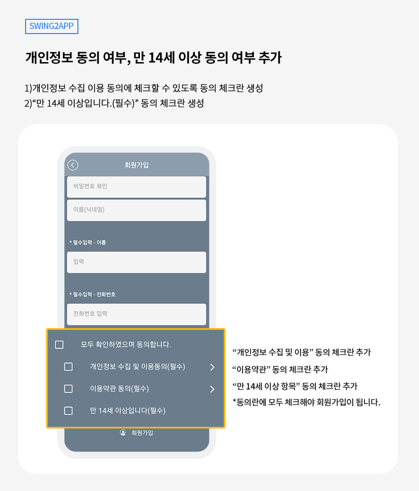
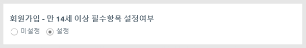

# 스윙투앱 업데이트

<figure><figcaption></figcaption></figure>

**\[업데이트 내용]**

**1)쇼핑몰앱 - 택배사, 운송장번호, 배송 추적 추가**

**2)도움말 사이트 AI 검색 도입**

**3)회원가입 화면 개인정보 방침 개선**

<figure><figcaption></figcaption></figure>

##  **1.**쇼핑몰 앱 - 택배사, 운송장번호, 배송 추적 기능 추가

<figure><figcaption></figcaption></figure>

쇼핑몰 앱에서 사용자가 상품을 결제하면, 주문 상세 페이지에서 결제한 내역을 확인할 수 있는데요.

실물 상품의 경우 배송이 시작되면 사용자에게 택배사, 운송장번호가 표시되지 않아 불편함이 있었어요.

이 부분을 보완 개선하여 업데이트 되었습니다.

​

###  **어떻게 업데이트 되었나요?**

이제, 사용자의 앱에서도 택배사와 운송장 번호를 확인할 수 있으며 배송 추적 기능도 이용할 수 있습니다.

사용자의 앱 – 주문상세 페이지에서 택배회사와 송장번호가 표시되며, 송장번호를 탭하면 해당 택배사의 배송 정보 페이지로 이동합니다.

<mark style="color:red;">**\*주의\***</mark>

관리자가 앱운영 대시보드- 주문정보표에서 배송 정보를 입력해야, 주문자도 주문상세 페이지에서 배송 정보를 확인할 수 있습니다.&#x20;

<figure><figcaption></figcaption></figure>

###  안내사항


1\)해당 기능은 일반 프로토타입 앱제작, 스윙투앱에서 제공하는 스윙샵(쇼핑몰)을 이용할 경우에만 해당됩니다.

웹앱이나 쇼핑몰 기능을 사용하지 않는 앱이라면, 해당 사항 없습니다.

2\)앱 업데이트가 필요합니다.

23년 11월 3일 기준으로 신규 앱제작 하신 분들은 업데이트된 기능이 자동 반영됩니다.

이전에 제작하신 분들은 앱 업데이트를 하셔야 반영됩니다.

스토어(앱스토어, 플레이스토어)에 출시된 앱은 업데이트 버전으로 다시 제출해주셔야 합니다.


<figure><figcaption></figcaption></figure>

##  **2.**도움말 사이트 AI 검색, 답변 도입

<figure><figcaption></figcaption></figure>

스윙투앱에서 제공하는 도움말 사이트에서 AI 검색 기능을 도입했습니다.

검색창에 궁금한 내용을 입력하면, 스윙투앱에서 제공한 매뉴얼을 기반으로 AI가 최적의 답변을 드립니다.

​

### 이용방법

1\)도움말 화면 오른쪽 상단 \[Ask or search] 검색창을 선택해주세요.

2\)답변을 원하는 내용 혹은 궁금한 내용을 입력해주세요.

3\)스윙투앱 매뉴얼 내용을 기반으로 답변이 제공됩니다.

\*\[Ask or search] 검색창이 보이지 않는다면, 새로 고침 후 이용해주세요.

***

##  **3.**개인정보 수집∙이용 동의 여부

<figure><figcaption></figcaption></figure>

회원가입 페이지에 이용약관, 개인정보 수집 및 이용 동의 필수 동의 체크란을 추가 생성했습니다.

해당 동의란에 모두 체크해야 회원가입이 완료됩니다.

“개인정보 수집 및 이용 동의(필수) >” 탭을 터치하면 개인정보 수집, 이용 방침에 대한 본문내용을 확인할 수 있습니다.

기존 이용약관에서 함께 제공되는 본문을 개인정보 페이지로 따로 구성하여 제공했습니다.

비밀번호 작성규칙을 수립하여 권고하는 비밀번호 규칙으로 수정 반영했습니다.

영문 대소문자, 숫자, 특수문자 중 2종류 이상을 조합하여 최소 8자리 이상 또는 1종류 이상을 조합하여 최소 10자리 이상으로 구성하여 비밀번호 입력하도록 수정했습니다.

​“만 14세 이상입니다(필수)” 동의 체크란을 추가 생성했습니다.

\[이용방법]

만 14세 이상 동의여부는 정책에서 설정 여부를 체크해서 사용할 수 있습니다.

적용 경로: 앱운영-서비스관리-정책관리-앱 가입 정책

<figure><figcaption></figcaption></figure>

\[만 14세 이상 필수항목 설정여부] 기본 설정: 미설정으로 체크되어 있습니다.

‘설정’으로 체크하고 정책설정하기 버튼을 눌러야 반영됩니다.

11월 17일 이후 제작된 앱은 저장만 하면 바로 반영되며, 이전에 제작한 앱은 앱 업데이트 해주셔야 합니다.

###  안내사항


\*해당 기능은 일반 프로토타입으로 제작한 앱에만 해당됩니다.

웹사이트를 연결한 웹앱 – 웹뷰, 푸시앱은 해당 없습니다.

​

1\)앱 업데이트가 필요합니다.

23년 11월 17일 기준으로 신규 앱제작 하신 분들은 업데이트된 기능이 자동 반영됩니다.

이전에 제작하신 분들은 앱 업데이트를 하셔야 반영됩니다.

스토어(앱스토어, 플레이스토어)에 출시된 앱은 업데이트 버전으로 다시 제출해주셔야 합니다.

​

2\)회원가입 메뉴를 앱에 적용해서 이용해주세요.

개인정보 방침은 모두 회원 가입 화면(페이지)에서 보여지는 내용입니다.

로그인 기능 자체를 이용하지 않는 앱이라면 상관없으나, 로그인 기능이 있는 앱이라면 회원가입 메뉴를 반드시 앱에 적용해서 이용해주세요.

​

3\)한국 인터넷 진흥원으로부터 개인정보 처리 개선권고 및 개선조치를 받았다면 앱을 업데이트 해서 제출해주세요.

개선을 요청한 모든 사항을 반영하여 업데이트 하였습니다.

\*스윙투앱 앱을 이용하는 앱 사용자분들에 해당됩니다.


