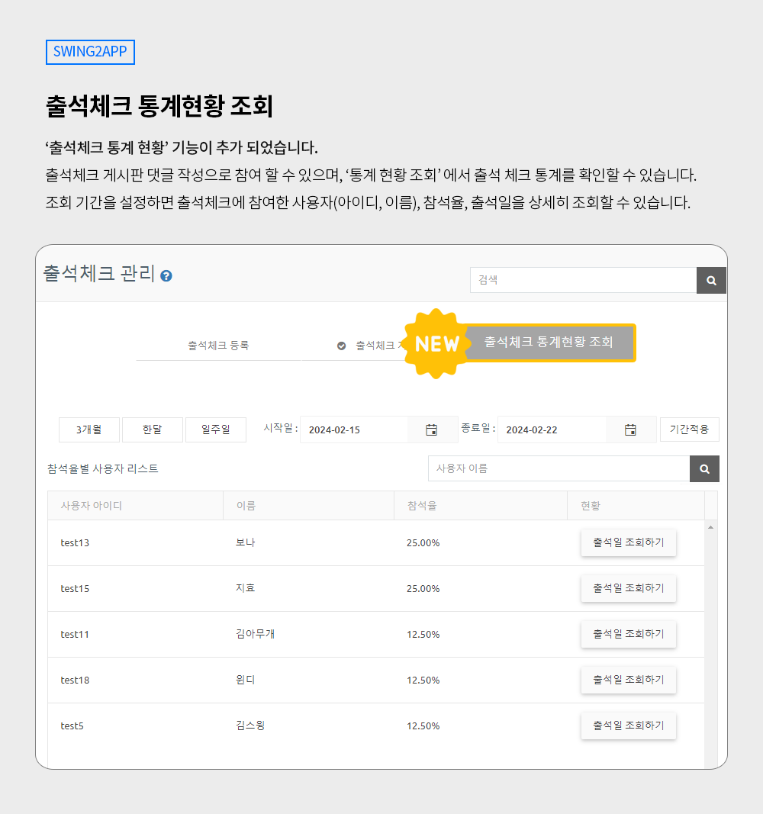
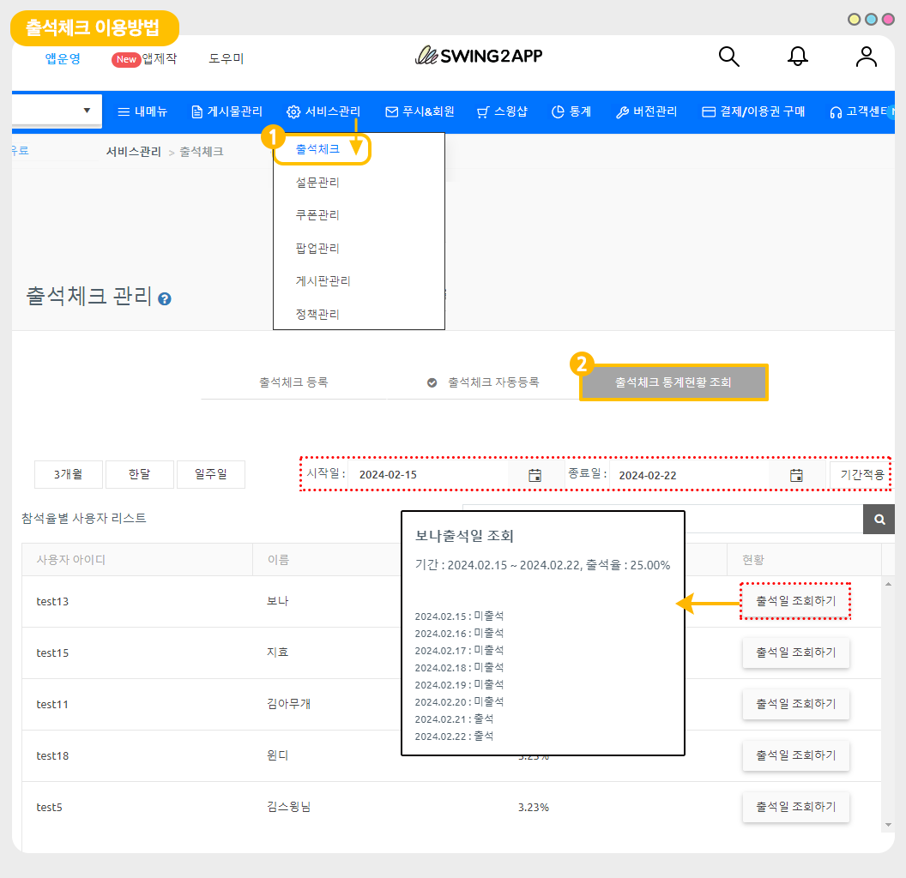

# 스윙투앱 업데이트

<figure><figcaption></figcaption></figure>

**\[업데이트 내용]**

출석체크 관리 – 출석체크 통계현황 조회 기능 추가

<figure><figcaption></figcaption></figure>

##  **출석체크 통계현황 조회 기능 추가**

<figure><figcaption></figcaption></figure>

**출석체크 기능에 ‘출석체크 통계현황 조회’ 메뉴가 추가 업데이트 되었습니다.**

출석 체크에 참여한 사용자들의 상세 통계를 확인할 수 있습니다.

출석체크란, 출석체크 게시판에 댓글 입력을 하면 참여(체크)가 되는 기능이구요. 매일 혹은 관리자가 정해놓은 기간에 댓글을 입력하여 참여하는 기능입니다.

따라서 사용자들이 출석체크에 참여하면, 관리자는 ‘통계 현황 조회’ 에서 출석 체크 통계를 확인할 수 있습니다.

조회 기간을 설정하면 출석체크에 참여한 사용자(아이디, 이름), 참석율, 출석일을 상세히 조회할 수 있습니다.

###  **어떻게 활용할 수 있나요?**

\-사용자들이 얼마나 출석 참여를 했는지 확인 \*전체 통계 확인

\-사용자별 출석 체크 현황 조회 \*사용자 개별 통계 확인

\-특정 기간 동안의 사용자 출석일 조회&#x20;

\-이벤트 진행시, 출석 체크 참여가 가장 많은 사용자를 선별할 때 사용

\-출석부 기능으로 이용할 때에도, 통계 기능을 100%활용할 수 있습니다.\

***

###  **이용방법**

<figure><figcaption></figcaption></figure>

[앱운영-서비스관리-출석체크](https://www.swing2app.co.kr/view/attendance\_board) 이동

출석체크 관리 페이지에서 추가된 ‘출석체크 통계현황 조회’를 확인할 수 있습니다.

1\)기간 적용 탭에서 통계 확인을 원하는 기간을 설정하여 확인할 수 있구요.

2\)사용자별 참석율 확인이 가능합니다.

3\)\[출석일 조회하기] 버튼을 탭하면 조회한 해당 사용자가 특정 기간 동안 출석한 일자를 확인할 수 있습니다.

###  안내사항


1\)해당 기능은 **일반 프로토타입 앱** 이용시에만 해당됩니다.&#x20;

웹앱-웹뷰, 푸시앱은 해당 사항 없습니다.

2\)**앱 업데이트 필요 없이 즉시 이용 가능합니다.**&#x20;

기존 출석체크 게시판을 운영하셨던 분들도 기간 설정해서 확인하시면 통계현황 바로 확인 가능합니다. &#x20;

**3)출석체크 기능을 이용해야 통계 확인이 가능합니다.**

기능을 사용하고 있지 않다면 먼저 출석체크를 등록한 뒤, 앱에 적용하여 이용해주세요.

[출석체크 이용방법 매뉴얼 보러가기](https://documentation.swing2app.co.kr/manual/appmanage/service/attendance-check)


