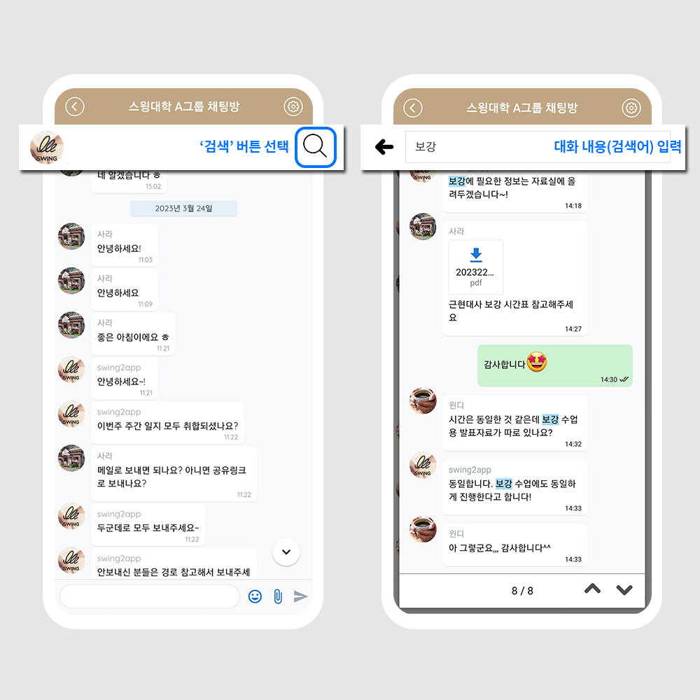

# 스윙투앱 업데이트

**\[업데이트 내용]**

그룹채팅방 대화 내용 검색 기능 추가

***

##  **그룹채팅방 대화 내용 검색 기능 추가**

<figure><figcaption></figcaption></figure>

그룹채팅방에 대화 내용을 검색할 수 있는 검색어 기능이 추가되었습니다.

***

###  **이용방법**

앱은 업데이트 하지 않아도 되며, 즉시 이용 가능합니다.

앱 실행 – 그룹채팅방 선택- 상단 검색 버튼 선택 – 검색어 입력창에 내용을 입력하여 검색해주세요.

PC앱운영 대시보드에서도 동일하게 이용 가능합니다.&#x20;

###  안내사항


**1)일반 프로토타입(탑, 푸터, 슬라이드, 드롭다운 등)앱 사용자에게만 해당되는 기능입니다.**

웹뷰, 푸시앱 사용자분들은 해당 없습니다.

**2)그룹채팅방이 앱에 적용되어 있어야 사용 가능합니다.**&#x20;

그룹채팅방을 만들거나 앱에 적용하지 않았다면 아래 그룹채팅방 등록방법 도움말을 보시고 만들어주세요.&#x20;

[그룹채팅방 이용방법 보러가기](https://documentation.swing2app.co.kr/manual/appmanage/board/groupchat)

**3)앱 업데이트 필요 없이 즉시 이용 가능합니다.**&#x20;

만약 오랜 시간 동안 앱을 열어두고 계셨다면, 앱 종료 후 재실행하여 이용해주세요.


