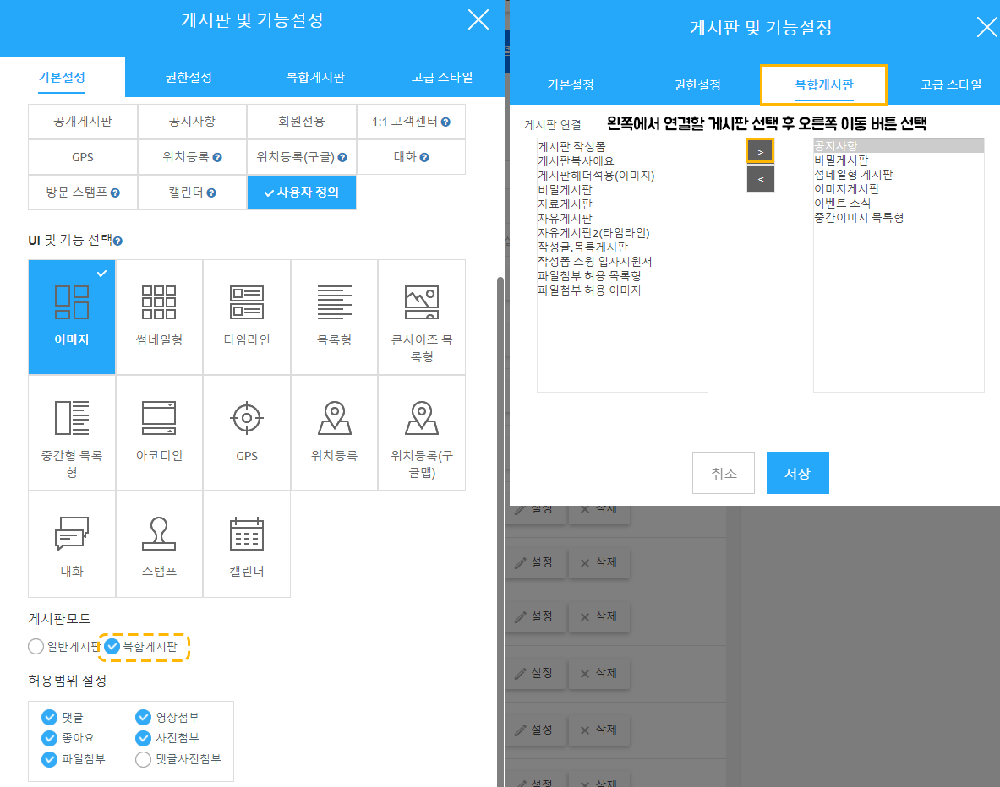
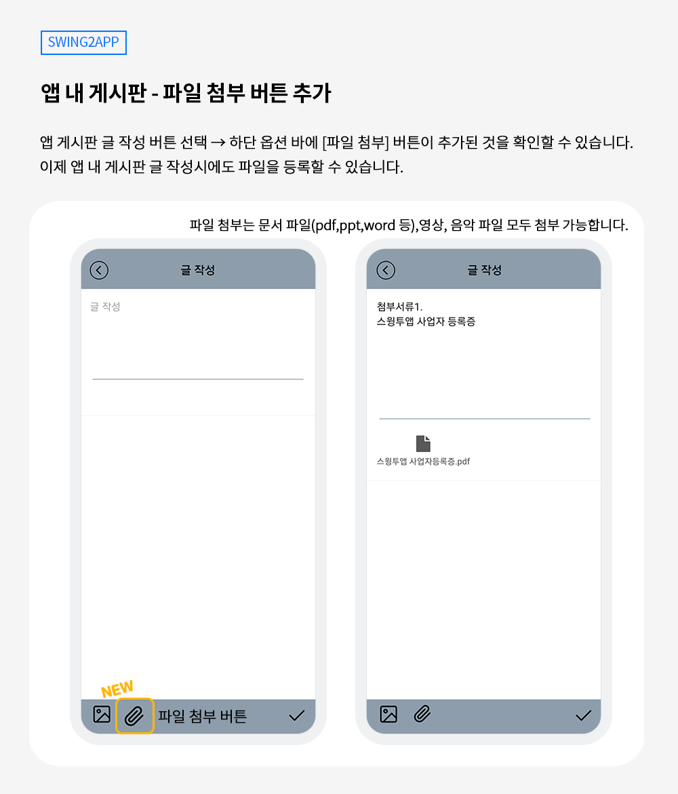
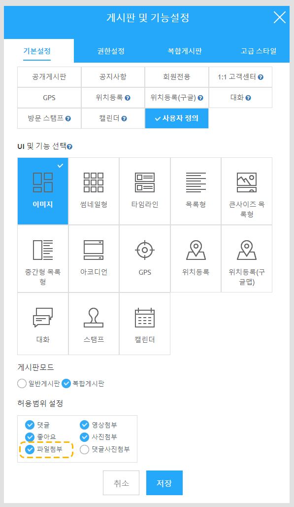

# 스윙투앱 업데이트

<figure><figcaption></figcaption></figure>

**\[업데이트 내용]**

**1.복합게시판 출시**

**2.앱 게시판 - 파일첨부 기능 추가**\

\*이번 업데이트 된 기능은 일반 프로토타입 앱에서 이용 가능한 기능입니다.

웹뷰앱, 푸시앱 이용자분들은 해당 사항 없습니다.

<figure><figcaption></figcaption></figure>

##  **1.복합게시판 출시**

<figure><figcaption></figcaption></figure>

**여러 게시판을 한 화면에 적용할 수 있는 복합 게시판 기능이 추가되었습니다.**&#x20;

복합게시판이란, 게시판 글을 모두 모아서 한 화면에 보여줄 수 있는 기능입니다.

기존에는 한 메뉴에 하나의 게시판만 연결하여 보여줄 수 있었는데요.&#x20;

업데이트된 복합게시판을 이용하면 **전체 게시판 혹은 선택한 몇 개의 게시판을 한 화면에 모두 보여줍니다.**

\

###  **이용방법**

\*앱 업데이트가 필요합니다. 해당 기능을 이용하기 전 앱 업데이트를 먼저 해주세요.

23년 4월 11일 새로 제작되는 앱은 업데이트 필요 없이, 바로 이용 가능합니다.&#x20;

<figure><figcaption></figcaption></figure>

1\)[앱운영 – 서비스관리 – 게시판 관리](http://www.swing2app.co.kr/view/board\_edit)- 게시판 생성 버튼 선택

\*기존에 만들어놓은 게시판으로 복합게시판을 설정한다면, 게시판 옆에 \[설정] 버튼을 선택해서 적용할 수 있습니다.&#x20;

2\)기본설정에서 - 게시판 이름, UI 선택은 일반 게시판 만드는 것과 동일하게 진행합니다.&#x20;

3\)스크롤하여 내려보면, 게시판 모드에 **“복합게시판”**이 추가된 것을 확인할 수 있습니다.

복합게시판에 체크해주세요. &#x20;

4\)상단 메뉴 \[복합게시판] 이동

5\)여기서 어떤 게시판을 연결할 것인지 왼쪽에 있는 게시판 중 선택하여 오른쪽 화면에 게시판을 추가해주시면 됩니다.

6\)추가 후 \[저장]버튼을 선택해주세요.&#x20;

7\)앱제작 이동 후, 만들어놓은 복합 게시판을 앱 메뉴로 연결해주시면 앱에서 확인 가능합니다.

### .png) 안내사항


1\)해당 기능은 V3앱제작 버전에서만 이용 가능하며, 기능을 이용하기 위해서는 앱 업데이트가 필요합니다.&#x20;

업데이트 후 기능 이용이 가능하며 앱이 스토어에 출시되어 있다면 해당 스토어별로 앱 업데이트 진행해주세요.&#x20;

23년 4월 11일 새로 제작되는 앱은 업데이트 필요 없이, 바로 이용 가능합니다.&#x20;

2\)복합 게시판은 글 작성이 불가합니다.&#x20;

게시판 글을 모아서 보여주는 목록보기 형식의 게시판입니다.&#x20;

따라서 글 보기 외에 글 작성은 불가합니다.

연동된 게시판에서 글을 등록하면 복합게시판에도 자동으로 글이 보여집니다. &#x20;

3\)복합게시판은 선택된 게시판 UI에 따라 디자인이 다릅니다.

섬네일, 이미지, 자료 게시판 등 선택한 UI에 따라 목록 화면이 다르게 보여집니다.&#x20;


<figure><figcaption></figcaption></figure>

##  **2.앱 게시판 - 파일첨부 기능 추가**

<figure><figcaption></figcaption></figure>

**앱 내 게시판 글 작성시 파일 첨부 기능이 추가되었습니다.**&#x20;

파일첨부는 웹 대시보드 게시물 글 등록에서 관리자만 등록이 가능했습니다. (앱에서는 등록 불가)

업데이트 된 기능에서는 일반 사용자도 앱에서 글 작성시 파일을 첨부할 수 있습니다. \

###  **이용방법**

\*앱 업데이트가 필요합니다. 해당 기능을 이용하기 전 앱 업데이트를 먼저 해주세요.

23년 4월 11일 새로 제작되는 앱은 업데이트 필요 없이, 바로 이용 가능합니다.&#x20;

<figure><figcaption></figcaption></figure>

1\)[앱운영 – 서비스관리 – 게시판 관리](http://www.swing2app.co.kr/view/board\_edit)- 게시판 생성 버튼 선택

2\)게시판 이름, UI 선택은 일반 게시판 만드는 것과 동일하게 진행합니다.

3\)스크롤하여 내려보면, 허용범위 설정 메뉴 확인할 수 있습니다.

\[파일첨부]에 체크하고 저장해주세요.

**-- 기존에 만들어놓은 게시판에 파일첨부를 할 경우 --**&#x20;

게시판관리 화면에서 게시판명 옆에 \[설정] 버튼을 선택 - 허용범위 설정 메뉴에서 - “파일첨부” 체크 후 저장해주시면 됩니다.

\*이미 파일첨부가 체크되어 있는 분들은 앱 업데이트 후 바로 이용 가능합니다.&#x20;

### .png) 안내사항


1\)해당 기능은 V3앱제작 버전에서만 이용 가능하며, 기능을 이용하기 위해서는 앱 업데이트가 필요합니다. &#x20;

(앱제작 화면 이동 후 ‘앱 업데이트’ 버튼만 선택해주시면 됩니다)

23년 4월 11일 새로 제작되는 앱은 업데이트 필요 없이, 바로 이용 가능합니다.&#x20;

2\)앱 파일 첨부시, 한 번에 첨부하는 파일 용량은 5MB를 초과할 수 없습니다.

파일 첨부의 경우 첨부된 용량만큼 앱 저장용량으로 집계됩니다.

스윙투앱 서비스에서 제공되는 용량이 정해져있기 때문에 한 번에 첨부할 수 있는 파일 용량은 5MB로 제한해두었습니다.

3\)앱 내 게시판 파일첨부를 사용하는 분들은 반드시! 앱 저장 용량을 체크해주세요.

관리자만 올리는 것이 아니라, 앱을 이용하는 사용자들도 올릴 수 있는 만큼 저장용량이 단시간에 많이 올라갈 수 있습니다.&#x20;

4\)스토어에 앱이 출시된 분들은, 앱이 업데이트가 되었기 때문에 각 스토어에도 새 버전으로 업데이트 해주셔야 합니다.

스토어에 업데이트를 해야 사용자들이 앱 업데이트를 받고 해당 기능을 이용할 수 있습니다.&#x20;


