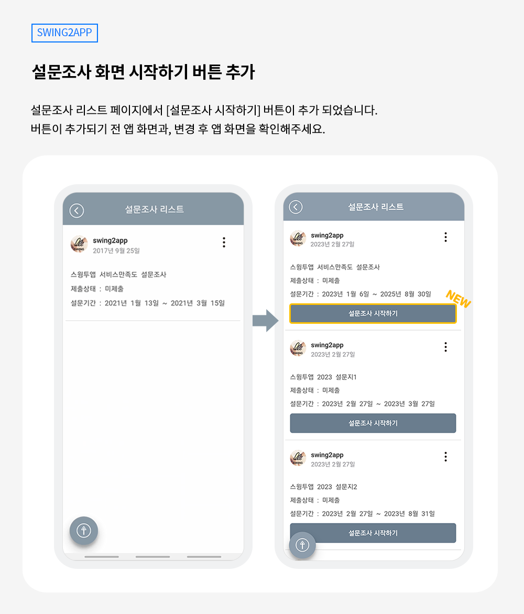
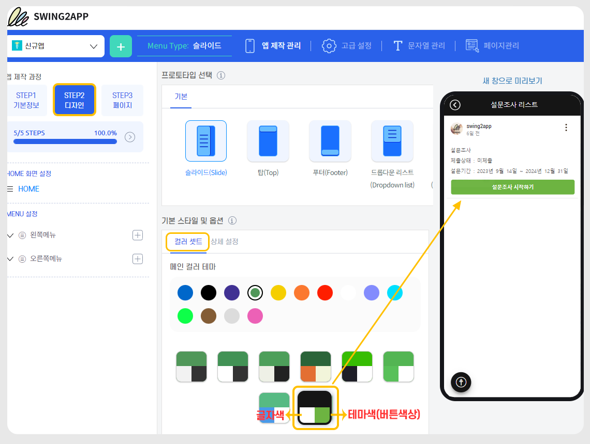
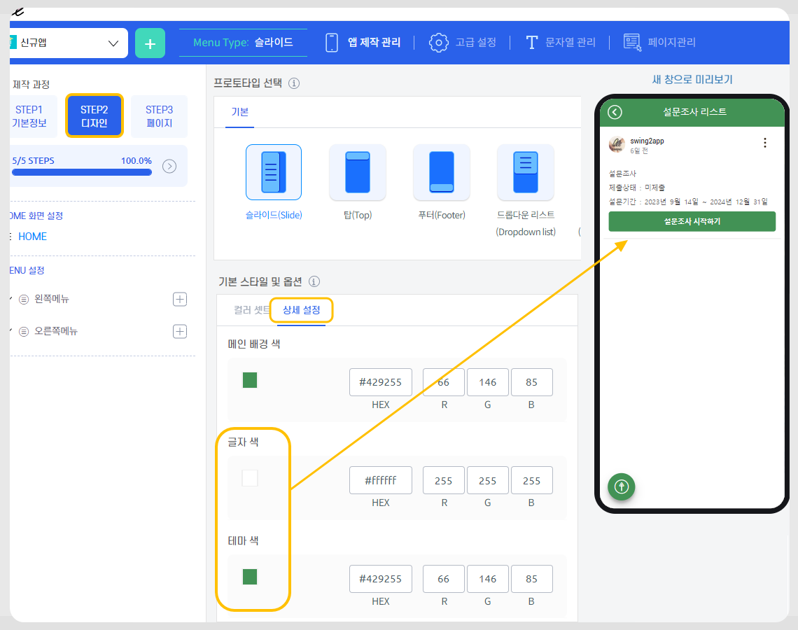

# 스윙투앱 업데이트

<figure><figcaption></figcaption></figure>

**\[업데이트 내용]**

**설문조사 화면 - 설문 시작하기 버튼 추가**

<figure><figcaption></figcaption></figure>

##  **설문조사 화면 인터페이스 수정) 버튼 추가**&#x20;

<figure><figcaption></figcaption></figure>

###  **어떤 내용이 변경되었나요?**

<mark style="color:blue;">설문조사 리스트 화면에서 \[설문조사 시작하기] 버튼이 추가 되었습니다.</mark>&#x20;

<mark style="color:blue;">제출 완료된 설문은 \[제출 완료/ 설문 다시 제출하기] 버튼으로 명확히 표시될 수 있도록 수정하였습니다.</mark>&#x20;

기존 화면에서는 시작을 확인할 수 있는 버튼이 없어 텍스트를 터치하여 설문을 진행하였는데요.&#x20;

업데이트 된 화면에서는, 조금 더 쉽게 접근할 수 있도록 직관적인 UI디자인으로 시작 버튼을 추가했습니다.&#x20;

### <mark style="color:blue;">**+추가 안내**</mark>

“버튼 색상 및 글자색은 어떻게 반영되나요? 혹은 어떻게 수정할 수 있나요?”

버튼 색상은 **앱제작 STEP2디자인 – 기본 스타일 및 옵션에서 설정한 컬러 테마 색상으로 적용됩니다.**

**1)컬러 테마를 “컬러 셋트”에서 적용했다면**&#x20;

<figure><figcaption></figcaption></figure>

컬러 조합에서 왼쪽에 있는 색상이 “글자 색상”으로 적용되고, 오른쪽 테마색이 “버튼 색상”으로 적용됩니다.

**2)컬러를 상세 설정에서 따로 적용했다면,**&#x20;

<figure><figcaption></figcaption></figure>

**테마 색이 버튼 색상으로 들어가며, 글자 색이 버튼 글자 색으로 셋팅됩니다.**&#x20;

<mark style="color:red;">**주의)**</mark> 앱 디자인 컬러와 연동이 되기 때문에 버튼만 따로 다른 색상으로 변경할 수 없습니다.

###  **설문조사 기능 이용방법**

설문조사는 게시판 관리에서 제공하는 설문조사를 등록한 뒤, 앱에 적용을 해야 이용할 수 있습니다.

이용방법 상세 내용은 가이드 매뉴얼을 확인해주세요.&#x20;

[설문조사 이용방법 매뉴얼 보러가기](https://documentation.swing2app.co.kr/manual/appmanage/service/survey)

###  (1).png>) 안내사항


1\)해당 기능은 앱 업데이트가 필요합니다.&#x20;

23년 9월 15일 기준으로 신규 앱제작 하신 분들은 업데이트된 기능이 자동 반영됩니다.

이전에 제작하신 분들은 앱 업데이트를 하셔야 반영됩니다. &#x20;

스토어(앱스토어, 플레이스토어)에 출시된 앱은 업데이트 버전으로 다시 제출해주셔야 합니다.

&#x20;

2\)사용자들이 설문조사 완료 후 볼 수 있는 결과지 화면 역시, 업데이트 기능으로 곧 공지가 될 예정이오니 조금만 기다려 주시기 바랍니다. ^^


<figure><figcaption></figcaption></figure>

