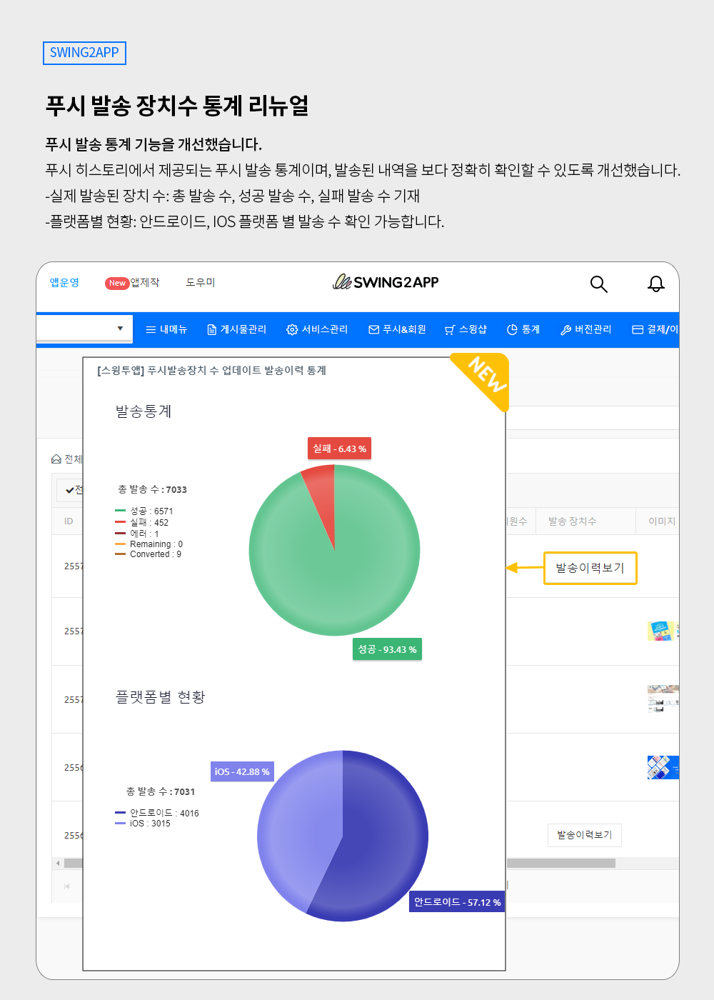

# 스윙투앱 업데이트

<figure><figcaption></figcaption></figure>

**\[업데이트 내용]**

푸시 발송 장치 수 통계 개선

<figure><figcaption></figcaption></figure>

##  **푸시 발송 통계 리뉴얼**

<figure><figcaption></figcaption></figure>

푸시 발송 통계 기능을 개선했습니다.

푸시 히스토리에서 제공되는 푸시 발송 통계이며, 발송된 내역을 보다 정확히 확인할 수 있도록 개선했습니다.

\-실제 발송된 장치 수: 총 발송 수, 성공 발송 수, 실패 발송 수 기재

\-플랫폼별 현황: 안드로이드, IOS 플랫폼 별 발송 수 확인 가능합니다.

\*Remaining: 아직 푸시 전송이 완료되지 않은 \*발송 중 상태를 말합니다.

\*Converted: 알림을 클릭/탭한 장치 수를 말합니다.

​

###  **이용방법**

\*운영 기능이므로, 별도 앱 업데이트 없이 대시보드에서 바로 확인 가능합니다.

[앱운영→ 푸시&회원→ 푸시 히스토리](http://www.swing2app.co.kr/view/push\_list) 이동

푸시 정상 발송, 푸시가 발송된 기기가 있을 경우 \[발송이력보기] 라는 버튼이 생성된 것을 확인할 수 있습니다.

해당 버튼 선택시 발송 통계 내역을 확인할 수 있습니다.

원형 그래프에 마우스 커서를 가져다 대면 각 범주별 퍼센트 확인 가능합니다.

### .png) 안내사항


1\)앱운영에서 제공되는 기능으로 별도 앱 업데이트 없이 바로 이용 가능합니다.

​

2\)업데이트 기준일(23.05.18) 이전, 과거 일부 기간 동안에는 발송 이력이 제공되지 않을 수 있습니다.

통계 시스템 개편으로 해당 기간 동안 발송 내역 집계가 되지 않았습니다.

​

3\)업데이트 기준일(23.05.18) 이전, 과거 일부 기간 동안 발송된 그룹발송, 예약 발송 등은 발송 이력이 제공되지 않을 수 있습니다.

​

4\)앱제작 V2버전에서 제작된 앱은 아이폰 통계 발송 집계가 되지 않습니다.

앱제작V3 버전으로 배포 및 설치된 앱에서만 아이폰으로 발송된 푸시 장치 수 이력이 조회됩니다.

​

5\)해당 기능은 웹뷰앱에서는 이용이 불가합니다.

푸시 발송 기능이 제공되는 푸시앱, 일반 프로토타입으로 제작한 앱에서만 확인 가능합니다.



<figure><figcaption></figcaption></figure>

