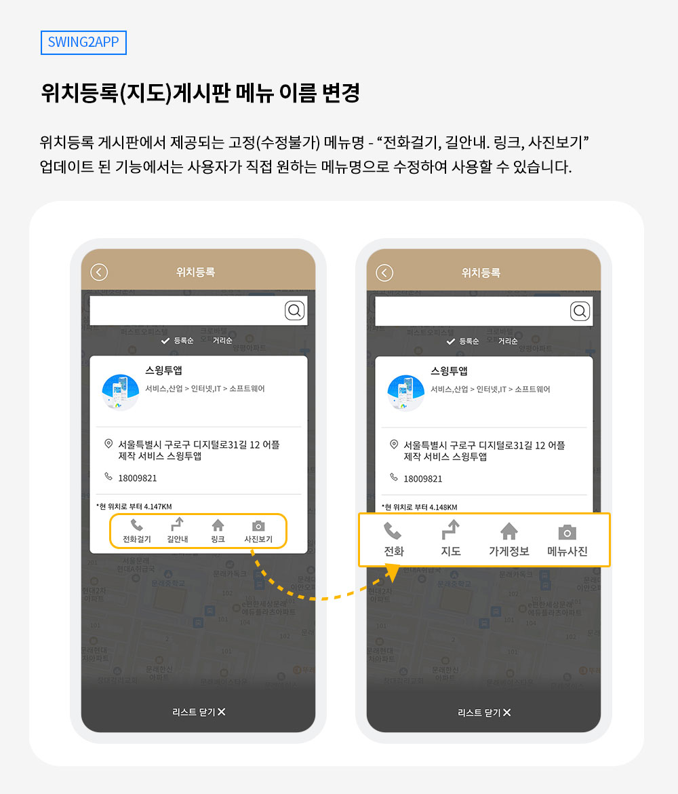
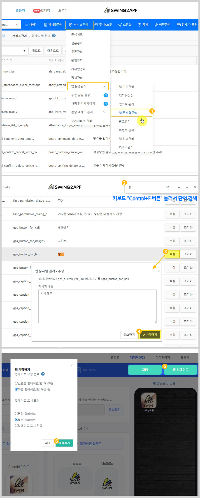

# 스윙투앱 업데이트

<figure><figcaption></figcaption></figure>

**\[업데이트 내용]**

위치등록(지도)게시판 버튼명 변경 기능 추가

<figure><figcaption></figcaption></figure>

##  **1.**위치등록(지도)게시판 버튼 이름 변경 기능 추가

<figure><figcaption></figcaption></figure>

위치등록 게시판에서 제공되는 고정 버튼이름\[전화걸기, 길안내, 링크, 사진보기]을 이제 사용자가 직접 원하는 텍스트로 수정하여 이용할 수 있습니다.&#x20;

(업데이트 전에는 이름은 수정 불가하며 고정값으로만 제공되었습니다)

각 항목에 제공되는 정보에 적합하게 버튼 이름을 수정해서 사용해보세요.&#x20;

**‘문자열관리’에서 직접 메시지(단어)를 수정하여 적용할 수 있습니다.**

###  **변경방법**

<figure><figcaption></figcaption></figure>

1\)[앱운영-서비스관리-앱 운영관리-앱 문자열 관리](https://www.swing2app.co.kr/view/app\_resourecs\_manager) 이동

2\)키보드 Control+F 버튼 선택하여, 단어를 검색해주세요.

‘링크’ 단어 변경시 → 링크 검색 후 \[수정]버튼 선택 → 원하는 단어로 편집 후 \[수정하기] 선택

3\)앱제작 화면 이동 → \[앱 업데이트] 버튼 선택

4\)새 버전으로 제작된 앱으로 실행시 변경된 항목 확인이 가능합니다.

스토어 출시된 유료버전 앱은 반드시 “하드 업데이트” 진행 후 해당 스토어에 업데이트 버전앱으로 다시 제출하여 버전 업데이트 해주셔야 합니다.

\*스토어를 통한 업데이트가 이루어지지 않으면 앱 변경이 되지 않습니다.

\*무료앱은 소프트 업데이트로 진행 가능

###  안내사항


**안내사항**

1\)해당 기능은 **일반 프로토타입 앱** 이용시에만 해당됩니다.&#x20;

웹앱-웹뷰, 푸시앱은 해당 사항 없습니다.

2\)**문자열 관리 수정은 앱 업데이트가 필요합니다.**

문자열 관리에서 텍스트를 수정하면 반드시 앱제작 화면으로 이동하여 앱 업데이트를 하셔야 반영됩니다. &#x20;

스토어(앱스토어, 플레이스토어)에 출시된 앱은 업데이트 버전으로 다시 제출해주셔야 합니다.&#x20;

무료앱은 소프트 업데이트 후 앱에서 자체 업데이트 하시면 반영됩니다.&#x20;

**3)위치등록 게시판 사용시 이용 가능합니다.**

위치등록 게시판을 사용하고 있지 않다면 게시판을 먼저 만든 뒤, 앱에 적용하여 이용해주세요.

[위치등록 게시판 이용방법 매뉴얼 보러가기](https://documentation.swing2app.co.kr/manual/appmanage/board/map-board)&#x20;


