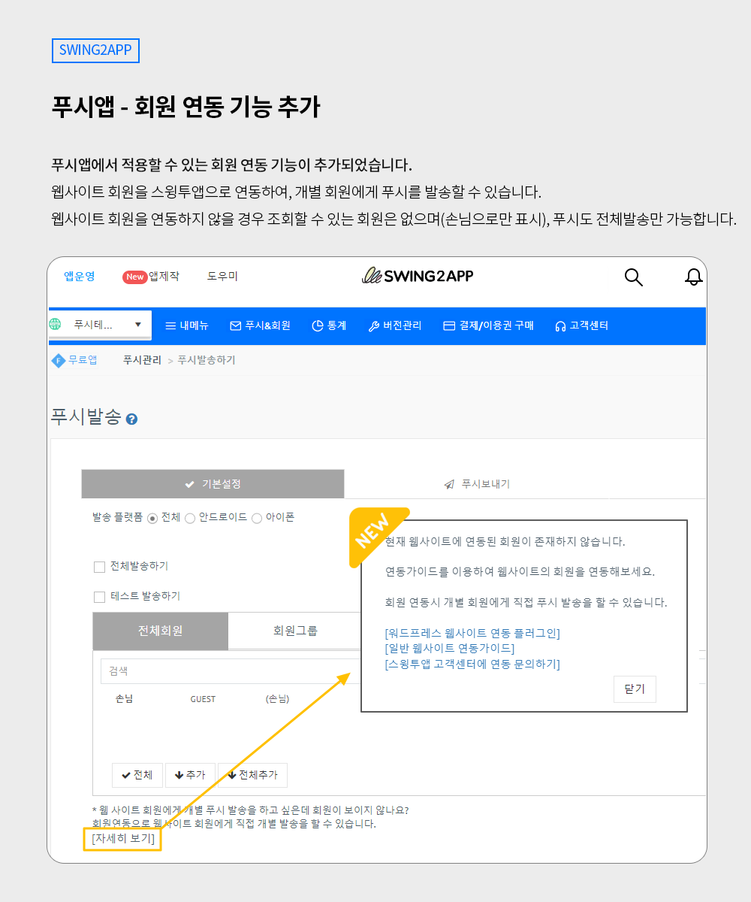
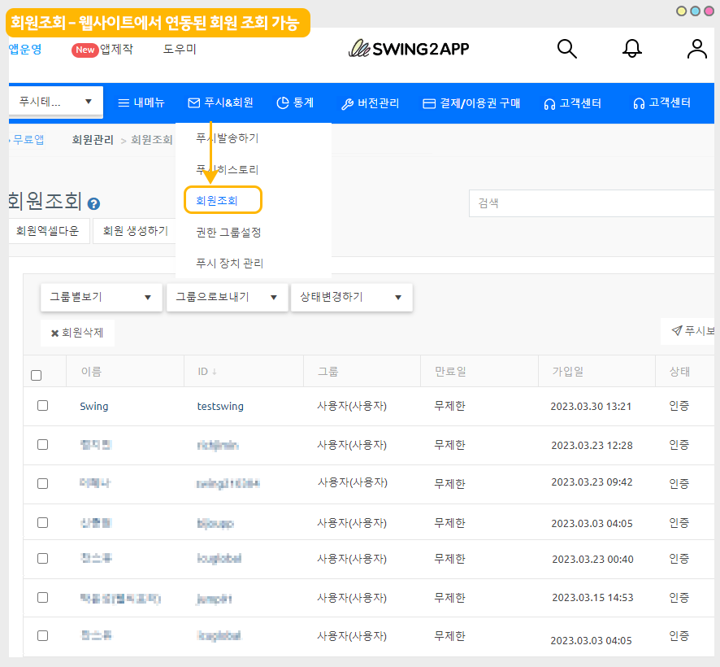
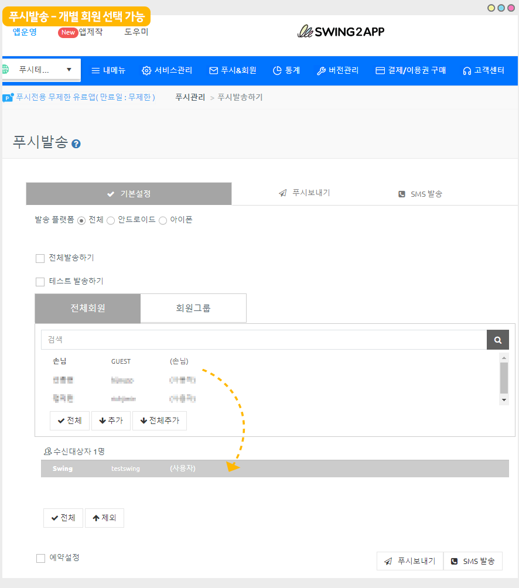
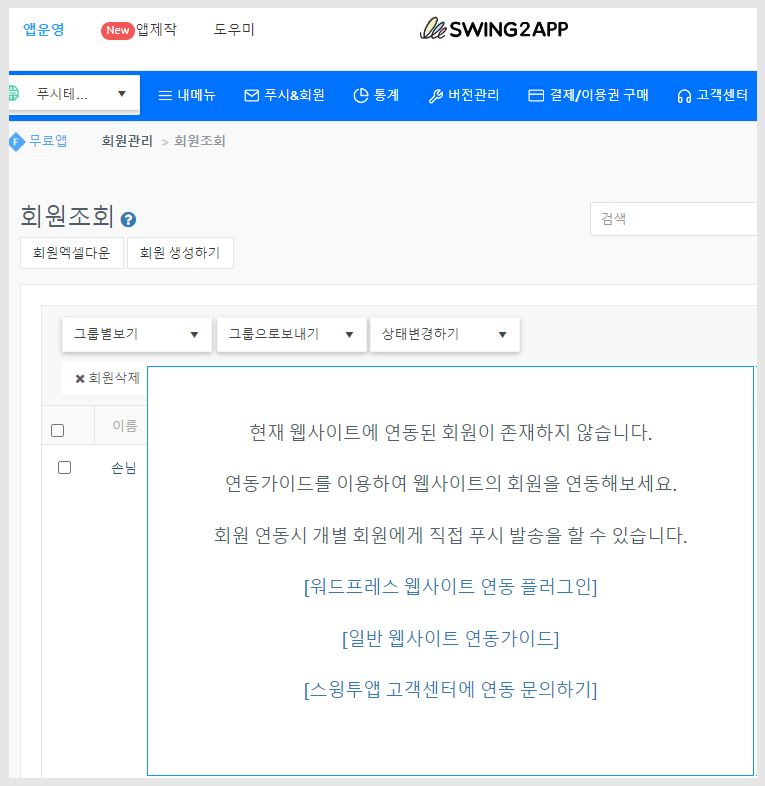

# 스윙투앱 업데이트

<figure><figcaption></figcaption></figure>

**\[업데이트 내용]**

**푸시앱 – 웹사이트 회원 연동 기능 업데이트**

<figure><figcaption></figcaption></figure>

##  **푸시앱 – 웹사이트 회원 연동 기능 추가**&#x20;

<figure><figcaption></figcaption></figure>

**푸시앱에서 적용할 수 있는 회원 연동 기능이 추가되었습니다.**

웹사이트 회원을 스윙투앱 서비스에 등록하여 사용자 기기와 함께 매칭하여 등록할 수 있습니다.&#x20;

회원 연동 작업시 스윙투앱에 웹 회원이 스윙투앱으로 연동되기 때문에,  웹 회원 조회 및 푸시 발송 시 - 개별 회원에게 푸시 발송을 할 수 있습니다.&#x20;

\

###  **회원 연동이란?**

<figure><figcaption></figcaption></figure>

<figure><figcaption></figcaption></figure>

#### 회원 연동을 하지 않을 경우 회원 조회 목록은 아무런 회원이 조회되지 않습니다.

실제 앱에서 가입한 회원이 아닌 사이트에서 가입된 회원이기 때문에 불러올 정보가 없기 때문이죠.

또한 푸시 발송시에도 회원 조회가 안되기 때문에 전체 발송만 가능합니다.&#x20;

회원연동을 할 경우, 위의 이미지처럼 웹사이트에서 연동된 회원 정보를 모두 확인할 수 있구요.

푸시 발송하기 메뉴에서도 개별 회원을 선택해서 푸시를 발송 할 수 있습니다.

###  **이용방법**

<figure><figcaption></figcaption></figure>

푸시앱 제작 후 회원조회 및 푸시 발송하기 메뉴로 들어오면 회원 연동 안내 팝업창이 뜹니다.

연결된 각 가이드를 확인하여 연동 작업을 하실 수 있습니다.&#x20;


### **안내사항**

1\)해당 기능은 푸시전용으로 제작한 앱에서만 이용 가능합니다. \_푸시앱만 이용 가능

웹뷰앱, 일반 프로토타입 앱은 해당 사항 없습니다.&#x20;

2\)회원 연동에 필요한 가이드를 모두 제공하고 있습니다.

가이드를 확인하여 작업해주세요.

3\)회원 연동이 어려우실 경우 스윙투앱으로 작업 요청을 의뢰하실 수 있습니다.

개발팀에서 작업 해드릴 수 있으며, 대행 작업에 대한 비용이 발생됩니다.

(비용은 사이트 구현에 따라 다르기 때문에 상담 후 최종 견적 안내 가능합니다)

4\)회원연동은 필수 기능이 아닌 선택 옵션 기능입니다.

회원 연동을 하지 않아도 푸시앱 이용에 아무런 영향을 주지 않으며, 푸시도 동일하게 보낼 수 있습니다.&#x20;

단, 푸시 발송시 전체 회원에게만 발송이 가능합니다.&#x20;


<figure><figcaption></figcaption></figure>
