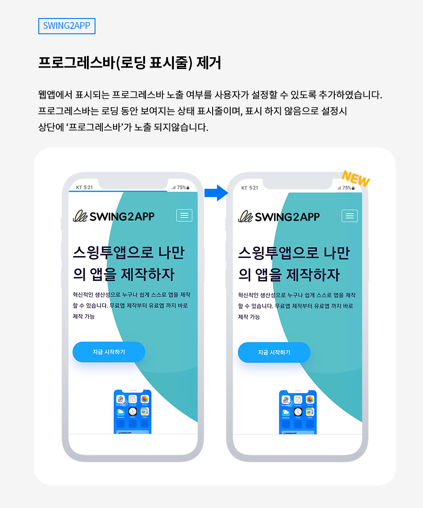
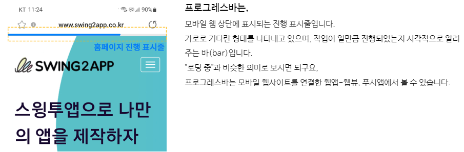
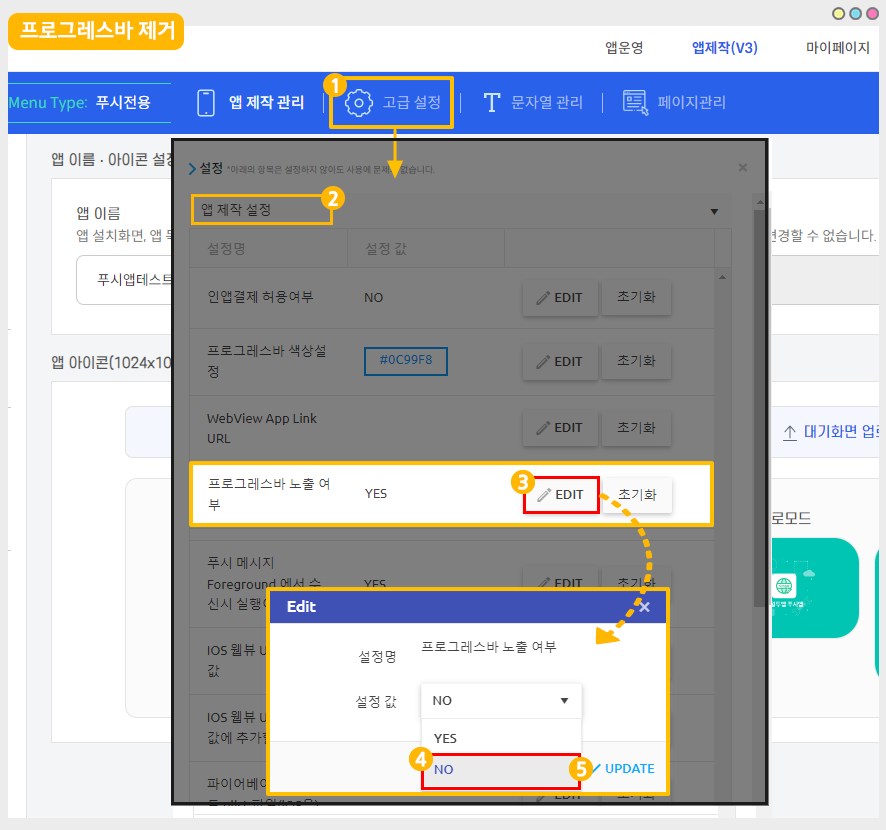
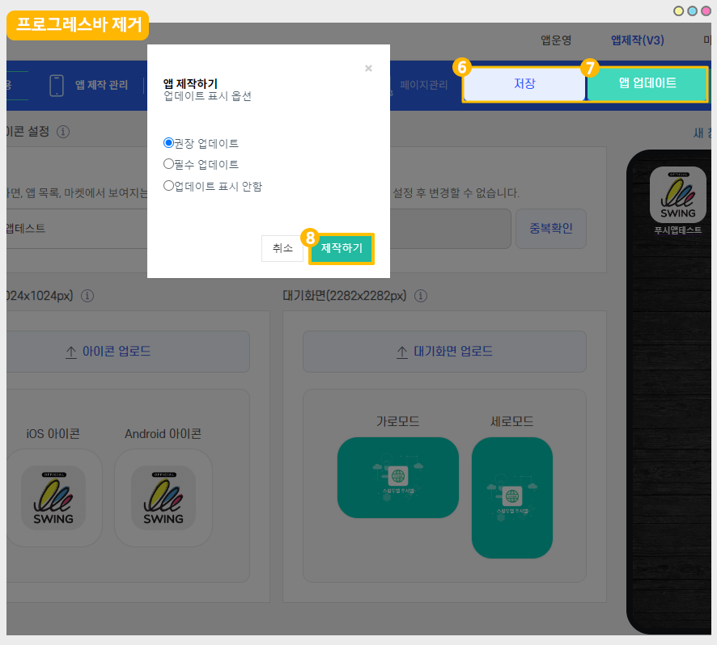

# 스윙투앱 업데이트

<figure><figcaption></figcaption></figure>

**\[업데이트 내용]**

**웹앱-프로그레스바(로딩 표시bar) 제거 기능 추가**

<figure><figcaption></figcaption></figure>

##  **1.프로그레스바(로딩 표시줄) 제거 기능 추가**

<figure><figcaption></figcaption></figure>

**웹앱에서 표시되는 프로그레스바 노출 여부를 사용자가 설정할 수 있도록 옵션 기능으로 추가하였습니다.**&#x20;

<mark style="color:blue;">**프로그레스바란?**</mark>

<figure><figcaption></figcaption></figure>

​웹앱에서 필수적으로 노출이 되었는데요.

변경된 업데이트 기능에서는 프로그레스바 제거 기능이 추가되어, ‘사용하지 않음’으로 체크시 노출이 되지 않습니다.

개별 웹 페이지 같은 이질감이 느껴지거나, 통일감을 주고 싶을 때 등 편의에 맞게 사용해주시기 바랍니다.&#x20;

<mark style="color:orange;">\*프로그레스바 노출 사용시, 색상 변경도 가능합니다.</mark>&#x20;

색상 변경방법은 도움말 가이드로 확인 부탁드립니다. &#x20;



###  **이용방법**

<figure><figcaption></figcaption></figure>

1\)앱제작 화면 - 고급설정 선택

2\)설정: ‘앱제작 설정’ 선택&#x20;

3\)프로그레스바 노출 여부 항목에서 \[EDIT] 버튼 선택

4\)노출 여부 설정: ‘NO’ 선택  <mark style="color:red;">\*기본 설정은 사용함 “YES”로 셋팅되어 있습니다.</mark> &#x20;

5\)\[UPDATE] 선택

<figure><figcaption></figcaption></figure>

6\)저장, 7)업데이트 버튼 선택

8\)제작하기 선택&#x20;

새 버전으로 앱 업데이트 후 변경된 내용으로 확인 가능합니다.

플레이스토어, 앱스토어 등에 앱이 출시되었다면 해당 버전 앱으로 업데이트 제출해야 합니다.&#x20;

###  안내사항


**안내사항**

1\)해당 기능은 웹앱 – 푸시앱, 웹뷰앱 이용시에만 해당 됩니다.&#x20;

일반 프로토타입 제작 앱에서는 해당 사항 없습니다.&#x20;

2\)앱 업데이트가 필요합니다.&#x20;

24년 1월 4일 기준으로 신규 앱제작 하신 분들은 업데이트된 기능이 자동 반영됩니다.

1월 3일 전에 제작하신 분들은 위의 방법으로 셋팅 후 앱 업데이트를 하셔야 반영됩니다. &#x20;

스토어(앱스토어, 플레이스토어)에 출시된 앱은 업데이트 버전으로 다시 제출해주셔야 합니다.&#x20;


