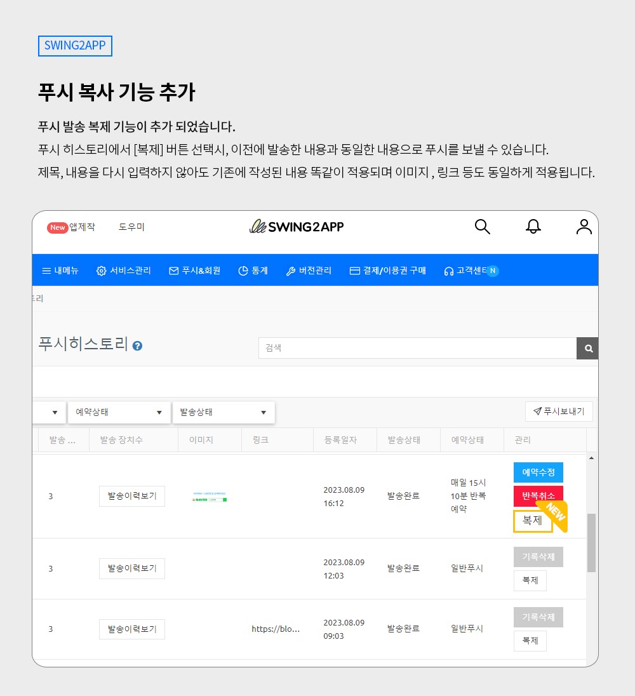
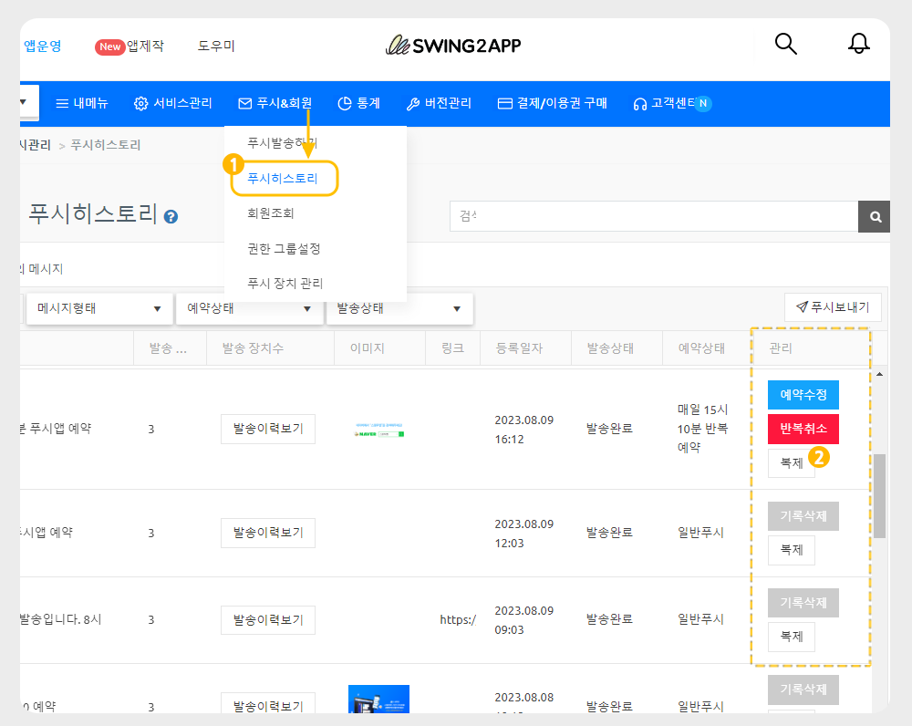

# 스윙투앱 업데이트

<figure><figcaption></figcaption></figure>

**\[업데이트 내용]**

**푸시 복사 기능 출시**

<figure><figcaption></figcaption></figure>

##  **푸시 복사 기능 출시**

<figure><figcaption></figcaption></figure>

**푸시 발송 복제 기능이 추가 되었습니다.**

이전에 발송한 푸시와 동일한 내용의 푸시를 다시 보내고자 할 때 \[복제] 버튼을 이용하여 간편하게 다시 보낼 수 있습니다.

제목, 내용을 다시 입력하지 않아도 기존에 작성된 내용과 똑같이 적용되며 이미지, 링크 등도 동일하게 적용됩니다.

###  **이용방법**

[앱운영 – 푸시&회원 – 푸시 히스토리](http://www.swing2app.co.kr/view/push\_list) 이동하시면 확인 가능합니다.

<figure><figcaption></figcaption></figure>

1\)푸시 히스토리 선택

2\)리스트 가장 오른쪽에 관리 영역에 보시면 \[복제]버튼 확인할 수 있습니다.

복제 버튼을 누르면 ‘푸시 발송하기’ 화면으로 이동하며,&#x20;

기존에 작성되었던 내용(메시지 제목, 내용, 이미지, 링크 등)이 동일하게 복사되어 연동됩니다.

\*추가 안내 : 예약 푸시 삭제를 원하시면 \[반복취소] 버튼을 선택해주세요. 기존에는 예약 취소만 되었다면, 기록 자체가 삭제됩니다.&#x20;

###  (1).png>) 안내사항


1\)앱운영 대시보드 추가 기능으로, 앱 업데이트는 필요 없습니다. 즉시 이용 가능합니다.

2\)복사하고자 하는 푸시 리스트를 확인 후 복제를 선택해주세요.

3\)복사시 내용 뿐만 아니라 수신대상자 역시 동일하게 선택이 됩니다.&#x20;

4\)예약 푸시도 이용 가능합니다.&#x20;


<figure><figcaption></figcaption></figure>

