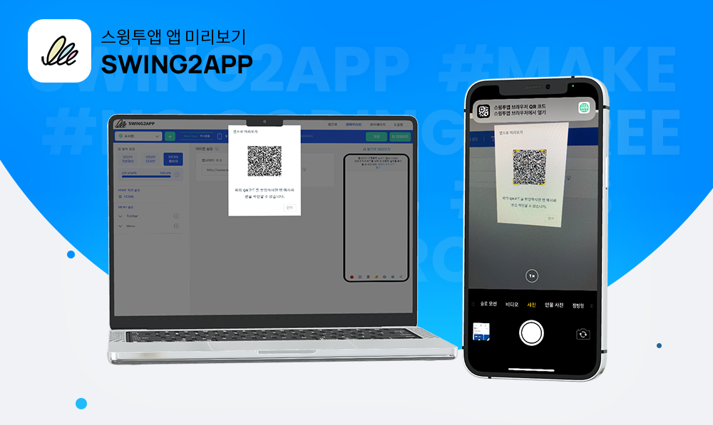
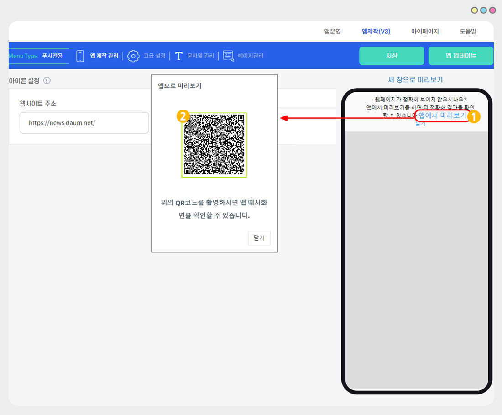
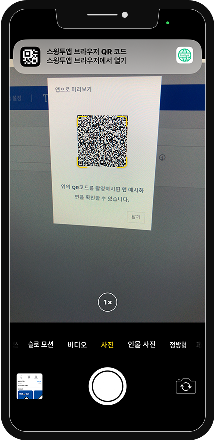
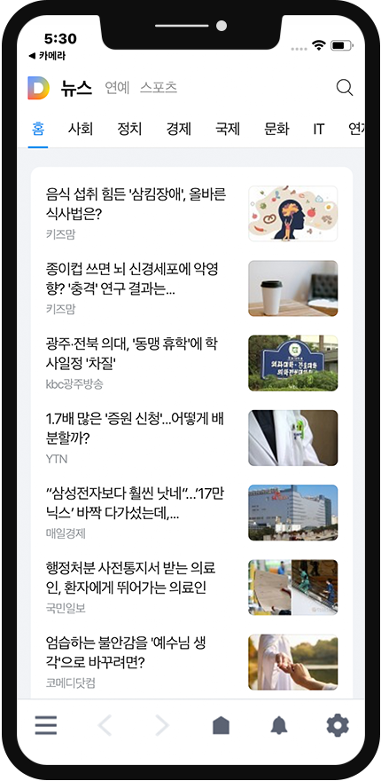

# 스윙투앱 업데이트

<figure><figcaption></figcaption></figure>

**\[업데이트 내용]**

스윙투앱 브라우저 어플 앱 미리보기 연동

<figure><figcaption></figcaption></figure>

##  스윙투앱 브라우저 어플 앱 미리보기 연동

<figure><figcaption></figcaption></figure>

푸시앱, 웹뷰앱 제작시 스윙투앱 브라우저 어플을 이용하여 모바일 기기에서 앱 미리보기 확인이 가능합니다.

<mark style="color:blue;">**어떻게 활용할 수 있나요?**</mark>

\-웹사이트 주소(URL)을 입력했지만, 웹 가상머신 화면에 표시되지 않거나(아무런 화면이 뜨지 않음)

\-모바일 화면이 아닌 PC 화면으로 보이는 등 정확한 확인이 불가할 때

앱 미리보기를 이용하여 핸드폰에서 직접 미리보기로 확인할 수 있습니다.

\*앱 설치 전 웹사이트가 앱으로 잘 연동이 되어 보여지는지 확인하는 용도입니다.

앱 미리보기는 안드로이드폰, 아이폰 모두 지원됩니다.

따라서 아이폰 사용자분들도 웹사이트가 앱으로 어떻게 입혀져서 보여지는지 확인이 가능합니다.

***

###  **이용방법**

\*먼저 스윙투앱 브라우저 어플을 설치하여 다운받아주세요.

\[아이폰] [앱스토어 다운 받기](https://apps.apple.com/us/app/swing2app-browser/id6450099622)

\[안드로이드폰] [플레이스토어 다운 받기](https://play.google.com/store/apps/details?id=com.hustay.swing.p275a02bc9a024f9eb54c077d056e2cb1)\

앱제작 화면 – STEP3 페이지에서 웹사이트 주소 입력 후 저장 버튼 선택

1\)오른쪽 웹 가상머신 화면에 기재된 \[앱에서 미리보기]를 선택해주세요.&#x20;

<figure><figcaption></figcaption></figure>

2\)QR코드가 생성됩니다. 아이폰 혹은 안드로이드폰 카메라로 QR코드를 촬영합니다.

<figure><figcaption></figcaption></figure>

3\)스윙투앱 브라우저 어플로 연결되며, 앱 미리보기에서 연결된 웹사이트를 확인할 수 있습니다.

<figure><figcaption></figcaption></figure>

\*스윙투앱 브라우저 어플이 설치 안되었을 경우 스토어 설치 화면으로 이동합니다.&#x20;

설치 후 다시 진행해주세요.&#x20;

\*앱 업데이트가 안되어 있는 분들은, 업데이트를 하고 이용할 수 있습니다.&#x20;

###  안내사항


1\)해당 기능은 **웹앱 – 웹뷰, 푸시앱 제작시 이용이 가능합니다.**

일반 프로토타입 앱제작시 웹 가상머신(웹 미리보기)로 앱 테스트를 모두 하실 수 있습니다.&#x20;

2\)**앱 업데이트 필요 없이 즉시 이용 가능합니다.**&#x20;

앱제작 화면 이동 오른쪽 가상머신 화면에서 앱 미리보기 선택하여 이용해주세요.&#x20;

STEP3페이지 단계 웹사이트 주소 입력되어 있어야 하며, 웹사이트 주소란에는 하이퍼링크 https:// or  http:// 꼭 입력해주세요.&#x20;

3\)앱스토어, 플레이스토어에서 스윙투앱 브라우저 어플을 설치하여 이용해주세요.&#x20;


