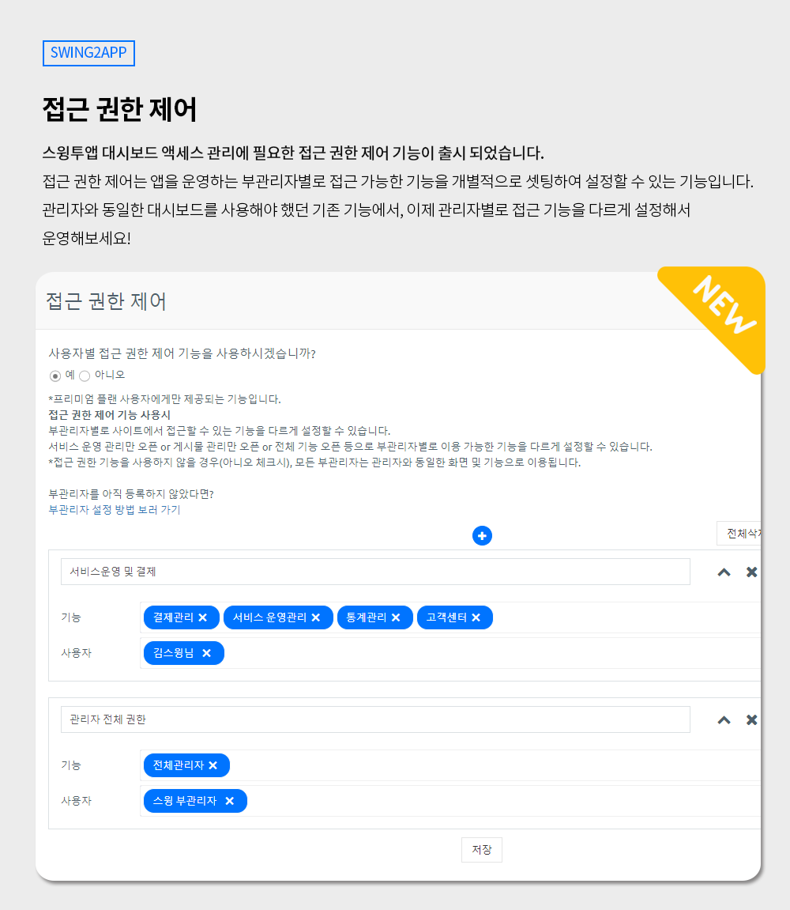
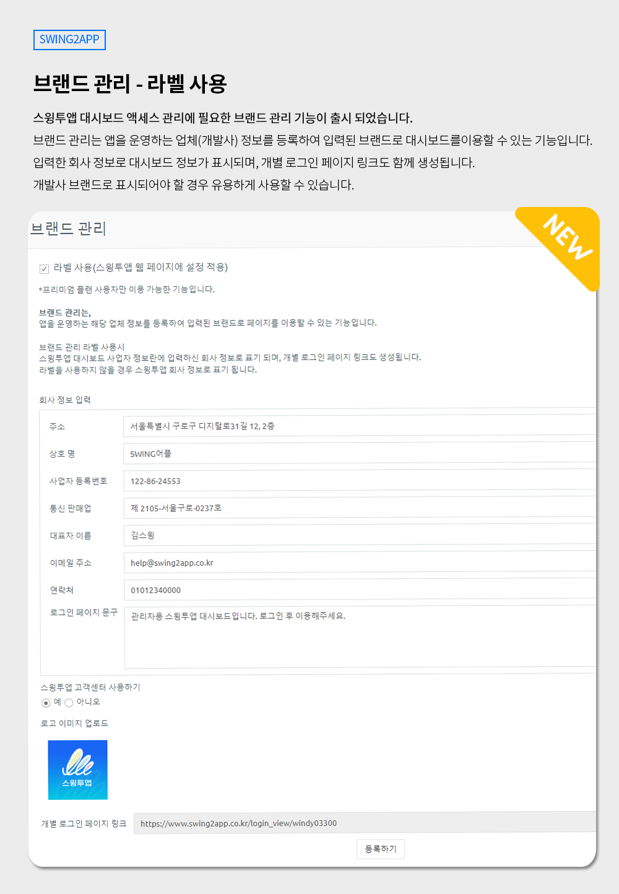

# 스윙투앱 업데이트

**\[업데이트 내용]**

1.접근 권한 제어

2.브랜드 관리 - 라벨설정

***

##  **1.접근 권한 제어 기능 업데이트**

<figure><figcaption></figcaption></figure>

**접근 권한 제어란?**

접근 권한 제어란, 부관리자별로 대시보드에 접근할 수 있는 기능을 각각 다르게 설정하는 기능입니다.

예를 들어)

\-A 부관리자: 결제 관리&#x20;

\-B 부관리자: 운영팀(앱 서비스관리, 게시물 관리, 쇼핑몰 관리)

\-C부관리자: 앱제작 관리

이렇게 각 관리자별로 접근이 가능한 기능을 셋팅하여 해당 기능만 노출되도록 사용할 수 있습니다.&#x20;

설정한 기능 외에 다른 기능은 노출되지 않아요.

\*접근 권한을 사용하지 않을 경우 모든 부관리자는 관리자와 동일한 대시보드로 사용됩니다.

접근 권한 없이 모든 기능이 관리자 화면과 동일하게 노출됩니다.

###  **이용방법**

[앱운영 - 서비스관리 - 콘솔 액세스 관리 - 접근 권한 제어](https://www.swing2app.co.kr/view/app\_access\_management\_view) 메뉴에서 이용 가능합니다.

이용방법은 아래 매뉴얼로 상세히 확인 가능합니다.

[접근 권한 제어 이용방법 바로가기](https://documentation.swing2app.co.kr/manual/appmanage/service/accessmanagement)&#x20;

###  안내사항


접근 권한 제어, 브랜드 관리 기능은 모두 아래의 사용 조건에 충족해야 이용이 가능합니다.

**\[사용조건]**

1\)일반 프로토타입 앱 사용자 대상

2\)스윙투앱 유료앱 이용권 중 "프리미엄 이용권" 사용에 한해 이용 가능합니다.

3\)앱에 설정된 부관리자가 있어야 합니다.&#x20;

부관리자를 아직 설정하지 않았다면 매뉴얼을 보시고, 부관리자를 지정해주세요.&#x20;

[부관리자 설정방법](https://documentation.swing2app.co.kr/manual/appmanage/pushmember/associate-administrator)


***

##  **2.브랜드 관리 – 라벨 사용 업데이트**

<figure><figcaption></figcaption></figure>

**브랜드관리 - 라벨 사용이란?**

브랜드 관리는, 앱을 운영하는 해당 업체 정보를 등록하여 입력된 브랜드로 페이지를 이용할 수 있는 기능입니다.

라벨 사용시, 스윙투앱 대시보드 사업자 정보란에 입력하신 회사 정보로 표기되며, 개별 로그인 페이지 링크도 생성됩니다.&#x20;

라벨을 사용하지 않을 경우 개별 페이지는 생성되지 않고, 회사 정보 역시 스윙투앱 정보로 표기 됩니다.

###  **이용방법**

[앱운영 - 서비스관리 - 콘솔 액세스 관리 – 브랜드 관리](https://www.swing2app.co.kr/view/brand\_setting\_view) 메뉴에서 이용 가능합니다.

이용방법은 아래 매뉴얼로 상세히 확인 가능합니다.

[브랜드관리 이용방법 바로가기](https://documentation.swing2app.co.kr/manual/appmanage/service/brandsetting)

###  안내사항


접근 권한 제어, 브랜드 관리 기능은 모두 아래의 사용 조건에 충족해야 이용이 가능합니다.

**\[사용조건]**

1\)일반 프로토타입 앱 사용자 대상

2\)스윙투앱 유료앱 이용권 중 "프리미엄 이용권" 사용에 한해 이용 가능합니다.

3\)앱에 설정된 부관리자가 있어야 합니다.&#x20;

부관리자를 아직 설정하지 않았다면 매뉴얼을 보시고, 부관리자를 지정해주세요.&#x20;

[부관리자 설정방법](https://documentation.swing2app.co.kr/manual/appmanage/pushmember/associate-administrator)


