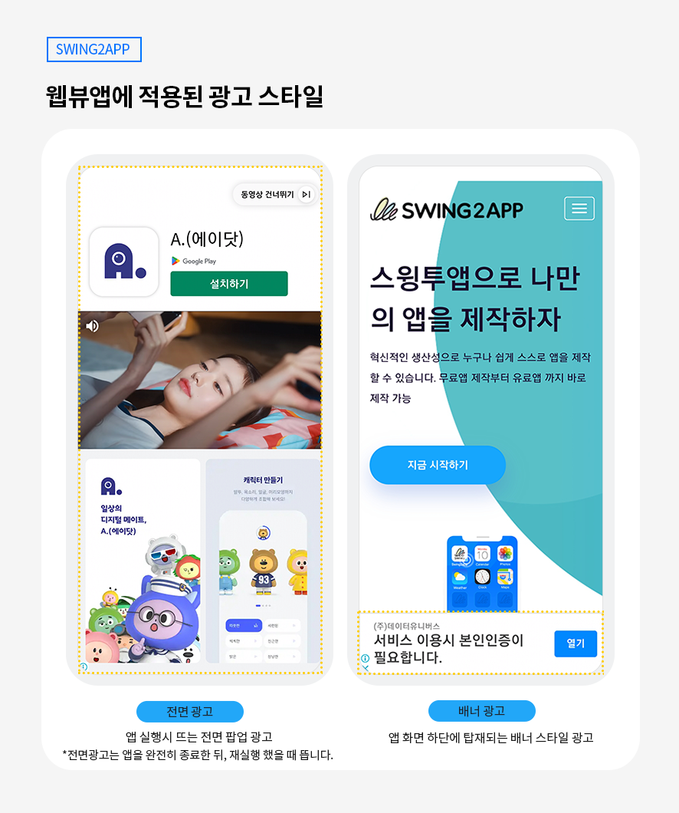

# 스윙투앱 업데이트

<figure><figcaption></figcaption></figure>

##  **** 웹앱(웹뷰, 푸시앱) 전용 애드몹 플러그인 출시

<figure><figcaption></figcaption></figure>

<mark style="color:blue;">웹사이트를 연결한 웹앱 – 웹뷰앱과 푸시앱에 적용할 수 있는 구글 애드몹 광고 플러그인 기능이 출시되었습니다.</mark>

**구글 애드몹(Admob)이란,**

앱에 광고를 탑재할 수 있는 서비스로, 구글에서 운영하는 광고 플랫폼입니다.

앱에서 구동이 되는 광고 플랫폼이기 때문에 스윙투앱 일반 프로토타입에서 제작한 앱에만 광고 셋팅이 가능했으나,&#x20;

업데이트된 기능에서는 웹사이트를 연결한 웹뷰&푸시앱에서도 광고를 셋팅할 수 있습니다.&#x20;

이제 웹앱에서도 광고를 탑재하여 광고 수익을 창출해보세요\~!



###   **광고가 적용된 웹뷰앱**

<figure><figcaption></figcaption></figure>

### .png)**이용방법**

1\)웹뷰 혹은 푸시앱 제작을 완료해주세요.&#x20;

2\)[앱운영→결제/이용권 구매 페이지→플러그인 추가 상품 구매 페이지](http://www.swing2app.co.kr/view/new\_product\_list\_by\_plugin) 이동

3\)구글 애드몹 적용 플러그인 상품(220,000원)을 구매합니다.&#x20;

4\)구매 즉시, 앱운영 메뉴에 서비스관리→애드몹 플러그인 설정 화면이 생성됩니다.

5\)애드몹 플러그인 설정 화면에서 광고 아이디를 연결해서 이용 가능합니다.

기존 일반 프로토타입 앱에서 적용하는 광고 셋팅 방법과 동일하게 이용해주시면 됩니다.

애드몹 플러그인 셋팅 상세 방법은 아래 매뉴얼을 확인해주세요.&#x20;



### .png)**안내사항**

1\)애드몹 플러그인 상품은 앱 한 개당 비용입니다.&#x20;

여러 앱에 광고를 셋팅 한다면 앱 마다 상품을 구매해야 합니다.

2\)애드몹 플러그인 적용 후 앱을 다시 업데이트 해야 합니다. (앱제작 화면- 앱 업데이트 선택)

이미 기존 앱이 스토어(플레이스토어, 앱스토어)에 출시된 상태라면, 새로 제작된 버전으로 앱 업데이트를 해야 합니다.&#x20;

스토어에 업데이트 하지 않을 경우 광고 적용이 되지 않습니다.&#x20;

3\)애드몹 적용 플러그인 상품은 애드몹 광고 셋팅만 지원하는 단품 상품입니다.

유료앱 이용권과 스토어 업로드 티켓은 포함되어 있지 않으니 별도 구매해야 합니다.

웹뷰/푸시 무제한 이용권을 추천 드립니다. [\[무제한 상품 추천 페이지\]](http://www.swing2app.co.kr/view/payment\_list\_by\_recommend\_voucher)

4\)앱에 노출되는 광고는 선택할 수 없으며(구글에서 랜덤으로 표시), 광고 셋팅은 - 전면광고, 배너 광고로 진행됩니다.

웹앱은 전면 광고 노출패턴 설정은 불가합니다.&#x20;

5\)애드몹에 관련된 광고 수익비, 운영방법, 정책사항 등 애드몹 운영에 관련된 내용은 스윙투앱에서 제공하지 않습니다.

구글 애드몹 공식 사이트에서 내용 및 주의사항을 충분히 확인 후 신청해주세요.


<mark style="color:orange;">**\*\*중요 안내\*\***</mark>

웹앱 전용 애드몹 플러그인 출시 기념으로 이벤트 진행 중입니다.

웹뷰앱 무제한 이용권 or 푸시앱 무제한 이용권 구매시 구글 애드몹 적용 플러그인 무료 제공해드리고 있습니다.

많은 참여 부탁드립니다.&#x20;

☞[\[이벤트 상세보기\]](https://blog.naver.com/swing2app/222997814328)


<figure><figcaption></figcaption></figure>
