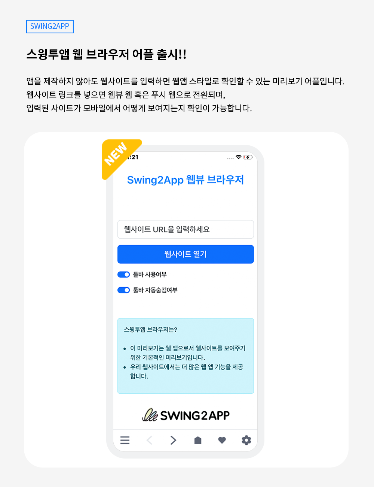

# 스윙투앱 업데이트

<figure><figcaption></figcaption></figure>

**\[업데이트 내용]**

스윙투앱 웹뷰 브라우저 어플 출시

<figure><figcaption></figcaption></figure>

##  **스윙투앱 브라우저 어플 출시 !**

<figure><figcaption></figcaption></figure>

**스윙투앱 브라우저 앱이란?**

앱을 제작하지 않아도 웹사이트를 입력하면 바로 웹앱 스타일로 확인 가능한 미리보기 어플입니다.

웹사이트 링크를 넣으면 웹뷰 웹 혹은 푸시 웹으로 전환되며 입력된 사이트가 모바일에서 어떻게 보여지는지 확인이 가능합니다.

###  **스윙투앱 브라우저 앱의 장점**

1\)웹사이트를 적용한 웹 앱이 어떻게 보여지는지 앱 제작 없이 바로 확인 가능

2\)아이폰에서도 즉시 확인 가능

3\)원하는 UI스타일 선택하여 확인 가능 (푸시 툴바 사용여부 체크)

4\)앱으로 만들고자 하는 웹사이트가 있다면, 언제 어디서든! 횟수 제한없이 자유롭게 확인 가능

​

###  **이용방법**

<figure><figcaption></figcaption></figure>

1\)안드로이드폰은 플레이스토어, 아이폰은 앱스토어에서 검색 후 다운 받아 주세요: '스윙투앱 브라우저' 검색 어플 다운

▶[플레이스토어 앱 출시 링크](https://play.google.com/store/apps/details?id=com.hustay.swing.p275a02bc9a024f9eb54c077d056e2cb1)

▶[앱스토어 앱 출시 링크](https://apps.apple.com/us/app/%EC%8A%A4%EC%9C%99%ED%88%AC%EC%95%B1-%EB%B8%8C%EB%9D%BC%EC%9A%B0%EC%A0%80/id6450099622?platform=iphone)

2\)앱 실행 후 웹사이트 URL입력란에 앱으로 적용할 홈페이지 주소를 입력해주세요

\*하이퍼링크 “http://” 반드시 입력해주세요

3\)웹사이트 열기 버튼을 선택해주세요.

4\)연결된 웹사이트로 웹앱 미리보기 확인이 가능합니다.

### .png) 안내사항


1\)스윙투앱 브라우저 앱은 앱 내에서 미리보기로 확인하는 용도로 실제 앱이 제작되거나, 앱으로 다운 받는 용도가 아닙니다.

2\)브라우저 어플에서 웹 앱 미리보기로만 확인하신 뒤, 앱제작은 스윙투앱 공식 홈페이지에서 회원가입 및 로그인 후 앱제작에서 직접 제작해주셔야 합니다.

3\)툴바 사용시, 툴바에서 제공되는 기능들도 이용할 수 있습니다.

툴바에서 제공되는 기능들도 확인 해보시기 바랍니다.

4\)앱이 아니기 때문에 푸시 앱에서 발송되는 푸시 등의 기능은 이용이 불가합니다.



<figure><figcaption></figcaption></figure>

