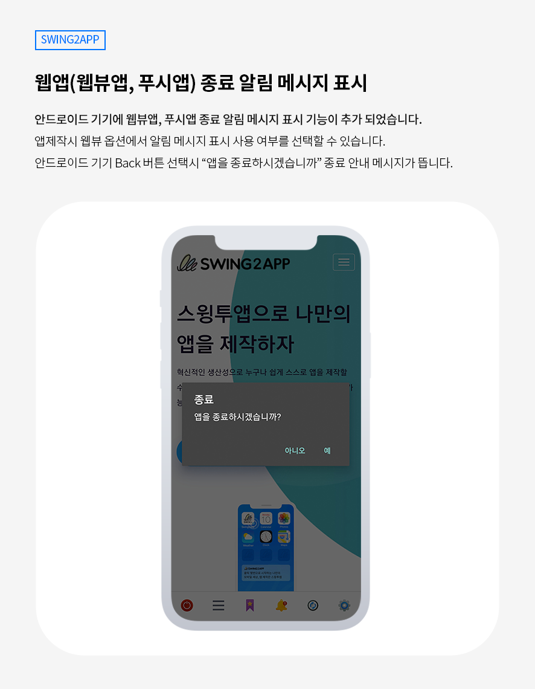
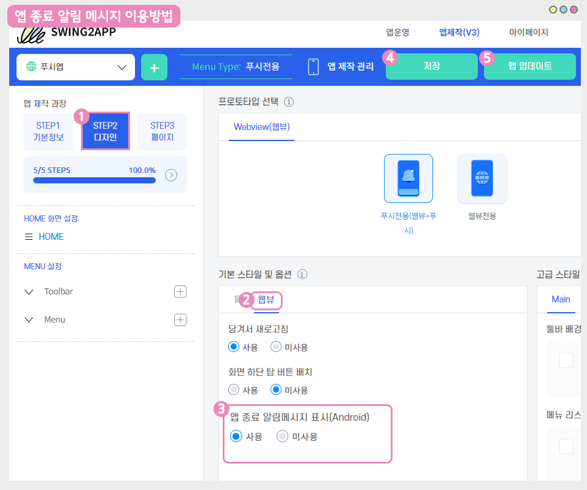

# 스윙투앱 업데이트

<figure><figcaption></figcaption></figure>

**\[업데이트 내용]**

웹앱(웹뷰앱, 푸시앱) 앱 종료 알림 메시지 기능 추가

<figure><figcaption></figcaption></figure>

##  웹앱(웹뷰앱, 푸시앱) 종료 알림 메시지

<figure><figcaption></figcaption></figure>

안드로이드 기기 - 웹뷰앱, 푸시앱 종료 알림 메시지 표시 기능이 추가 되었습니다.

기존 웹앱은 앱 종료시 별도 메시지가 뜨지 않고, 더이상 돌아갈 이전 페이지가 없으면 앱이 자동 종료되었습니다.

업데이트된 기능에서는 웹뷰앱, 푸시앱 제작시 알림 메시지 표시 사용 여부를 선택할 수 있도록 옵션 기능으로 제공됩니다.

앱 종료 메시지 표시를 사용할 경우, 안드로이드 기기 Back 버튼 선택시 “앱을 종료하시겠습니까” 안내 메시지가 뜹니다.

​

###  **이용방법**

<figure><figcaption></figcaption></figure>

앱제작 화면 이동 합니다.

1\)STEP2디자인 선택

2\)기본 스타일 및 옵션에서 \[웹뷰] 선택

3\)앱 종료 알림 메시지 표시 선택 - 사용(알림 메시지 띄움) or 미사용(메시지 없이 바로 종료됨)

4\)상단 \[저장] 버튼 선택

5\)\[앱 업데이트] 버튼을 선택합니다.

### .png) 안내사항


1\)해당 기능은 앱 업데이트가 필요합니다.

업데이트 후 새로 제작된 버전으로 확인시 반영된 내용으로 확인 가능합니다.

플레이스토어, 앱스토어 등에 출시된 앱은 해당 스토어별로 새로 제작된 버전으로 앱 업데이트를 해주셔야 합니다.

​

2\)사용으로 이용하다 다시 미사용으로 변경할 때에도 업데이트를 해야 합니다.

반대(미사용→사용)의 경우도 동일합니다.

​

3\)앱 종료 알림 메시지는 안드로이드폰에서만 이용 가능합니다.

아이폰은 기기 특성상 앱에서 별도 종료를 할 수 없기 때문에, 안드로이드폰에서만 이용이 가능합니다.

​

4\)기본 셋팅은 ‘미사용’으로 되어 있으며, 미사용으로 이용시 종료 메시지는 뜨지 않고 앱은 바로 종료됩니다.

종료 메시지를 사용할 경우 반드시 '사용'으로 체크한 뒤 이용해주시기 바랍니다.

​

5\)웹뷰앱, 푸시앱에서 모두 이용 가능합니다.

일반 프로토타입으로 제작한 앱은 앱 종료 알림 메시지가 제공이 되고 있으므로 별도 업데이트가 필요 없습니다.



<figure><figcaption></figcaption></figure>

