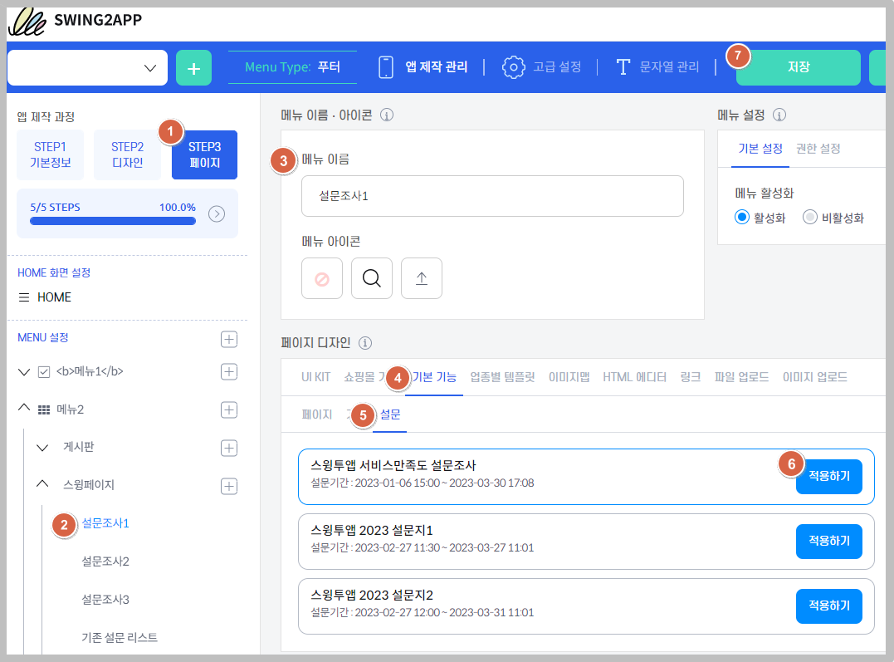
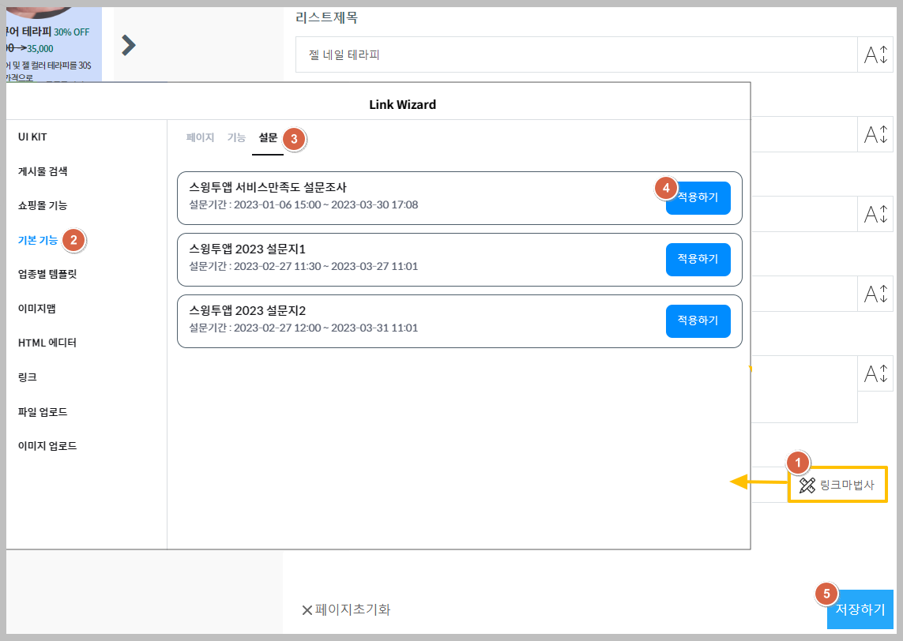

# 스윙투앱 업데이트

<figure><figcaption></figcaption></figure>

**\[업데이트 내용]**

**1.설문조사시 개별 링크 추가 업데이트**&#x20;

**2.푸시앱 툴바 리스트 메뉴 영문→한국어 변경**

<figure><figcaption></figcaption></figure>

###  **1.설문조사 개별 링크 추가 업데이트**&#x20;

<figure><figcaption></figcaption></figure>

앱 메뉴에 개별적으로 설문조사 페이지를 연결할 수 있는 개별 링크 기능을 추가 업데이트 했습니다.

**설문조사 개별 링크란,** 하나의 설문조사만 선택해서 메뉴에 연결할 수 있도록 추가된 기능입니다. 

기존에는 등록한 모든 설문조사가 한 페이지에 보여 졌지만, 업데이트 된 기능에서는 하나의 설문조사만 보여 지도록 개별 링크를 선택해서 메뉴에 연결할 수 있습니다.\

**활용 TIP**

\-여러 설문지를 등록한 뒤, 특정 시기 마다 새로운 설문지를 공개할 때 일정에 맞게 하나씩 오픈하여 사용할 수 있어요.  &#x20;

\-아직 시작이 되지 않은 설문지가 공개되지 않도록 활용할 수 있어요.&#x20;

\-메뉴별 다른 주제의 설문지를 연결해서 사용자들에게 다양한 설문조사지를 받을 때 활용할 수 있어요.&#x20;

\
 **설문조사 앱 실행화면 비교**

<figure><figcaption></figcaption></figure>

기존 제공되던 설문조사 페이지 적용 화면과, 설문조사 개별 링크로 적용한 화면을 확인해주세요.

기존 페이지로 적용시 등록된 모든 설문조사가 한 페이지에 모두 활성화되어 보여지구요.

개별 링크 적용시, 연결된 하나의 설문조사만 보여지며 설문이 바로 시작됩니다.

\

 **이용방법**

<figure><figcaption></figcaption></figure>

1\)설문조사를 먼저 만들어주세요.&#x20;

[설문조사 만들기 이용방법 매뉴얼 보기](https://documentation.swing2app.co.kr/manual/appmanage/service/survey)&#x20;

2\)설문조사를 다 등록했다면, 앱제작으로 이동해서 메뉴에 개별 링크로 적용해주세요.&#x20;

3\)앱제작 이동→ STEP3페이지→ 왼쪽 화면 메뉴 선택→메뉴 이름 입력→ '페이지 디자인' 항목에서 \[기본 기능] 선택→ \[설문] 선택→ 적용하고자 하는 설문지 선택 후 \[적용하기]버튼 선택→ 상단\[저장]버튼 선택

\

\*페이지 제작도구(웹 템플릿, 이미지 페이지, HTML에디터 적용시)에 설문지 개별링크를 적용한다면 아래 방법으로 진행해주세요.

<figure><figcaption></figcaption></figure>

페이지 제작도구 화면→\[링크 마법사]버튼 선택→ \[기본 기능] 선택→ \[설문] 선택→ 적용하고자 하는 설문지 선택 후 \[적용하기]버튼 선택→ 저장하기 버튼 선택→ 앱제작화면으로 돌아와서 상단 \[저장]버튼 선택해주세요.


**안내사항**

1\)기존 설문조사 페이지 메뉴도 이용 가능하며, 설문조사를 개별적으로 연결해서 하나씩 보여지게 할 때만 업데이트된 해당 메뉴로 이용해주시면 됩니다.&#x20;

2\)해당 기능은 업데이트 하지 않아도 바로 이용 가능합니다.

위의 이용방법을 확인하여 앱에 적용해주세요.&#x20;


<figure><figcaption></figcaption></figure>

###  **2.푸시앱 툴바 리스트 메뉴 영문→한국어 변경**

<figure><figcaption></figcaption></figure>

툴바 알림목록 메뉴 중 영문으로 뜨는 버튼명을 한국어로 수정 조치했습니다.

See more, Share 버튼 → 더보기, 공유 한국어로 버튼명 수정 완료했습니다.


**이용방법 및 안내사항**

1\)해당 기능은 푸시앱 이용시 확인 가능하며, 푸시앱 툴바에서 '알림목록' 메뉴를 사용할 경우 이용 가능합니다.

2\)수정된 한국어로 메뉴를 반영하기 위해서는 앱 업데이트가 필요합니다.

앱제작 화면 이동 → \[앱 업데이트] 버튼 선택→ 업데이트 표시 유형: 권장 or 필수 선택사항

업데이트 버전 확인시 변경된 문구로 확인 가능합니다.

앱이 플레이스토어, 앱스토어에 출시되었다면, 새 버전앱으로 업데이트 제출해주세요.&#x20;


****

<figure><figcaption></figcaption></figure>
