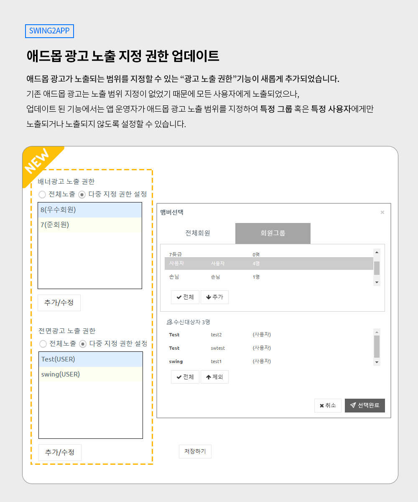

# 스윙투앱 업데이트

<figure><figcaption></figcaption></figure>

**스윙투앱 2023년 1월 4주차 정기 업데이트**

안녕하세요 스윙투앱 입니다.

1월 4주차 스윙투앱 기능 업데이트 내용을 알려드리겠습니다.

**\[업데이트 내용]**

애드몹 광고 노출 - 지정 권한 설정 기능 신규 출시

<figure><figcaption></figcaption></figure>

##  **애드몹 광고 노출 지정 권한 기능**

<figure><figcaption></figcaption></figure>

애드몹 광고가 노출되는 범위를 지정할 수 있는 “광고 노출 권한”기능이 새롭게 추가되었습니다.&#x20;

<mark style="color:blue;">\*애드몹 광고 노출 권한이란?</mark>

스윙투앱에서 제작한 앱 광고는 ‘구글 애드몹 광고’ 셋팅이 가능하며, 배너 광고와 전면 광고로 노출이 되고 있습니다.

광고는 별도의 접근 권한 없이 앱을 설치한 모든 사용자들에게 노출이 되는 구조이나, 노출 권한을 이용하면 배너 광고와 전면 광고 각각 노출이 되거나 노출이 되지 않는 범위를 설정할 수 있습니다.&#x20;

권한은 앱에 가입된 회원들을 개별적으로 선택해서 추가하거나, 특정 그룹(회원 그룹)을 선택하여 추가할 수 있습니다.&#x20;

기존 애드몹 광고는 노출 범위 지정이 없었기 때문에 모든 사용자에게 노출되었으나,

업데이트 된 기능에서는 **앱 운영자가 애드몹 광고 노출 범위를 지정하여 특정 그룹 혹은 특정 사용자에게만 노출되거나 노출되지 않도록 설정할 수 있습니다.**&#x20;

\

.png)**이용방법**

1\)앱제작 화면으로 이동한 뒤 앱을 한번 업데이트 해주세요.&#x20;

\[앱 업데이트] 버튼만 선택해주시면 됩니다.

2\)업데이트 표시 옵션은 '업데이트 표시 안함'으로 우선 선택해주세요.

3\)앱 제작이 완료되면, [애드몹 플러그인 설정](http://www.swing2app.co.kr/view/app\_plugin\_by\_admob)으로 이동해주세요.

4\)애드몹 설정화면 - 배너, 전면 광고에 \[노출 권한 설정] 입력 항목이 추가 된 것을 확인할 수 있습니다.

<figure><figcaption></figcaption></figure>

5\)다중 지정 권한 설정을 선택한 뒤, \[추가/수정 버튼] 선택

<figure><figcaption></figcaption></figure>

→앱에 가입된 회원(사용자) 혹은 그룹별로 추가한 뒤 \[저장하기]버튼 선택해주시면 됩니다.

→별도 권한 설정을 하지 않을 경우 “전체노출”로 설정해주시면 됩니다.&#x20;

→지정 권한설정에 추가 되어 있는 그룹 및 사용자에게 광고가 노출 됩니다.&#x20;

\*광고를 노출할 그룹을 선택해주세요.&#x20;

6\)저장한 뒤, 새로 제작된 앱(업데이트 버전 앱)을 다시 다운받아 확인해주세요.

\*핸드폰에 플레이스토어에서 다운 받은 앱이 설치되어 있다면, 삭제 후 업데이트 된 버전의 앱으로 새로 설치해주세요.&#x20;

\*아이폰은 테스트 불가, 앱스토어에 업데이트 해야 확인 가능합니다.&#x20;

7\)테스트 후 문제 없으면, 앱이 출시된 각 스토어에 업데이트 버전의 앱으로 심사 제출해야 합니다.&#x20;

앱스토어는 업로드 대행만 가능하기 때문에, 당사로 앱스토어 업로드 신청주시기 바랍니다.

플레이스토어는 직접 업데이트 가능하며, 대행 요청 시 동일하게 플레이스토어 업로드 신청 주시면 됩니다.

8\)업데이트 설정은 다시 수정이 가능합니다.

스토어 업데이트 전 테스트를 위해 업데이트 설정을 “업데이트 표시 안함”으로 설정했기 때문에, 사용자의 앱에서 앱 업데이트 메시지 창이 뜨도록 수정해주세요.&#x20;

[앱운영-버전관리-앱제작이력 페이지](http://www.swing2app.co.kr/view/app\_work\_history) 이동, 업데이트 설정: “필수 업데이트(재설치)”로 선택합니다.

  **운영방법 TIP**

앱 내에서 유료 회원권 등의 상품을 구매하는 경우, 회원권을 구매한 유료 사용자에게는 앱 광고가 노출되지 않게 설정할 수 있습니다.&#x20;

광고 노출이 앱 이용에 방해가 될 수 있기 때문에, VIP 등의 등급에게는 광고가 제거된 버전으로 이용이 가능하도록 운영할 수 있습니다.&#x20;

또한 회원가입을 하지 않은 손님에게는 광고가 모두 노출되고, 회원가입을 할 경우 광고가 노출되지 않도록 설정할 수도 있습니다.

이처럼 앱 이용 목적에 맞게 광고 노출 범위를 운영자가 직접 설정할 수 있습니다.&#x20;

​

.png)**안내사항**

1\)해당 기능은 ‘구글 애드몹 적용 플러그인’ 상품을 구매한 사용자만 이용 가능합니다.

애드몹 플러그인 상품은 [결제/이용권 구매 - 플러그인 추가 상품 구매 페이지](http://www.swing2app.co.kr/view/new\_product\_list\_by\_plugin)에서 구매 가능합니다.&#x20;

2\)광고 노출 권한 기능을 이용하기 위해서는 앱 업데이트를 먼저 해주셔야 합니다.

앱 업데이트를 해야 애드몹 광고 플러그인 화면에 신규 기능이 노출됩니다.&#x20;

3\)앱을 업데이트 하기 때문에, 스토어에 출시된 앱도 새 버전으로 다시 업데이트 해주셔야 합니다.

스토어에 업데이트를 하지 않으면 앱을 다운 받은 사용자들은 이용이 불가합니다.&#x20;

4\)업데이트 후 광고 노출 권한 수정은 수정 후 저장만 해주시면 앱에 자동 반영됩니다.

최초 반영 이후는 업데이트를 따로 하지 않아도 됩니다.&#x20;

5\)기능 업데이트일 기준 23년 1월 20일 이후 애드몹 플러그인 상품을 구매한 분들은 애드몹 플러그인 설정 화면에 광고 노출 권한 설정 기능을 즉시 확인할 수 있습니다.

<figure><figcaption></figcaption></figure>
