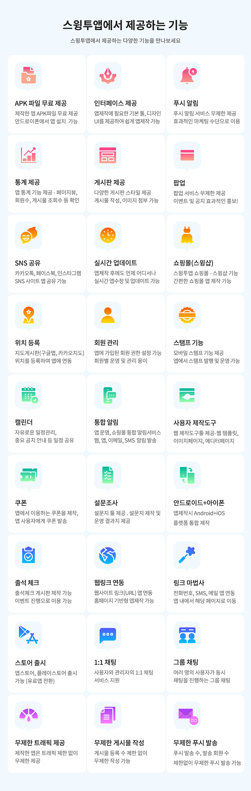

# 스윙투앱

<figure><figcaption></figcaption></figure>

## **스윙투앱이란?**



스윙투앱은 사용자가 직접 제작하는 무료앱제작 서비스입니다.

개발비, 구축비가 전혀 없으며, 무료로 제작이 가능합니다.

* 스윙투앱에서 제공하는 앱제작 툴로 쉽고 간편하게 앱제작을 할 수 있습니다.
* 내맘대로 메뉴를정하고 다양한 기능을 무료로 사용할 수 있어요!
* 언제 어디서나 앱 제작 및 관리가 편리한 앱 운영관리가 가능합니다.
* 푸시, 팝업, 전화, SNS 연동으로 효과적인 마케팅 및 홍보가 가능합니다.

스윙투앱에서 제공하는 앱제작툴에 다양한 기능을 적용하여 나만의 앱을 만들어보세요!

## 모바일 앱 제작 최고의 솔루션

**코딩 없이 누구나 쉽게 제작할 수 있는 앱 제작 서비스 지금 시작해보세요.**

1년 365일 , 24시간 언제나 자신의 앱을 제작하고 확인할 수 있습니다.

<table data-card-size="large" data-view="cards"><thead><tr><th></th><th></th><th></th><th data-hidden></th><th data-hidden data-type="files"></th></tr></thead><tbody><tr><td><h4><strong>노코드 앱 제작 환경 제공</strong></h4></td><td>

개발 지식이 없어도 앱 제작 도구를 활용해 누구나 직접 앱을 만들 수 있습니다. 복잡한 개발 과정 없이 필요한 기능을 선택하고 구성하여 빠르게 앱 제작을 시작할 수 있습니다.
</td><td><ul><li>코딩 없이 앱 화면 구성 가능</li><li>메뉴, 페이지, 게시판 등 기능 선택형 제작</li><li>앱 제작 초보자도 쉽게 접근 가능</li><li>제작 후 수정 및 관리 가능</li><li>사업, 쇼핑몰, 커뮤니티, 교육, 기관용 앱 제작 지원</li></ul></td><td></td><td></td></tr><tr><td><h4><strong>웹사이트 기반 앱 제작 지원</strong></h4></td><td>기존에 운영 중인 웹사이트나 쇼핑몰이 있다면, 해당 사이트를 기반으로 웹앱 또는 푸시앱 형태의 모바일 앱을 제작할 수 있습니다.</td><td><ul><li>기존 홈페이지를 앱으로 제작 가능</li><li>쇼핑몰, 예약사이트, 커뮤니티 사이트 앱 제작 지원</li><li>모바일 웹사이트 기반 앱 제작 가능</li><li>다양한 게시판 기능 및 도구</li><li>웹사이트 기능을 앱에서도 그대로 활용 가능</li><li>별도 신규 개발 부담을 줄일 수 있음</li></ul></td><td></td><td></td></tr><tr><td><h4><strong>스토어 출시 지원</strong></h4></td><td>앱 제작뿐만 아니라 구글 플레이스토어와 애플 앱스토어 출시 과정까지 함께 진행할 수 있어, 처음 앱을 출시하는 사용자도 부담을 줄일 수 있습니다.</td><td><ul><li>구글 플레이스토어 등록 지원</li><li>애플 앱스토어 등록 지원</li><li>앱 심사 제출 과정 안내</li><li>스토어 등록에 필요한 기본 정보 확인</li><li>출시 후 앱 관리 및 업데이트 지원</li></ul></td><td></td><td></td></tr><tr><td><h4><strong>무제한 푸시 알림 기능 제공</strong></h4></td><td>앱 사용자에게 공지사항, 이벤트, 업데이트 소식 등을 푸시 알림으로 전달할 수 있어 앱 운영과 고객 관리에 효과적입니다.</td><td><ul><li>전체 회원 대상 푸시 발송 가능</li><li>공지, 이벤트, 마케팅 알림 활용 가능</li><li>앱 재방문 유도 가능</li><li>운영자가 직접 푸시 메시지 관리 가능</li><li>웹사이트보다 적극적인 사용자 소통 가능</li></ul></td><td></td><td></td></tr></tbody></table>

<table data-card-size="large" data-view="cards"><thead><tr><th></th><th></th><th></th><th data-hidden></th><th data-hidden data-type="files"></th></tr></thead><tbody><tr><td><h4><strong>안드로이드+아이폰 통합 제작</strong></h4></td><td>

다양한 플랫폼 지원으로 운영되는 모든 플랫폼에 대한 서비스 가능합니다. 
</td><td><ul><li>안드로이드 앱 제작 지원</li><li>애플 아이폰 앱 제작 지원</li><li>모바일 웹 제작 지원</li><li>아이패드 및 태블릿 호완가능</li></ul></td><td></td><td></td></tr><tr><td><h4><strong>강력한 앱 운영도구 제공</strong></h4></td><td>앱 출시후에 푸시발송 회원관리 등 앱 제작에 필요한 다양한 도구들을 제공</td><td><ul><li>HTML 제작 도구 제공</li><li>업종별 템플릿 페이지 제공</li><li>이미지 기반 페이지 제작도구</li><li>다양한 게시판 기능 및 도구</li><li>푸시 무제한 무료발송</li><li>강력한 앱 관리 툴 제공</li></ul></td><td></td><td></td></tr><tr><td><h4><strong>앱 제작 도구</strong></h4></td><td>초기 앱 제작 및 배포를 위한 다양한 도구를 제공, 앱을 만들면서 실시간으로 나의 앱을 확인할 수 있습니다.</td><td><ul><li>실시간 앱 제작기능</li><li>실시간 가상머신 제공</li><li>아이폰 미리보기 앱 제공</li><li>APK 다운로드 기능 제공</li><li>10분 이내 빠른 앱제작 속도</li></ul></td><td></td><td></td></tr><tr><td><h4><strong>사용자 지원</strong></h4></td><td>제작에 필요한 고객지원 그리고 앱 업로드를 위한 등록 대행서비스까지 누구나 쉽게 접근할 수 있는 서비스</td><td><ul><li>온라인 및 유선 고객센터 운영</li><li>온라인 도움말 제공</li><li>커스터마이징 서비스 제공</li><li>구글,애플스토어 등록대행 가능</li><li>이용한만큼 결제 합리적인 비용</li></ul></td><td></td><td></td></tr><tr><td><h4><strong>실시간 확인과 빠른 제작 진행</strong></h4></td><td>앱을 제작하면서 실시간으로 결과를 확인할 수 있어, 원하는 형태로 빠르게 수정하고 완성도를 높일 수 있습니다.</td><td>

<ul><li>앱 제작 중 실시간 미리보기 가능</li><li>수정 사항을 빠르게 확인 가능</li><li>제작 과정에서 반복 수정 가능</li><li>앱 완성 전 테스트 가능</li><li>빠른 앱 제작 및 배포 준비 가능</li></ul></td><td></td><td></td></tr><tr><td><h4><strong>앱 제작 후 확장 가능</strong></h4></td><td>처음에는 기본 앱으로 시작하고, 운영 과정에서 필요한 기능을 추가하거나 커스터마이징을 통해 서비스를 확장할 수 있습니다.</td><td>

<ul><li>기본 기능으로 빠른 앱 제작 가능</li><li>필요 시 추가 개발 및 커스터마이징 가능</li><li>운영 상황에 맞춰 기능 확장 가능</li><li>웹사이트 연동 및 회원 연동 지원 가능</li><li>장기적인 앱 운영에 적합한 구조 제공</li></ul></td><td></td><td></td></tr></tbody></table>

## 스윙투앱 제작 가이드 영상



## 가장 자주 묻는 질문 FAQ





## 도움말 프로그램 안내

도움말에서 제공하는 스윙투앱 서비스를 선택하여 빠르게 이동해보세요.













## 스윙투앱에서 제공하는 무료 기능 및 강점

스윙투앱에서는 앱제작 및 앱운영에 필요한 다양한 기능을 모두 무료로 제공하고 있습니다.





<figure><figcaption></figcaption></figure>
