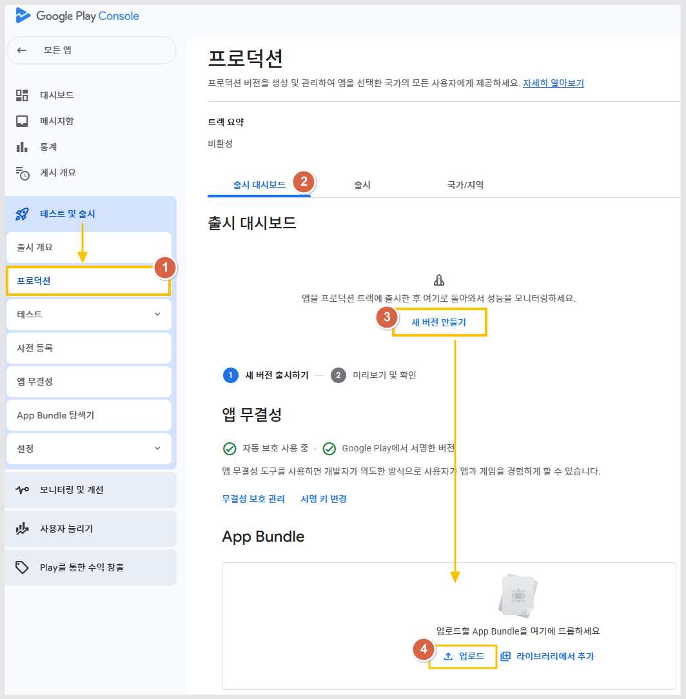

# AAB파일 받기

***

## **1.AAB파일이란?**


AAB 파일이란, 플레이스토어/ 갤럭시 스토어 등 안드로이드 기반의 플랫폼 스토어에 등록할 수 있는 앱 파일입니다.

제작하신 앱을 플레이스토어에 출시할 때 AAB파일을 PC에서 다운 받은 뒤 등록해주세요.



<mark style="color:red;">AAB 파일은 유료앱 사용자에게만 제공됩니다.</mark>&#x20;

<mark style="color:red;">\*스토어 배포용 파일이기 때문에 무료앱에서는 제공하지 않습니다.</mark>

이용권 구매 후, 앱 업데이트 (앱제작 화면 - 앱 업데이트 버튼 선택)를 해주세요.

새로 제작된 버전부터 AAB파일이 생성됩니다.&#x20;


***

## **2.AAB파일 받기**

<figure><figcaption></figcaption></figure>

앱제작이 완료된 후 [**앱운영→ 버전관리→앱제작이력**](http://www.swing2app.co.kr/view/app_work_history) 에서 AAB파일을 받을 수 있습니다. (이용권 구매 후 앱제작 한번 더 해주세요)

\[AAB파일 받기] 버튼을 선택하면 사용자의 PC로 파일이 다운되요.

***

## **3.AAB파일 등록하기**

<figure><figcaption></figcaption></figure>

구글 플레이스토어에 앱을 등록하는 방법입니다.

[플레이콘솔 접](https://play.google.com/console/developers)속 후&#x20;

1\)테스트 및 출시 - 프로덕션 선택&#x20;

2\)출시 대시보드 선택&#x20;

3\)새 버전 만들기 선택

4\)App Bundle 업로드 버튼을 선택하신 뒤, 다운 받은 AAB파일을 업로드 해주시면 됩니다.

플레이스토어 앱 등록 전체 과정은, 플레이스토어 앱등록 가이드를 확인해주세요.



***

## **4.중요안내**


플레이스토어 앱 등록 시스템 업데이트로 기존 앱 등록 파일인 APK파일에서 → AAB파일로 변경되었습니다.

**AAB파일은 스윙투앱에서 21년 8월9일 이후에 제작된 앱부터 생성이 됩니다.​**

따라서 21.08.09 이전에 제작된 앱은 앱제작으로 이동하셔서 \[앱 업데이트]버튼 선택하여 새 버전으로 앱제작 다시 해주세요.

새로 제작된 앱부터 AAB파일을 받을 수 있습니다.

만약 정상적으로 등록이 되지 않는다면 스윙투앱 문의게시판으로 문의 남겨주시기 바랍니다.



**앱 업데이트를 제출할 경우,**

\
<mark style="color:orange;">**APK파일로 출시된 앱은→업데이트도 APK파일로 등록해주세요.**</mark>

<mark style="color:orange;">**AAB파일로 출시된 앱은→업데이트도 AAB파일로 등록해주세요.**</mark>

플레이스토어 업데이트를 하는 경우, 기존 APK파일로 출시된 앱은 AAB파일이 아닌 APK파일로 올려주시면 됩니다.

일반 프로토타입 앱, 푸시/웹뷰 앱 모두 동일합니다.

즉, 파일 확장자를 동일하게 맞춰서 업데이트 해주셔야 합니다.


