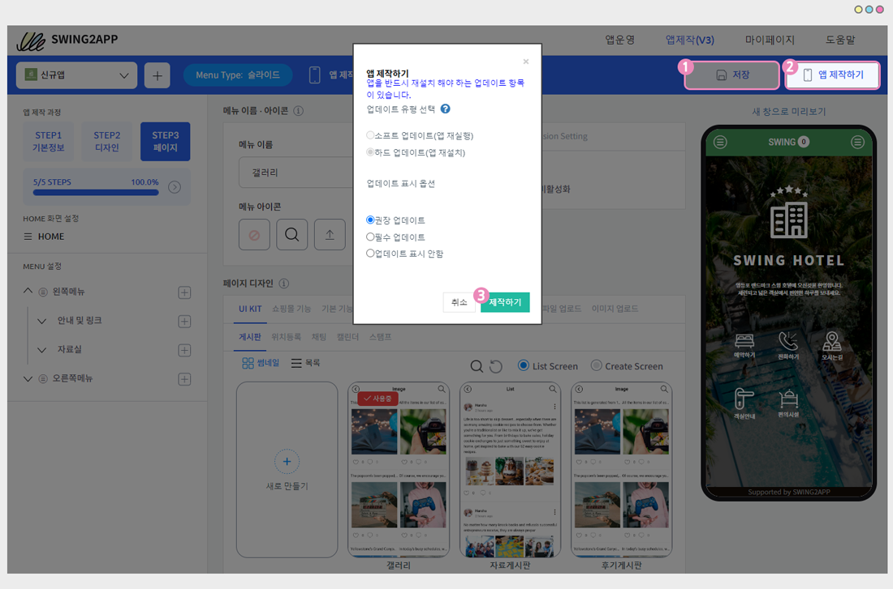
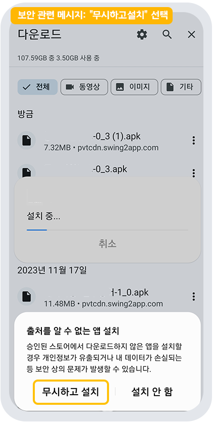
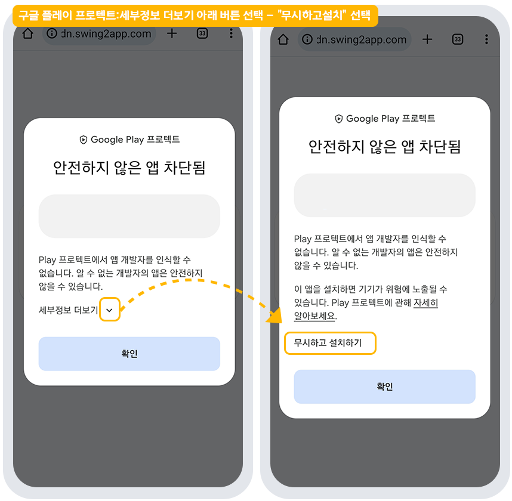

# 앱 다운받는 방법 (APK파일 핸드폰 설치)

**스윙투앱에서 제작한 APK파일(앱)을 핸드폰으로 설치하는 방법을 알려드리겠습니다.**

스윙투앱에서 앱제작 요청을 하면, 앱이 제작되며 해당 앱이 APK파일로 만들어지는데요.

앱 제작시간은 일반 프로토타입 앱제작시 5분 이내, 웹뷰&푸시앱제작은 10분 이내 완성됩니다.

제작이 완료되면  웹 대시보드에서 앱제작완료로 변경되며, 앱 제작 완성 메일도 발송됩니다. (스윙투에 가입하신 계정 이메일로 발송)

**그리고 앱은 안드로이드폰에서 다운받아 이용할 수 있습니다.**&#x20;

**\*스윙투앱 공식앱에서 \[앱 미리보기]를 통해서 앱을 다운 받을 수 있습니다.**

**\*\*안드로이드에서만 가능, 아이폰은 설치 안되요\~!​**

아래 매뉴얼을 통해서 앱제작완료 후 APK파일(앱)을 다운받아 설치하는 방법을 확인해주세요.

<figure><figcaption></figcaption></figure>

## **STEP1. 앱제작 완료하기**

<mark style="color:blue;">**1. 앱제작하기 버튼 선택**</mark>

<figure><figcaption></figcaption></figure>

앱제작이 완료되면 **1)\[저장], 2)\[앱제작하기]** 버튼을 눌러주세요.

업데이트 표시 옵션을 선택한 뒤 **3)\[제작하기]**&#xB97C; 누르면 앱 제작이 시작됩니&#xB2E4;**.**

\*업데이트 유형, 표시 옵션은 체크되어있는대로 그대로 두시고 제작해주세요.&#x20;

&#x20;첫 앱제작시에는업데이트 창이 안 뜨기 때문에 어떤 걸 선택해도 상관은 없습니다.&#x20;

이후 앱 업데이트를 진행할 경우 업데이트 상황에 맞게 체크해주세요.&#x20;

<mark style="color:blue;">**2 . 앱제작 진행 중**</mark>

앱제작 페이지에서 앱제작요청을 누르면, 바로 앱운영 페이지의 앱 작업이력 페이지로 이동합니다.

플랫폼별 상태를 확인해보면 아직 ‘제작순서 대기중’으로 표시가 되어 있죠?

해당 화면에서 앱 제작 진행상태를 확인할 수 있구요.

앱제작요청을 누른 뒤 5분 이내로 제작이 되기 때문에 조금만 기다려주세요 \~!

​

<mark style="color:blue;">**3 . 앱 미리보기**</mark>

제작을 기다리는 중에 1분도 안되서 \[스윙 미리보기] 팝업창이 뜨는데요.

앱이 제작되기 전 스윙 미리보기를 통해서 앱을 미리볼 수 있는 기능이에요.

\*웹에서 보기: \[웹에서 바로보기] 버튼을 선택하면 웹에서 가상머신으로 제작한 앱을 미리볼 수 있습니다.

\*핸드폰으로 미리보기: 스윙투앱 공식앱을 다운 받은 뒤 →앱 미리보기 메뉴 → 스윙계정으로 로그인하거나 or 팝업창에 보여지는 QR코드를 스캔하면 핸드폰에서도 앱을 미리보기로 확인할 수 있어요!(다운이 아닌 미리보기입니다.)

<mark style="color:blue;">**4. 앱 제작 완료**</mark>

잠시 뒤 플랫폼별 상태가 ‘앱제작 완료’라고 바뀐 것을 확인할 수 있어요.

**제작이 완료되면 APK파일(앱을 다운 받을 수 있는 파일)은 사용자의 스윙투앱 가입 메일로 발송됩니다.**

**핸드폰으로 메일함을 열어서 직접 APK파일을 다운받아 설치할 수 있구요.**

위에서 설명드린 \[앱 미리보기]를 이용하면, 안드로이드폰에서 앱을 다운 받을 수 있습니다.

<mark style="color:red;">\*APK해당 파일은 PC에서 열리지 않으니 꼭 핸드폰에서 확인해주세요.</mark>

<mark style="color:red;">\*APK파일 설치는 안드로이드폰에서만 설치가 가능합니다. (아이폰은 지원이 안됩니다.)</mark>

<figure><figcaption></figcaption></figure>

## STEP2. APK파일 다운받기

스윙투앱에서 제작한 무료버전 앱을 다운 받는 방법은 3가지입니다.

스윙투앱 공식앱에서 제공하는 앱미리보기 메뉴로  제작한 앱을 직접 다운 받거나 미리보기로 확인할 수 있구요.

안드로이드폰 사용자에 한해서, APK파일을 직접 핸드폰으로 설치할 수 있습니다.

### **1. 스윙투앱 공식앱 – 앱미리보기 이용**

스윙투앱 공식앱 -앱미리보기에서 앱을 다운받는 방법이 이용하시기에 가장 편리합니다. \_보안상의 문제 없이 다운이 가능!

따라서 앱을 다운받으실 때는 앱미리보기를 이용하시기를 권장드립니다. (스윙 추천!!)

<mark style="color:red;">\*안드로이드폰에서 앱 다운이 가능합니다.</mark>&#x20;

<mark style="color:red;">\*아이폰도 앱 미리보기로 확인이 가능하지만, 웹뷰와 푸시로 제작한 앱은 아이폰 미리보기 이용이 불가합니다.</mark>

1\)앱스토어, 플레이스토어에서 ‘스윙투앱’ 공식앱을 다운받아주세요.&#x20;

\*앱이 이미 설치가 되어 있다면 최신버전으로 업데이트 받아주세요.

[**앱스토어 출시 링크(URL)**](https://itunes.apple.com/us/app/%EC%8A%A4%EC%9C%99%ED%88%AC%EC%95%B1-swing2app/id1089434204?l=ko\&ls=1\&mt=8)

[**플레이스토어 출시 링크(URL)**](https://play.google.com/store/apps/details?id=com.hustay.swing.n24b9904fe8b52497d87aaa75f795b5f96)

2\) 앱 실행 후 → 카테고리 상단에 \[앱미리보기] 메뉴를 선택한 뒤 스윙투앱 웹사이트 가입 계정(아이디, 비밀번호)으로 로그인해주세요.

**-간편로그인 사용자: 스윙투앱 가입시 간편로그인으로 진행하셨던 분들을 네이버, 구글,페이스북 아이콘을 선택해서 로그인을 진행해주세요.**

<mark style="color:red;">\*주의: 로그인은 반드시 \[</mark>[<mark style="color:red;">스윙투앱 홈페이지</mark>](http://www.swing2app.co.kr)<mark style="color:red;">]에서 가입한 계정을 넣어주셔야 합니다.</mark>

<mark style="color:red;">스윙투앱 공식앱에서 가입한 계정이 아닙니다.</mark>&#x20;

3\) 로그인이 완료되면 앱 미리보기 페이지가 열리며, 제작한 앱 목록을 확인할 수 있습니다.

\*아이폰은 미리보기 버튼을 눌러서 확인이 가능합니다.

\*안드로이드폰에서는 앱미리보기, 앱 다운로드 가능합니다.


-안드로이드폰에서 앱 설치시 구글프로텍트 관련 보안 메시지가 뜬다면 ‘무시하고 설치’ 하고 진행해주시기 바랍니다.&#x20;

-스윙투앱 프로토타입- 푸시, 웹뷰로 제작한 앱은 앱미리보기가 불가능합니다.(앱 다운로드만 가능)

-<mark style="color:red;">아이폰에서는 푸시, 웹뷰로 제작한 앱은 이용할 수 없으며, 안드로이드폰에서는 다운로드로 이용 가능합니다.</mark>


 <mark style="color:blue;">**앱 미리보기에서 앱 다운받는 방법 확인하기**</mark>

\*앱이 플레이스토어 혹은 앱스토어에 출시가 되어 있다면 ‘마켓에서 보기’를 선택하여 바로 출시된 해당 스토어로 이동할 수 있습니다.

**\*스윙투앱 프로토타입- 푸시, 웹뷰로 제작한 앱은 앱미리보기가 불가능합니다.(앱 다운로드만 가능)**

**따라서 아이폰에서는 푸시, 웹뷰로 제작한 앱은 이용할 수 없으며, 안드로이드폰에서는 다운로드로 이용 가능합니다.**

### **2. 이메일에서 앱 다운로드하기**

위의 스윙미리보기 어플을 이용하는 방법 외에 APK파일을 직접 다운받는 방법도 있어요!!

앱제작이 완료되면 스윙투앱에서 사용자 메일로 앱 제작완료,  앱 다운로드 메일을 보내드려요.&#x20;

여기서 \[앱 다운로드하기] 버튼을 선택하여 앱을 설치할 수 있습니다.

<mark style="color:red;">★앱 다운은 아이폰은 이용할 수 없으며, 안드로이드폰에서만 이용이 가능합니다.</mark>

앱이 제작되면 사용자의 이메일로 제작 완료된 APK파일이 발송되요.

<mark style="color:blue;">**파란색 배너 – \[앱 다운로드 하기]**</mark> 를 선택해주세요.

APK파일이 핸드폰으로 다운됩니다.

다운이 완료되면 해당 앱을 설치하게 됩니다.&#x20;

\*APK파일 다운은 압축이 된 파일을 여는 것이고, 설치까지 진행되어야 앱이 실제로 핸드폰에 설치가됩니다.

어플리케이션을 설치하는 과정은 플레이스토어에서 앱을 다운 받는 과정과 동일합니다.&#x20;

<mark style="color:red;">\*간혹 핸드폰에 보안이 설정되어 있어서, 출처를 알 수 없는 앱에 대한 접근이 막혀 있는 경우도 있어요.</mark>&#x20;

이 경우 앱 설치 허용을 해주시면 정상적으로 다운이 됩니다.\~!!

<mark style="color:blue;">**어플리케이션 설치완료!!**</mark>

이렇게 스윙에서 제작한 무료버전 앱을 핸드폰에 설치 완료했습니다.&#x20;

무료버전으로 제작된 앱도 안드로이드폰에서는 다운받아서 사용할 수 있구요.&#x20;

무료이용자도 유료이용자와 동일한 기능, 앱운영을 이용할 수 있습니다\~!!


<mark style="color:red;">메일에서 정상적으로 다운이 안된다면, 링크 URL을 복사해서 웹브라우저 앱에서 열어주세요!</mark>


이메일에서 설치파일을 열려고 하면, 이메일에 내장된 보안 시스템 때문에 외부  APK파일이 열리는 것을 막아놓을 수 있어요.

따라서 이메일에서 받은 파일이 설치가 안된다면 새로운 웹브라우저를 열어서 해당 브라우저에서 다운을 받아주세요.&#x20;

\[앱다운로드 하기] 버튼을 길게 누르면 앱 URL 복사 팝업창이 뜹니다.

앱설치 URL을 복사할 수 있어요.

URL 복사하여 웹브라우저 어플로 앱 설치 링크를 붙여넣을 수 있구요.

혹은 ‘웹브라우저에서 열기’로 바로 이동하여 열어도 됩니다

인터넷 새 브라우저 창에 붙여 넣으면, 앱 파일이 열리면서 다운이 가능합니다.

<mark style="color:red;">\*브라우저는 반드시 인터넷(IE)브라우저를 이용해주세요! (크롬, 네이버 등의 웹브라우저는 이용 안됩니다)</mark>

​

 <mark style="color:blue;">**URL 복사 설치방법 움짤 이미지로 확인하기**</mark>

### **3. 모바일 스윙투앱 사이트 접속 (안드로이드 폰만 가능)**&#x20;

모바일(안드로이드폰)에서 [**\[스윙투앱 홈페이지\]**](http://www.swing2app.co.kr/) 접속합니다.

**\*크롬 브라우저에서 접속해주세요!**

1\)사이트 접속 후 \[앱운영]을 선택해주세요.

2\)왼쪽 메뉴바에서 도구 – 렌치 모양 아이콘 선택

3\)\[앱제작 이력] 선택

4\)앱제작 이력 페이지에서 \[APK 파일 받기] 버튼을 선택합니다.&#x20;

5\)APK파일 받기를 선택하면 파일 다운로드가 시작됩니다.&#x20;

열기 선택해주세요.&#x20;

6\)앱 설치가 시작됩니다. 설치 버튼 탭해주세요.&#x20;

7\)앱 설치가 완료 됩니다.&#x20;

안드로이드폰에서 설치된 앱을 실행한 모습입니다.

\_ 웹뷰앱으로 제작해서 앱이 모바일웹과 동일하게 보입니다.

***

<mark style="color:red;">\*위의 방법대로 앱을 설치하는데 안드로이드폰 보안설정으로 앱 설치가 안되는 경우가 있습니다.</mark>

<mark style="color:red;">앱 설치가 잘 안된다면, 아래 매뉴얼을 참고해주세요!</mark>

##  **STEP3. 보안 메시지 대처방법**

<figure><figcaption></figcaption></figure>

안드로이드폰에는 기본적으로 외부에서 받아온 파일을 설치할 경우 보안 메시지가 뜹니다.

이때 설치가 안되는 것은 아니며, 모든 메시지에 "무시하고 설치"를 선택하고 진행해주시면 됩니다.&#x20;


스윙투앱에서 제공되는 APK파일은 사용자가 제작한 앱이기 때문에 어떠한 개인정보를 유출하거나 데이터를 손상시키는 문제를 발생시키지 않습니다.

따라서 보안상 문제에 대해서는 걱정하지 않으셔도 됩니다.&#x20;


<mark style="color:blue;">**유료앱은 구글 프로텍트 메시지가 뜹니다.**</mark>

<figure><figcaption></figcaption></figure>

유료앱 APK파일을 다운 받을 경우 위의 안드로이드폰 자체 보안 메시지도 뜨지만, 구글 플레이 프로텍트 보안 메시지도 뜹니다.

**이때는 '세부정보 더보기란을 터치 → \[무시하고 설치하기] 탭해주시면 됩니다.**&#x20;

<mark style="color:red;">\*중요\*</mark> 확인을 누르면 설치가 되지 않고 중단됩니다. 따라서 꼭! "무시하고 설치하기"로 선택해주세요.&#x20;


해당 메시지는 구글 플레이에서 자체적으로 띄우는 보안 메시지에요.

플레이스토어를 통하지 않은 외부 경로의 앱 설치를 감지하여 메시지를 띄우는 것이기 때문에 보안상의 문제는 전혀 없구요.

\*플레이스토어 앱 출시 후, 다운시에는 해당 메시지는 뜨지 않습니다.&#x20;

특히 플레이스토어는 출시 안되어 있고, 원스토어에서 앱을 다운 받을 경우에도 해당 메시지가 뜹니다.&#x20;





