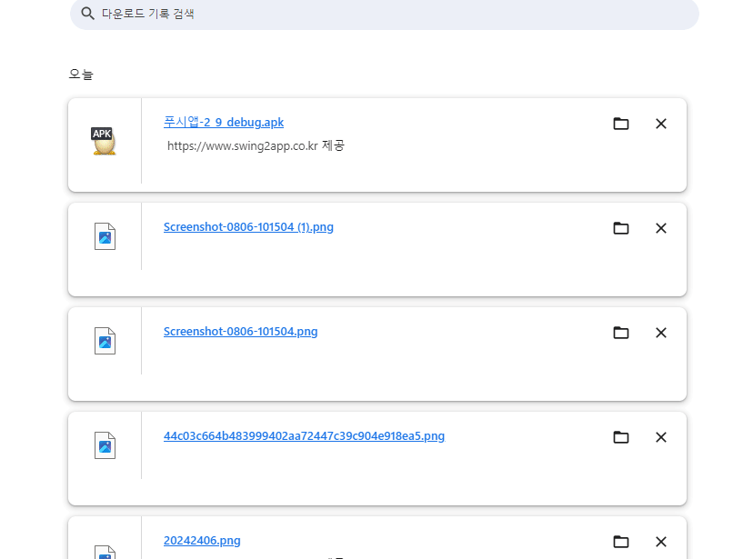

# 앱 설치 링크주소로 앱 다운받기

<figure><figcaption></figcaption></figure>

**앱 설치 링크 주소 발행, 링크 주소로 앱 다운받기**

앱 설치 링크를 발행하는 방법과 설치링크를 통해 앱을 다운받는 방법을 알려드릴게요.

안드로이드폰에서는 앱 설치 링크로 직접 앱을 다운 받을 수 있습니다.

\*아이폰은 앱 설치 불가, 안드로이드폰에서만 이용 가능합니다.

스윙투앱에서 앱제작시 앱 설치 파일 뿐만 아니라 링크도 발행받을 수 있구요. 해당 링크를 다양한 곳에서 공유할 수 있습니다.

***


<mark style="color:red;">**안내사항**</mark>

1\)무료앱 이용자는 앱 설치 기기수 제한이 있습니다. - 10개까지 이며, 그 이상이 될 경우 앱 설치 및 이용이 중단됩니다.

무료앱은 홈페이지 등에 설치 링크를 배포할 수 없습니다.&#x20;

2\)앱 링크주소는 유효세션 시간이 있습니다. 15분이며, 15분 이내로 복사한 링크로 앱을 설치하지 않을 경우 세션이 종료되어 앱 설치가 불가합니다.

3\)유료앱 이용자는 플레이스토어에 올려서 앱을 배포하는 것이 가장  좋습니다.&#x20;

설치 기기수는 제한이 없습니다.&#x20;

4\)앱 설치 링크이기 때문에 반드시 모바일(안드로이드폰)에서 다운 받아주셔야 하구요.

5\)해당 기능은 아이폰은 이용 할 수 없어요. 안드로이드폰에서만 앱 다운이 가능합니다.

6\)앱 설치 링크는 위에 안내드린 것 외에도 메신저(카톡)이나 링크를 공유할 수 있는 다양한 어플에서 이용이 가능합니다


<figure><figcaption></figcaption></figure>

##  **STEP1. 앱 설치 링크주소 복사하기**

<mark style="color:red;">\*중요\* PC에서 진행, 웹브라우저: 크롬을 이용해주세요!!</mark>

\*브라우저는 반드시 크롬 이용해주세요. PC에서 이용해주세요.

1\)[앱운영-버전관리-앱제작이력 페이지](https://www.swing2app.co.kr/view/app_work_history) 이동

2\)\[APK파일 받기] 버튼을 선택합니다. (PC에 설치하는 용도가 아니며, 다운만 받아주세요)

​

3\)그다음 크롬 브라우저 상단 오른쪽 점 3개 버튼 선택해주세요

4\) \[다운로드] 선택해주세요.

**​**

다운로드 새창이 열리구요. 방금 다운 받으신 앱을 확인할 수 있습니다.

5\) 링크쪽에 마우스 커서를가져다 대고, 마우스 오른쪽 버튼 선택해주세요.

**‘링크 주소 복사’** 하시면 앱 설치(다운로드) 주소를 복사할 수 있습니다.

<mark style="color:red;">**\*다운로드 화면에서 링크 주소가 바로 뜨지 않으면 아래 방법으로 이용해주세요.**</mark>&#x20;

<figure><figcaption></figcaption></figure>

파일명에 마우스 오른쪽 버튼을 클릭하면 '링크 주소 복사'를 선택할 수 있습니다.&#x20;

주소가 복사 되구요, 복사된 주소를 붙여넣기해서 공유할 수 있습니다.&#x20;

<figure><figcaption></figcaption></figure>

이렇게 하면 제작하신 앱 파일이 아닌 링크로 받을 수 있습니다.&#x20;

그럼 해당 링크로 어떻게 앱 다운을 할 수 있는지 확인해주세요\~

<figure><figcaption></figcaption></figure>

##  **STEP2. 앱 설치 링크로 다운받기**

### <mark style="color:blue;">**1.이메일로 앱 설치 링크 발송 후 다운**</mark>

이메일로 앱 설치 링크를 받은 뒤 앱 다운을 진행할 수 있습니다.

***

## STEP3. 무료앱 설치 보안 메시지 안내

무료앱은 기기에서 권장하는 설치 방법이 아니기 때문에 (외부 경로 파일은 기기에서 보안상  막아놓음 )

보안 메시지가 뜰 수 있습니다.&#x20;

관련 메시지가 뜰 경우 모두 "무시하고 설치"로 진행해주세요.&#x20;

***


<mark style="color:red;">**주의사항**</mark>

1\)무료앱 이용자는 앱 설치 기기수 제한이 있습니다. - 10개까지 이며, 그 이상이 될 경우 앱 설치 및 이용이 중단됩니다.

무료앱은 홈페이지 등에 설치 링크를 배포할 수 없습니다.&#x20;

2\)유료앱 이용자는 플레이스토어에 올려서 앱을 배포하는 것이 가장  좋습니다.&#x20;

설치 기기수는 제한이 없습니다.&#x20;

3\)앱 설치 링크이기 때문에 반드시 모바일(안드로이드폰)에서 다운 받아주셔야 하구요.

4\)해당 기능은 아이폰은 이용 할 수 없어요. 안드로이드폰에서만 앱 다운이 가능합니다.

5\)앱 설치 링크는 위에 안내드린 것 외에도 메신저(카톡)이나 링크를 공유할 수 있는 다양한 어플에서 이용이 가능합니다


.

***
