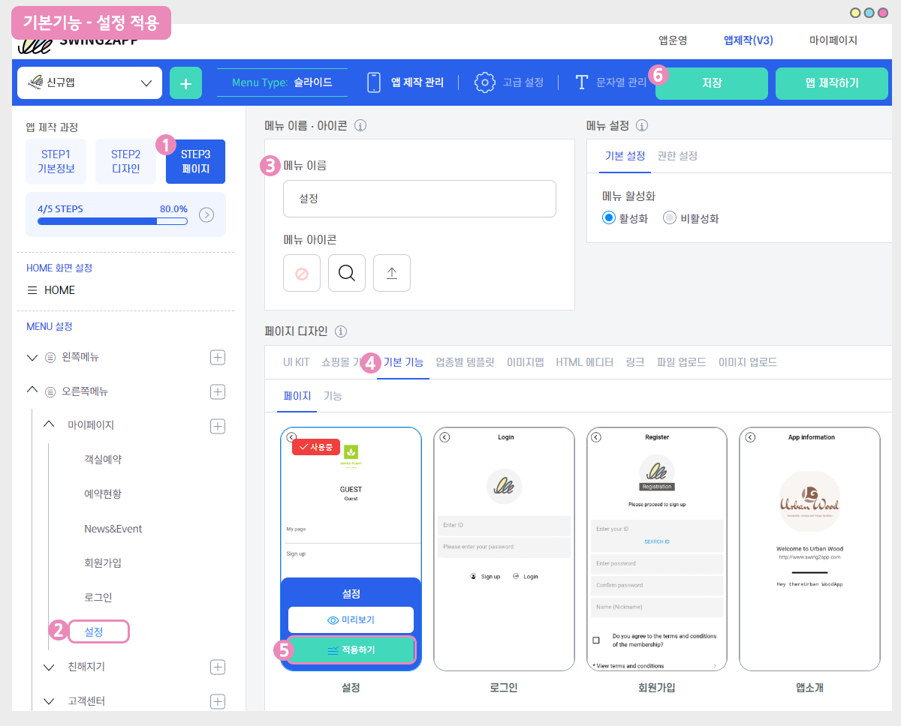
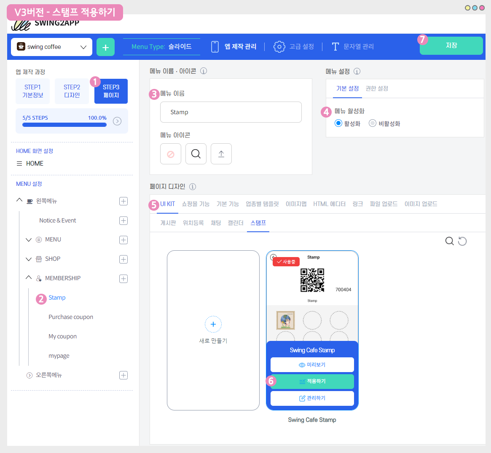

# 앱 관리자메뉴:스탬프 등록

***

스탬프는 카페 등의 매장에서 발행한 쿠폰에 도장을 찍어주는 용도로 사용되는데요.

이러한 스탬프를 이제 앱을 이용하여 제공할 수 있습니다.

-스탬프 메뉴 추가시, 각 회원마다 스탬프 번호와 함께 QR코드 이미지가 발행됩니다.

-관리자는 번호를 입력해서 스탬프 적립을 하거나,  QR코드로 스탬프를 적립할 수 있습니다.

-앱 관리자메뉴에서는 QR코드이미지를 스캔하여 앱에서 바로 스탬프를 적립할 수 있습니다.

<mark style="color:orange;">**\[스탬프 제작 방법]**</mark>

스윙 앱운영 페이지→ 게시판관리> \[게시판 생성] 버튼을 선택 한 뒤→ \[스탬프] 서비스를 선택합니다.

앱제작 페이지→ 메뉴를 선택한 뒤→ 게시판 불러오기→스탬프를 선택해서 앱에 적용해주세요.

<mark style="color:orange;">**\[스탬프 적립(등록)방법]**</mark>

회원마다 발행된 스탬프 번호로 등록 처리하거나, 앱 관리자메뉴에서 QR코드이미지를 스캔하여 적립할 수 있습니다.



***

##  **STEP1. 앱 관리자메뉴 이동**

**앱 실행 후 \[설정] → 관리자 로그인→ 스윙투앱(사이트)에서 가입한 계정으로 로그인해주세요.**

<mark style="color:red;">★만약 앱에서 설정 메뉴를 제거했거나, 보이지 않는다면 앱제작시 스윙페이지에서- 설정 메뉴를 추가해주세요!</mark>

<figure><figcaption></figcaption></figure>

앱제작 화면 이동

1\)STEP3 페이지 단계로 이동합니다.

2\)새 메뉴를 만들어주세요. (+ 모양 버튼 선택하여 메뉴 추가)

3\) 메뉴 이름 입력

4\) 페이지 디자인에서 \[기본 기능] -\[페이지]를 선택해주세요.&#x20;

5\) 설정 페이지를 찾아서 \[적용하기] 버튼을 선택해주세요. (페이지에 마우스 커서를 가져다 대면 적용하기 버튼이 열립니다)

6\) 화면 상단 \[저장]버튼을 누르면 앱에 적용됩니다.

<mark style="color:orange;">**–관리자 메뉴) 관리자 로그인이 완료되면, 관리자 메뉴가 열립니다.**</mark>&#x20;

관리자 메뉴가 열리구요.&#x20;

여기서 <mark style="color:blue;">**\[스탬프 추가]**</mark>를 선택해주세요.

스탬프 등록화면에서 등록수량을 체크하구요.

사용자 폰에서 스탬프 화면을 열어놓은 뒤 QR코드로 읽기를 선택하여 스캔합니다.&#x20;

아래에서 QR코드 스캔 방법을 알려드릴게요!

***

##  **STEP2. QR코드로 스탬프 등록하기**

**\[QR코드로 읽기]**&#xB97C; 선택하면  엡에 내장된 QR코드 리더기가 실행됩니다.&#x20;

그리고 사용자의 폰에서 스탬프 화면을 열어놓으면 위의 이미지에서 보시는 것처럼 사용자의 QR코드 이미지를 스캔할 수 있습니다.

<mark style="color:red;">\*사용자 앱에서 스탬프를 열어두셔야 QR코드이미지를 확인할 수 있어요.</mark>

***

##  **STEP3. 스탬프 적립 완료**

사용자 앱을 실행해서, 스탬프를 확인해볼게요

위에서 QR코드를 스캔하여 적립한 스탬프 수만큼 사용자의 스탬프가 추가된 것을 확인할 수 있어요.

<mark style="color:orange;">**움짤이미지를 통해서 스탬프 등록방법을 확인해주세요.**</mark>&#x20;

실제로 앱 관리자메뉴- 스탬프 등록 화면에서  QR코드를 실행하여서 사용자의 스탬프를 등록할 수 있어요.&#x20;

***

##  **STEP4. 스탬프 만들고 앱에 적용하기**

**스탬프 메뉴는 어디서 만들어서 앱에 적용할 수 있나요?**

&#x20;**앱에 스탬프를 적용하는 방법을 알려드릴게요.**

[앱운영 페이지 → 서비스관리→게시판관리](https://www.swing2app.co.kr/view/board_edit) 이동합니다.&#x20;

### <mark style="color:blue;">**1. 스탬프 게시판 기본설정**</mark>

게시판 관리 페이지에서 \[게시판 생성] 버튼을 선택하면 \[게시판 및 기능설정]창이 열립니다.

**첫번째 기능 설정 창에서 게시판을 선택합니다.**

1\) 게시판 이름 입력

2\)게시판 설명: 스탬프 이용에 대한 간단 설명을 기재합니다.

3\)서비스용도: ‘사용자 정의’ 선택

4\)UI및 기능 선택: 스탬프 선택

5\) 게시판 권한 설정

목록 보기 권한 : 스탬프를 이용할 권한을 설정해주세요.

6\) 지정권한 사용기능 허용 : ‘사용안함’이 기본셋팅값입니다.

선택된 특정 권한만 이용하게 하는 설정으로 ‘손님’으로 설정시 손님을 제외한 다른 등급 및 그룹의 이용자들은 확인이 불가

**\*만약 해당 게시판을 특정 회원들만 이용하게 하고 싶다면 \[지정권한 사용기능 허용] 에 체크하고 지정할 회원그룹을 선택해주세요.**

### <mark style="color:blue;">**2. 스탬프 게시판 상세설정**</mark>

**두 번째 기본설정 메뉴에서 입력이 모두 끝났다면 \[스탬프 상세설정]으로 이동합니다.**

7\)스탬프 이미지 등록: 스탬프 이미지는 원하는 이미지로 등록가능합니다.(이미지 사이즈 512px \* 512px)

아이콘을 누르면 이미지를 등록할 수 있도록 파일첨부 창이 뜨구요. 원하는 이미지를 첨부해주세요.

8\)스탬프 사용방법 메시지: 해당 스탬프를 이용하는 방법, 주의사항 등을 기재해주세요.(업체에 맞게 기재)

9\)스탬프 도장 개수: 기본 셋팅이 10개로 제공되며, 개수는 사용자가 원하는 수로 설정할 수 있습니다.

10\) **“스탬프 완료시 쿠폰발행”** 체크 여부는 선택사항입니다.

11\) \[저장]버튼을 누르면 스탬프 게시판이 등록완료됩니다.

**\*스탬프 완료시 쿠폰발행 기능은 신규기능으로 앱 업데이트를 해야 이용 가능해요.**

**2019.3.22 이전에 제작한 사용자분은 업데이트를 먼저 하고 이용해주세요.**

### <mark style="color:blue;">**3. 앱에 스탬프 적용하기**</mark>

스탬프 게시판을 만들었다면, 앱에 스탬프 게시판을 적용해볼게요.

<figure><figcaption></figcaption></figure>

1\)앱제작-STEP3 페이지 단계

2\)메뉴를 추가해주세요. + 아이콘 선택

3\)메뉴 이름을 입력해주세요.

4\)메뉴 설정 – 기본설정에서 메뉴 활성화에 체크해주세요.

\*아직 앱에 보여지는 메뉴가 아니라면 ‘비활성화’에 체크 후 작업이 완료되면 ‘활성화’로 바꿔주셔도 됩니다.

5\)페이지 디자인: **\[UI KIT – 스탬프]** 선택

6\)\[적용하기] 버튼

7\)\[저장] 버튼을 누르면 완료됩니다.

\*아이콘은 선택사항이며, 메뉴 앞에 아이콘을 적용할 경우만 선택해주세요.

<mark style="color:red;">**스탬프 등록은 번호로도 입력이 가능합니다.**</mark>

사용자들마다 스탬프 고유 번호도 함께 생성되기 때문에 꼭 QR코드로 스캔하지 않아도, 번호를 입력하여 등록할 수도 있어요.

앱운영 페이지 →  게시물관리 →  스탬프로 이동합니다.

**1)회원번호 입력**

**2)스탬프를 등록할 수량입력**

**3)등록하기를 누르면 완료됩니다.**

<mark style="color:purple;">**↓↓ 회원번호는 아래 앱 실행화면을 보면, 사용자마다 회원번호를 확인할 수 있습니다.**</mark>

<figure><figcaption></figcaption></figure>

그리고 만약!! 스탬프를 잘 못 추가했다면**스탬프 \[추가], \[삭제] 버튼이 있습니다.**

**삭제 버튼을 선택해서 잘 못 등록한 스탬프를 지워주세요.**&#x20;

