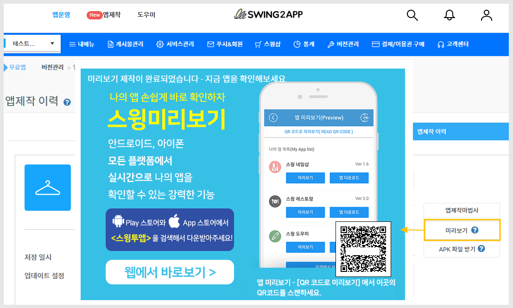
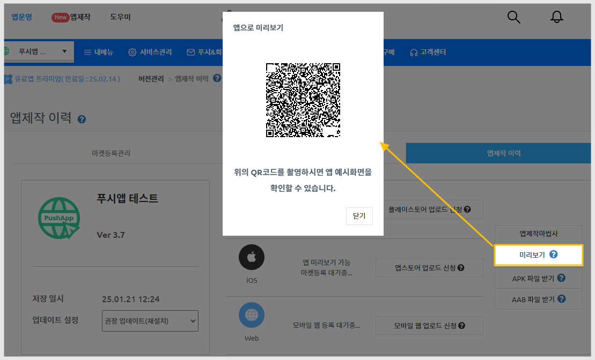

# 미리보기 이용방법

***

## **1.앱 미리보기란?**


스윙투앱에서 제작한 앱을 실시간으로 확인할 수 있는 서비스입니다.

**스윙투앱 공식앱을 다운받은 뒤 → \[앱 미리보기] 메뉴 선택→ 스윙 홈페이지에서 가입하신 계정으로 로그인해주세요.**

앱미리보기 페이지에서 스윙투앱에서 제작한 모든 앱 목록을 확인할 수 있어요.

앱 내에서 미리보기, 다운로드하여 핸드폰에서 직접 확인할 수 있습니다.

번거롭게 APK파일을 받아서 설치하지 않아도, 내가 제작한 앱을 실시간으로 확인할 수 있습니다!

\*특히 아이폰에서도 앱 미리보기가 가능합니다.


***

## 2.일반프로토타입앱 미리보기

<figure><figcaption></figcaption></figure>

앱제작 시작되면 5분 뒤에 미리보기 팝업이 뜹니다.

해당 앱에 대한 QR코드가 뜨며, 스윙투앱 공식 앱을 통해서 QR코드를 스캔하여 앱 미리보기가 가능합니다.

### <mark style="color:blue;">1)QR코드로 미리보기</mark>

앱미리보기 로그인화면에 QR코드로 미리보기 메뉴를 확인할 수 있어요.

해당 메뉴는 관리자나 부관리자로 로그인하지 않아도, **앱 마다 제공되는 QR코드를 스캔하여 핸드폰에서 앱을 미리볼 수 있습니다.**

### <mark style="color:blue;">2)미리보기 방법</mark>

<figure><figcaption>
QR코드로 앱 미리보기
</figcaption></figure>

**스윙투앱 공식 앱 설치 및 실행 후**&#x20;

**앱운영 화면 \[미리보기] 선택 → 공식앱 \[QR코드로 미리보기] 버튼 선택** &#x20;

**→ 핸드폰을 해당 QR코드 이미지에 가져다 대면 제작한 앱이 핸드폰에서 미리보기로 실행됩니다.**


앱 미리보기, QR코드 미리보기는 스윙투앱 공식 어플을 통해서 이용이 가능합니다.

아직 스윙투앱 공식 어플을 설치 하지 않았다면,

플레이스토어 or 앱스토어에서 앱을 먼저 다운받아 설치해주세요.


1\)앱스토어, 플레이스토어에서 ‘스윙투앱’ 공식앱을 다운받아주세요. \*앱이 이미 설치가 되어 있다면 최신버전으로 업데이트 받아주세요

2\) 앱 실행 후 → 카테고리 상단에 \[앱미리보기] 메뉴를 선택한 뒤 스윙웹사이트 가입 계정(아이디, 비밀번호)으로 로그인해주세요.

3\) 로그인이 완료되면 앱 미리보기 페이지가 열리며, 제작한 앱 목록을 확인할 수 있습니다.

아이폰은 미리보기 버튼을 눌러서 확인이 가능합니다.

안드로이드폰에서는 앱미리보기, 앱 다운로드 가능합니다.

[**앱스토어 출시 링크(URL)**](https://itunes.apple.com/us/app/%EC%8A%A4%EC%9C%99%ED%88%AC%EC%95%B1-swing2app/id1089434204?l=ko\&ls=1\&mt=8)

[**플레이스토어 출시 링크(URL)**](https://play.google.com/store/apps/details?id=com.hustay.swing.n24b9904fe8b52497d87aaa75f795b5f96)

## 3.웹뷰&푸시앱 미리보기  

웹사이트를 연결한 웹앱에 대한 미리보기 방법입니다.

웹뷰 혹은 푸시앱으로 제작한 분들은 해당 방법으로 미리보기를 이용해주세요.&#x20;

<figure><figcaption></figcaption></figure>

**스윙 브라우저 어플 먼저 설치해주세요.**

**'스윙투앱 브라우저'** 검색 후 어플다운&#x20;

[플레이스토어 앱 출시 링크](https://play.google.com/store/apps/details?id=com.hustay.swing.p275a02bc9a024f9eb54c077d056e2cb1)

[앱스토어 앱 출시 링크](https://apps.apple.com/us/app/%EC%8A%A4%EC%9C%99%ED%88%AC%EC%95%B1-%EB%B8%8C%EB%9D%BC%EC%9A%B0%EC%A0%80/id6450099622?platform=iphone)

### <mark style="color:blue;">**1)스윙투앱 브라우저 QR코드**</mark>

<figure><figcaption></figcaption></figure>

### <mark style="color:blue;">**2)미리보기 방법**</mark>

<figure><figcaption>
브라우저 어플로 앱 미리보기
</figcaption></figure>


**앱운영 화면에서 \[미리보기] 선택 → 핸드폰 카메라 실행 → QR코드 촬영**

**핸드폰을 해당 QR코드 이미지에 가져다 대면 제작한 앱이 핸드폰에서 미리보기로 실행됩니다.**


## 4.안내사항


1\)일반 프로토타입 앱으로 제작한 경우 미리보기는, 스윙투앱 공식 어플을 다운받아 이용 가능합니다.&#x20;

2\)웹뷰, 푸시앱으로 제작한 경우 미리보기는, 스윙투앱 브라우저 어플을 다운받아 이용 가능합니다.

3\)미리보기로 앱을 이용할 때는 푸시 알림, 공유기능 등이 적용되지 않습니다.

-푸시 알림, 공유를 이용하셔야 한다면 앱 다운받기를 하여 앱을 설치한 뒤 이용해주세요

&#x20;(아이폰은 지원 X)

4\)일반프로토타입 앱은 공식앱을 통해서 앱 설치도 가능합니다.

테스트하실 경우, 앱을 다운받아 이용해주세요.&#x20;


