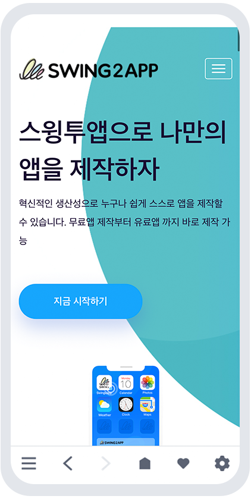

# 스윙투앱 브라우저 앱 이용방법

<figure><figcaption></figcaption></figure>

 <mark style="color:blue;">**스윙투앱 브라우저 앱이란?**</mark>

앱을 제작하지 않아도 웹사이트를 입력하면 바로 웹앱 스타일로 확인 가능한 미리보기 어플입니다. &#x20;

웹사이트 링크를 넣으면 웹뷰 웹 혹은 푸시 웹으로 전환되며 입력된 사이트가 모바일에서 어떻게 보여지는지 확인이 가능합니다.

 <mark style="color:blue;">**스윙투앱 브라우저 앱 이용방법**</mark>

<figure><figcaption></figcaption></figure>

 <mark style="color:blue;">**스윙투앱 브라우저 앱 장점**</mark>

1\)웹사이트를 적용한 웹 앱이 어떻게 보여지는지 앱 제작 없이 바로 확인 가능

2\)아이폰에서도 즉시 확인 가능&#x20;

3\)원하는 UI스타일 선택하여 확인 가능 (푸시 툴바 사용여부 체크)

4\)앱으로 만들고자 하는 웹사이트가 있다면, 언제 어디서든! 횟수 제한없이 자유롭게 확인 가능

<figure><figcaption></figcaption></figure>

## 1.이용방법1 -URL입력

**웹앱 제작 전, 입력할 웹사이트(홈페이지)가 앱으로 어떻게 보여지는지 미리 확인할 경우 이용할 수 있습니다.**

### <mark style="color:blue;">1)스윙투앱 브라우저 앱 설치</mark>

<figure><figcaption></figcaption></figure>

안드로이드폰은 플레이스토어, 아이폰은 앱스토어에서 검색 후 다운 받아 주세요

&#x20;**'스윙투앱 브라우저'** 검색 후 어플다운&#x20;

[플레이스토어 앱 출시 링크](https://play.google.com/store/apps/details?id=com.hustay.swing.p275a02bc9a024f9eb54c077d056e2cb1)

[앱스토어 앱 출시 링크](https://apps.apple.com/us/app/%EC%8A%A4%EC%9C%99%ED%88%AC%EC%95%B1-%EB%B8%8C%EB%9D%BC%EC%9A%B0%EC%A0%80/id6450099622?platform=iphone)

### <mark style="color:blue;">2)어플 실행</mark>

<figure><figcaption></figcaption></figure>

앱 실행 후 웹사이트 URL입력란에 앱으로 적용할 홈페이지 주소를 입력해주세요.

\*하이퍼링크 “http://” 반드시 입력해주세요.

### <mark style="color:blue;">3)웹사이트 링크 입력 및 열기</mark>

<figure><figcaption></figcaption></figure>

해당 매뉴얼에서는 스윙투앱 홈페이지 주소를 입력했습니다.&#x20;

\*하이퍼링크 “http://” 반드시 입력해주세요

입력 후 \[웹사이트 열기] 버튼을 선택해주세요.

### <mark style="color:blue;">4)웹앱 미리보기 확인</mark>&#x20;

<figure><figcaption></figcaption></figure>

입력한 웹사이트로 연결되며, 웹앱 미리보기 확인이 가능합니다.

***

## 2.이용방법2 -QR코드 촬영

**2번째 이용방법은 앱제작에서 생성되는 QR코드로 앱을 미리보는 방법입니다.**

### <mark style="color:blue;">1)앱에서 미리보기 선택</mark>

<figure><figcaption></figcaption></figure>

앱제작 화면 – STEP3 페이지에서 웹사이트 주소 입력 후 저장 버튼 선택

웹 미리보기(웹 가상머신)화면에 연결된 웹이 정상적으로 뜨지 않을 경우&#x20;

(1)가상머신 화면에 기재된 **\[앱에서 미리보기]**&#xB97C; 선택해주세요.

(2)QR코드가 화면에 생성이 됩니다.&#x20;

### <mark style="color:blue;">2)QR코드 촬영</mark>

<figure><figcaption></figcaption></figure>

아이이폰 혹은 안드로이드폰 카메라로 QR코드를 촬영합니다.

### <mark style="color:blue;">3)브러우저 어플 연결</mark>&#x20;

<figure><figcaption></figcaption></figure>

스윙투앱 브라우저 어플로 연결되며, 앱 미리보기에서 연결된 웹사이트를 확인할 수 있습니다.

***

## 3.툴바이용 TIP

<figure><figcaption></figcaption></figure>

 **툴바 미사용**

웹뷰앱 스타일로 모바일 웹과 동일한 화면 &#x20;

 **툴바 사용**&#x20;

푸시앱으로 웹 앱 하단에 푸시 툴바가 생성됨


<mark style="color:orange;">**안내사항**</mark>

1\)스윙투앱 브라우저 앱은 앱 내에서 미리보기로 확인하는 용도로 실제 앱이 제작되거나, 앱으로 다운 받는 용도가 아닙니다.

2\)브라우저 어플에서 웹 앱 미리보기로만 확인하신 뒤, 앱제작은 스윙투앱 공식 홈페이지에서 회원가입 및 로그인 후 앱제작에서 직접 제작해주셔야 합니다.&#x20;

3\)툴바 사용시, 툴바에서 제공되는 기능들도 이용할 수 있습니다.

툴바에서 제공되는 기능들도 확인 해보시기 바랍니다.&#x20;

4\)앱이 아니기 때문에 푸시 앱에서 발송되는 푸시 등의 기능은 이용이 불가합니다.


