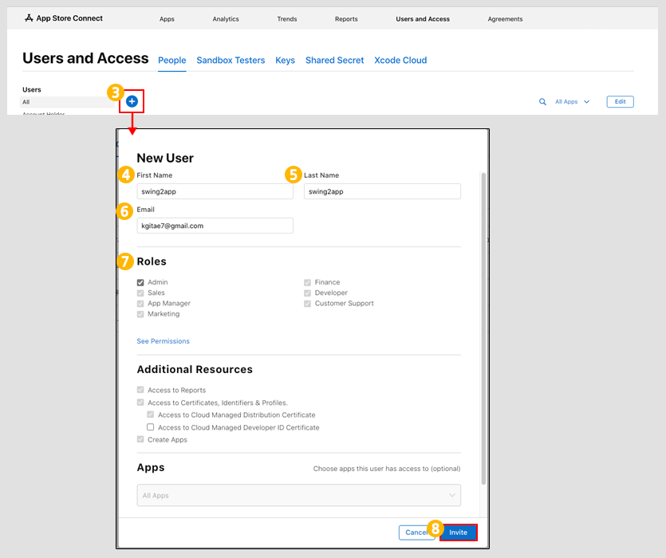
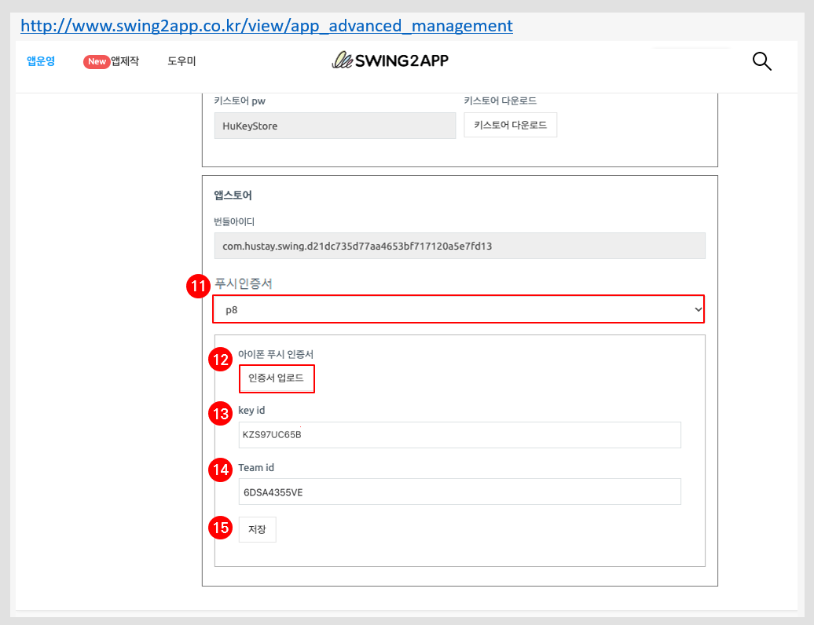

# 애플 사용자 계정 등록 프로세스

***


사용자 애플 개발자 계정(개인 혹은 비즈니스용)으로 앱스토어 앱 등록을 하실 경우

아래 **3가지 프로세스**를 완료해주셔야 합니다.

매뉴얼을 보시고 진행 부탁드립니다.&#x20;

\*스윙투앱 계정으로 대리등록 진행 하시는 분들은 해당 사항 없습니다.&#x20;


##  1.사용자 초대(스윙투앱 추가)


사용자를 초대하는 이유는, 스윙투앱에서 앱스토어 앱 등록 작업을 대행하여 진행해드리기 위함입니다.

즉, 관리자 권한으로 스윙투앱 계정을 추가해주시면 사용자분의 계정으로 접속하지 않아도 앱스토어에 앱을 등록할 수 있습니다.&#x20;

사용자 계정으로 로그인 하지 않아도 되기 때문에 계정  보안에 보다 안전하며, 앱스토어 심사 거절 등의 이슈에 즉각적인 대응이 가능합니다.&#x20;


**앱스토어 커넥트 사이트 접속**

<figure><figcaption></figcaption></figure>

1\)앱스토어 커넥트 사이트 접속 및 로그인



2\)커넥트 메인 화면에서 \[User and Access] 선택합니다.&#x20;

(한국어로 보시는 분들은 \[사용자 및 액세스] 선택)

<figure><figcaption></figcaption></figure>

3\)Users - All 메뉴 옆의  \[+]아이콘 선택

New User(신규 사용자) 팝업창이 열립니다.

4\)First Name(성): 'swing2app' 입력

5\)Last Name(이름): 'swing2app' 입력

6\)Email(이메일): 'kgitae7@gmail.com' 입력(스윙투앱 애플 개발자 이메일주소입니다)

7\)Roles(역할): Admin(관리자) 선택

Admin 선택시 밑의 항목은 모두 자동으로 셋팅되어 입력됩니다.&#x20;

8\)invite(초대) 버튼 선택하면 완료됩니다.&#x20;

초대를 하시면 스윙투앱 개발자 이메일로 초대 메일이 발송되며, 저희가 초대를 수락하면 완료됩니다.&#x20;

***

##  2.**API 인증서 등록**


앱스토어 API 인증서 등록이란, 스윙투앱에서 제작한 앱을 앱스토어에 연동하는 작업입니다.&#x20;

아이폰에서 앱에서 사용되는 모든 기능을 연동하는 것이기 때문에 필수로 작업이 필요하며 API 키를 등록해주시기 바랍니다.&#x20;


<figure><figcaption></figcaption></figure>

1\)Key(키)선택&#x20;

2\)Active(활성화됨)옆에 \[+]모양 아이콘 선택

3\)Name(이름): 'swing api' 입력

4\)Acces(액세스): 'Admin(관리자)' 선택

마우스 커서로 오른쪽 내림 화살표 버튼 선택하시면 Admin(관리자) 선택 가능합니다.&#x20;

5\)Generate(생성) 선택

**스윙투앱 사이트 접속하신 뒤 앱 고급관리 화면을 열어주세요.**&#x20;

<figure><figcaption></figcaption></figure>

[스윙투앱 앱운영 - 서비스관리-앱 고급 관리](https://www.swing2app.co.kr/view/app\_advanced\_management) 화면 이동하시면, 화면 가장 아래에 앱스토어 API인증서 입력란을 확인할 수 있습니다.&#x20;

**이제 앱스토어 커넥트 화면과, 스윙투앱 앱 고급관리-앱스토어 API 인증서 화면함께 열어주세요.**&#x20;

<figure><figcaption></figcaption></figure>

6\)\[다운로드 API KEY] 버튼을 선택하여 파일 다운받아 주세요. (파일은 열지 말고 저장만 해주세요)

앱스토어 API 인증서 \[파일 선택]을 눌러 다운받은 파일을 등록해주세요.

7\)\[Issuer ID] Copy 선택&#x20;

복사한 ID 값을 앱스토어 API 인증서 ios\_api\_issuer 입력란에 붙여넣기 해주세요.&#x20;

8\)\[KEY ID] Copy 선택&#x20;

복사한 KEY ID 값을 앱스토어 API 인증서 ios\_api\_kid 입력란에 붙여넣기 해주세요.&#x20;

9\)\[저장] 버튼 선택하면 완료됩니다.&#x20;

***

##  3.푸시 인증서 등록


앱스토어는 앱 등록시 애플에서 사용하는 푸시 인증서를 등록하게 됩니다.&#x20;

아이폰에서 푸시를 발송하기 위해 필요한 장치입니다.

앱스토어 앱 등록시 최초 한번 등록시 멤버십 기간 동안 이용 가능합니다.

<mark style="color:red;">\*웹뷰앱으로 제작한 분들은 등록하지 않아도 됩니다.</mark>&#x20;

푸시앱, 일반 프로토타입 앱 등 푸시 기능을 이용할 수 있는 앱만 해당 됩니다.&#x20;


**애플 개발자 사이트 접속**



<figure><figcaption></figcaption></figure>

1\)[애플 개발자 사이트 ](https://developer.apple.com/account/)접속 로그인해주세요. (애플 개발자 계정 로그인)

2\)애플 개발자 메인 화면에서 Membership Details  선택

Team ID 값 복사해주세요.

<mark style="color:red;">\*중요\*</mark>

Team ID는 마지막 고급관리에서 입력해야 하는 정보입니다.

복사한 ID는 메모장 등에 붙여넣기 해주세요.

<figure><figcaption></figcaption></figure>

3\)Certificates, Identifiers & Profiles 항목에서 **\[Keys] 선택합니다.**

<figure><figcaption></figcaption></figure>

4\)Keys 옆의 \[+] 버튼을 선택합니다.

5\)Key name: Key 이름을 입력해주세요. (key 값은 아무 이름이나 입력해도 됩니다\*영문으로 기재)

6\)Apple Push Notification Service 체크박스에 체크해주세요.

7\)\[Continue] 클릭

<figure><figcaption></figcaption></figure>

8\)\[Register] 클릭

9\)\[Download] 버튼 클릭 후 파일 저장

(파일 열지 말고 저장만 해주세요.마지막에 해당 파일 다시 업로드 해야 합니다.)

10\)Key ID 복사

<mark style="color:red;">\*중요\*</mark>

Key ID는 마지막 고급관리에서 입력해야 하는 정보입니다.

복사한 ID는 메모장 등에 붙여넣기 해주세요.

**스윙투앱 앱 고급관리로 화면으로 이동합니다.**

<figure><figcaption></figcaption></figure>

[스윙투앱  앱운영 →서비스관리 →앱 고급관리](http://www.swing2app.co.kr/view/app\_advanced\_management)

11\)푸시 인증서 ‘p8’ 선택

12\)인증서 업로드 버튼을 눌러 다운받은 파일을 업로드 합니다. (순서 9에서 다운받은 파일)

13\)Key id 값을 입력합니다. (순서 10에서 복사한 값 )

14\)Team id 값을 입력합니다. (순서 2에서 복사한 값 )

15\)\[저장] 선택시 완료

