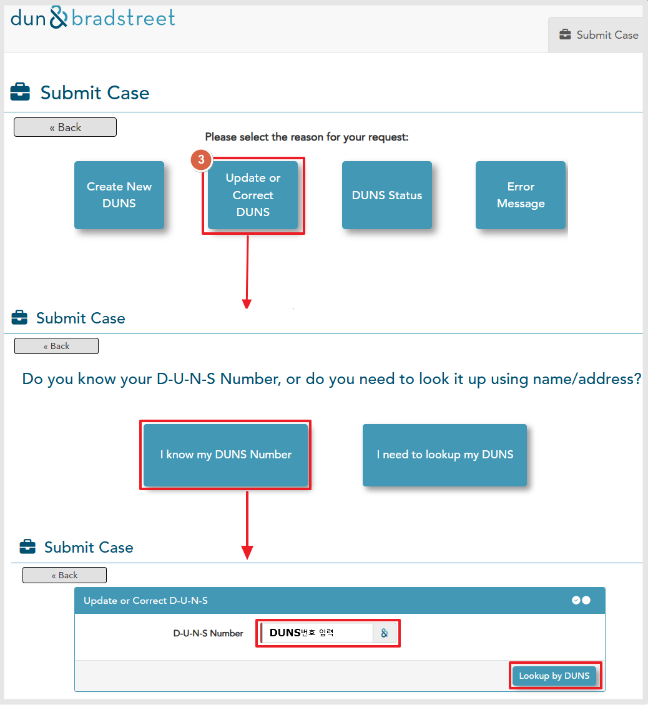
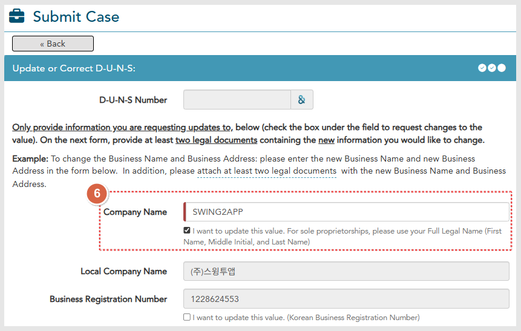
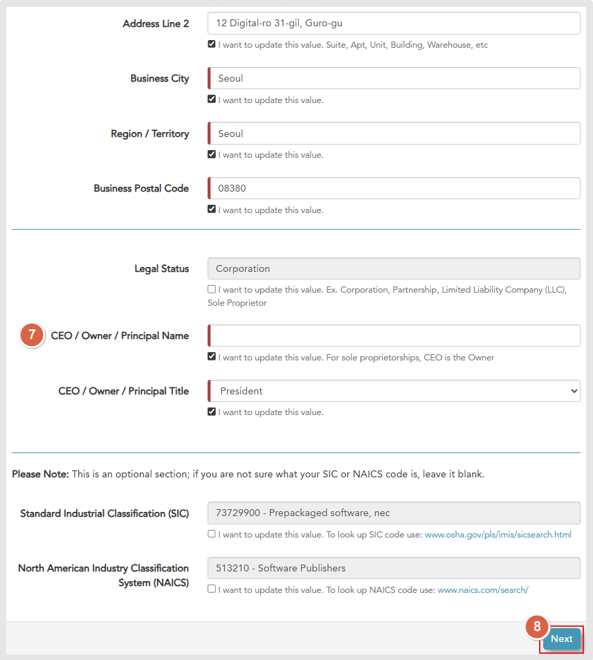
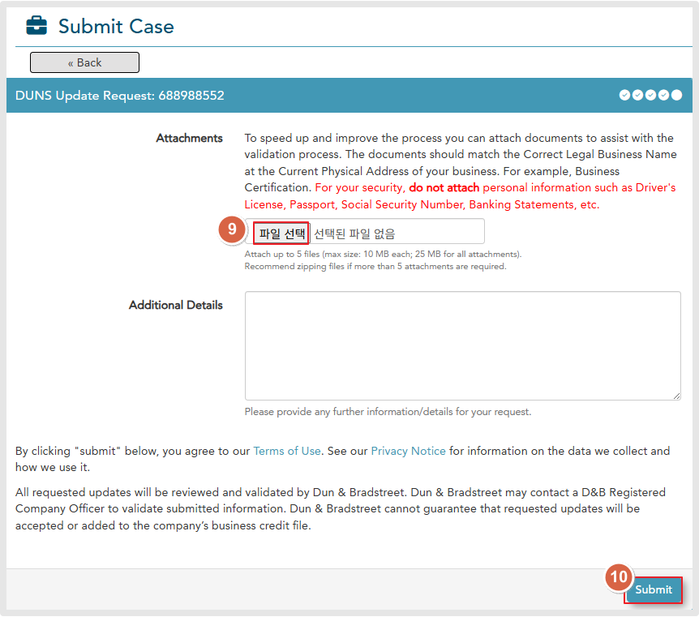

# DUNS번호 업데이트

***

## **1.DUNS 발행 사이트 접속**

[던스 발행사 사이트 이동](https://support.dnb.com/?CUST=APPLEDEV)&#x20;



<figure><figcaption></figcaption></figure>

1\) Email 주소 입력: DUNS 에 가입된 메일주소를 입력합니다. Nest 선택

2\) Developer Program 선택

<figure><figcaption></figcaption></figure>

3\) "Update or Correct DUNS" 선택

4\) "I Know my DUNS Number" 선택

5\) DUNS번호 입력 - Lookup by DUNS 선택

<figure><figcaption></figcaption></figure>

<figure><figcaption></figcaption></figure>

6\) 7) 수정이 필요한 영역을 체크하면 고정된 영역이 풀립니다.

회사명, 회사주소, 회사 대표자 이름 등 수정이 필요한 항목을 입력해주세요.&#x20;

8\) Next 버튼 선택

<figure><figcaption></figcaption></figure>

9\)  \[파일 선택] 버튼을 선택해서 사업자등록증, 영문 사업자등록증(3개월 발행 이내)을 제출해주세요.&#x20;

10\) "Submit" 선택

\*Additional Details 에는 필수가 아니라서 내용 입력을 하지 않아도 되구요.

&#x20;추가 내용 제출이 필요할 경우는 기재해주세요. \*영문으로 작성해야 합니다.


작성예시)&#x20;

Hello,\
We are submitting supporting documents for the update of our company information registered with DUNS.\
Our company name has been changed, and we are providing the business registration certificate as evidence of this change.\
Kindly refer to the attached document.

Thank you.



영문 사업자등록증도 꼭 제출해야 하나요?

&#x20;대한민국 사업자의 경우 한국어 사업자등록증을 제출하게 되는데요.

간혹 DUNS에서 3개월 이내 발행한 영문 사업자등록증명을 요청하기도 합니다.&#x20;

그럼 추가 서류를 확인하는 기간만큼 일정이 더 소요될 수 있어요.

따라서 처음 제출할 때 재요청이 없도록 한번에 사업자등록증, 영문사업자등록증명 서류를 함께 제출하는 것이 좋습니다!


<figure><figcaption></figcaption></figure>

&#x20;모든 제출이 끝났습니다.&#x20;

&#x20;업데이트 요청건이 접수되었다는 메시지를 확인할 수 있습니다.

메시지에는 7-14일 소요된다고 기재되어 있으나, 실제로 이렇게 오래는 안걸리구요.&#x20;

3-4일(영업일 기준) 소요됩니다.&#x20;

업데이트결과는 가입한 메일로 전송이 됩니다.&#x20;

