# 구글 로그인 API 연동

***

## 1.구글 클라우드 콘솔 접속

[https://console.cloud.google.com](https://console.cloud.google.com) &#x20;

<figure>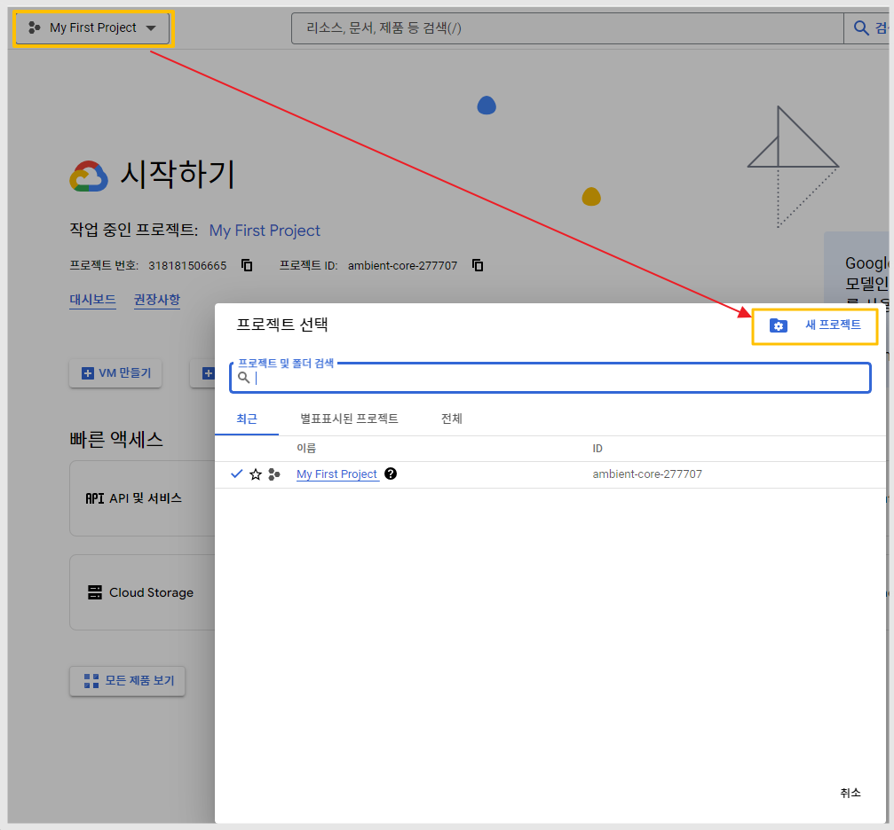<figcaption></figcaption></figure>

구글 클라우드 접속 후 - 로그인&#x20;

**1)My First Project 선택 - 새 프로젝트 선택**

<figure>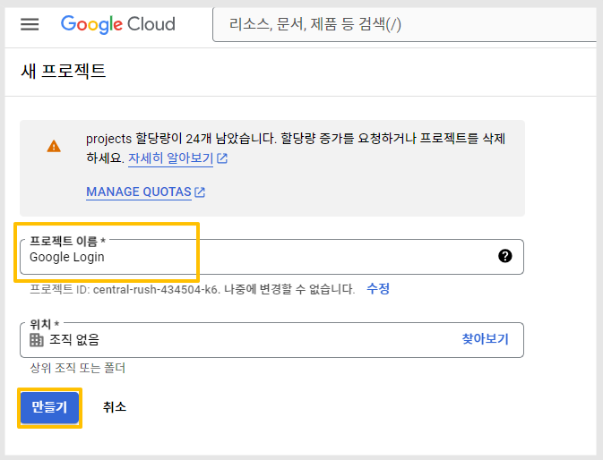<figcaption></figcaption></figure>

2\)프로젝트 이름 입력 \*원하는 이름으로 입력해주세요, 프로젝트명으로 사용되며 공개적으로 어디에 노출되는 것은 아닙니다.&#x20;

3\)만들기 버튼 선택&#x20;

<figure>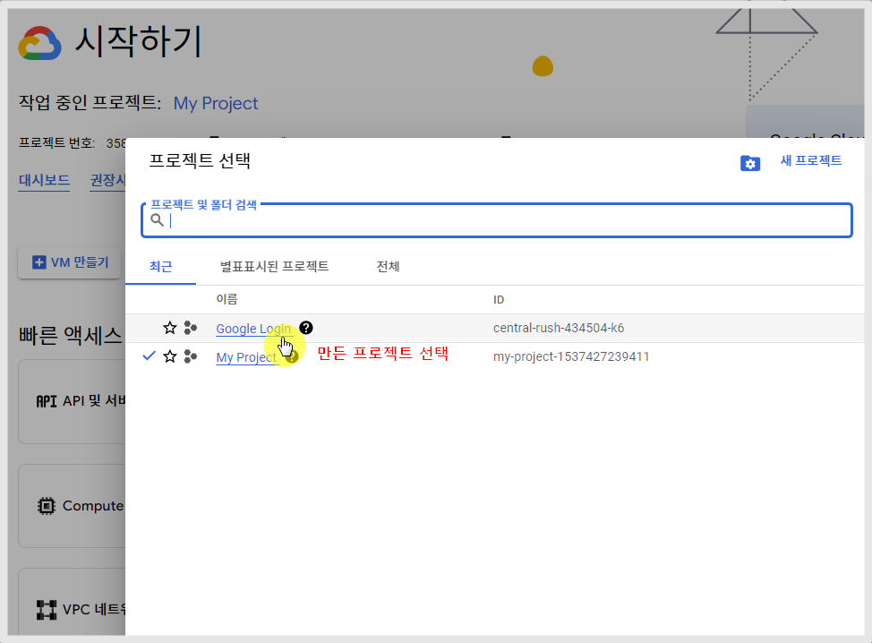<figcaption></figcaption></figure>

4\)프로젝트 선택 창에서 방금 만든 프로젝트를 선택해주세요.&#x20;

<figure>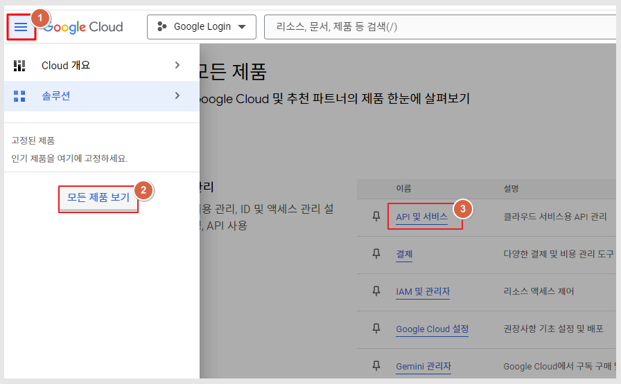<figcaption></figcaption></figure>

5\)아래 순서대로 이동해주세요.&#x20;

(1)왼쪽 상단 햄버거 모양 메뉴 선택

(2)모든 제품 보기 선택

(3)대시보드 화면에서 <mark style="color:blue;">**API 및 서비스**</mark> 선택합니다.&#x20;

\*만약 카테고리에 'API 및 서비스' 메뉴가 고정되어 바로 있다면 해당 경로로 선택해서 이동하셔도 됩니다.

<figure>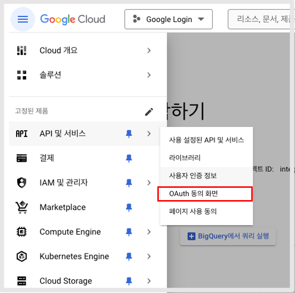<figcaption>
메뉴가 고정되어 있을 경우
</figcaption></figure>

<figure>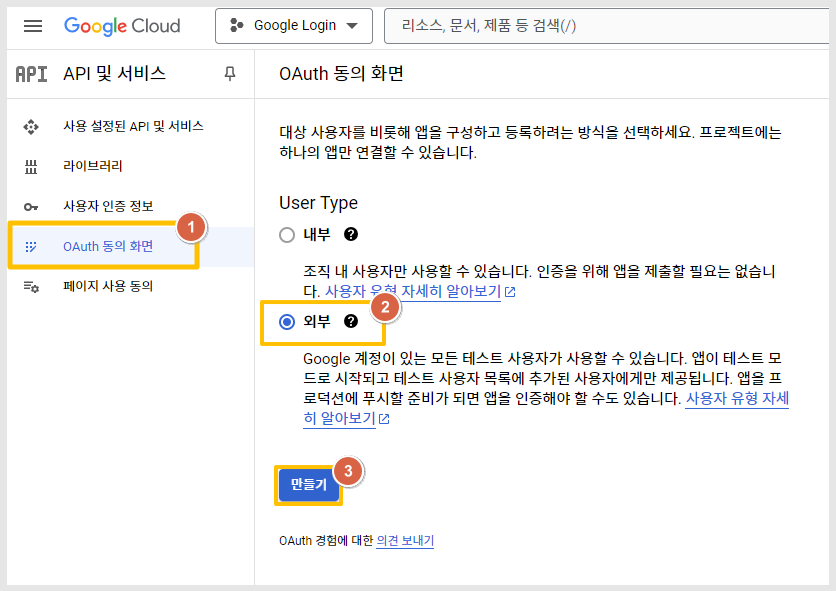<figcaption></figcaption></figure>

6\)API 및 서비스를 선택한 뒤 아래 경로로 진행해주세요.&#x20;

(1)OAuth 동의 화면 선택

(2)Usrt Type :  외부 선택

(3)만들기 버튼 선택

<figure>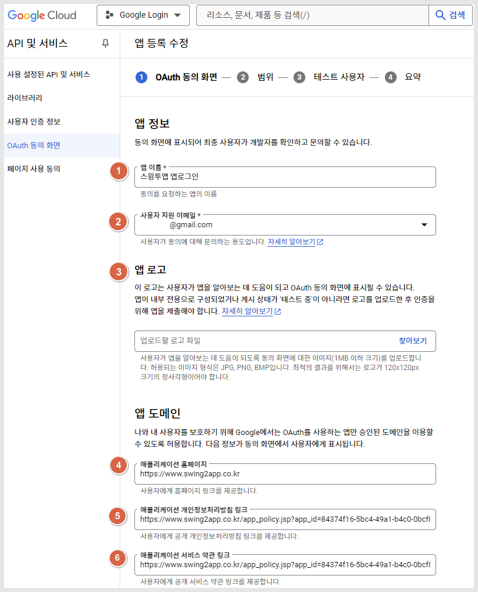<figcaption></figcaption></figure>

**7)앱 정보를 입력합니다.**

(1)앱 이름 입력&#x20;

\*앱에서 구글 로그인시 표시되는 이름이오니 현재 적용하는 앱의 이름과 동일하게 기재해주시는 것이 좋습니다.&#x20;

(2)사용자 지원 메일 \*해당 메일주소는 사용자들에게 노출이 되는 이메일주소이오니 고객센터 등 오픈이 가능한 메일주소로 입력합니다.

(3)앱 로고 or 아이콘 이미지를 올려주세요. &#x20;

(4)애플리케이션 홈페이지 입력 \*스윙투앱 홈페이지 URL 입력해주세요.

[https://www.swing2app.co.kr](https://www.swing2app.co.kr)

(5)애플리케이션 개인정보처리방침 링크


**앱 개인정보처리방침 링크은 어디서 가져 오나요?**

\*일반프로토타입 앱은 앱제작 후 - 앱 가입 정책 페이지에서 앱마다 개별 개인정보처리방침 링크를 제공합니다.

**경로)**

[**앱운영- 서비스관리-정책관리-앱가입 정책**](https://www.swing2app.co.kr/view/app\_setting)  &#x20;

\[서비스 이용약관URL 보기]를 선택해서, 인터넷 주소란에 기재된 링크 주소를 복사해서 붙여넣습니다.


(6)애플리케이션 서비스 약관 링크&#x20;

약관 내용도 개인정보 처리방침에 기재되어 있으니, 5번에 입력한 개인정보 처리방침 링크와 동일한 URL을 입력합니다.&#x20;

<figure><figcaption></figcaption></figure>

\+도메인 추가 버튼을 눌러서 도메인 입력란에 아래 도메인 URL 입력해주세요

(7)승인된 도메인 1 입력&#x20;

(8)승인된 도메인 2 입력


도메인 1) <mark style="color:blue;">swing2app.com</mark>&#x20;

도메인2) <mark style="color:blue;">swing2app.co.kr</mark>


(9)개발자 연락처 정보&#x20;

이메일주소를 입력해주세요. \*구글에서 알림을 보내는 용도로 어디에 공개적으로 노출되는 정보는 아닙니다.&#x20;

(10)저장 후 계속 버튼 선택

<figure><figcaption></figcaption></figure>

**8)범위 추가**&#x20;

(1)\[범위 추가 또는 삭제] 버튼 선택

(2)API 범위 선택&#x20;


<mark style="color:red;">\*범위 체크시 반드시 3개 항목만 체크해주세요.</mark>&#x20;

"구글 계정 이메일주소, 개인정보, 구글에서 내 개인정보를 나와 연결" 3개만 선택


(3)업데이트 선택

(4)저장 후 계속 선택

<figure>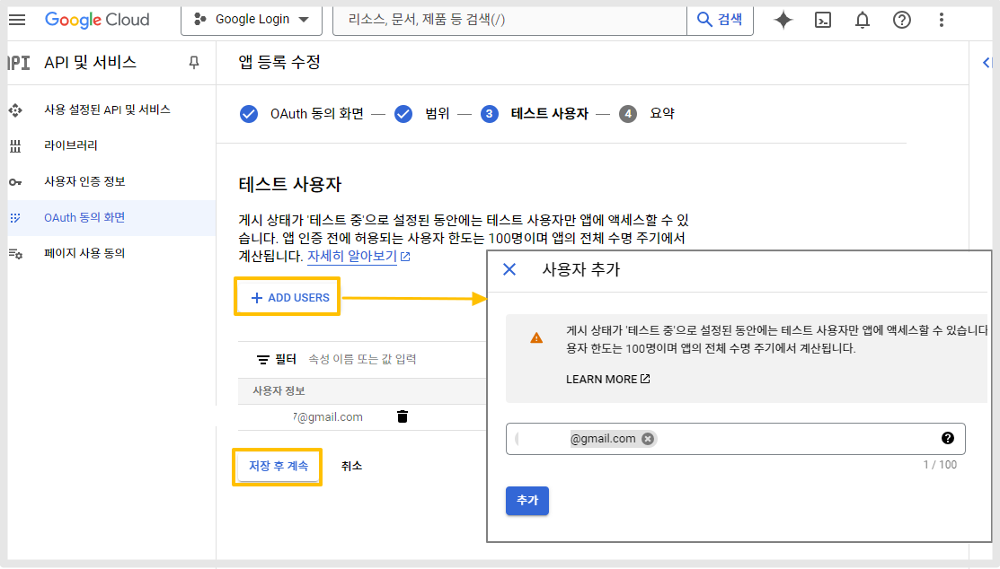<figcaption></figcaption></figure>

9\)\[+ADD USERS] 선택&#x20;

로그인 테스트할 사용자 계정 이메일주소를 입력한 뒤 추가해주세요.&#x20;

입력한 해당 사용자 계정만 테스트가 가능합니다. 추가 가능한 사용자 수는 100명 입니다.&#x20;

10\)저장 후 계속

<figure>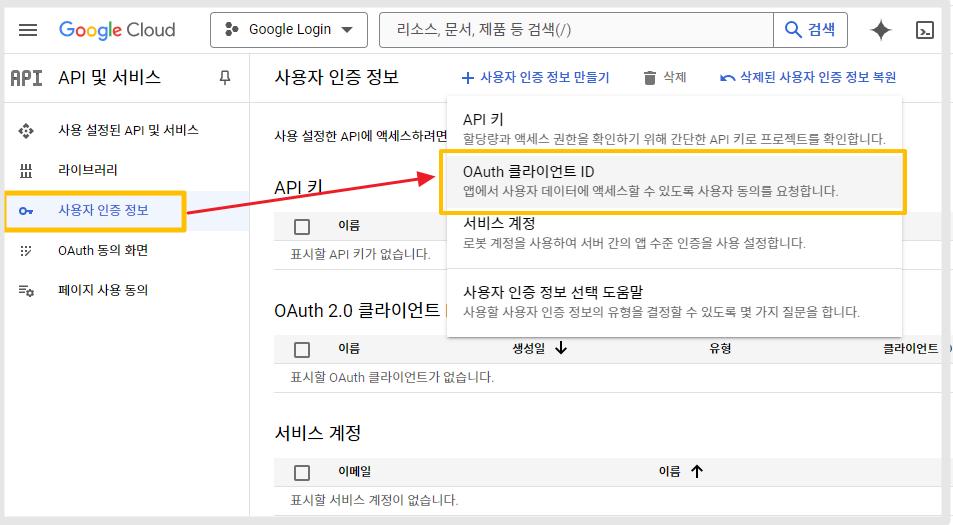<figcaption></figcaption></figure>

11\)왼쪽 카테고리에서 "<mark style="color:blue;">사용자 인증 정보</mark>" 선택해주세요.

12\)<mark style="color:blue;">OAuth 클라이언트</mark> ID선택

<figure>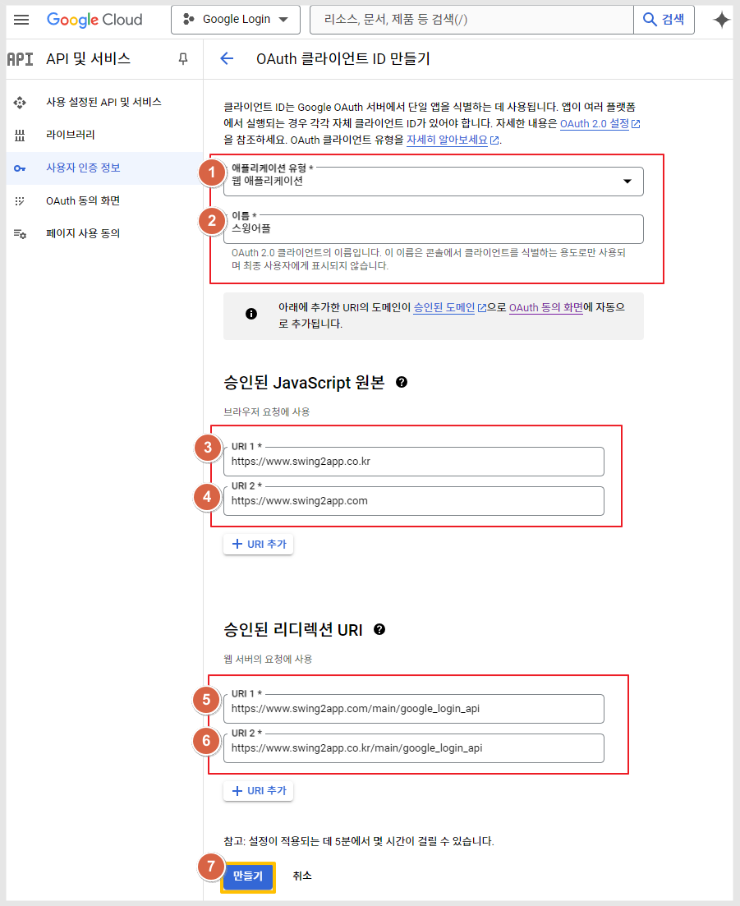<figcaption></figcaption></figure>

**13)OAuth 클라이언트 ID 만들기 화면**

(1)애플리캐이션 유형 : 웹 애플리케이션 선택

(2)이름 입력 : 공개되거나 어디에 노출되는 정보는 아니며 콘솔에서 보여지는 이름입니다.&#x20;

(3)브라우저 URL 입력 1 **\*아래 URL 입력해주세요.**&#x20;

(4)브라우저 URL 입력 2**\*아래 URL 입력해주세요.**&#x20;


URL1) [**https://www.swing2app.co.kr**](https://www.swing2app.co.kr)

URL2) [**https://www.swing2app.com**](https://www.swing2app.com/)


(5)리디렉션 URL입력1 **\*아래 URL 입력해주세요.**&#x20;

(6)리디렉션 URL입력2 **\*아래 URL 입력해주세요.**&#x20;


URL1) [**https://www.swing2app.com/main/google\_login\_api**
\
](https://www.swing2app.com/main/google\_login\_api)\
URL1) [**https://www.swing2app.co.kr/main/google\_login\_api**
\
](https://www.swing2app.co.kr/main/google\_login\_api)


(7)만들기 선택

**OAuth 클라이언트 생성 완료**&#x20;

<figure>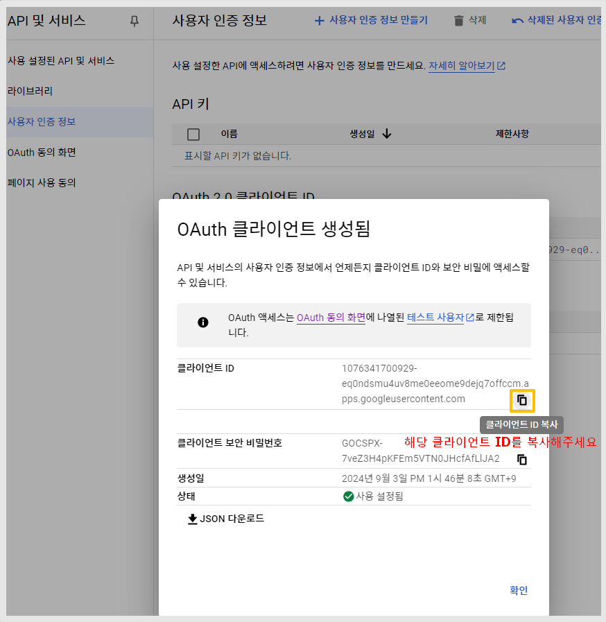<figcaption></figcaption></figure>

14\)클라이언트 ID 값이 생성됩니다.&#x20;

오른쪽 복사 버튼을 선택해서 ID를 복사해주세요.&#x20;

<mark style="color:red;">\*복사한 키는 스윙투앱 대시보드 - 외부 연동 로그인- 카카오 아이디란에 입력해주셔야 합니다.</mark>

***

## 2.스윙투앱 대시보드- ID 입력하기

<figure>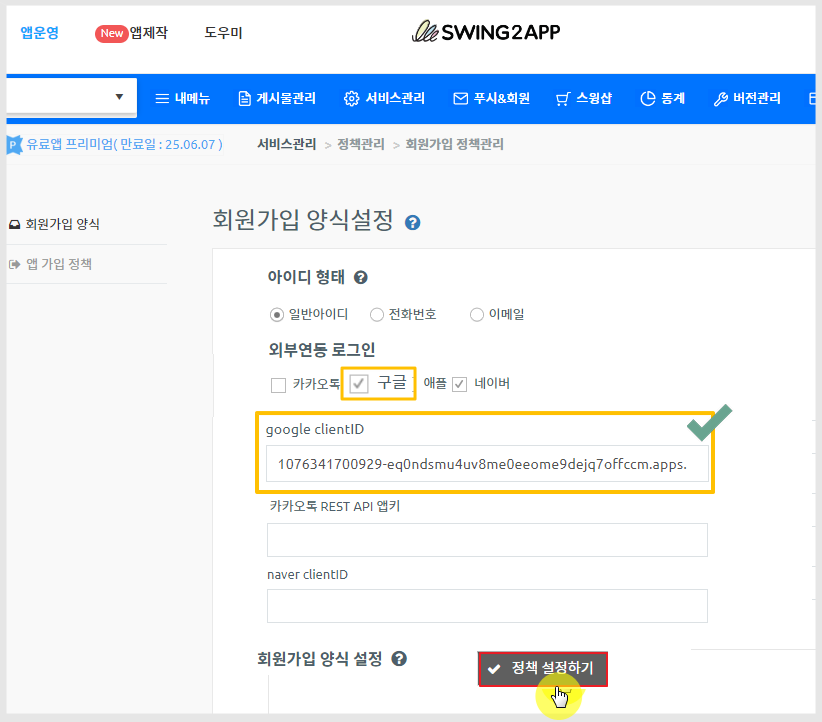<figcaption></figcaption></figure>

[앱운영-서비스관리-정책관리-회원가입 양식](https://www.swing2app.co.kr/view/app\_policy)

\-아이디 형태: 일반아이디 선택

\-외부연동 로그인 :  '구글'  체크

\-google clientID 입력란에 복사한 ID를붙혀넣기 해주세요.

\-\[정책설정하기] 선택

<mark style="color:red;">\*앱제작 이동 후 \[앱 업데이트]까지 꼭 해주세요. \*업데이트가 되어야 로그인 반영됩니다.</mark>

**\[업데이트 방법]**

<figure><figcaption></figcaption></figure>

스토어(플레이스토어, 앱스토어 등)에 출시되어 있을 경우&#x20;

\>업데이트 유형: 하드 업데이트(재설치) 선택 , 업데이트 후 해당 스토어에도 업데이트 제출해주세요.&#x20;

무료앱 혹은 유료앱이지만 스토어 출시 전 앱 이라면&#x20;

\>소프트 업데이트(재실행) 선택

***

## 3.앱 실행화면

앱 업데이트 후, 구글 로그인이 앱에서 정상적으로 셋팅 되었는지 확인할 수 있습니다.&#x20;

<figure>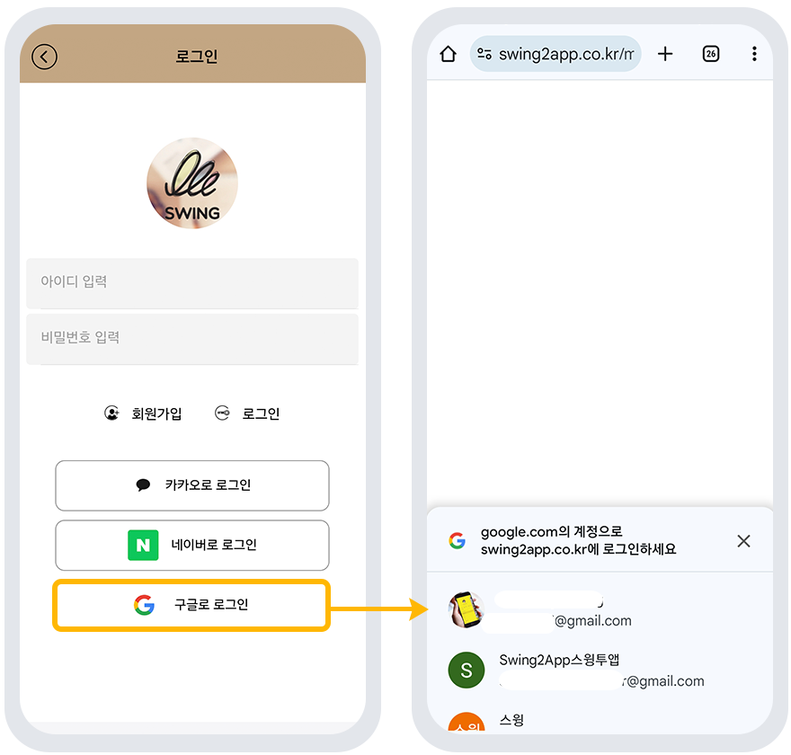<figcaption></figcaption></figure>

<figure><figcaption></figcaption></figure>

스윙투앱에서 제작한 앱 - 로그인 화면에서 "구글로 로그인" 버튼이 셋팅된 것을 확인할 수 있습니다.&#x20;

**로그인 방법)**

구글로 로그인 버튼 선택 > 핸드폰에 등록된 구글 계정 리스트가 열립니다. (구글 계정이 핸드폰에 연동되어 있어야 합니다) > 로그인하고자 하는 이메일 계정 선택 > 해당 계정 확인 완료 > 앱에서 &#x20;

이름 입력이 완료되면 정상 로그인 됩니다.&#x20;

\* 앱 업데이트를 한 뒤 구글 로그인을 확인해주세요.&#x20;

***

## 4.게시하기

테스트가 완료되었으면, <mark style="color:blue;">**OAuth 동의화면: 테스트 상태를 → 앱 게시로 변경합니다.**</mark>

게시로 변경을 해야만 모든 구글 계정에서 로그인이 가능합니다.&#x20;

<figure>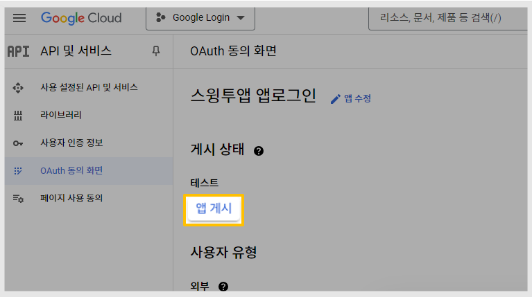<figcaption></figcaption></figure>

