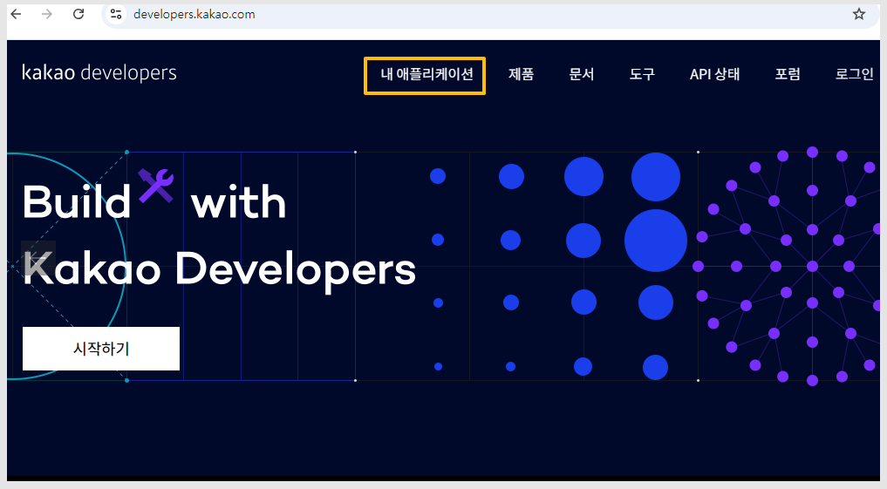

# 카카오 로그인 API 연동

***


해당 기능은 스윙투앱 **일반 프로토타입 앱에서 적용할 수 있는 연동 매뉴얼입니다.**

\*무료앱 이용 불가/ 이용권 중 확장형, 프리미엄 이용권 이용시에만 이용 가능합니다.&#x20;

\*웹사이트를 연결한 웹뷰앱, 푸시앱은 이용 불가합니다.&#x20;

(웹앱은 웹사이트 내에서 소셜 로그인 셋팅을 하여 이용해주세요.)&#x20;


***

## 1.kakao developers 접속

[kakao developers 사이트](https://developers.kakao.com/)

<figure><figcaption></figcaption></figure>

[kakao developers](https://developers.kakao.com/) 사이트에 접속한 뒤, 로그인 해주세요.

\[내 애플리케이션] 메뉴를 선택합니다.&#x20;

<figure><figcaption></figcaption></figure>

<mark style="color:blue;">**+애플리케이션 추가하기**</mark> 선택 한 뒤, 앱 정보를 입력해주세요&#x20;

1\)앱 아이콘 이미지 등록

2\)앱 이름 입력&#x20;

3\)회사 이름 입력&#x20;

4\)카테고리 선택

5\)동의 체크 후&#x20;

6\)저장

<figure><figcaption></figcaption></figure>

왼쪽 카테고리에서 \[플랫폼] 선택 - Web \[Web 플랫폼 등록] 선택합니다.&#x20;

<figure><figcaption></figcaption></figure>

사이트 도메인 입력란에는 아래 4가지 주소를 입력 후 저장해주세요.

도메인 입력시, 기본 도메인은 첫 번째 사이트 도메인으로 자동 입력됩니다.

<mark style="color:blue;">**https://www.swing2app.co.kr**</mark>

<mark style="color:blue;">**http://www.swing2app.com**</mark>

<mark style="color:blue;">**http://www.swing2app.co.kr**</mark>

<mark style="color:blue;">**https://www.swing2app.com**</mark>

\[저장] 버튼 선택해주세요.

<figure><figcaption></figcaption></figure>

화면 하단 <mark style="color:purple;">\[등록하러 가기]</mark> 버튼을 선택해주세요.

<figure><figcaption></figcaption></figure>

**활성화 설정**&#x20;

상태를  OFF에서 → **활성화로 변경 체크해주세요.**&#x20;

**Redirect URL**

Redirect URL 등록 선택 , 아래의 2개URL 입력 후 저장해주세요.&#x20;


[https://www.swing2app.co.kr/swapi/do-oauth-kakao-login-receive
\
http://www.swing2app.co.kr/swapi/do-oauth-kakao-login-receive
\
](https://www.swing2app.co.kr/swapi/do-oauth-kakao-login-receivehttp://www.swing2app.co.kr/swapi/do-oauth-kakao-login-receive)


<figure><figcaption></figcaption></figure>

왼쪽 카테고리 - 동의항목 선택 후, 개인정보 - 닉네임 -'설정' 버튼 선택

동의 항목 설정 팝업에서 아래 내용으로 체크 및 입력한 뒤 저장해주세요.&#x20;

**-동의 단계: "필수 동의"로 체크 후 저장해주세요.**&#x20;

**-동의목적: 카카오 로그인이 필요한 이유를 기재합니다. 예시)회원가입시 기본정보로 활용합니다.**&#x20;

<figure><figcaption></figcaption></figure>

왼쪽 카테고리 - 앱 키 선택

JavaScript키 값을 복사해주세요.&#x20;

<mark style="color:red;">\*복사한 키는 스윙투앱 대시보드 - 외부 연동 로그인- 카카오 아이디란에 입력해주셔야 합니다.</mark>

***

## 2.스윙투앱 대시보드- 키 값 입력하기

<figure><figcaption></figcaption></figure>

[앱운영-서비스관리-정책관리-회원가입 양식](https://www.swing2app.co.kr/view/app\_policy)

\-아이디 형태: 일반아이디 선택

\-외부연동 로그인 :  카카오톡 체크

\-카카오톡 REST API 앱키 입력란에 복사한 키를붙혀넣기 해주세요.

\-\[정책설정하기] 선택

<mark style="color:orange;">\*앱제작 이동 후 \[앱 업데이트]까지 꼭 해주세요. \*업데이트가 되어야 로그인 반영됩니다.</mark>

<figure><figcaption></figcaption></figure>

스토어(플레이스토어, 앱스토어 등)에 출시되어 있을 경우&#x20;

\*업데이트 유형: 하드 업데이트(재설치) 선택 , 업데이트 후 해당 스토어에도 업데이트 제출해주세요.&#x20;

무료앱 혹은 유료앱이지만 스토어 출시 전 앱 이라면&#x20;

\*소프트 업데이트(재실행) 선택

***

## 3.앱 실행화면

업데이트 후, 카카오톡 로그인이 앱에서 정상적으로 셋팅 되었는지 확인할 수 있습니다.&#x20;

<figure><figcaption></figcaption></figure>

스윙투앱에서 제작한 앱 - 로그인 화면에서  '카카오 로그인'이 셋팅된 것을 확인할 수 있습니다.&#x20;

'카카오 로그인' 선택시 - 연동된 카카오 로그인 화면이 열리구요.&#x20;

카카오톡 로그인 동의하고 계속하기 선택시, 카카오톡 본인인증 완료 후 회원가입이 완료됩니다.&#x20;

\*카카오톡 로그인 적용 후 앱 업데이트를 한 뒤 확인해주세요.&#x20;

