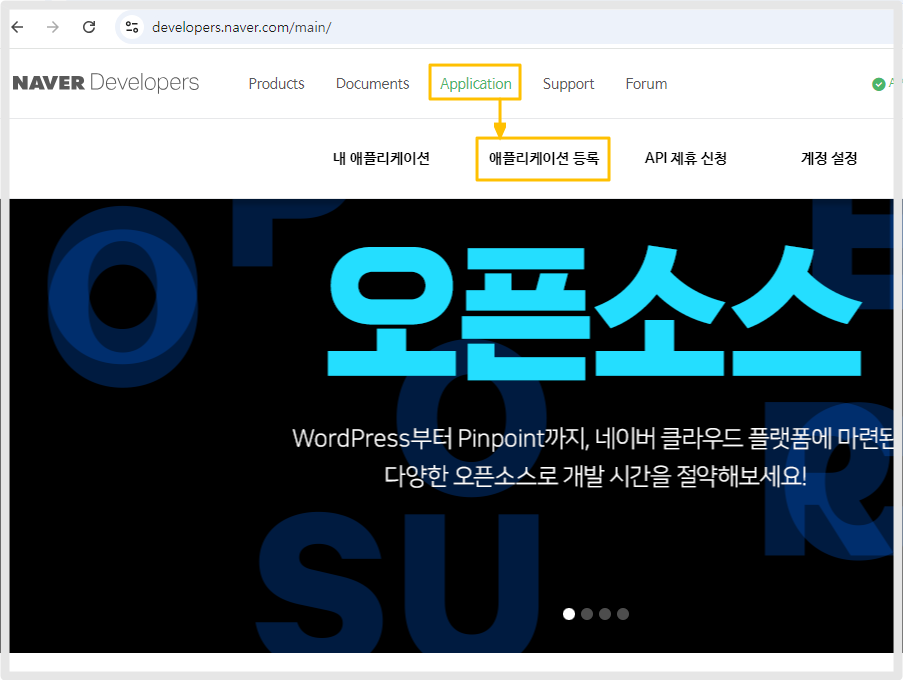
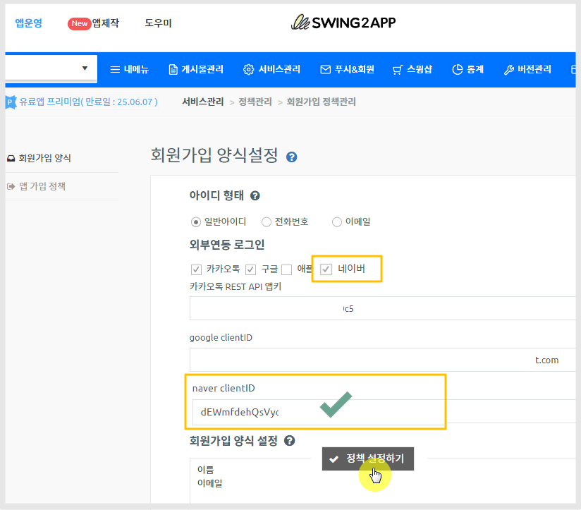
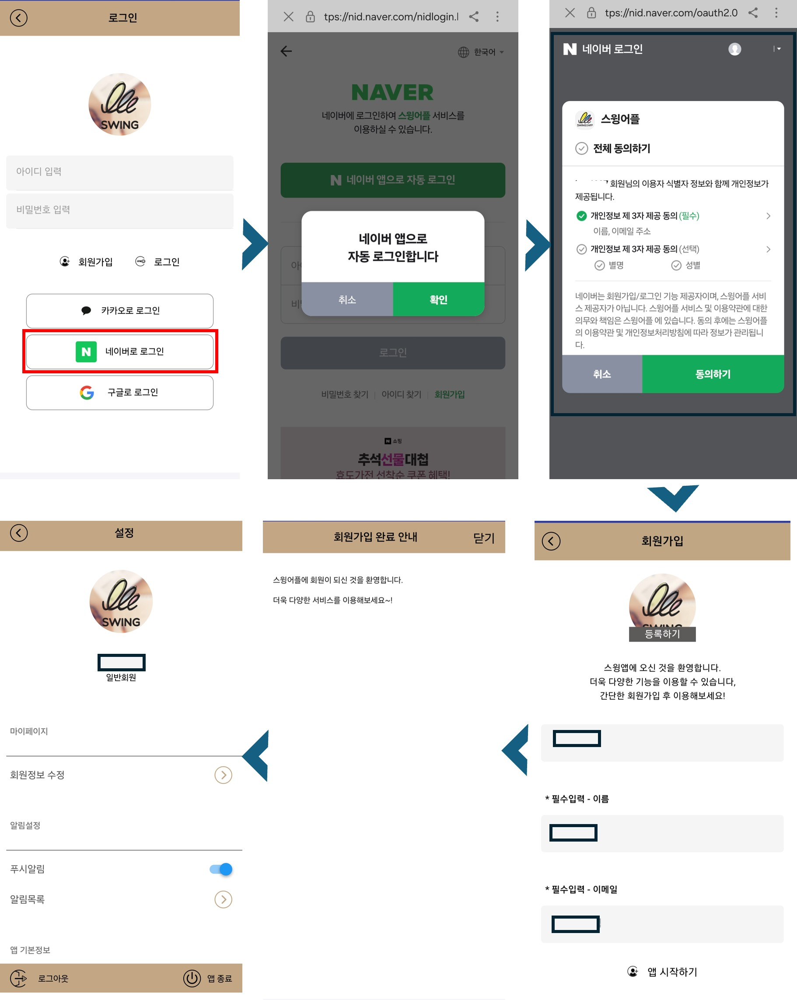

# 네이버 로그인 API 연동

***

[https://developers.naver.com/](https://developers.naver.com/apps/) 접속 후 로그인

아직 가입이 안되어있다면, 가입 후 진행해주세요.

## 1.NAVER Developers 사이트 - 어플리케이션 등록

<figure><figcaption></figcaption></figure>

1.Application - 애플리케이션 등록 선택

<figure><figcaption></figcaption></figure>

2.어플리케이션 이름 입력

\*로그인시 사용자에게 표시되는 이름이므로, 실제 앱 이름과 동일하게 기재하는 것이 좋습니다.

3.사용 API : 네이버 로그인 선택

<figure><figcaption></figcaption></figure>

4.네이버 로그인에서 제공 정보를 선택하는것인데,  스윙투앱 앱에서는 정보가 매핑 되지 않습니다.

따라서 <mark style="color:red;">\*정보 선택은 아무것도 체크하지 말고 진행해주세요.</mark>&#x20;

5.로그인 오픈 API 서비스 환경: **Mobile웹** 선택

<mark style="color:blue;">해당로  API로 연동된 로그인 화면 캡쳐)</mark>

<figure><figcaption></figcaption></figure>

<figure><figcaption></figcaption></figure>

6.URL 입력

1\)서비스 URL 입력

[https://www.swing2app.co.kr/](https://www.swing2app.co.kr/)

2\)네이버 로그인 Cllback URL 입력

[https://www.swing2app.co.kr/main/sns\_login\_callback\_naver](https://www.swing2app.co.kr/main/sns\_login\_callback\_naver)\
\
7.서비스 이용 동의에 모두 동의 체크 해주세요.

8.등록하기 선택

<figure><figcaption></figcaption></figure>

#### 9.테스터 ID 등록하기&#x20;

내 어플리이션에서 만들어놓은 앱 선택 후 - 멤버관리 선택 - 테스터 ID를 등록해주세요.

네이버 로그인으로 테스트할 ID를 입력하는 것이구요. &#x20;

<mark style="color:red;">\*검수 전에는 먼저 테스트로 등록한 ID로만 로그인이 가능합니다.</mark>&#x20;

관리자 ID는  테스터로 등록하지 않아도 로그인 가능합니다.&#x20;

ID 입력시 @naver.com 이메일 다 입력하지 않고 앞에 아이디만 입력합니다.

예를 들어) 메일주소가 swing2appko@naver.com 이라면 "swing2appko"만 입력하면 됩니다.

<figure><figcaption></figcaption></figure>

**10.Client ID 복사**

개요 탭 - 애플리케이션 정보에서 Client ID를 복사해주세요.&#x20;

복사한 ID는 스윙투앱 대시보드 - 외부 연동 로그인- 네이버 아이디란에 입력해주셔야 합니다.

***

## 2.스윙투앱 대시보드에 ID 입력하기

<figure><figcaption></figcaption></figure>

[앱운영-서비스관리-정책관리-회원가입 양식](https://www.swing2app.co.kr/view/app\_policy)

\-아이디 형태: 일반아이디 선택

\-외부연동 로그인 :  네이버 체크

\-Naver clientID 입력란에 복사한 ID 붙혀넣기 해주세요.

\-정책설정하기 선택

\*앱제작 이동 후 \[앱 업데이트]까지 꼭 해주세요. \*업데이트가 되어야 로그인 반영됩니다.

<figure><figcaption></figcaption></figure>

스토어(플레이스토어, 앱스토어 등)에 출시되어 있을 경우&#x20;

\*업데이트 유형: 하드 업데이트(재설치) 선택

무료앱 혹은 유료앱이지만 스토어 출시 전 앱 이라면&#x20;

\*소프트 업데이트(재실행) 선택

***

## 3.앱 실행화면

<figure><figcaption></figcaption></figure>

스윙투앱에서 제작한 앱 - 로그인 화면에서  '네이버 로그인'이 셋팅된 것을 확인할 수 있습니다.&#x20;

'네이버 로그인' 선택시 - 연동된 네이버 로그인 페이지가 실행됩니다.&#x20;

\*네이버 로그인 적용 후 앱   업데이트를 한 뒤 확인해주세요.&#x20;

***

## 4.검수받기

테스트를 완료한 뒤, 앱에서 문제가 없으면 네이버 로그인 검수를 요청해주세요.

검수를 요청한 뒤, 완료가 되어야 실제 앱에서 네이버 로그인 기능을 사용할 수 있습니다.&#x20;

<mark style="color:red;">\*검수가 되지 않으면 정상적으로 이용이 불가하오니, 꼭 검수까지 진행해주세요</mark>

<figure><figcaption></figcaption></figure>

어플 선택 후 - 네이버 로그인 검수상태 탭을 선택합니다.

1\)검수 요청 가이드 확인 체크

2\)서비스 적용 형태 확인 : 네이버 로그인을 통한 신규 회원가입에 적용 체크

3\)'파일선택' 버튼 선택해서 캡쳐 파일을 등록합니다.

앱에서 네이버 로그인 이용 화면- 네이버로그인 버튼을 클릭하여 로그인 혹은 회원가입을 완료하는 화면을 캡쳐해서 등록해주세요.

<mark style="color:blue;">캡쳐화면 샘플 예시)</mark>

<figure><figcaption></figcaption></figure>

4\)추가 제출 서류 확인 : 해당 되는 것에 체크해주세요, 없으면 "없음"으로 체크해주세요.&#x20;

5\)\[검수요청] 버튼 선택시 완료됩니다.&#x20;

***

## 5.검수완료

<figure><figcaption></figcaption></figure>

네이버 로그인 검수가 완료되면 승인 완료 메일이 전송됩니다.

승인이 완료되면 이제 모든 네이버 아이디 로그인이 가능해집니다.

\*앱은 다시 업데이트 할 필요 없으며, 종료 후 재실행한 뒤 네이버 로그인 진행해주세요.

테스트로 등록된 계정 외에 다른 네이버 아이디 선택 후 로그인 진행해주시면 됩니다.&#x20;

