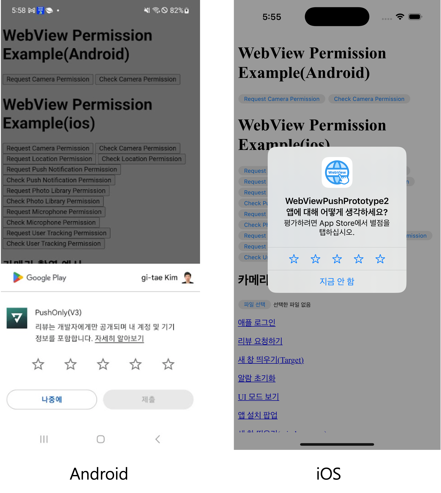

# Javascript 웹뷰 API 문서

스윙투앱에서 제공하는 웹뷰와 푸시전용 프로토타입의 앱을 제어할 수 있는 javascript API 입니다.

공통적으로 아래의 js 파일을 include 하여 사용하시고 아래의 API 명세를 통해서

필요한 기능을 실행하시면 됩니다.


공통 js 파일 HTML 파일에 아래의 js 파일을 포함시켜주세요



```html
<script src="https://pcdn2.swing2app.co.kr/swing_public_src/v3/2026_03_31_001/js/swing_app_on_web.js"></script>
```


## 웹뷰 Javascript API 명세서

## 웹뷰 제어관련 Method

### • 웹뷰 뒤로가기  <a href="#back-webview" id="back-webview"></a>

웹뷰에서 이전 페이지로 이동 웹브라우저에서 뒤로가기 기능과 동일한 동작


```javascript
swingWebViewPlugin.app.webview.back();
```


### • 웹뷰 앞으로 가기 <a href="#forward-webview" id="forward-webview"></a>

웹뷰에서 앞의 페이지로 이동 웹브라우저에서 앞으로가기 기능과 동일한 동작


```javascript
swingWebViewPlugin.app.webview.forward();
```


### • 웹뷰 홈으로 이동 <a href="#go-to-home" id="go-to-home"></a>

웹뷰에서 스윙투앱에 셋팅된 홈 페이지(설정된 초기 페이지)로 이동하는 기능


```javascript
swingWebViewPlugin.app.webview.navigateToHome()
```


### • 웹뷰 캐시 초기화 <a href="#webview-clear-cache" id="webview-clear-cache"></a>

웹뷰에서 캐시를 초기화 하는 Command

<mark style="background-color:blue;">\*js lib 2024\_02\_28\_002 버전 부터 사용 가능</mark>


```javascript
swingWebViewPlugin.app.webview.clearCache()
```


### • 웹뷰 Navigation History 초기화 <a href="#webview-clear-routh-history" id="webview-clear-routh-history"></a>

웹뷰에서 Navigation History 를 초기화하는 기능

<mark style="background-color:blue;">\*js lib 2024\_02\_28\_002 버전 부터 사용 가능</mark>


```javascript
swingWebViewPlugin.app.webview.clearWebViewRouteHistory()
```



## 툴바 제어관련 Method <a href="#toolbar" id="toolbar"></a>

### • 툴바 활성화 설정하기 <a href="#toolbar-setting" id="toolbar-setting"></a>

푸시전용 프로토타입에서 Toolbar 를 API 통해서 제어할 수 있습니다.

앱 실행상태에서 툴바를 숨기거나 활성화 그리고 자동 숨김 옵션까지 모두 제어할 수 있습니다.&#x20;

<mark style="background-color:blue;">\*js lib 2024\_02\_28\_002 버전 부터 사용 가능</mark>


```javascript
// toolbar 활성화 , 자동숨김 비활성화 
// swingWebViewPlugin.app.webview.updateToolbar(true,false)
// toolbar 활성화 , 자동숨김 활성화 
// swingWebViewPlugin.app.webview.updateToolbar(true,true)
// toolbar 비활성화 , 자동숨김 비활성화 
// swingWebViewPlugin.app.webview.updateToolbar(false,false)
swingWebViewPlugin.app.webview.updateToolbar(false,false)
```



## 어플리케이션 관련 Method

### • 플랫폼 정보 가져오기 <a href="#get-platform-info" id="get-platform-info"></a>

웹상에서 플랫폼 정보를 가져오기 위한 함수


```javascript
if( swingWebViewPlugin.app.methods.getCurrentPlatform() == 'android' )
{
    console.log('android');
}
else if( swingWebViewPlugin.app.methods.getCurrentPlatform() == 'ios' )
{
    console.log('ios');
}
else
{
    console.log('web browser');
}
```


### • 버전 및 기기정보 가져오기 <a href="#get-version-device-info" id="get-version-device-info"></a>

앱의 버전및 기기의 H/W 그리고 S/W 정보를 가져오는 함수


```javascript
// android
swingWebViewPlugin.app.methods.getAppVersion(function(value){
    var appVersion = JSON.parse(value);

    console.log('model : ' + appVersion.model);
    console.log('sdk_version : ' + appVersion.sdk_version);
    console.log('version_release : ' + appVersion.version_release);
    console.log('manufacturer : ' + appVersion.manufacturer);
    console.log('app_version : ' + appVersion.app_version);
    console.log('radio_version : ' + appVersion.radio_version);
    console.log('package_name : ' + appVersion.package_name);
    console.log('uuid : ' + appVersion.uuid);
    console.log('deviceToken : ' + appVersion.device_token);
});

// ios
swingWebViewPlugin.app.methods.getAppVersion(function(value){
    var appVersion = JSON.parse(value);
    
    console.log('model : ' + appVersion.model);
    console.log('name : ' + appVersion.name);
    console.log('systemVersion : ' + appVersion.systemVersion);
    console.log('appVersion : ' + appVersion.appVersion);
    console.log('bundleVersion : ' + appVersion.bundleVersion);
    console.log('bundleID : ' + appVersion.bundleID);
    console.log('uuid : ' + appVersion.uuid);
    console.log('deviceToken : ' + appVersion.deviceToken);
});
```


### • 앱 종료 기능 <a href="#how-to-exit-app" id="how-to-exit-app"></a>

&#x20;실행중인 앱을 종료하는 명령어


```javascript
swingWebViewPlugin.app.methods.doExitApp();
```


### • 외부 브라우저로 URL 실행하기 <a href="#open-external-browser-specific-url" id="open-external-browser-specific-url"></a>

크롬 또는 사파리등 앱의 기본 브라우저로 특정 페이지를 열고 싶을때 아래의 함수를 이용할 수 있다.


```javascript
swingWebViewPlugin.app.methods.doExternalOpen('https://www.swing2app.com');
```


### • 내장 브라우저로 URL 실행하기 <a href="#open-browser-specific-url" id="open-browser-specific-url"></a>

안드로이드와 iOS 자체적으로 제공하는 앱 내장 브라우저를 이용해서 실행

크롬과 사파리등을 반드시 이용해야 하는 경우 아래의 코드를 통해서 앱 내부에서 크롬과 사파리를 호출 할 수 있다.


```javascript
swingWebViewPlugin.app.methods.openBrowser('https://www.swing2app.com');
```


### • 현재 페이지를 공유하기 <a href="#share-current-page" id="share-current-page"></a>

현재 웹 페이지를 공유하는 기능을 위한 아래의 코드를 실행


```javascript
swingWebViewPlugin.app.methods.doShareCurrentPage();
```


### • 지정 URL 공유하기 <a href="#share-specific-url" id="share-specific-url"></a>

지정한 URL을 공유하고자 할 경우 아래와 같이 코드를 실행


```javascript
swingWebViewPlugin.app.methods.doShareWithUrl('https://www.swing2app.com');
```


### • 어플리케이션의 알림 설정 상태를 확인하기 <a href="#set-notification" id="set-notification"></a>

어플리케이션에서 푸시 알람 설정에 대한 상태를 확인하는 기능

푸시가 비활성화 되었을 경우 OS 자체적으로 푸시가 Off 되었을 경우와

앱 자체적인 설정으로 Off 가 되었을경우를 확인할 수 있다.


```javascript
swingWebViewPlugin.app.methods.isNotificationEnabled(function (result) {
    if( result == '1' ) // 푸시를 발송 할 수 있는 상태
    {
        console.log('push active');
    }
    else if( result == 'off_on_permission' )    // android 13 이상에서 푸시 권한이 없을 경우
    {
        console.log('push inactive');    
    }
    else if( result == 'off_on_system' )    // 시스템 설정에 의한 앱 푸시 비활성화
    {
        console.log('push inactive');
    }
    else if( result == 'off_on_app' )       // 앱 설정에 의한 앱 푸시 비활성화
    {
        console.log('push inactive');
    }
});
```


Ex:) 푸시 설정에 따라 Off 설정일 경우 활성화 권장을 위한 코드예제


```javascript
swingWebViewPlugin.app.methods.isNotificationEnabled(function (result) {
    if( result == '1' ) // 푸시를 발송 할 수 있는 상태
    {
        console.log('push active');
    }
    else if( result == 'off_on_permission' )    // android 13 이상에서 푸시 권한이 없을 경우
    {
        console.log('push inactive');    
        swingWebViewPlugin.app.permission.android.requestPermission('android.permission.POST_NOTIFICATIONS', function(status) {
            if (status == 'granted') {
                console.log('Push notification permission granted');
            } else {
                console.log('Push notification permission denied');
            }
        });        
    }
    else if( result == 'off_on_system' )    // 시스템 설정에 의한 앱 푸시 비활성화
    {
        console.log('push inactive');
        swingWebViewPlugin.app.methods.goToNotificationSetting("system"); // 시스템 설정 Open
    }
    else if( result == 'off_on_app' )       // 앱 설정에 의한 앱 푸시 비활성화
    {
        console.log('push inactive');
        swingWebViewPlugin.app.screen.setting.show();    // 앱 설정 Open
    }
});
```


### • 알람 설정 이동하기 <a href="#go-to-set-notification" id="go-to-set-notification"></a>

어플리케이션 또는 시스템의 알람설정을 이동할 수 있는 기능

(1) 어플리케이션 자체적인 알람 설정을 할 수 있는 화면으로 이동

```javascript
swingWebViewPlugin.app.screen.setting.show();
```

(2) 시스템(안드로이드, iOS) 자체적인 알람 설정을 할 수 있는 화면으로 이동

```javascript
swingWebViewPlugin.app.methods.goToNotificationSetting('system');
```

### • 클립보드에 텍스트 저장하기 <a href="#clipboard-write" id="clipboard-write"></a>

클립보드에 텍스트를 저장할 수 있는 기능

웹뷰에서는 보안상의 이슈로 window.navigator.clipboard.writeText API 가 정상동작하지 않기 때문에

스윙투앱 웹뷰에서는 아래의 API 를 이용하여 clipboard 에 저장하면 됩니다.

```javascript
swingWebViewPlugin.app.methods.copyToClipboard("copyToClipboard 텍스트 테스트");
```

### • 푸시메시지 수신 활성화 하기 <a href="#active-push" id="active-push"></a>

푸시메시지 수신설정을 활성화 하기 위한 API

```javascript
swingWebViewPlugin.app.methods.activePush();
```

### • 푸시메시지 수신 비활성화 하기  <a href="#inactive-push" id="inactive-push"></a>

푸시메시지 수신설정을 비활성화 하기 위한 API

```javascript
swingWebViewPlugin.app.methods.inactivePush();
```


### • 디바이스에 변수 저장하기 <a href="#save-localstorage" id="save-localstorage"></a>

앱내에 Storage 변수 저장하기

앱내의 Storage 저장하고 싶은 데이터가 있다면 아래의 함수를 이용해서 저장할 수 있습니다.

다음 기능을 활용해서 웹 사이트 자동 로그인을 쉽게 구현할 수 있습니다.

<mark style="background-color:blue;">\*js lib 2025\_02\_14\_001 버전으로 업데이트 됨</mark>


```javascript
// 앱과 웹 모두 사용할 경우
swingWebViewPlugin.app.methods.setVariable('id','test', {type : 'app_n_web'}); // 앱과 웹에 모두 저장
// 앱에만 데이터를 저장할 경우
swingWebViewPlugin.app.methods.setVariable('id','test', {type : 'app'}); // 앱에만 저장

// 'app_n_web' 앱과 웹 모두 저장할 경우 앱이 아닌 웹 환경에서도 loadVariable 호출할 경우 localStorage 를 통해 값을 가져올 수 있습니다.
// 'app' 으로 사용할 경우 앱 환경에서만 저장되며, 웹 환경에서는 loadVariable 호출할 경우 값은 null이 반환됩니다.
```


### • (New)디바이스에 저장된 변수 불러오기 <a href="#load-localstorage" id="load-localstorage"></a>

앱내에 Storage 저장된 변수값 가져오기

변수값을 저장할때 setVariable 함수의 옵션에 따라 앱 또는 웹 저장소에 저장된 값을 가져오게 됩니다.

<mark style="background-color:blue;">\*js lib 2025\_02\_14\_001 버전 부터 사용 가능, 2025년 2월 14일 이후 제작된 앱에서만 실행가능</mark>


```javascript
swingWebViewPlugin.app.methods.loadVariable('id',function(value) {
    console.log(value);
    // 출력예시 : test
});
```


### • (Old)디바이스에 저장된 변수 불러오기 <a href="#load-localstorage" id="load-localstorage"></a>

앱내에 Storage 저장된 변수값 가져오기

웹에서는 callback 함수가 실행되지 않으며 앱으로 구동 되었을때만 callback 함수가 실행됩니다.

<mark style="background-color:blue;">\*js lib 2023\_12\_20\_001 버전 부터 사용 가능</mark>


```javascript
swingWebViewPlugin.app.methods.getVariable('id',function(value) {
    console.log(JSON.parse(value).value);
    // 출력예시 : test
});
```



### • TTS 재생하기(프리미엄 기능) - 커스터마이징 필요 <a href="#speak-tts" id="speak-tts"></a>

텍스트를 음성으로 출력하는 TTS 기능을 활성화하는 기능&#x20;

<mark style="background-color:blue;">\*js lib 2023\_12\_20\_001 버전 부터 사용 가능</mark>


```javascript
swingWebViewPlugin.app.methods.speakOutViaTTS('안녕하세요');
```



### • 앱 첫 실행 여부 확인하기 <a href="#check-first-run" id="check-first-run"></a>

앱이 처음실행 했는지는 확인할 수 있는 API , 앱의 첫 실행여부를 판단하는 함수

<mark style="background-color:blue;">\*js lib 2024\_02\_28\_001 버전 부터 사용 가능</mark>


```javascript
swingWebViewPlugin.app.methods.isFirstRun(function (value) {
    if (JSON.parse(value).result) // 앱 첫실행 될 경우
    {
        console.log('앱 첫 실행');
    }
});
```



### • 앱 리뷰 요청하기  <a href="#open-review" id="open-review"></a>

사용자에게 앱 리뷰를 요청하는 기능을 호출하는 함수

\*iOS 에서 리뷰 요청기능에 대한 호출 제한이 있어 호출 제한이 걸릴 경우 앱스토어 이동하도록 처리되어있습니다.

<mark style="background-color:blue;">\*js lib 2025\_03\_14\_001 버전 부터 사용 가능, 25년 3월 14일 앱 제작 이후에 만든앱 부터 동작합니다.</mark>


```javascript
swingWebViewPlugin.app.methods.doOpenReview();
```


<figure><figcaption><p>앱에서 리뷰 기능을 호출한 화면</p></figcaption></figure>


## 앱 UI 제어관련 Method <a href="#ui-control" id="ui-control"></a>

### • iOS 배경색상 설정하기 <a href="#change-ios-backcolor" id="change-ios-backcolor"></a>

&#x20;iOS 의 디바이스 노치 및 홈바 UI 로 인해 설정된 SafeArea 영역 및 메인 색상을 설정하는 옵션입니다.

색상은 hex 값으로 #을 제외하고 입력해주시면 됩니다. 해당 설정은 iOS 에서만 동작합니다.

<mark style="background-color:blue;">\*js lib 2024\_02\_28\_001 버전 부터 사용 가능</mark>


```javascript
swingWebViewPlugin.app.ui.setIosBackColor('00ff00');
```


### • 앱 화면모드 확인하기(다크모드,라이트모드) <a href="#device-ui-mode" id="device-ui-mode"></a>

시스템에서 설정한 화면 모드(라이트모드,다크모드)를 확인하는 코드 입니다.

이 코드를 활용해서 사용자의 폰에 설정된 화면모드에 따라 웹페이지 컨텐츠를 변경해보세요.

<mark style="background-color:blue;">\*js lib 2024\_07\_23\_001 버전 부터 사용 가능(24년 7월30일 이후 제작된 버전부터 동작)</mark>


```javascript
swingWebViewPlugin.app.ui.getDeviceUiStyle(function (mode) {
    if( mode == 'light' )
    {
        console.log('light');        
    }
    else if( mode == 'dark' )
    {
        console.log('dark');
    }
});
```


### •  상태바 감추기(Android) <a href="#hide-statusbar" id="hide-statusbar"></a>

안드로이드에서 상태바를 가리고 전체화면으로 변경하는 명령.

( wifi,배터리,이동통신 표시 등)

<mark style="background-color:blue;">\*js lib 2025\_07\_04\_001 버전 부터 사용 가능(25년 7월4일 이후 제작된 버전부터 동작)</mark>


```javascript
swingWebViewPlugin.app.ui.hideStatusBar();
```


### •  상태바 보여주기(Android) <a href="#show-statusbar" id="show-statusbar"></a>

안드로이드에서 상태바를 보여주도록 변경하는 명령.

( wifi,배터리,이동통신 표시 등)

<mark style="background-color:blue;">\*js lib 2025\_07\_04\_001 버전 부터 사용 가능(25년 7월4일 이후 제작된 버전부터 동작)</mark>


```javascript
swingWebViewPlugin.app.ui.showStatusBar();
```



## 앱 화면 제어관련 Method <a href="#screen-control" id="screen-control"></a>

### • 설정화면으로 이동하기 <a href="#go-to-setting" id="go-to-setting"></a>

설정화면으로 이동하는 API Command.

툴바 또는 메뉴바를 이용하지 않고 설정화면으로 이동할 수 있습니다.

<mark style="background-color:blue;">\*js lib 2024\_02\_28\_002 버전 부터 사용 가능</mark>


```javascript
swingWebViewPlugin.app.screen.setting.show();
```


### • 알림목록화면으로 이동하기 <a href="#go-to-notification-list" id="go-to-notification-list"></a>

알림목록화면으로 이동하는 API Command.

툴바 또는 메뉴바를 이용하지 않고 알림목록화면으로 이동할 수 있습니다.

<mark style="background-color:blue;">\*js lib 2024\_02\_28\_002 버전 부터 사용 가능</mark>


```javascript
swingWebViewPlugin.app.screen.notificationList.show();
```


### • 메뉴화면으로 이동하기 <a href="#go-to-menu" id="go-to-menu"></a>

메뉴화면으로 이동하는 API Command.

툴바를 이용하지 않고 메뉴화면으로 이동할 수 있습니다.

<mark style="background-color:blue;">\*js lib 2024\_02\_28\_002 버전 부터 사용 가능</mark>


```javascript
swingWebViewPlugin.app.screen.menu.show();
```


### • 북마크목록화면으로 이동하기 <a href="#go-to-bookmark-list" id="go-to-bookmark-list"></a>

북마크목록화면으로 이동하는 API Command.

메뉴 또는 툴바를 이용하지 않고 북마크목록화면으로 이동할 수 있습니다.

<mark style="background-color:blue;">\*js lib 2024\_02\_28\_002 버전 부터 사용 가능</mark>


```javascript
swingWebViewPlugin.app.screen.bookmarkList.show();
```



## 어플리케이션 Event

앱의 Native Event 를 관리할 수 있는 명령어 입니다.


### • 안드로이드 앱 Back key 웹뷰 Navigation 이벤트 추가하기 <a href="#add-event-exit-app" id="add-event-exit-app"></a>

앱의 Back 버튼의 종료 이벤트를 추가할 경우 Back버튼을 인한  뒤로가기 기능이 동작하지 않습니다.

따라서 backEvent 추가할 경우 Back key 로 인해 웹뷰 Navigation Back되는 상황에서 뒤로가기 기능이&#x20;

동작하지 않고 직접 구현해주셔야 합니다.

```javascript
swingWebViewPlugin.event.addEvent('backEvent' , function() {
    // 안드로이드 back event 
    swingWebViewPlugin.app.webview.back(); // 웹뷰 뒤로가기 예시
})
```


### • 안드로이드 앱 Back key로 인해 종료 이벤트 추가하기 <a href="#add-event-back-key" id="add-event-back-key"></a>

앱의 back 버튼의 종료 이벤트를 추가할 경우 back버튼을 인한 앱에서는 종료 기능이 동작하지 않습니다.

따라서 backExitEvent 추가할 경우 종료에 대한 처리를 callback 함수내에서 직접 구현해야 합니다.

```javascript
swingWebViewPlugin.event.addEvent('backExitEvent' , function() {
    // 앱 종료 Logic 직접 구현
    swingWebViewPlugin.app.methods.doExitApp();    // 앱 종료 Command 호출 예시
});
```


## 어플리케이션 권한제어 Method <a href="#permission-control" id="permission-control"></a>

Android 및 iOS 플랫폼에서 웹뷰를 사용하여 권한을 요청하고 확인하는 방법을 설명합니다.&#x20;

아래의 예제 코드와 함께 권한을 요청하고 확인하는 방법을 안내합니다.

<mark style="background-color:blue;">\*js lib 2024\_07\_23\_001 버전 부터 사용 가능</mark>

<mark style="background-color:blue;">\*앱은 2024년 7월 23일 제작된 버전 이후부터 사용가능</mark>

### • 권한 요청 (Android) <a href="#permission-request-android" id="permission-request-android"></a>

**각 권한별 파라미터 설명**

* **카메라**: `android.permission.CAMERA`
* **위치**: `android.permission.ACCESS_FINE_LOCATION`
* **푸시 알림**: `android.permission.POST_NOTIFICATIONS` (Andriod 13 이상에서 사용)
* **마이크**: `android.permission.RECORD_AUDIO`

각 권한별로 호출 예시(Ex:카메라 권한 요청)

```javascript
swingWebViewPlugin.app.permission.android.requestPermission('android.permission.CAMERA', function(status) {
    if (status == 'granted') {
        console.log('Camera permission granted');
    } else {
        console.log('Camera permission denied');
    }
});
```

위치 권한 요청

```javascript
swingWebViewPlugin.app.permission.android.requestPermission('android.permission.ACCESS_FINE_LOCATION', function(status) {
    if (status == 'granted') {
        console.log('Location permission granted');
    } else {
        console.log('Location permission denied');
    }
});
```

\*사용자가 권한을 거부한 경우

사용자가 권한 요청을 거부한 경우, 이후 동일한 권한 요청 시 시스템에서 팝업을 표시하지 않습니다.&#x20;

사용자는 시스템 설정에서 권한을 수동으로 허용해야 합니다.


### • 권한 확인 (Android) <a href="#permission-check-android" id="permission-check-android"></a>

**각 권한별 파라미터 설명**

* **카메라**: `android.permission.CAMERA`
* **위치**: `android.permission.ACCESS_FINE_LOCATION`
* **푸시 알림**: `android.permission.POST_NOTIFICATIONS` (Andriod 13 이상에서만 사용가능)
* **마이크**: `android.permission.RECORD_AUDIO`

**권한 확인 후 권한이 없는 경우 요청하는 코드 예시**

카메라 권한 확인 후 요청

```javascript
swingWebViewPlugin.app.permission.android.checkPermission('android.permission.CAMERA', function(status) {
    if (status == 'granted') {
        console.log('Camera permission already granted');
    } else {
        swingWebViewPlugin.app.permission.android.requestPermission('android.permission.CAMERA', function(status) {
            if (status == 'granted') {
                console.log('Camera permission granted');
            } else {
                console.log('Camera permission denied');
            }
        });
    }
});
```

**권한이 없을 경우 메시지 처리 예시**

```javascript
swingWebViewPlugin.app.permission.android.checkPermission('android.permission.CAMERA', function(status) {
    if (status == 'granted') {
        console.log('Camera permission already granted');
    } else {
        alert('Camera permission is required to use this feature.');
        swingWebViewPlugin.app.permission.android.requestPermission('android.permission.CAMERA', function(status) {
            if (status == 'granted') {
                console.log('Camera permission granted');
            } else {
                console.log('Camera permission denied');
            }
        });
    }
});

```

모든 callback 의 결과는 granted 와 denied 로 return 값을 제공


### • 권한 요청 (iOS) <a href="#permission-request-ios" id="permission-request-ios"></a>

**각 권한별 파라미터 설명**

* **카메라**: `'camera'`
* **위치**: `'location'`
* **푸시 알림**: `'push'`
* **앨범**: `'album'`
* **마이크**: `'microphone'`
* **사용자 추적**: `'userTracking'`


각 권한별로 호출 예시(Ex:카메라 권한 요청)

```javascript
swingWebViewPlugin.app.permission.ios.requestPermission('camera', function(status) {
    if (status == 'granted') {
        console.log('Camera permission granted');
    } else {
        console.log('Camera permission denied');
    }
});
```

위치 권한 요청

```javascript
swingWebViewPlugin.app.permission.ios.requestPermission('location', function(status) {
    if (status == 'granted') {
        console.log('Location permission granted');
    } else {
        console.log('Location permission denied');
    }
});

```


\*사용자가 권한을 거부한 경우

사용자가 권한 요청을 거부한 경우, 이후 동일한 권한 요청 시 시스템에서 팝업을 표시하지 않습니다.&#x20;

사용자는 시스템 설정에서 권한을 수동으로 허용해야 합니다.


### • 권한 확인 (iOS) <a href="#permission-check-ios" id="permission-check-ios"></a>

**각 권한별 파라미터 설명**

* **카메라**: `'camera'`
* **위치**: `'location'`
* **푸시 알림**: `'push'`
* **앨범**: `'album'`
* **마이크**: `'microphone'`
* **사용자 추적**: `'userTracking'`


**권한 확인 후 권한이 없는 경우 요청하는 코드 예시**

카메라 권한 확인 후 요청

```javascript
swingWebViewPlugin.app.permission.ios.checkPermission('camera', function(status) {
    if (status == 'granted') {
        console.log('Camera permission already granted');
    } else {
        swingWebViewPlugin.app.permission.ios.requestPermission('camera', function(status) {
            if (status == 'granted') {
                console.log('Camera permission granted');
            } else {
                console.log('Camera permission denied');
            }
        });
    }
});
```

**권한이 없을 경우 메시지 처리 예시**

```javascript
swingWebViewPlugin.app.permission.ios.checkPermission('camera', function(status) {
    if (status == 'granted') {
        console.log('Camera permission already granted');
    } else {
        alert('Camera permission is required to use this feature.');
        swingWebViewPlugin.app.permission.ios.requestPermission('camera', function(status) {
            if (status == 'granted') {
                console.log('Camera permission granted');
            } else {
                console.log('Camera permission denied');
            }
        });
    }
});

```

userTracking 제외하고는 모두 granted 와 denied 로 return 값을 제공


**사용자 추적 권한 요청(userTracking)**&#x20;

userTracking 권한의 경우 좀 더 다양한 return 값을 제공한다.(requestPermission 도 동일)

```javascript
swingWebViewPlugin.app.permission.ios.checkPermission('userTracking', function(status) {
    if (status == 'granted') {
        console.log('User tracking permission granted');
    } else if (status == 'denied') {
        console.log('User tracking permission denied');
    } else if (status == 'unset_desc') {
        console.log('User tracking usage description not set in Info.plist');
    } else if (status == 'unset_os') {
        console.log('User tracking not supported on this iOS version');
    }
});
```


이와 같이 권한 요청 및 확인 기능을 사용하여 웹뷰에서 Android 및 iOS 플랫폼의 다양한 권한을 관리할 수 있습니다.&#x20;

필요에 따라 각 플랫폼에 맞는 권한을 요청하고 확인하여 사용자 경험을 향상시키세요.


## 추가 기능 API <a href="#additional-functions" id="additional-functions"></a>

웹사이트에서 직접 앱내의 애드몹 광고를 관리할 수 있는 명령어 입니다.

아래의 내용을 참고하셔서 광고들을 활용해보세요.


반드시 애드몹이 활성된 앱의 경우만 동작하는 명령어 입니다.


### • 애플 아이디로 로그인하기 구현 <a href="#apple-signin" id="apple-signin"></a>

애플에서는 외부 로그인(예:네이버,카카오,구글 등)이 존재할 경우 반드시 애플 로그인을 제공해야 합니다.

복잡한 애플 로그인 구현을 앱의 네이티브 API 를 활용하면 손쉽게 단 몇줄로 애플 로그인을 구현하실 수 있습니다.

해당 코드는 네이티브 API 를 활용한것이기 때문에 <mark style="background-color:yellow;">**iOS 에서만 동작합니다.**</mark>

<mark style="background-color:blue;">\*js lib 2024\_12\_23\_001 버전 부터 사용 가능</mark>


**로그인 처리(Front-end 처리 방식)**

```javascript
swingWebViewPlugin.app.ios.doAppleSignIn(function (result) {
    if( result.result )
    {
        // 로그인 성공
        // 개인정보에 해당하는 정보는 최초 로그인 1회만 제공되며, 이후에는 userId 와 authTime 만 제공됩니다.
        var loginTokenResult = swingWebViewPlugin.utils.parseJWT(result.identityToken);
        var loginResult = {
            fullName : result.fullName,
            givenName : result.givenName,
            familyName : result.familyName,
            email : loginTokenResult.email,
            userId : loginTokenResult.sub,
            authTime : loginTokenResult.auth_time
        }

        console.log(JSON.stringify(loginResult));
        alert(JSON.stringify(loginResult));
    }
    else
    {
        alert('로그인 실패');
    }
});
```

**로그인 처리(Back-end 처리 방식)**

```javascript
swingWebViewPlugin.app.ios.doAppleSignIn(function (result) {
    if( result.result )
    {
        // 로그인 성공
        // 개인정보에 해당하는 정보는 최초 로그인 1회만 제공되며, 이후에는 userId 와 authTime 만 제공됩니다.
        // 파라미터로 전달된 identifyToken 을 서버에서 복호화해서 아래의 데이터를 가져와 로그인 및 회원가입을 처리한다.
        // fullName, givenName, familyName, email, userId, authTime
        location.href = '/loginWithApple?token=' + result.identityToken;
    }
    else
    {
        alert('로그인 실패');
    }
});
```

**identityToken 처리 방법(Server-Side)**

전달된 identifyToken 은 JWT(Java JSON Web Token) 형식으로  암호화 되어있습니다.

각 언어별로 JWT 토큰 파싱 방법은 쉽게 검색할 수 있습니다.

```javascript
import java.util.Base64;
import java.util.HashMap;
import java.util.Map;
import org.json.JSONObject;

public class DecoderMain {
    public static void main(String[] args) {
        // 테스트용 JWT (실제 토큰 사용 시 변경)
        String identityToken = "identifyToken 값";  

        // 토큰 디코딩 및 값 추출
        Map<String, Object> loginResult = decodeIdentityToken(identityToken);

        // 결과 출력
        System.out.println("Decoded Identity Token Data:");
        loginResult.forEach((key, value) -> System.out.println(key + " : " + value));
    }

    public static Map<String, Object> decodeIdentityToken(String token) {
        Map<String, Object> result = new HashMap<>();

        try {
            // JWT는 "header.payload.signature" 형태이므로, 두 번째 부분(payload)만 추출
            String[] parts = token.split("\\.");
            if (parts.length < 2) {
                throw new IllegalArgumentException("유효하지 않은 JWT 형식");
            }

            // Base64Url 디코딩 (패딩 처리)
            String payloadJson = new String(Base64.getUrlDecoder().decode(parts[1]));

            // JSON 파싱 (JDK 기본 기능만 사용할 경우 직접 String 파싱 필요)
            JSONObject json = new JSONObject(payloadJson);

            // 필요한 정보 추출
            result.put("fullName", json.optString("fullName", null));
            result.put("givenName", json.optString("given_name", null));
            result.put("familyName", json.optString("family_name", null));
            result.put("email", json.optString("email", null));
            result.put("userId", json.optString("sub", null));
            result.put("authTime", json.optLong("auth_time", 0));

        } catch (Exception e) {
            System.err.println("토큰 디코딩 오류: " + e.getMessage());
        }

        return result;
    }
}

```


## 디바이스 관련 Method <a href="#device-method" id="device-method"></a>

### 진동 실행하기 <a href="#do-vibration" id="do-vibration"></a>

디바이스 진동을 실행하는 기능

> \*js lib 2026\_03\_31\_001 버전 부터 사용 가능

```javascript
// 기본 진동
swingWebViewPlugin.app.device.vibrate();

// 진동 시간 지정 (Android만 효과)
swingWebViewPlugin.app.device.vibrate({ duration: 500 });

// 패턴 진동 [대기, 진동, 대기, 진동, ...]
swingWebViewPlugin.app.device.vibrate({ pattern: [100, 200, 100, 400] });

// iOS Haptic 타입 사용 (light, medium, heavy, success, warning, error)
swingWebViewPlugin.app.device.vibrate({ type: 'success' });
```

| Parameter | 타입     | 필수 | 기본값       | 설명                                                            |
| --------- | ------ | -- | --------- | ------------------------------------------------------------- |
| duration  | Number | N  | 200       | 진동 지속 시간 (ms) - Android만 지원                                   |
| pattern   | Array  | N  | -         | 진동 패턴 배열                                                      |
| type      | String | N  | 'default' | iOS Haptic 타입 (light, medium, heavy, success, warning, error) |

## 토스트/알림 관련 Method <a href="#toast-method" id="toast-method"></a>

### 토스트 메시지 표시하기 <a href="#show-toast-message" id="show-toast-message"></a>

화면에 토스트 메시지를 표시하는 기능. 커스텀 위치, 색상을 지원합니다.

> \*js lib 2026\_03\_31\_001 버전 부터 사용 가능

```javascript
// 기본 토스트
swingWebViewPlugin.app.ui.showToast('저장되었습니다.');

// 상단 토스트 + 커스텀 스타일
swingWebViewPlugin.app.ui.showToast('새 메시지가 도착했습니다.', {
    duration: 3000,
    position: 'top',
    backgroundColor: '#4CAF50',
    textColor: '#FFFFFF'
});

// 중앙 토스트
swingWebViewPlugin.app.ui.showToast('로딩 중...', {
    position: 'center',
    duration: 5000
});
```

| Parameter       | 타입     | 필수 | 기본값       | 설명                        |
| --------------- | ------ | -- | --------- | ------------------------- |
| message         | String | Y  | -         | 표시할 메시지                   |
| duration        | Number | N  | 2000      | 표시 시간 (ms)                |
| position        | String | N  | 'bottom'  | 'top', 'center', 'bottom' |
| backgroundColor | String | N  | '#333333' | 배경색 (hex)                 |
| textColor       | String | N  | '#FFFFFF' | 텍스트 색상 (hex)              |

## 키보드 제어 관련 Method <a href="#keypad-method" id="keypad-method"></a>

### 키보드 숨기기 <a href="#hide-keypad" id="hide-keypad"></a>

소프트 키보드를 숨기는 기능

> \*js lib 2026\_03\_31\_001 버전 부터 사용 가능

```javascript
swingWebViewPlugin.app.keyboard.hide();

// 폼 제출 후 키보드 숨기기 예시
document.getElementById('myForm').addEventListener('submit', function(e) {
    e.preventDefault();
    swingWebViewPlugin.app.keyboard.hide();
});
```

### 키보드 표시 상태 확인하기 <a href="#keypad-status-check" id="keypad-status-check"></a>

키보드가 현재 표시되어 있는지 확인하는 기능

> \*js lib 2026\_03\_31\_001 버전 부터 사용 가능

```javascript
swingWebViewPlugin.app.keyboard.isVisible(function(isVisible) {
    console.log('키보드 표시 상태:', isVisible);
});
```

## QR코드/바코드 관련 Method <a href="#qrcode-method" id="qrcode-method"></a>

### QR/바코드 스캔하기 <a href="#scan-qr-code" id="scan-qr-code"></a>

QR코드/바코드 스캐너를 실행하는 기능

> \*js lib 2026\_03\_31\_001 버전 부터 사용 가능

```javascript
// 기본 스캔
swingWebViewPlugin.app.scanner.scan({}, function(result) {
    if (result.success) {
        console.log('스캔된 데이터:', result.data);
        console.log('포맷:', result.format);
    } else if (result.cancelled) {
        console.log('사용자가 취소했습니다.');
    } else {
        console.error('스캔 실패:', result.error);
    }
});

// QR코드만 스캔
swingWebViewPlugin.app.scanner.scan({
    type: 'qr',
    title: '출석 QR 스캔',
    beepOnScan: true,
    vibrateOnScan: true
}, function(result) {
    if (result.success) {
        processAttendance(result.data);
    }
});
```

| Parameter     | 타입      | 필수 | 기본값     | 설명                     |
| ------------- | ------- | -- | ------- | ---------------------- |
| type          | String  | N  | 'all'   | 'qr', 'barcode', 'all' |
| title         | String  | N  | '코드 스캔' | 스캐너 화면 타이틀             |
| beepOnScan    | Boolean | N  | true    | 스캔 시 비프음               |
| vibrateOnScan | Boolean | N  | true    | 스캔 시 진동                |

**Callback 결과:**

| 파라미터      | 타입      | 설명                          |
| --------- | ------- | --------------------------- |
| success   | Boolean | 성공 여부                       |
| data      | String  | 스캔된 데이터                     |
| format    | String  | 코드 포맷 (QR\_CODE, EAN\_13 등) |
| cancelled | Boolean | 사용자 취소 여부                   |
| error     | String  | 에러 메시지 (실패 시)               |

### QR코드 표시하기 <a href="#show-qr-code" id="show-qr-code"></a>

QR코드를 화면에 팝업으로 표시하는 기능

> \*js lib 2026\_03\_31\_001 버전 부터 사용 가능

```javascript
// 기본 QR코드 표시
swingWebViewPlugin.app.qr.show('https://myapp.com/profile/12345');

// 커스텀 옵션
swingWebViewPlugin.app.qr.show('https://payment.example.com/pay?order=ABC123', {
    title: '결제 QR코드',
    size: 300,
    closeButtonText: '확인'
});
```

| Parameter       | 타입     | 필수 | 기본값  | 설명              |
| --------------- | ------ | -- | ---- | --------------- |
| data            | String | Y  | -    | QR코드에 인코딩할 데이터  |
| size            | Number | N  | 250  | QR코드 크기 (dp/pt) |
| title           | String | N  | -    | 다이얼로그 타이틀       |
| closeButtonText | String | N  | '닫기' | 닫기 버튼 텍스트       |

## 이미지/PDF 뷰어 관련 Method <a href="#image-pdf-method" id="image-pdf-method"></a>

### 이미지 뷰어 열기 <a href="#open-image-viewer" id="open-image-viewer"></a>

전체 화면 이미지 뷰어를 표시하는 기능. 줌, 스와이프 네비게이션을 지원합니다.

> \*js lib 2026\_03\_31\_001 버전 부터 사용 가능

```javascript
// 단일 이미지
swingWebViewPlugin.app.viewer.showImage('https://example.com/photo.jpg');

// 여러 이미지 (갤러리)
swingWebViewPlugin.app.viewer.showImage([
    'https://example.com/photo1.jpg',
    'https://example.com/photo2.jpg',
    'https://example.com/photo3.jpg'
], {
    startIndex: 1,
    showPageIndicator: true,
    showThumbnails: true
});
```

| Parameter         | 타입           | 필수 | 기본값       | 설명                |
| ----------------- | ------------ | -- | --------- | ----------------- |
| images            | String/Array | Y  | -         | 이미지 URL 또는 URL 배열 |
| startIndex        | Number       | N  | 0         | 시작 이미지 인덱스        |
| showPageIndicator | Boolean      | N  | true      | 페이지 인디케이터 표시      |
| showThumbnails    | Boolean      | N  | false     | 썸네일 목록 표시         |
| backgroundColor   | String       | N  | '#000000' | 배경색               |

### PDF 뷰어 열기 <a href="#open-pdf-viewer" id="open-pdf-viewer"></a>

PDF 파일을 뷰어로 표시하는 기능

> \*js lib 2026\_03\_31\_001 버전 부터 사용 가능

```javascript
// 기본 PDF 열기
swingWebViewPlugin.app.viewer.showPDF('https://example.com/document.pdf');

// 옵션 지정
swingWebViewPlugin.app.viewer.showPDF('https://example.com/manual.pdf', {
    title: '사용자 매뉴얼',
    showPageIndicator: true,
    showThumbnails: true
});
```

| Parameter         | 타입      | 필수 | 기본값       | 설명           |
| ----------------- | ------- | -- | --------- | ------------ |
| url               | String  | Y  | -         | PDF 파일 URL   |
| title             | String  | N  | 'PDF 뷰어'  | 뷰어 타이틀       |
| showPageIndicator | Boolean | N  | true      | 페이지 인디케이터 표시 |
| showThumbnails    | Boolean | N  | false     | 썸네일 네비게이션    |
| backgroundColor   | String  | N  | '#FFFFFF' | 배경색          |

## 팝업 관련 Method <a href="#popup-method" id="popup-method"></a>

### 배너 팝업 표시하기 <a href="#show-banner-popup" id="show-banner-popup"></a>

배너 형태의 팝업을 표시하는 기능

> \*js lib 2026\_03\_31\_001 버전 부터 사용 가능

```javascript
// 기본 배너 팝업
swingWebViewPlugin.app.popup.showBannerPopup({
    imageUrl: 'https://example.com/event-banner.jpg',
    linkUrl: '/event/summer-sale'
});

// 상단 배너
swingWebViewPlugin.app.popup.showBannerPopup({
    imageUrl: 'https://example.com/notice.jpg',
    position: 'top',
    height: 150,
    autoDismiss: 5000
});
```

| Parameter       | 타입      | 필수 | 기본값       | 설명                        |
| --------------- | ------- | -- | --------- | ------------------------- |
| imageUrl        | String  | Y  | -         | 배너 이미지 URL                |
| position        | String  | N  | 'bottom'  | 'top', 'center', 'bottom' |
| height          | Number  | N  | 200       | 배너 높이 (dp/pt)             |
| backgroundColor | String  | N  | '#FFFFFF' | 배경색                       |
| showCloseButton | Boolean | N  | true      | 닫기 버튼 표시                  |
| autoDismiss     | Number  | N  | 0         | 자동 닫힘 시간 (ms, 0=비활성)      |
| linkUrl         | String  | N  | -         | 클릭 시 이동 URL               |

### 풀스크린 팝업 표시하기 <a href="#show-fullscreen-popup" id="show-fullscreen-popup"></a>

전체 화면 팝업을 표시하는 기능. 앱 투어(온보딩), 이벤트 팝업에 활용할 수 있습니다.

> \*js lib 2026\_03\_31\_001 버전 부터 사용 가능

```javascript
// 앱 투어 / 온보딩
swingWebViewPlugin.app.popup.showFullScreen({
    type: 'tour',
    pages: [
        {
            image: 'https://example.com/onboarding/step1.png',
            title: '환영합니다!',
            description: '앱의 주요 기능을 소개해드릴게요.'
        },
        {
            image: 'https://example.com/onboarding/step2.png',
            title: '쉬운 주문',
            description: '3번의 터치로 간편하게 주문하세요.'
        },
        {
            image: 'https://example.com/onboarding/step3.png',
            title: '지금 시작해보세요!',
            description: '회원가입하고 첫 주문 할인 받으세요.',
            buttonText: '시작하기'
        }
    ],
    showPageIndicator: true,
    actionButtonText: '시작하기',
    popupId: 'app-tour-v1'
}, function(result) {
    if (result.action === 'complete') {
        localStorage.setItem('onboarding_completed', 'true');
    }
});

// 프로모션 팝업
swingWebViewPlugin.app.popup.showFullScreen({
    type: 'promotion',
    pages: [{
        image: 'https://example.com/promo.jpg',
        title: '여름 세일!',
        description: '전 상품 30% 할인'
    }],
    showDontShowAgain: true,
    popupId: 'summer-sale-2024'
});
```

| Parameter            | 타입      | 필수 | 기본값       | 설명                            |
| -------------------- | ------- | -- | --------- | ----------------------------- |
| type                 | String  | N  | 'tour'    | 'tour', 'promotion', 'notice' |
| pages                | Array   | Y  | -         | 페이지 배열                        |
| pages\[].image       | String  | N  | -         | 이미지 URL                       |
| pages\[].title       | String  | N  | -         | 제목                            |
| pages\[].description | String  | N  | -         | 설명                            |
| showCloseButton      | Boolean | N  | true      | 닫기 버튼 표시                      |
| showPageIndicator    | Boolean | N  | true      | 페이지 인디케이터                     |
| showDontShowAgain    | Boolean | N  | false     | "다시 보지 않기" 표시                 |
| actionButtonText     | String  | N  | '시작하기'    | 완료 버튼 텍스트                     |
| backgroundColor      | String  | N  | '#000000' | 배경색                           |
| popupId              | String  | N  | 'default' | 팝업 고유 ID                      |

**팝업 타입:**

| 타입        | 설명       | UI 스타일                    |
| --------- | -------- | ------------------------- |
| tour      | 앱 투어/온보딩 | 풀스크린, 상태바 숨김              |
| promotion | 프로모션 팝업  | 모달 카드 (85% x 70%), 반투명 배경 |
| notice    | 공지 팝업    | 모달 카드, 배경 탭으로 닫기          |

## 플로팅 메뉴 관련 Method <a href="#floating-menu-method" id="floating-menu-method"></a>

### 플로팅 메뉴 표시하기 <a href="#show-floating-menu" id="show-floating-menu"></a>

플로팅 액션 버튼(FAB) 메뉴를 표시하는 기능

> \*js lib 2026\_03\_31\_001 버전 부터 사용 가능

```javascript
// 기본 플로팅 메뉴
swingWebViewPlugin.app.floatingMenu.show({
    items: [
        { id: 'home', label: '홈', icon: 'https://example.com/home.png' },
        { id: 'cart', label: '장바구니', icon: 'https://example.com/cart.png', color: '#FF5722' },
        { id: 'share', label: '공유', icon: 'https://example.com/share.png' }
    ],
    position: 'bottomRight',
    buttonColor: '#673AB7'
}, function(result) {
    console.log('선택된 메뉴:', result.id);
    if (result.id === 'home') {
        window.location.href = '/';
    }
});

// 드래그 가능한 메뉴
swingWebViewPlugin.app.floatingMenu.show({
    items: [
        { id: 'scroll-top', label: '맨 위로' },
        { id: 'refresh', label: '새로고침' }
    ],
    draggable: true
});
```

| Parameter      | 타입      | 필수 | 기본값           | 설명                                                 |
| -------------- | ------- | -- | ------------- | -------------------------------------------------- |
| items          | Array   | Y  | -             | 메뉴 아이템 배열                                          |
| items\[].id    | String  | Y  | -             | 아이템 고유 ID                                          |
| items\[].label | String  | N  | -             | 아이템 레이블                                            |
| items\[].icon  | String  | N  | -             | 아이콘 URL                                            |
| items\[].color | String  | N  | '#333333'     | 아이템 배경색                                            |
| position       | String  | N  | 'bottomRight' | 'bottomRight', 'bottomLeft', 'topRight', 'topLeft' |
| buttonSize     | Number  | N  | 56            | 메인 버튼 크기 (dp/pt)                                   |
| buttonColor    | String  | N  | '#4CAF50'     | 메인 버튼 배경색                                          |
| buttonIcon     | String  | N  | -             | 메인 버튼 아이콘 URL                                      |
| draggable      | Boolean | N  | false         | 드래그 이동 가능                                          |

### 플로팅 메뉴 숨기기

플로팅 메뉴를 숨기는 기능

> \*js lib 2026\_03\_31\_001 버전 부터 사용 가능

```javascript
swingWebViewPlugin.app.floatingMenu.hide();
```

## 위치 정보 관련 Method <a href="#location-method" id="location-method"></a>

### 현재 위치 가져오기 <a href="#gps-get-location" id="gps-get-location"></a>

현재 디바이스 위치를 가져오는 기능

> \*js lib 2025\_04\_03\_001 버전 부터 사용 가능

```javascript
swingWebViewPlugin.app.location.getCurrentPosition({}, function(result) {
    if (result.success) {
        console.log('위도:', result.coords.latitude);
        console.log('경도:', result.coords.longitude);
        console.log('정확도:', result.coords.accuracy, 'm');
    } else {
        console.error('위치 오류:', result.error, result.code);
    }
});
```

| Parameter          | 타입      | 필수 | 기본값  | 설명              |
| ------------------ | ------- | -- | ---- | --------------- |
| enableHighAccuracy | Boolean | N  | true | 고정밀 위치 사용 (GPS) |

**Callback 결과:**

| 파라미터             | 타입      | 설명                                                    |
| ---------------- | ------- | ----------------------------------------------------- |
| success          | Boolean | 성공 여부                                                 |
| coords.latitude  | Number  | 위도                                                    |
| coords.longitude | Number  | 경도                                                    |
| coords.accuracy  | Number  | 정확도 (m)                                               |
| coords.altitude  | Number  | 고도 (m)                                                |
| coords.speed     | Number  | 속도 (m/s)                                              |
| coords.heading   | Number  | 방향 (도)                                                |
| timestamp        | Number  | 타임스탬프                                                 |
| error            | String  | 에러 메시지                                                |
| code             | String  | 에러 코드 (PERMISSION\_DENIED, PROVIDER\_DISABLED, ERROR) |

### 위치 추적 시작하기 <a href="#gps-watch-position" id="gps-watch-position"></a>

위치 변화를 지속적으로 감시하는 기능

> \*js lib 2026\_03\_31\_001 버전 부터 사용 가능

```javascript
swingWebViewPlugin.app.location.watchPosition({
    watchId: 'myWatch1'
}, function(result) {
    if (result.success) {
        updateMapMarker(result.coords.latitude, result.coords.longitude);
    }
});
```

| Parameter          | 타입      | 필수 | 기본값  | 설명       |
| ------------------ | ------- | -- | ---- | -------- |
| watchId            | String  | Y  | -    | 고유 감시 ID |
| enableHighAccuracy | Boolean | N  | true | 고정밀 위치   |

### 위치 추적 중지하기

위치 감시를 중지하는 기능

> \*js lib 2026\_03\_31\_001 버전 부터 사용 가능

```javascript
swingWebViewPlugin.app.location.clearWatch('myWatch1');
```

## 로컬 푸시 알림 관련 Method <a href="#local-push-notification-method" id="local-push-notification-method"></a>

### 로컬 푸시 알림 예약하기 <a href="#local-push-notification" id="local-push-notification"></a>

로컬 푸시 알림을 예약하는 기능

> \*js lib 2026\_03\_31\_001 버전 부터 사용 가능

```javascript
// 10초 후 알림
swingWebViewPlugin.app.localPush.schedule({
    title: '알림 테스트',
    body: '10초 후 알림입니다.',
    delaySeconds: 10
}, function(result) {
    console.log('알림 예약됨, ID:', result.id);
});

// 특정 시각 알림
swingWebViewPlugin.app.localPush.schedule({
    id: 'morning-alarm',
    title: '좋은 아침입니다!',
    body: '오늘도 좋은 하루 되세요.',
    scheduledTime: '2024-03-15T09:00:00'
});

// 즉시 알림
swingWebViewPlugin.app.localPush.schedule({
    title: '즉시 알림',
    body: '바로 표시되는 알림입니다.',
    delaySeconds: 0
});
```

| Parameter     | 타입      | 필수 | 기본값       | 설명                  |
| ------------- | ------- | -- | --------- | ------------------- |
| id            | String  | N  | auto      | 알림 고유 ID            |
| title         | String  | Y  | -         | 알림 제목               |
| body          | String  | Y  | -         | 알림 내용               |
| delaySeconds  | Number  | N  | 0         | N초 후 발송             |
| scheduledTime | String  | N  | -         | 발송 시각 (ISO 8601 형식) |
| channelId     | String  | N  | 'default' | 알림 채널 ID (Android)  |
| sound         | Boolean | N  | true      | 알림 사운드              |

**scheduledTime 지원 형식:**

* `2024-01-01T12:00:00` - 로컬 시간
* `2024-01-01T12:00:00Z` - UTC
* `2024-01-01T12:00:00.000Z` - UTC (밀리초 포함)

### 로컬 푸시 알림 취소하기 <a href="#cancel-local-push-notification" id="cancel-local-push-notification"></a>

예약된 알림을 취소하는 기능

> \*js lib 2026\_03\_31\_001 버전 부터 사용 가능

```javascript
swingWebViewPlugin.app.localPush.cancel('morning-alarm');
```

### 모든 로컬 푸시 알림 취소하기 <a href="#cancel-all-local-push-notification" id="cancel-all-local-push-notification"></a>

모든 예약된 알림을 취소하는 기능

> \*js lib 2026\_03\_31\_001 버전 부터 사용 가능

```javascript
swingWebViewPlugin.app.localPush.cancelAll();
```


## 애드몹 관련 Method

웹사이트에서 직접 앱내의 애드몹 광고를 관리할 수 있는 명령어 입니다.

아래의 내용을 참고하셔서 광고들을 활용해보세요.


반드시 애드몹이 활성된 앱의 경우만 동작하는 명령어 입니다.


### • 배너광고 노출하기 <a href="#show-admob-banner" id="show-admob-banner"></a>

어플리케이션내에 애드몹 배너 광고를 노출시키는 명령

| Parameter | 설명             | 값 예시                                   |
| --------- | -------------- | -------------------------------------- |
| adId      | 배너광고 단위 아이디 입력 | ca-app-pub-3940256099942544/6300978111 |


```javascript
swingWebViewPlugin.app.admob.showBanner('ca-app-pub-3940256099942544/6300978111');
```


### • 배너광고  종료하기 <a href="#close-admob-banner" id="close-admob-banner"></a>

어플리케이션내에 애드몹 배너 광고를 종료시키는 명령


```javascript
swingWebViewPlugin.app.admob.closeBanner();
```


### • 전면광고 노출하기 <a href="#show-admob-screen-a-ds" id="show-admob-screen-a-ds"></a>

어플리케이션내에 애드몹 전면 광고를 노출시키는 명령

| Parameter | 설명             | 값 예시                                   |
| --------- | -------------- | -------------------------------------- |
| adId      | 전면광고 단위 아이디 입력 | ca-app-pub-3940256099942544/6300978111 |


```javascript
swingWebViewPlugin.app.admob.showInterstitialAd('ca-app-pub-3940256099942544/6300978111');
```


### • 보상형 광고 노출하기 <a href="#show-reward-a-d" id="show-reward-a-d"></a>

어플리케이션내에 애드몹 보상형 광고를 노출시키는 명령

| Parameter | 설명               | 값 예시                                   |
| --------- | ---------------- | -------------------------------------- |
| adId      | 리워드 광고 단위 아이디 입력 | ca-app-pub-3940256099942544/5224354917 |


```javascript
swingWebViewPlugin.app.admob.showRewardAd('ca-app-pub-3940256099942544/5224354917');
```



### • 보상형 광고 노출하기 - \[선택사항] 서버 측 확인(SSV) 콜백 검사 <a href="#show-reward-a-d-with-customdata" id="show-reward-a-d-with-customdata"></a>

어플리케이션내에 애드몹 보상형 광고를 노출시키는 명령

아래의 코드 샘플에는 광고를 요청하기 전에 보상형 광고 객체에 맞춤 데이터를 설정하는 방법이 나와 있습니다.

<mark style="background-color:blue;">\*js lib 2025\_10\_27\_001 버전 부터 사용 가능(25년 10월28일 이후 제작된 버전부터 동작)</mark>

| Parameter    | 설명                            | 값 예시                                   |
| ------------ | ----------------------------- | -------------------------------------- |
| adId         | 리워드 광고 단위 아이디 입력              | ca-app-pub-3940256099942544/5224354917 |
| custom\_data | SSV 콜백의 `custom_data` 쿼리 매개변수 |                                        |


```javascript
swingWebViewPlugin.app.admob.showRewardAdWithCustomData('ca-app-pub-3940256099942544/5224354917','custom_data');
```



### • 보상형 전면 광고 노출하기 <a href="#show-reward-interstitial" id="show-reward-interstitial"></a>

어플리케이션내에 애드몹 보상형 전면 광고를 노출시키는 명령

| Parameter | 설명                  | 값 예시                                   |
| --------- | ------------------- | -------------------------------------- |
| adId      | 보상형 전면 광고 단위 아이디 입력 | ca-app-pub-3940256099942544/5354046379 |


```javascript
swingWebViewPlugin.app.admob.showRewardInterstitial('ca-app-pub-3940256099942544/5354046379');
```



### • 보상형 전면 광고 노출하기 - \[선택사항] 서버 측 확인(SSV) 콜백 검사 <a href="#show-reward-interstitial-with-customdata" id="show-reward-interstitial-with-customdata"></a>

어플리케이션내에 애드몹 보상형 전면 광고를 노출시키는 명령

아래의 코드 샘플에는 광고를 요청하기 전에 보상형 광고 객체에 맞춤 데이터를 설정하는 방법이 나와 있습니다.

<mark style="background-color:blue;">\*js lib 2025\_10\_27\_001 버전 부터 사용 가능(25년 10월28일 이후 제작된 버전부터 동작)</mark>

| Parameter    | 설명                            | 값 예시                                   |
| ------------ | ----------------------------- | -------------------------------------- |
| adId         | 보상형 전면 광고 단위 아이디 입력           | ca-app-pub-3940256099942544/5354046379 |
| custom\_data | SSV 콜백의 `custom_data` 쿼리 매개변수 |                                        |


```javascript
swingWebViewPlugin.app.admob.showRewardInterstitialWithCustomData('ca-app-pub-3940256099942544/5354046379','custom_data');
```



