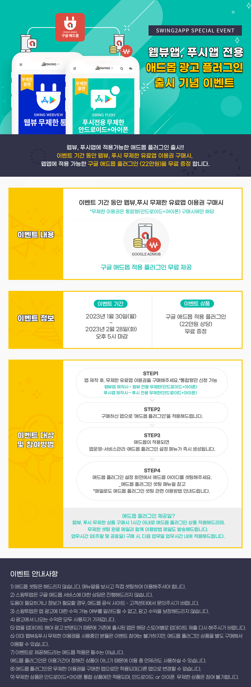
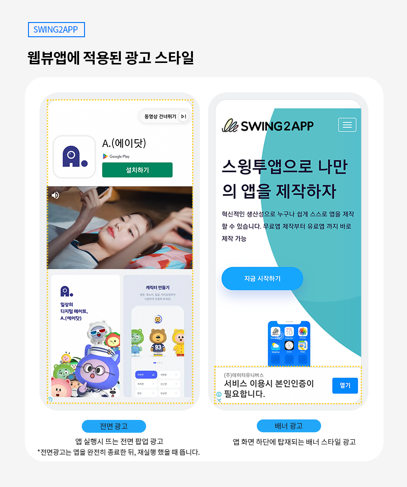

# 이벤트(진행 중)

<figure><figcaption></figcaption></figure>

웹뷰, 푸시앱에 적용가능한 애드몹 플러그인 출시 기념!!

이벤트 기간 동안 웹뷰, 푸시 무제한 유료앱 이용권 구매시, 웹앱에 적용 가능한 구글 애드몹 플러그인 (22만원)을 무료 증정합니다.

☞ [구글 애드몹 플러그인이란?](https://wp.swing2app.co.kr/admob/)

이벤트 상세 내용을 확인하시어 많은 참여 부탁드립니다\

<figure><figcaption></figcaption></figure>

<mark style="color:blue;">**▶이벤트 내용**</mark>

웹뷰 무제한&푸시 무제한 이용권 구매시 → 구글 애드몹 적용 플러그인(22만원) 무료 제공

​

<mark style="color:blue;">**▶이벤트 대상**</mark>

이벤트 기간 동안 \*웹뷰 무제한 유료앱, 푸시 무제한 유료앱 상품을 구매한 분들

\*무제한 이용권은 통합형(안드로이드+아이폰) 구매시에만 해당됩니다.

​

<mark style="color:blue;">**▶이벤트 기간**</mark>

2023년 1월 30일(월) \~ 2023년 2월 28일(화) 오후 5시 마감

​

<mark style="color:blue;">**▶이벤트 신청방법**</mark>

1\)앱 제작 후, 무제한 유료앱 이용권을 구매해주세요. [\[무제한 이용권 추천 페이지\]](http://www.swing2app.co.kr/view/payment\_list\_by\_recommend\_voucher)

**-웹뷰앱 제작시**&#x20;

→ 웹뷰 무제한 유료앱(안드로이드+아이폰)+플레이스토어+앱스토어 업로드티켓 포함 = 330,000원

**-푸시앱 제작시**&#x20;

→ 푸시 무제한 유료앱(안드로이드+아이폰)+플레이스토어+앱스토어 업로드티켓 포함 = 580,000원

2\)구매하신 앱으로 ‘애드몹 플러그인’을 적용해드립니다.

3\)애드몹이 적용되면 앱운영-서비스관리–애드몹 플러그인 설정 메뉴가 즉시 생성됩니다. (해당 페이지는 애드몹이 적용된 사용자분들에게만 보입니다.)

4\)애드몹 플러그인 설정 화면에서 애드몹 아이디 및 광고를 셋팅하여 이용 가능합니다.

&#x20;☞ [애드몹 플러그인 광고 셋팅방법 보러가기](https://documentation.swing2app.co.kr/knowledgebase/admob/admob-apply)

\*메일로도 애드몹 플러그인 셋팅 관련 이용방법 안내드립니다.

​

<mark style="color:blue;">**▶애드몹 플러그인 적용일**</mark>

웹뷰, 푸시 무제한 상품 구매시 1시간 이내로 애드몹 플러그인 상품 적용해드리며, 무제한 셋팅 완료 메일과 함께 이용방법 메일도 발송해드립니다.

업무시간 외(주말 및 공휴일) 구매 시, 다음 업무일 업무시간내에 적용해드립니다.

​

<mark style="color:blue;">**▶안내사항**</mark>

**☞** [**구글 애드몹 플러그인이란?**](https://wp.swing2app.co.kr/admob/)****

1\) 애드몹 무료 증정 이벤트에 참여 가능한 대상은 ‘무제한 안드로이드+아이폰 통합 상품입니다.

안드로이드 or 아이폰 단일 상품에 대한 무제한이용권 구매는 참여 불가합니다.

2\)애드몹 셋팅은 해드리지 않습니다. 매뉴얼을 보시고 직접 셋팅하여 이용해주셔야 합니다.

3\)스윙투앱은 구글 애드몹 서비스에 대한 상담은 진행해드리지 않습니다.

도움이 필요하거나 정보가 필요할 경우, 애드몹 공식 사이트 - 고객센터에서 문의주시기 바랍니다.

4\)스윙투앱은 앱 광고에 대한 수익 가능 여부를 알려드릴 수 없고, 광고 수익을 보장해드리지 않습니다.

5\)광고에서 나오는 수익은 모두 사용자가 가져갑니다.

6\)앱을 업데이트 해야 광고 반영되기 때문에 기존에 출시된 앱은 해당 스토어별로 업데이트 제출 다시 해주시기 바랍니다.

7\)이미 웹뷰&푸시 무제한 이용권을 사용중인 분들은 이벤트 참여는 불가하지만, 애드몹 플러그인 상품을 별도 구매해서 이용할 수 있습니다.

8\)이벤트로 제공해드리는 애드몹 적용은 필수는 아닙니다.

애드몹 플러그인은 이용기간이 정해진 상품이 아니기 때문에 이용 중 언제라도 사용하실 수 있습니다.

9\)애드몹 플러그인은 무제한 이용권을 구매한 앱으로만 적용되며, 다른 앱으로 변경할 수 없습니다.

​

<mark style="color:blue;">**▶광고가 적용된 웹뷰앱**</mark>

<figure><figcaption></figcaption></figure>

웹뷰앱 혹은 푸시앱 제작을 희망하시고, 광고 플랫폼 적용을 원하신다면!

이벤트 기간 내에 상품을 구매해주세요.

무료로 애드몹 광고 서비스를 이용할 수 있습니다.

스윙투앱 사용자분들의 많은 참여 부탁드립니다.

