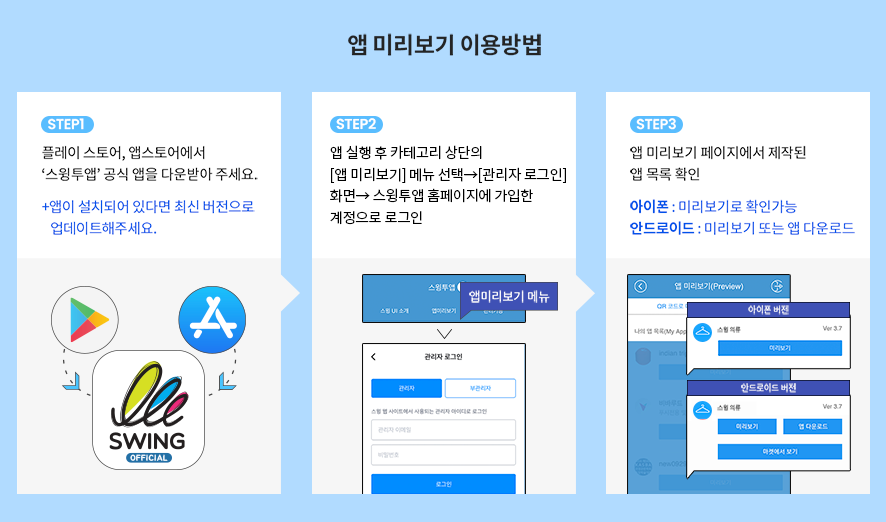
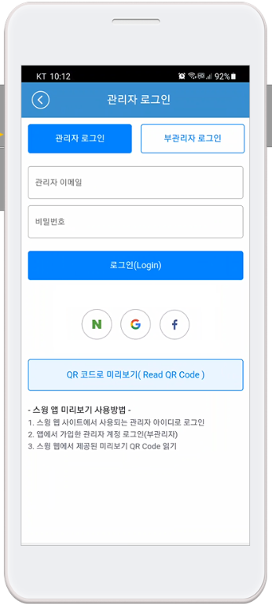

# 앱 미리보기 FAQ

<strong>스윙미리보기(앱미리보기)란?</strong>

스윙 미리보기는 스윙투앱에서 제작한 앱을 실시간으로 확인할 수 있는 \[앱미리보기]서비스입니다.

스윙투앱 공식앱을 다운받은 뒤 – 앱미리보기 메뉴에서 – 스윙홈페이지에서 가입하신 계정으로 로그인해주세요.

앱 미리보기 페이지에서 스윙투앱에서 제작한 모든 앱 목록을 확인할 수 있어요.

앱 내에서 미리보기, 다운로드하여 핸드폰에서 직접 확인할 수 있습니다.

번거롭게 APK파일을 받아서 설치하지 않아도, 내가 제작한 앱을 실시간으로 확인할 수 있습니다!

\*특히 그동안 지원되지 않았던 아이폰에서도 앱 미리보기가 가능합니다. (다운은 안되요\~!)

★스윙 미리보기에 대한 상세 설명은 관련 매뉴얼을 확인해주시기 바랍니다.

**☞** [**스윙 미리보기 서비스란?**](https://wp.swing2app.co.kr/swing-preview/)

**☞** [**스윙 미리보기 이용방법 보러가기**](https://wp.swing2app.co.kr/documentation/swingpreview/)

<strong>스윙 미리보기는 어떻게 이용할 수 있나요?</strong>

1\)앱스토어, 플레이스토어에서 ‘스윙투앱’ 공식앱을 다운받아주세요. \*앱이 이미 설치가 되어 있다면 최신버전으로 업데이트 받아주세요

2\) 앱 실행 후 → 카테고리 상단에 \[앱미리보기] 메뉴를 선택한 뒤 스윙웹사이트 가입 계정(아이디, 비밀번호)으로 로그인해주세요.

3\) 로그인이 완료되면 앱 미리보기 페이지가 열리며, 제작한 앱 목록을 확인할 수 있습니다.

\-아이폰은 미리보기 버튼을 눌러서 확인이 가능합니다.

\-안드로이드폰에서는 앱미리보기, 앱 다운로드 모두 가능합니다.&#x20;

<strong>앱 부관리자도 앱미리보기를 이용할 수 있나요?</strong>

네 부관리자도 앱미리보기에서 로그인하여 앱을 확인할 수 있습니다.

로그인을 할 때는 **부관리자 아이디, 비밀번호, 앱 아이디**를 입력하시고, \[부관리자 로그인] 버튼을 선택하면 로그인 됩니다.

여기서! 아이디와 비밀번호는 앱에 가입된 아이디, 비밀번호를 넣어주시구요.

**앱 아이디는 스윙 앱제작 페이지 → 1단계 기본정보에 보시면, 앱 아이디를 확인할 수 있습니다.​**

스윙투 웹사이트에서 부관리자 로그인하는 방법과 동일하게!

부관리자 아이디, 비밀번호, 앱 아이디를 입력해서 로그인할 수 있습니다.

**\* 이미지 참고)**

**앱 부관리자 설정 방법, 로그인하는 방법은 아래 매뉴얼을 참고해주세요!**

 [**스윙미리보기 상세방법 매뉴얼 확인하기**](https://wp.swing2app.co.kr/documentation/swingpreview/)

<strong>미리보기에서 제공되는 QR코드는 어떻게 사용하나요?</strong>

앱 미리보기 페이지에서 ‘QR 코드로 미리보기’ 메뉴를 확인할 수 있는데요.

해당 메뉴는 관리자로 로그인하지 않아도! **앱마다 제공되는 QR코드를 스캔하여 핸드폰에서 앱을 미리볼 수 있습니다.**

QR코드 미리보기는 일반 프로토타입으로 제작한 앱만 이용이 가능합니다. \*웹뷰, 푸시앱으로 제작한 앱은 이용 불가

**★ QR코드 이용방법**

스윙투앱 앱 실행 – 앱 미리보기 – \[QR코드로 미리보기] 버튼 선택 → 핸드폰을 해당 QR코드 이미지에 가져다 대면 제작한 앱이 핸드폰에서 미리보기로 실행됩니다.

<strong>[미리보기]로 볼 때는 푸시 알림 발송이 안되나요?</strong>

네 , 앱 다운이 아니라 미리보기로 앱을 보실 때는 푸시 알림이 발송되지 않습니다.

푸시 외에도 공유기능을 이용할 수 없습니다.

(앱 공유, 게시판, 게시물, 이미지 공유 모두 안되요)

★아이폰 사용자들은 \*미리보기만 가능하기 때문에 해당 기능을 사용할 수 없음에 양해부탁드립니다.

★안드로이드 사용자들은 앱 다운로드를 선택하면, 다운 받은 앱에서는 스윙의 모든 기능을 이용할 수 있습니다.

<strong>미리보기, 앱 다운로드의 차이가 무엇인가요?</strong>

스윙투앱 공식앱 – \[앱미리보기] 에서 스윙 계정으로 로그인을 하면, 제작한 앱목록이 뜨구요.

앱이름 하단에 **\[미리보기], \[앱 다운로드]** 버튼을 확인할 수 있습니다.

**\* 미리보기: 앱을 다운 받지 않고, 핸드폰에서 앱을 미리보기 형식으로 바로 확인할 수 있습니다.**

**\* 앱 다운로드: 앱을 핸드폰에 직접 다운 받아 설치하여 이용합니다.**

<strong>프로토타입: 푸시, 웹뷰로 제작한 앱도 스윙미리보기에서 확인할 수 있나요?</strong>나요?

안드로이드폰에서는 \[앱 다운로드]로 확인이 가능하며, **아이폰에서는 확인할 수 없습니다.**

\-안드로이드폰 프로토타입 – 푸시, 웹뷰로 제작한 앱은 스윙미리보기 \[앱 다운로드]만 가능합니다.

미리보기는 지원되지 않으며, 핸드폰에 앱을 다운받아야만 확인할 수 있습니다.

\-아이폰에서는 푸시, 웹뷰로 제작한 앱은 목록에 뜨지 않습니다.

아이폰은 앱 미리보기만 이용 가능한가요?

네 아이폰의 경우 앱 다운로드는 지원되지 않고, \[미리보기]를 통해서 앱을 확인할 수 있습니다.

앱미리보기 페이지에서 동일하게 스윙 계정: 관리자 아이디, 비밀번호로 로그인하면 제작한 앱목록을 확인할 수 있습니다.

**\*프로토타입: 푸시, 웹뷰로 제작한 앱은 스윙 미리보기로 이용할 수 없습니다.**

푸시, 웹뷰로 제작한 앱은 앱 다운로드만 가능하기 때문에 아이폰에서 지원이 안됩니다.

&#x20;

**\[아이폰 – 스윙미리보기 어플 실행화면]**\

앱 미리보기를 이용하지 않고, APK파일을 받아 앱 다운이 가능한가요?

&#x20;안드로이드폰 기존 앱 설치방법 – APK파일을 다운받아 설치하여 이용할 수 있습니다.

스윙미리보기를 이용하지 않고, 앱제작 시 완성되는 APK파일을 다운 받아 핸드폰에 직접 설치하여 이용할 수 있습니다.

기존 앱설치 방법과 스윙 미리보기를 함께 이용하실 수 있으니, 이용에 참고 부탁드립니다.

**\*APK파일 다운은 안드로이드폰만 가능**

간편 로그인으로 스윙투앱 홈페이지를 가입한 사용자는 앱 미리보기에서 어떻게 로그인하나요?

스윙투앱 가입시 간편로그인으로 진행하셨던 분들은 네이버, 구글, 페이스북 아이콘을 선택해서 로그인을 진행해주세요.

**\*아이폰은 간편 로그인 기능이 제공되지 않습니다.**

간편로그인 사용자는 안드로이드폰을 이용하시거나, 아이폰 이용시 부관리자 로그인 or  QR코드로 미리보기 기능으로 이용해주세요.

앱 미리보기에 로그인했으나, 제작된 앱 목록이 없습니다.

&#x20;제작 완료된 앱만 미리보기 목록에 뜹니다.

따라서 리스트에 앱이 없다면, 아직 앱이 제작되지 않았을 가능성이 큽니다.

아직 앱제작을 안했다면 \[앱 제작하기] 버튼을 눌러서 제작을 해주시구요.

\[앱 제작하기]를 눌렀다면 버전관리에서 제작이 완료되었다는 상태표시를 확인하고 다시 접속해주세요. (제작시간 5분\~10분 소요)

