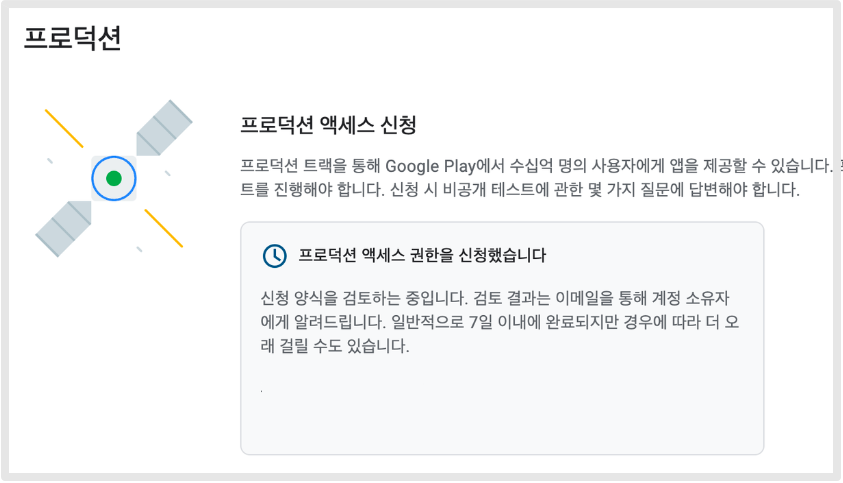

# 비공개 테스트 FAQ

***

구글 개인 개발자 계정 정책 내용을 자세히 알려주세요.

1\)신규 개발자는 프로덕션에 앱 게시를 바로 할 수 없습니다.

2\)앱은 비공개 테스트 등록으로 제출하고 20여명의 테스트 계정을 연결 해주셔야 합니다.

3\)테스트는 14일간 진행되어야 합니다.

4\)20명의 테스트, 14일 기간이 종료된 후 프로덕션으로 전환하여 앱 제출을 요청할 수 있습니다.

어떤 개인 개발자 계정은 바로 앱 등록이 가능하던데, 기준일이 있나요?

계정 앱 등록 여부 기준일은 2023년 11월 입니다.

23년 11월 이전에 생성한 개인 개발자 계정은 프로덕션 앱 등록(출시)이 가능하구요.

23년 11월 이후에 생성한 개인 개발자 계정은 프로덕션 앱 등록 불가하며, 테스트 등록 후 프로덕션으로 전환하여 앱을 출시하게 됩니다.

계정 내에 여러 앱 등록은 가능한가요?(앱 개수 제한)

네 계정 내 앱 개수 제한은 없습니다.

프로덕션 즉시 출시만 안 되는 것일 뿐, 앱 등록은 개수 제한 없이 이용 가능합니다.

테스트 등록에서 앱 등록 후, 테스터만 등록하면 되는건가요?

그렇지 않습니다.

플레이스토에서 제공하는 앱의 기본정보(기본스토어 등록정보, 스토어 설정, 앱 콘텐츠 등)들은 동일하게 입력하고, 마지막 단계에 테스트 등록을 합니다.

앱 등록만 하는 것이 아니라, 플레이스토어에 제공되는 항목들 역시 동일하게 입력을 완료해주셔야 합니다.

실제 출시만 안되는 것일 뿐, 비공개 테스트도 구글에 심사를 받는 것은 동일하기 때문에 모든 정보들은 출시하는 것처럼 성실히 입력해주셔야 해요.

비공개 테스트 등록방법은 매뉴얼을 확인해주세요!

20명의 테스터는 어떻게 모집하나요?

본인 계정, 가족 계정, 친구들 계정을 함께 등록할 수 있습니다. \*물론 계정만 등록해서는 안되고, 실제 해당 계정으로 로그인 된

최근 카톡 오픈 채팅방에서는 품앗이처럼 서로 앱을 다운 받아주는 채팅방도 생겼다고 하구요.

크몽에서도 조회하면 비싸지 않은 금액으로 테스터를 모집해준다는 글을 볼 수 있어요.

테스터가 앱만 설치하면 되는지 다른 작업이 필요한지 궁금해요.

초대된 링크로 접속하여, 앱을 설치 하구요.

전반적으로 앱 화면 및 메뉴들을 훑어볼 수 있도록 해주세요.

로그인 기능이 있다면 회원가입 후 로그인도 진행해주셔야 합니다.

\*아무것도 안하고 설치만 했는데 통과 되었다는 분들도 있으나 구글의 검토 로직을 봤을 때 앱 실행 후, 앱에 머무는 시간도 집계가 되는 것으로 확인됩니다.

따라서 처음에는 어느 정도 앱 화면을 열어놓은 뒤 종료해주시기 바랍니다.

그 외에는 다른 작업은 하지 않아도 됩니다.

14일간 앱을 유지해야 한다는게 무슨 말인가요?

매일 매일 앱을 실행해서 이용해야 하는지 궁금하실 텐데요.

적어도 본인의 기기에서는 매일 들어가서 앱을 이용해주시는 것이 좋습니다.

저희가 테스트 및 사용자들 테스트를 종합적으로 판단했을 때 꼭 매일 실행하지 않아도 통과가 되었구요.

구글에서 말하는 공식 입장은) 14일간 기기에서 앱이 삭제되지 않아야 한다는 것입니다.

따라서 앱을 설치하고 14일간 설치한 앱을 삭제하지 않고 설치된 기기에 유지만 해주시면됩니다.

\*앱 내에 로그인 기능이 있다면 로그인을 한 상태에서 유지해주세요.

비공개 테스트? 내부 테스트? 어떤걸 해야 하는건가요?

비공개 테스트와 내부 테스트 목적은 전혀 다릅니다.

우선, 구글 개인 개발자 프로덕션 등록을 위해서는 반드시 ‘비공개 테스트’ 로 등록을 해주셔야 하구요.

다른 것 볼 것 없이 ‘비공개’에만 집중해주세요.

내부 테스트란, 플레이스토어 검수와는 관계없이 테스트용도로 앱을 핸드폰에 설치받아 확인하고자 할 때 이용할 수 있습니다.

즉, 내부테스트는 말 그대로 개발자가 앱을 확인하기 위한 용도로 이용 플레이스토어 검토가 들어가지 않기 때문에 등록시 별도의 검수 시간 없이 1시간 내로 바로 앱을 다운 받을 수 있습니다.

선택사항이며 진행하지 않아도 전\~혀 관계 없습니다.

비공개 테스트 등록(앱등록, 테스터 등록) 모두 끝냈습니다. 그럼 등록한 날부터 바로 앱을 다운 받고 테스트를 할 수 있나요?

비공개 테스트는 앱 검토(심사)가 들어갑니다.

프로덕션 출시가 아니지만 이 앱이 정책상, 기술적으로 문제가 없는지 정책팀이 먼저 앱을 심사 하구요.

문제가 없다고 판단되면 “승인”으로 바뀌고, 그때 앱을 다운 받을 수 있어요.

심사는 문제가 없고 바로 출시되는 가정하에 빠르면 4일 이내, 주말이나 공휴일이 끼면 7일이 넘어가는 경우도 많아요.

즉, 비공개 테스트도 심사(검토)기간이 들어가며 검토 후 문제가 없어야 테스트를 시작할 수 있습니다.

개인 개발자 계정에서 조직 개발자 계정으로 전환 할 수 있나요?

계정 유형 전환은 불가합니다.

어쩔 수 없이 조직용으로 계정을 새로 하나 등록해야 합니다.

만약 개인 개발자 계정에 등록된 앱이 아직 없다면 계정 등록비 환불을 요청할 수 있습니다.

정책지원팀을 통해 문의 남겨 주시면 환불을 받을 수 있으니 참고해주세요.

비공개 테스트 20일이 끝나면(임무 완수!)다음은 어떤 작업을 해야 하나요?

구글에서 제시한 테스트 진행 임무가 완수되면 메일을 발송하구요.

사용자분의 구글 개발자 콘솔 대시보드에서도 진행 및 완료된 내용을 확인할 수 있습니다.

이때 “프로덕션 액세스 신청” 을 진행해주세요 라는 메일이 옵니다.

해당 메일을 받고 구글 플레이 콘솔 – 앱 선택 – 왼쪽 메뉴 “프로덕션” 선택해주세요.

여기에 앱 파일을 다시 업로드 한 뒤 제출해주세요.

비공개 테스트 전까지는 프로덕션 페이지가 오픈이 되지 않구요,

비로소 테스트가 완료되어야 프로덕션 페이지가 열리니 모든 과정은 구글의 메일을 받은 뒤 확인해주세요.

프로덕션에 등록하면 이제 바로 플레이스토어에 앱이 출시(배포)가 되나요?

그렇지 않습니다. 다시 심사가 들어갑니다.

구글은 7일 이내 공지하고 있구요. 주말이나 공휴일이 끼지 않으면 빠르면 3-4일 이내 출시가 됩니다.

테스트/프로덕션을 담당하는 정책팀이 다르기 때문에 테스트에서는 문제가 없었던 내용이 프로덕션 심사에서는 정책 위반으로 심사가 거절될 수 있어요.

따라서 프로덕션 출시에도 심사를 기다려 주셔야 하고, 거절이 될 경우 조치를 다시 해주셔야 합니다.

비공개 테스트를 하고, 프로덕션에 최종적으로 출시되기까지 총 얼마나 걸릴까요? (소요시간)

스윙투앱 사용자분들 사례로 말씀드리면요.

짧게는 22일, 길게는 40일 정도 걸렸다고 해요.

테스트 기간 14일만 있는 것이 아니라 앱을 등록하고, 테스터를 모집하고 테스트 심사 진행, 프로덕션 심사까지 진행해야 하기 때문에 해당 시간만큼이 소요됩니다.

플레이스토어 앱 출시에 위의 시간이 소요되기 때문에 회사 혹은 프로젝트, 영업용으로 앱 출시를 준비한다면 해당 기간을 염두해두고 진행해주세요.

물론 회사라면 처음부터 “조직” 개발자 계정을 만드는 것을 추천드리구요!!

한 개 앱이 테스트 후 프로덕션 출시 되었습니다. 다른 앱을 등록할 때도, 테스트 등록을 또 거쳐야 하나요?

네 다른 앱을 등록하실 때에도 동일하게 비공개 테스트 진행 후 프로덕션 출시 방법으로 진행해주셔야 합니다.

앱 개수 관계 없이, 개인 개발자 계정에서는 앱 등록시 무조건 테스트 등록으로만 이용 가능합니다.



프로덕션 출시 후, 앱 업데이트는 자유롭게 할 수 있나요?

네 업데이트 자유롭게 할 수 있습니다.&#x20;

비공개 테스트 중에도 업데이트는 제한 없이 이용 가능합니다.

비공개 테스트 승인이 거절되는 경우는 어떠한 사례가 있나요?

1\)20명의 테스터가 모두 앱을 설치 하지 않았을 경우입니다.

즉, 테스트가 시작되면 테스터로 등록된 사용자들이 모두 앱을 기기에 설치해주셔야 하는데요.

초대는 되었으나, 실제 핸드폰에 앱을 설치하지 않았을 경우 20명을 다 채우지 못해 승인이 거절됩니다.

2\)처음에는 20명이 다 설치를 했으나, 테스터가 앱을 삭제 하여 14일을 채우지 못하는 경우도 있습니다.

3\)앱 설치를 했으나, 앱을 실행하지 않아 조건을 충족하지 않은 경우 입니다.

구글에서 제시한 조건을 다 채우지 않을 경우 비공개 테스트 승인이 거절되어, 프로덕션으로 제출을 할 수 없게 됩니다.

