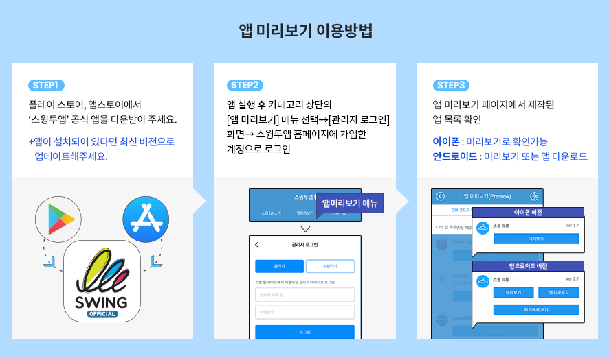

# 가장 많이 묻는 질문 FAQ

유료버전과무료버전의 차이점은?

**1)첫 번째는&#x20;**<mark style="color:red;">**\*중요\***</mark>**&#x20;스토어 배포(앱스토어, 플레이스토어 앱 출시)입니다.**

-무료는 개인적인 용도로만 이용가능하며 스토어 출시가 불가한 버전입니다.(안드로이드폰 설치 파일로만 사용 가능)

-유료버전은 플레이스토어, 앱스토어 등의 스토어 배포가 가능하기 때문에 스토어에 제작한 앱을 출시할 수 있습니다.

**2)두 번째는 용량의 차이가 있습니다.**

무료 버전은 기본 100MB 제공, 유료버전은 2GB에서 상품유형에 따라 50GB까지 제공됩니다.

**3)세번째는 게시판 제작 개수 및 그룹 채팅방 개설 수에 차이가 있습니다.**

무료 버전은 게시판 제작 수 30개, 그룹 채팅방은 1개 제작이 가능합니다.

유료버전은 게시판 제작 100개에서 \~ 무제한(상품유형에 따라), 그룹 채팅방은 5개\~무제한(상품유형에 따라)까지 제작 가능합니다,

**4)마지막으로 앱제작 갯수가 다릅니다.​**

유료이용자는 한 계정당 앱을 10개까지 만들 수 있으며, 무료이용자는 한 계정당 앱을 3개까지 만들 수 있습니다.

하지만 무료버전도 대부분의 기능은 사용할 수 있으니, 무료로 충분히 사용해보시고 필요할 경우 유료로 전환하세요^^

상세 내용은 스윙투앱 서비스 정책을 확인해주세요.

**☞** [**스윙투앱 서비스 이용방법**](https://documentation.swing2app.co.kr/swing2app-guide)

<strong>스토어마다 앱이 출시되는 시간을 알려주세요.</strong>

**\[앱스토어]**

앱스토어 심사 기간 7일 소요

심사에서 문제가 없을 경우는 7일 내로 출시가 되지만 심사가 거절되는 경우가 많기 때문에 출시일은 더욱 늦어질 수 있습니다.

따라서 충분한 시간적 여유를 두고 신청해주시고, 앱 거절 사유 피드백을 반드시 확인해주시기 바랍니다.

**\[플레이스토어]**

플레이스토어 심사기간 7일 소요&#x20;

심사시 문제가 없을 경우 위의 심사 기간 후에 바로 출시가 되지만, 플레이스토어도 심사가 거절 될 경우 출시일을 더 늦어질 수 있습니다.

시간 여유를 두시고 신청해주세요.

<strong>스토어 업로드 대행은 무엇인가요?</strong>

유료버전의 앱(유료앱 이용권을 결제한 앱)은 플레이스토어, 앱스토어 등의 스토어에 출시하여 상용화 할 수 있게 됩니다.

이때 스토어에 직접 출시가 어려운 분들은 스윙으로 업로드 대행 신청을 할 수 있구요.

스윙투앱에서 대신하여 사용자분의 앱을 스토어에 올려드립니다.

**즉, 사용자분이 제작한 앱을 스토어에 대신 올려드리는 것을 업로드 대행이라고 합니다.**

따라서 **업로드 대행을 요청할 경우** [**스윙 결제 – 스윙 이용권, 티켓 구매 페이지**](http://www.swing2app.co.kr/view/shop_list)[**에서** ](http://www.swing2app.co.kr/view/shop_list)**\[앱스토어 업로드 티켓 20,000원], \[플레이스토어 업로드 티켓 20,000원]을 구매해서 신청해주시면 됩니다.**

구매 후 업로드 신청을 해주셔야 신청이 완료됩니다.

[**버전관리→앱제작이력 메뉴**](http://www.swing2app.co.kr/view/app_work_history)**로 이동한 뒤, 마켓등록란에 있는 \[플레이스토어 업로드 신청] or \[앱스토어 업로드 신청]버튼을 선택합니다.**

\*플레이스토어는 사용자 개인이 업로드가 가능하므로 직접 올릴 수 있는 경우 업로드 티켓을 구매하지 않으셔도 됩니다.

\*앱스토어는 사용자가 직접 올릴 수 없으며 반드시 업로드 대행으로만 출시가 가능합니다.

<strong>유료 이용권은 언제부터 이용 일수가 카운팅 되나요?</strong>

유료 이용권은 이용권을 **결제한 날부터 일수가 카운팅됩니다.**

예를 들어 3월 4일에 결제를 했다면 4일부터 이용기간이 시작되는 것이지요.

**스토에 앱을 올려야 할 경우, 앱제작이 완료 된 후에 유료이용권과 업로드 티켓을 구매해주세요.**

<strong>플레이스토어에 등록할 수 있는 AAB파일은 어떻게 받을 수 있나요?</strong>

AAB파일은 무료버전앱에서는 제공되지 않으며, 유료앱 이용권을 구매한 유료버전앱에서만 제공됩니다.

(무료버전앱 사용자는 APK파일로만 제공)

스윙투앱에서 제공하는 유료앱 이용권 구매 후 앱 업데이트를 한번 더 해주세요. \*앱제작에서 \[앱 업데이트 버튼] 선택

제작이 완료되면, 앱운영→ 버전관리→ 앱제작이력 페이지에 AAB파일 받기 버튼이 생성됩니다.

<strong>이용기간 만료 후 한참 뒤 이용권을 다시 구매해도 앱은 정상 이용 가능한가요?</strong>

네 이용기간이 만료되어도 앱이 삭제되는 것은 아니기 때문에 나중에 구매하셔도 됩니다.

앱은 무료버전으로 전환됩니다.

<mark style="color:red;">\*무료버전 전환시 앱스토어, 플레이스토어에서 앱을 다운 받은 사용자는 앱 이용이 불가함</mark>

나중에 다시 이용권을 구매하시면 앱은 자동 복구되어 정상적으로 이용할 수 있구요.

스토어에서 앱을 다운받았던 사용자들의 앱도 정상 복구됩니다.

다만 앱스토어, 플레이스토어 등의 앱 출시 후에 잘 이용이 되고 있는지 불시 필터링 검사를 합니다.

이때 <mark style="color:red;">앱 이용이 중단되어 있으면 정상적인 앱이 아니라고 판단하여 스토어에서 삭제해버리니, 이용기간이 종료되면 되도록 빨리 이용권을 재구매하여 이용을 연장해주시는 것이 좋습니다.</mark>

스토어에서 앱이 삭제되면 경우에 따라 앱을 다시 복원하는 것이 어려울 수 있으며, 기존 사용자들도 모두 잃게 됩니다.

<strong>스윙투앱 홈페이지 탈퇴는 어떻게 하나요?</strong>

회원탈퇴는 스윙 홈페이지 앱운영 페이지의 오른쪽 상단 프로필 선택 → 내정보 수정 →회원탈퇴 선택해주시면 됩니다.&#x20;

탈퇴하신 아이디는 복구가 불가능하며, 추후 같은 아이디로 재가입 할 수 없습니다.

회원탈퇴시 제작한 앱, 컨텐츠가 모두 삭제되오니 신중하게 선택하시기 바랍니다.

<strong>앱 관리자는 어떻게 설정하나요?</strong>

앱을 제작한 제작자라도 **관리자로 등급을 변경해주셔야만 관리자 권한으로 앱을 이용**할 수 있습니다.

**\[앱 관리자 설정방법]**

1.앱에서 회원가입 먼저 해주세요.

2.스윙 홈페이지에서 → 앱운영페이지 →푸시&회원 → 회원조회 페이지 이동 합니다.

3.회원조회 페이지에서 관리자로 변경할 해당 회원을 선택 후 → 현재 그룹 정보의 ‘사용자’에서 → ‘관리자’로 선택한 뒤 \[그룹변경하기] 버튼을 선택합니다.

+변경하기를 완료하면 관리자 등급 변경 완료됩니다. \~!!

☞ [**앱 관리자 설정방법 확인하기**](https://documentation.swing2app.co.kr/manual/appmanage/pushmember/appmaster)

<strong>제작한 앱을 삭제할 수 있나요?</strong>

네, 제작한 앱을 직접 삭제 할 수 있습니다.&#x20;

앱제거는 [**앱운영 페이지 → 내메뉴 → \[보유앱관리\]**](http://www.swing2app.co.kr/view/app_stat) 페이지로 가시면 **\[앱제거]** 버튼이 있어요.

해당 버튼을 선택해서 앱을 삭제할 수 있어요.

<mark style="color:red;">**\[주의사항]**</mark>

\* 제작한 앱이 2개 이상일 때 삭제할 수 있어요.

\*삭제된 앱은 다시 복원되지 않으니 신중히 생각해서 진행해주세요.

\*유료이용자분들은 유료기간이 끝나기 전까지 앱이 제거되지 않도록 해놓았으니 유념해주세요.

<strong>제작한 앱은 어떻게 다운 받아 확인하나요?</strong>

\*제작한 앱을 핸드폰에 다운 받아 확인할 수 있는 방법은 2가지 입니다.

\*안드로이드폰은 핸드폰에서 앱을 설치하여 확인 가능하며, 아이폰에서는 미리보기로 이용 가능합니다.

**1) 앱미리보기 확인**

앱스토어, 플레이스토어에서 \[스윙투앱] 공식앱을 다운 받아주세요.

앱 실행 후 → 카테고리 상단 \[앱 미리보기] 메뉴 선택 → 관리자 로그인 창에서 스윙투앱에 가입하신 계정으로 로그인해주세요.

앱 미리보기에서 스윙투앱에서 제작한 앱 목록을 확인할 수 있습니다.

**-아이폰: 미리보기 버튼을 눌러서 확인 가능**

**-안드로이드 : 미리보기 or 앱 다운로드 확인 가능**

\*아이폰은 미리보기만 되고 다운은 되지 않으니 유의해주세요.&#x20;

(푸시, 웹뷰로 제작한 앱은 아이폰에서는 확인 할 수 없습니다)

**2) 안드로이드폰 APK파일 설치 \*안드로이드폰에서만 가능**

앱제작요청을 하시면 사용자로 메일로 APK파일이 발송됩니다.

핸드폰으로 APK 파일을 다운받아서 앱을 설치할 수 있구요.

스윙 [앱운영 페이지 → 버전관리 →앱제작이](https://www.swing2app.co.kr/view/app_work_history)력 에서도 APK파일을 다운받을 수 있습니다.

<strong>아이폰은 무료 버전앱을 설치할 수 없나요?</strong>

네 아이폰은 무료버전앱 설치 및 다운이 불가합니다.

스윙투앱에서 제작한 무료버전의 앱은 안드로이드폰에서만 다운받아 설치할 수 있습니다.

**아이폰은 애플 정책상 공식 앱스토에서 다운 받은 앱만 이용할 수 있습니다.**

**유료앱 이용권을 구매한 유료버전앱이라도, 앱스토어에 출시하지 않으면 앱 이용이 불가합니다.**

**-일반 프로토타입으로 제작하셨다면, 아이폰 앱 미리보기로 앱을 확인할 수 있습니다.**

\* 미리보기 제공, 앱설치 용도가 아닙니다

**\[스윙 미리보기 이용 방법]**

1\)앱스토어에서 \[스윙투앱] 공식앱을 다운 받아주세요.

2\)앱 실행 후 → 카테고리 상단 \[앱 미리보기] 메뉴 선택 → 관리자 로그인 창에서 스윙투앱에 가입하신 계정으로 로그인해주세요.

3\)앱 미리보기에서 스윙투앱에서 제작한 앱 목록을 확인할 수 있습니다.

\*단 프로토타입- 푸시, 웹뷰로 제작된 앱은 스윙 미리보기로 확인할 수 없습니다.

\*웹사이트를 연결한 웹앱- 웹뷰, 푸시앱은 웹앱브라우저 어플을 이용해 확인해주세요.

[스윙투앱 브라우저 앱 이용방법](https://documentation.swing2app.co.kr/manual/webappconverter)

<strong>앱제작 후 수정 및 업데이트는 어떻게 하나요?</strong>

스윙투앱은 앱 수정 및 업데이트 제한이 없으며 자유롭게 컨텐츠를 수정하여 이용할 수 있습니다.

앱 컨텐츠를 수정(업데이트)하는 작업 페이지가 따로 있는 것이 아니기 때문에, 수정을 할 때도 동일하게 \[앱제작 페이지]로 들어가서 진행해주세요.

기존에 제작된 앱에 덮어서 업데이트를 계속 하실 수 있구요.

저장한 후 \[**앱 업데이트**] 버튼을 누르면 새 버전으로 다시 업데이트되어 재제작이 됩니다.

<strong>앱 이용 중 기본 제공 용량이 초과되면 어떻게 되나요?</strong>

**용량이 초과되면, 용량 초과일 기준 3일 이후에는 앱 이용이 정지됩니다.**

**\*용량이 초과되면 메일, 문자로 알려드립니다. (문자메시지는 번호 등록시에만 발송)**

용량초과로 인한 앱 정지는 이용기간이 만료되는 것과 동일한데요.

앱이 삭제되지는 않지만 앱을 실행 했을때 ‘유료 이용기간이 만료되었습니다.’ 라는 메시지가 뜨며 앱이 자동 정지됩니다.

기존에 마켓에서 앱을 다운받았던 사용자 역시 해당 메시지가 뜨면서 앱 이용이 제한됩니다.

**\*유료 사용자의 경우 용량이 초과되면 유료앱 이용기간이 남아 있어도 앱 이용이 정지되니 주의해주시기 바랍니다.**

따라서 용량이 초과되기 전 부족한 용량만큼을 별도 용량 추가 상품을 구입하여 적용해주시구요.

**☞** [**용량 추가 상품 구매하기**](https://www.swing2app.co.kr/view/new_product_list_by_plugin)

앱운영 페이지 → 서비스관리 → 리소스관리 페이지에서 필요 없는 게시물을 삭제하여 용량을 확보할 수도 있습니다.

**☞** [**리소스관리 이용방법 보러가기**](https://documentation.swing2app.co.kr/manual/appmanage/service/capacity-management)

<strong>유료앱 이용 중 이용기간이 만료되면 어떻게 되나요?</strong>

**유료앱 이용기간 만료 후 다시 이용권을 결제 하지 않으면, 앱 이용이 정지됩니다.**

스토어에 출시된 앱이 삭제되거나 없어지지는 않지만,  **앱을 초기에 실행했을때 ‘이용기간이 만료되었습니다.’ 라는 메시지가 뜨며 앱이 실행되지 않습니다.**

**기존에 스토에서 앱을 다운받았던 사용자 역시 해당 메시지가 뜨면서 앱 이용이 제한됩니다.**

다시 이용권을 결제하시면 해당 메시지가 뜨지 않고, 정상적으로 앱을 다시 이용할 수 있습니다.

**\[이용기간 만료 메시지창]**

다시 무료로 앱을 사용하길 원할 경우 기간 종료 후에 기존에 핸드폰에 설치된 앱을 삭제하고 앱을 새 버전으로 다시 제작해주세요.

유료이용기간이 종료된 이후부터 해당 버전은 무료버전이기 때문에 무료앱으로 사용하실 수 있습니다.

단. 무료앱으로 전환되는 것이기 때문에 스토어 배포는 불가합니다.

<strong>스윙투앱에서 제공하는 기능들은 모두 무료로 이용이 가능한가요?</strong>

**네 무료로 모두 이용하실 수 있습니다.**

스윙투은 앱제작 및 앱운영이 모두 무료로 제공됩니다.

따라서 사용자분들은 이용제한 없이 무료로 모든 기능들을 이용해주시면 됩니다.

<strong>원스토어, 갤럭시스토어는 업로드 대행을 안해주나요? 어떻게 등록하나요?</strong>

네 원스토어와 갤럭시스토어 스윙투앱에서 업로드 대행을 하지 않습니다.

사용자분이 직접 출시 진행해주셔야 합니다.

원스토어, 갤럭시스토어 앱 등록방법은 당사 매뉴얼로도 제공해드리고 있으니 보시면서 진행해주시기 바랍니다.

**☞** [**원스토어 앱 출시 방법 보러가기**](https://documentation.swing2app.co.kr/knowledgebase/onestore/onestore)

**☞**[**갤럭시스토어 앱 출시 방법 보러가기**](https://documentation.swing2app.co.kr/knowledgebase/galaxystore/galaxystore)

<strong>플레이스토어에는 앱을 직접 올리고자 합니다. 어떻게 등록 할 수 있나요?</strong>

앱제작 완료 후, 유료앱 이용권 구매 후 AAB파일을 등록하여 올릴 수 있습니다.

플레이스토어 앱 등록(출시)방법은 매뉴얼로 제공해드리고 있습니다. (플레이스토어 앱 등록에 관련된 상담은 해드리지 않습니다)

매뉴얼 보시면서 진행해주시기 바랍니다.

**☞** [**플레이스토어 앱 출시방법**](https://documentation.swing2app.co.kr/knowledgebase/playstore/playstore-apprelease)

<strong>무료버전앱 공유 기능은 안드로이드폰에서만 가능한가요?</strong>

네 무료버전앱에서의 공유하기(앱 공유, 게시판, 게시물 공유 등)기능은 안드로이드폰에서만 가능합니다.

안드로이드 ↔ 안드로이드 폰으로만 공유가 가능합니다.

아이폰은 무료버전앱 설치가 되지 않기 때문에 공유 기능을 이용할 수 없습니다. 앱스토어에 출시 후 이용 가능합니다.

무료버전앱은 스토어 출시가 불가한가요?

네 스윙투앱에서 제작한 무료버전앱은 상용화가 불가합니다. (개인적인 용도내에서만 이용가능)

따라서 스토어에 출시하는 용도로 이용하실 경우 스윙투앱에서 제공하는 유료앱 이용권을 구매해주셔야 합니다.

유료앱 전환 후, 해당 앱으로 스토어 출시할 수 있습니다.

