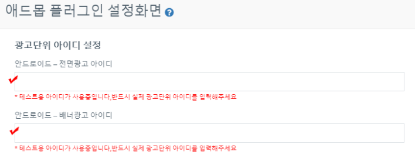
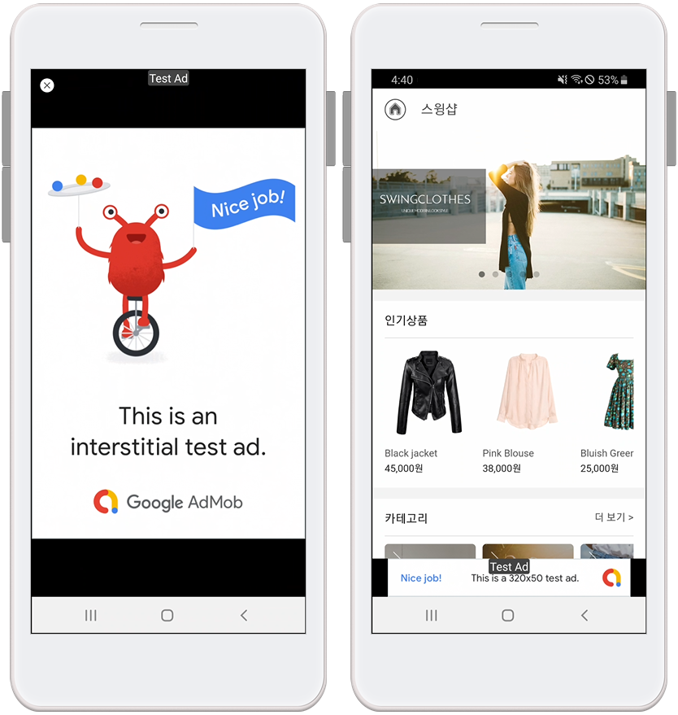

# 애드몹 플러그인 광고 셋팅방법

**애드몹 플러그인 광고 셋팅 방법**

스윙투앱에서 제작한 앱에 구글 애드몹 광고를 적용해서 광고 수익형 앱을 제작할 수 있는데요.

스윙투앱에서 제공하는 구글 애드몹 플러그인 상품을 구매한 뒤, 애드몹 셋팅에 필요한 정보를 입력하면 앱에 광고를 직접 연결할 수 있습니다.

애드몹 셋팅부터 스토어 출시 과정까지 안내드리오니 애드몹 광고 셋팅을 희망하신다면 해당 매뉴얼을 보시고 진행해주시기 바랍니다.


**애드몹 광고 셋팅 순서 정리**

1\) 앱제작 완료

2\) 애드몹 적용 플러그인(22만원)상품 or 애드몹 패키지 상품(580,000원) 결제

<mark style="color:red;">\*애드몹 플러그인 단품 상품 구매시 유료앱 이용권은 광고 적용 후 스토어 출시 전 구매하셔도 되며, 같이 구매하셔도 됩니다.</mark>&#x20;

3\) 애드몹 공식 사이트 가입 → 광고 단위 아이디 만들기, 플랫폼별 앱 아이디 복사

4\)애드몹 플러그인 설정에서 광고 셋팅하기

앱운영 →서비스관리→ 애드몹 플러그인 설정으로 이동

\[광고 단위 아이디 설정], \[광고 노출 패턴 설정]을 입력한 뒤 저장

5\) 광고 셋팅 후 \[앱제작 요청] : 광고 적용된 버전으로 앱 업데이트 하기

6\) 광고 셋팅 완료. 안드로이드폰에서 앱 다운받아 광고가 잘 뜨는지 테스트하기

7\) 유료앱 이용권 구매 안했다면 이용권 구매, 업로드 대행 필요할 경우 업로드티켓 구매

8\)스토어 등록: 플레이스토어, 앱스토어 등 출시를 희망하는 스토어 업로드 진행



**애드몹 광고 중요 안내- 왜 광고가 바로 안뜨나요?**

****

순서대로 광고 아이디를 만들고, 애드몹 플러그인에 광고 아이디 셋팅을 완료한 다음 앱제작 후 앱을 확인했지만 광고가 바로 안뜰 수 있습니다.

&#x20;우선 스토어에 출시되기 전 앱으로 광고를 연결할 경우 검토가 바로 되지 않기 때문에 앱을 플레이스토어 등에 출시한 뒤 부터 앱 검토를 시작합니다.

따라서 앱 광고가 바로 안 뜨는 것이 맞습니다.

**만약 스토어에 출시된 앱으로 광고를 연결한 경우에 광고가 안뜬다면,**&#x20;

애드몹에서 광고를 송출하는데 걸리는 심사 시간도 있지만 <mark style="color:red;">일반적으로 신청한 앱의 이용빈도가 적을 경우 구글에서 광고를 바로 송출을 해주지 않습니다.</mark>&#x20;

<mark style="color:red;">(앱을 이용하는 사용자들이 없다면 광고를 붙여도 수익이 나지 않을 것을 알기 때문에 구글에서 굳이 해당 앱에 바로 광고를 주지 않는 이유입니다.)</mark>

설치 사용자 수, 해당 앱을 사용하는 빈도수 등을 확인한 뒤 광고를 송출하게 됩니다.&#x20;

**=> 구글에서 가이드라인으로 제시한 시간은 2일 이내 길게는 일주일 정도 소요될 수 있습니다.**

****

따라서 광고가 바로 뜨지 않아도 애드몹 적용된 앱은 스토어 출시 및 업데이트를 **** 바로 진행하셔도 됩니다.

스토어 출시도 심사 기간이 있기 때문에 해당 심사 기간 동안 광고가 뜰 수 있구요.

심사 동안 광고가 뜨지 않아도 출시 후 어느 정도 앱 사용을 계속 하시다보면 구글 애드몹에서 광고를 송출해줍니다.

따라서 바로 광고가 안뜬다는 분들은 시간을 가지고 기다려주시고 우선 출시된 앱 홍보릍 통해 많은 사용자들이 이용하도록 해주셔야 광고가 빨리 노출이 됩니다.

**\*그리고!  구글 애드몹 사이트에서 광고 검토를 안했거나, 결제 프로필 미입력 등,,, 입력을 빼먹은 항목이 없는지도 다시 확인해주세요**

**▶** [**애드몹 플러그인 주의사항 확인하기**](https://wp.swing2app.co.kr/knowledgebase/admobplugin-check/)****



****

**애드몹 셋팅 후 앱에서 광고가 잘 연결되었는지 확인하는 방법**

테스트 광고 아이디로 앱에 셋팅을 잘 했는지, 앱 광고가 어떻게 뜨는지 확인할 수 있어요.&#x20;

애드몹 플러그인 설정 화면에서 아이디 입력란에 기재된 아이디를 모두 지우고, 공란으로 두고 저장해주세요.

공란으로 두시면 아래 빨간 메시지로 “테스트용 아이디가 사용중입니다” 라고 표시될 거에요.

해당 메시지가 표시되어야 테스트광고 셋팅이 완료된것입니다.

저장 한 뒤 앱을 다시 실행하시면 테스트 광고가 뜨는 것을 확인할 수 있습니다.  **(앱을 완전히 종료한 뒤, 재실행해주세요)**

****

<mark style="color:orange;">핸드폰 앱 실행) 테스트용 애드몹 광고 화면</mark>

이렇게 앱에서 애드몹 테스트용 광고가 잘 뜬다면 스윙투앱에서 제작한 앱에 애드몹 플러그인 셋팅은 잘 되신거구요.

스윙투앱 서버 자체에서의 문제는 없는 것이기 때문에 다시 사용자분의 광고 아이디로 변경하여 저장해주시면 됩니다.

.PNG>)

### <mark style="color:blue;"></mark> <mark style="color:blue;">****</mark>** 1.앱제작 완료**

애드몹 광고 적용 전 앱제작을 완료해주세요.

\*앱을 100% 완벽하게 제작하지 않아도 됩니다!

우선 광고 셋팅을 먼저 테스트 해보고 싶으시다면 어느 정도 만들어놓은 뒤 진행하셔도 되요.

앱은 나중에도 계속 수정 및 업데이트 가능하기 때문에 광고를 적용해도 계속 수정하여 사용가능합니다.

.PNG>)

### <mark style="color:blue;"></mark> <mark style="color:blue;">****</mark>** 2. 애드몹 플러그인 상품 or 패키지 상품 구매**

<mark style="color:orange;">****</mark>

<mark style="color:orange;">**1) 구글 애드몹 적용 플러그인 상품 구매 (단품)**</mark>

\*[앱운영 →결제→ 스윙플러그인 구매 페이지](http://www.swing2app.co.kr/view/shop\_list\_by\_plugin)에서\[구글 애드몹 적용 플러그인] 220,000원을 결제해주세요.

애드몹 플러그인 상품은 무료버전앱에서도 구매가능합니다. 광고 셋팅 후에 유료앱 이용권을 구매하셔도 됩니다.

\* 애드몹 적용 플러그인은 단품 상품이며 해당 상품 구매 후 스윙 유료앱 이용권, 스토어 업로드티켓은 별도 구매해서 이용하셔야 합니다.

**or**

<mark style="color:orange;">**2) 애드몹 파워 패키지**</mark>

패키지로 제공되는 \[애드몹 파워 패키지] 상품도 구매할 수 있습니다.

\*[앱운영 →결제→ 패키지 상품 구매 페이지](http://www.swing2app.co.kr/view/shop\_list\_by\_package)에서 \[애드몹 파워패키지] 580,000원을 결제해주세요.

애드몹 파워 패키지 상품은 애드몹과 이용권이 합해져서 제공되는 보다 저렴한 패키지 상품이에요.

<mark style="color:purple;">\[애드몹 적용 플러그인 + 스윙 기본형 이용권(2년/24개월)+ 업로드티켓 각1회분(앱스토어 업로드 티켓, 플레이스토어 업로드티켓)]</mark>

모두 포함되어 제공됩니다.

따라서 애드몹도 적용하고 앱을 오래 사용할 예정이라면 패키지 상품을 구매하는 것이 훨씬 저렴합니다.

\*개별 상품으로 구입하는 것보다 245,000원 할인된 금액으로 제공됩니다.~~825,000~~→ 580,000원

.PNG>)

### <mark style="color:blue;"></mark> <mark style="color:blue;">****</mark>** 3. 애드몹 사이트 가입 및 광고 셋팅에 필요한 아이디 만들기**

[https://apps.admob.com/v2/home](https://apps.admob.com/v2/home) 애드몹 사이트 접속

1\)구글 애드몹에 가입해주시거나 계정이 있을 경우 로그인해주세요.

2\)앱을 추가하여 광고 단위 아이디를 만들고, 앱 아이디를 확인합니다.

3\)결제정보가 누락되지 않도록 모두 추가해주시기 바랍니다.

<mark style="color:orange;">**애드몹 가입 및 광고단위 만들기, 앱 아이디를 확인하는 방법은 아래 매뉴얼을 확인해주세요.**</mark>

☞[**구글 애드몹 가입 방법 , 광고 단위 아이디 만드는 방법 보러가기**](admob-register.md)

애드몹 광고를 앱에 셋팅하기 위해서는 아래 정보가 필요합니다.

<mark style="color:purple;">(1) 전면광고 광고단위 아이디(안드로이드, 아이폰)</mark>

<mark style="color:purple;">(2) 배너광고 광고단위 아이디(안드로이드, 아이폰)</mark>

<mark style="color:purple;">(3) Android 앱 ID , IOS 앱ID</mark>

**위의 광고 아이디 만들기 포스팅을 확인하셔서 위의 3가지 정보를 모두 준비해주세요!**

.PNG>)

### <mark style="color:blue;"></mark> <mark style="color:blue;">****</mark>** 4. 애드몹 플러그인 설정에서 광고 셋팅하기**

애드몹 가입 후 광고단위 아이디를 모두 만들었다면, 이제 내가 만든 앱에! 광고 셋팅 작업을 해볼게요.

**앱운영 →서비스관리→ 애드몹 플러그인 설정 이동**

****

<mark style="color:orange;">**1)광고단위 아이디 설정**</mark>

\-안드로이드 전면 광고, 배너 광고 아이디 입력

\-아이폰 전면 광고, 배너 광고 아이디 입력

\-안드로이드, 아이폰 앱 아이디 입력

<mark style="color:orange;"></mark>

<mark style="color:orange;">**2)광고노출 패턴 설정**</mark>

전면, 배너 광고 모두 노출 ‘사용’으로 체크해주세요.

<mark style="color:orange;">\*전면 광고와 배너 광고는 선택사항이에요. 2개다 노출 시키지 않아도 되구요.</mark>

<mark style="color:orange;">배너만 노출하거나, 전면만 노출하는 등 선택해서 적용 가능합니다.</mark>

배너 광고는 노출 ‘사용’으로 체크하면 완료되구요.

전면 광고는 노출 패턴을 선택할 수 있어요.

<mark style="color:purple;">**\*전면광고 노출 설정**</mark>

1\)앱 최초 실행시 광고 노출

\->앱을 처음 실행할 때 전면광고가 노출됩니다.

2\) 앱 최초 화면 전환이 진행될 경우

\->앱 실행 후, 처음 메뉴나 페이지 등을 선택하여 화면이 한번 전환되면 전면 팝업광고가 뜹니다.

3\)화면 전환 횟수별 광고 노출

\->화면이 전환되면서 뜨는 광고 노출수를 설정할 수 있습니다.

예시)’5’로 설정시 화면이 5번 전환 될 때 전면광고가 노출됩니다.

4\)일정 시간마다 광고 노출

→ 일정 시간을 설정해놓으면, 해당 시간이 지나면 전면 광고가 노출됩니다.

예시) 60초 설정시, 앱 실행 후 60초가 지나면 광고가 노출됩니다. (60초 마다 광고 노출)

<mark style="color:red;">**\*중요\***</mark>

전면광고를 설정할 때 주의해주세요!

너무 잦은 광고를 띄우게 되면, 앱 사용자들의 불편함이 증대되어 광고스팸 신고로 이어질 수 있어요.

신고를 받으면 구글에서 앱 광고 노출을 막아버리거나 심할 경우 애드몹 계정 자체를 삭제할 수 있습니다.

따라서 적절하게 광고 노출을 배치하여서 정책상 문제가 생기지 않도록 관리해주시기 바랍니다.

**화면 전환 횟수별 광고 노출+일정 시간마다 광고 노출은 같이 설정하지 않는 것이 좋구요.**

**같이 설정하게 되면 횟수나 노출시간을 길게 설정을 해주세요.**

<mark style="color:red;">\*광고 정책 위반으로 광고가 정지될 경우 스윙투앱에서 해결해드리지 않는 점 유념해주세요.</mark>

<mark style="color:red;"></mark>

전면 광고 패턴 설정을 확인해서 원하는 형태로 직접 설정할 수 있구요.

언제든지 자유롭게 수정 가능합니다! 최초 셋팅 때에만 앱제작 다시 해주시구요.

이후에는 수정하고 저장만 하면 됩니다. 앱 종료 후 재실행하면 변경된 광고 설정으로 반영됩니다.

.PNG>)

### <mark style="color:blue;"></mark> <mark style="color:blue;">****</mark>** 5. 앱 업데이트**

애드몹 플러그인 설정 입력이 완료된 후,앱제작 페이지에서 \[앱제작요청] 버튼을 눌러서 새 버전으로 앱을 재제작해주세요.

**이때 업데이트 표시 옵션은 ‘업데이트 표시 안함’으로 체크해주세요.**

**→ 앱을 새로 설치해야 하기 때문에 업데이트 표시가 의미가 없구요.**

혹은 기존앱이 플레이스토어 등에 출시된 앱의 경우 업데이트를 표시해놓으면 테스트 전에 사용자들이 이용 가능하겠죠.

따라서 관리자만 이용가능하도록 ‘업데이트 표시 안함’으로 체크해서 제작하는 것이 놓습니다.

앱을 새로 업데이트 해주셔야 광고 셋팅이 적용됩니다.

<mark style="color:red;">최초 앱 광고 셋팅시에만 앱제작이 필요하구요.</mark>

<mark style="color:red;">이후 수정을 할 때에는 저장만 하시면 앱에 바로 반영됩니다. (앱 종료 후 재실행하시면 변경된 광고 설정으로 반영됨)</mark>

.PNG>)

### <mark style="color:blue;"></mark> <mark style="color:blue;">****</mark>** 6. 광고 셋팅 앱제작 완료 (앱 테스트)**

****

<mark style="color:red;">**1.스토어 출시 전 앱은 광고가 바로 뜨지 않기 때문에 테스트 광고 아이디를 넣어서 테스트 해볼 수 있습니다.**</mark>

**플레이스토어 등에 앱이 출시되어야 광고가 앱에 연결됩니다.**

따라서 실제 광고가 뜨기 전에는 테스트 광고 아이디로 앱에 셋팅을 잘 했는지, 앱 광고가 어떻게 뜨는지 확인할 수 있어요.

애드몹 플러그인 설정 화면에서 아이디 입력란에 기재된 아이디를 모두 지우고, 공란으로 두고 저장해주세요.

공란으로 두시면 아래 빨간 메시지로 “테스트용 아이디가 사용중입니다” 라고 표시될 거에요.

해당 메시지가 표시되어야 테스트광고 셋팅이 완료된것입니다.

저장 한 뒤 앱을 다시 실행하면 테스트 광고가 뜨는 것을 확인할 수 있습니다.

**(앱을 완전히 종료한 뒤, 재실행해주세요)**

**테스트 광고가 앱에서 잘 뜬다면 광고 셋팅이 잘 된 것이므로 앱을 플레이스토어, 앱스토어에 등록하여 출시해주세요.**

**-테스트 광고 화면**

**​**

<mark style="color:red;">**2. 스토어에 출시된 앱은 업데이트 전 앱 미리보기로 확인해주세요.**</mark>

새로 제작한 버전 앱을 안드로이드폰에 설치해서 광고가 정상적으로 잘 뜨는지 확인해주세요. (안드로이드폰으로만 테스트 가능)

스윙투앱 공식앱 – \[앱 미리보기]에서 제작한 앱을 다운받아 확인해주세요.

<mark style="color:purple;"><mark style="color:orange;"><mark style="color:red;">앱 다운 받는 방법 확인하기<mark style="color:red;"><mark style="color:orange;"></mark>

<mark style="color:orange;">앱 실행 후 광고가 잘 뜨는지 확인해볼게요!</mark>

해당 앱 광고 설정은 배너 광고 노출 사용 했구요.

전면광고는 -> 앱 최초 실행시 뜨기 + 화면 5번 전환 될 때 광고 뜨는 것으로 설정했습니다.

그래서 보시는 것처럼 앱을 처음 실행하면 전면 광고 한번 떴구요.

게시물을 선택해서 화면이 5번 전환되는 시점에 전면광고가 뜹니다.

이렇게 앱을 다운 받아서 셋팅된 광고가 제대로 잘 나오는지 확인할 수 있어서 너무 간편하죠 \~!


<mark style="color:red;">**\*중요\***</mark>

광고 셋팅을 완료한 뒤 앱제작을 다시 해서 앱을 다운 받았는데! 앱에 광고가 바로 뜨지 않을 수도 있어요.

구글에서 애드몹 계정 및 앱 확인 후 광고를 송출하기 때문에 심사 기간이 있습니다.

애드몹 광고 송출 시간은 경우에 따라 길게는 일주일 정도 소요될 수 있습니다.

따라서 바로 광고가 안뜨는 분들은 조금 기다려주시구요.

**테스트 광고 아이디로 확인하여 앱에서 테스트 광고가 잘 뜨면 앱 광고 셋팅은 잘 된 것이에요.**&#x20;

따라서 우선 앱을 플레이스토어에 새로 등록하거나, 출시된 분들은 업데이트 해주세요.

구글에서 검토 후 광고가 표시 될 것입니다.


<mark style="color:red;">****</mark>

**\*해당 내용 외 광고가 바로 뜨지 않는 이유들이 더 있으니 애드몹 플러그인 운영 주의사항 포스팅을 확인해주세요!**

**☞**[ **애드몹 플러그인 운영 주의사항**](https://blog.naver.com/swing2app/222134468870)

<mark style="color:red;">****</mark>

아래 내용도 함께 체크해주세요!

애드몹 사이트에서 (1)결제정보 입력, (2)광고 관리를 모두 체크했는지 확인해주세요.

결제프로필 등록이 되어 있지 않으면 광고 승인이 되지 않으며, 광고관리를 하지 않아 미검토 광고가 있을 경우 앱에 광고가 뜨지 않습니다.

해당 내용은 모두 운영자분께서 애드몹 사이트에서 직접 체크해주셔야 하며, 이후에도 지속적으로 관리해주셔야 합니다.

아래 링크를 확인하셔서 체크항목을 확인한 뒤 진행해주시기 바랍니다.

\*애드몹 신청시 체크해야 하는 내용: [http://blog.naver.com/swing2app/221755545922](http://blog.naver.com/swing2app/221755545922)

해당 내용 진행이 안되실 경우 애드몹 광고를 셋팅완료해도, 실제 앱 광고 게시가 지연될 수 있습니다.

.PNG>)

###  <mark style="color:blue;">****</mark>** 7. 스토어 등록 진행하기**

위에서 앱 다운을 받아 테스트 한 뒤, 광고가 문제없이 잘 뜬다면 앱을 스토어에 정식 출시할 수 있습니다.

1\)애드몹 파워패키지를 구매한 분들은 이미 이용권과 업로드티켓이 모두 적용되었기 때문에 바로 업로드 신청해주시면 됩니다.

2\)애드몹 적용 플러그인 상품만 구매하신 분들은 이용권을 구매하지 않으셨다면 유료앱 이용권과 업로드 티켓을 함께 구매해주세요.&#x20;

(앱스토어 업로드티켓 20,000원 / 플레이스토어 업로드티켓 10,000원)

<mark style="color:purple;">3)기존 앱이 플레이스토어, 앱스토어에 출시되어 있다면 새 버전(애드몹 적용버전) 앱으로 해당 스토어별로 업데이트 해주셔야 합니다.</mark>

\*플레이스토어는 사용자분이 직접 등록이 가능하실 경우 업로드티켓 구매 하지 않으셔도 되고, 직접 업로드 해주세요.

<mark style="color:red;">\*앱스토어는 대행만 가능하기 때문에 앱스토어 업로드 및 업데이트를 희망하신다면 티켓 구매 후 업로드 신청을 해주세요.</mark>

업로드 신청 방법은 아래 참고해주세요.

\*앱운영 → 버전관리→앱제작이력메뉴로 이동한 뒤, 마켓등록란에 있는 \[플레이스토어 업로드 신청] or \[앱스토어 업로드 신청] 버튼을 선택합니다.

신청서 팝업이 뜨며, 신청 양식에 따라 내용을 기재한 뒤 업로드 신청을 해주셔야 스윙투앱으로 업로드 신청건이 전달됩니다.

\*결제한 뒤 꼭 업로드 신청을 해주세요

**☞**[**\[플레이스토어 업로드 신청방법\]**](../../manual/appmanage/version/playstore-upload.md)

**☞**[**\[앱스토어 업로드 신청 방법\]**](../../manual/appmanage/version/appstore-upload.md)

플레이스토어, 앱스토어 업로드 신청 해주시면 저희가 대행하여 고객님 앱을 스토어에 올려드립니다.

각 스토어별 정책은 반드시 확인해주셔야 합니다.

\*스토어 등록정책: [https://wp.swing2app.co.kr/market-policy/](https://wp.swing2app.co.kr/market-policy/)

.PNG>)

### <mark style="color:blue;"></mark> <mark style="color:blue;">****</mark>** 8.애드몹 운영 주의사항 (사용자 확인)**

**1) 애드몹 계정은 한 사람 당 계정 1개만 운영하여 사용할 수 있습니다.**

동일 인물이 여러 계정을 운영할 수 없으며, **중복 계정이 있다면 만들어놓은 계정은 정지됩니다.**

따라서 애드몹 가입 전 반드시 이전에 가입한 계정이 있는지 확인해주시구요.

실수로 중복계정을 만들었다면 계정 해지를 요청해야 합니다.

**중복계정이 있을 경우 광고가 게시되지 않으며, 중복계정 해지를 요청해도 다시 계정이 복원되기 까지 오랜 시간이 소요될 수 있습니다.**

****

**2)애드몹 광고는 운영자가 계속 체크해서 관리해야 합니다.**

처음 앱을 추가해서 광고단위 아이디를 만들었다면, <mark style="color:red;">광고 관리에서 미검토된 광고가 없는지 차단된 광고가 없는지 확인해주셔야 합니다.</mark>

해당 내용은 처음에만 하는 것이 아니라 수시로 체크해주셔야 합니다.

미검토광고가 있을 경우 사용자의 폰에서 광고가 뜨지 않기 때문에 운영자가 항상 체크하여 검토광고로 변경해주셔야 합니다.

광고관리가 제대로 안 될 경우 광고가 처음에 잘 게시가 되었어도 갑자기 광고가 내려가거나 게시가 중단될 수 있습니다.

**3)무효트래픽 및 부정 클릭을 주의해주세요!**

무효트래픽 및 부정클릭은 사용자가 계속해서 인위적으로 광고를 클릭하는 경우를 말합니다.

광고는 앱에 셋팅이 된 순간부터 광고 수익이 작동됩니다.

<mark style="color:red;">특정 기종(핸드폰)에서 무분별한 광고 터치가 발견될 경우 예고 없이 구글에서 광고를 내려버립니다.</mark>

운영자 뿐만 아니라 앱을 이용하는 사용자들이 인위적으로 광고를 선택할 경우도 마찬가지입니다.

의심스러운 행동이 있을 경우 무효트래픽으로 광고가 중단될 수 있으니 주의해주세요.

**=무효트래픽으로 광고가 내려갔을 경우 구글에서 광고를 다시 게시하기까지 기다리는 방법 밖에는 없습니다.**

****

**4)트래픽이 저조할 경우 앱 광고 게시가 중단될 수 있습니다.**

앱에 애드몹만 셋팅한다고 해서 바로 광고 수익이 나는 것은 아닙니다.

구글은 해당 앱이 신뢰가 있는 앱인지를 확인하여 광고를 송출해주고 있습니다.

이때 **운영자의 앱 설치가 저조하거나, 사용자들이 앱을 이용하는 것이 저조할 경우 신뢰할 수 없는 앱으로 판단하여 광고 송출을 중단합니다.**

따라서 단순히 앱을 만들고 애드몹 셋팅만 한다고 하여 끝나는 것이 아니라 더많은 사용자들이 앱 이용을 할 수 있도록 홍보 등 마케팅 활동을 꾸준히 해주셔야 합니다.

**5) 애드몹에서 결제 프로필을 반드시 등록 완료해주세요.**

애드몹에서 결제정보가 등록이 안되어 있을 경우 광고가 게재되지 않습니다.

결제 프로필이 확인되어야 구글에서 광고를 열어주기 때문에 가입시 반드시 결제 정보 등록을 완료해주세요.

\= 결제 정보 입력 없이 신청할 경우 애드몹 광고 게시가 그만큼 늦어집니다.

<mark style="color:red;">\*애드몹 셋팅 후에는 광고에 대한 관리는 모두 직접 진행해야 하기 때문에 운영에 대한 부분들은 반드시 사용자가 확인하여 체크해주셔야 합니다.</mark>

.PNG>)

### <mark style="color:blue;"></mark> **9.주의사항**

<mark style="color:blue;">-애드몹은 앱내에 탑재된 광고를 사용자들이 클릭해야 수익이 발생이 됩니다.​ 단순히 광고만 거는 것으로 수익이 발생되는 것이 아니니 충분히 고려해주세요.​</mark>

<mark style="color:blue;">-애드몹으로 수익을 내기 위해서는 앱설치를 많이 유도하셔야 합니다. ​</mark>

<mark style="color:blue;">-애드몹 운영 앱 중 평균적으로 앱 사용자 수는 5,000명에서 1만명 이상을 보유하고 있습니다. ​</mark>

1\)**애드몹에 관련된 광고 수익비 , 운영방법, 정책사항 등 애드몹 운영에 관련된 내용은 스윙투앱에서 제공하지 않습니다.**

구글 애드몹 공식 사이트에서 내용 및 주의사항을 충분히 확인 후 신청해주세요.

<mark style="color:red;">\*스윙투앱은 앱에 애드몹 광고 셋팅만 해드리기 때문에 애드몹 운영과 관련된 상담은 해드리지 않아요.</mark>

2\)앱에 애드몹을 적용하는 내용에 대해서 문의가 있으시다면 고객센터로 문의 후 진행해주시기 바랍니다.

3\)결제 후 애드몹 플러그인 셋팅이 완료되면 도중에 애드몹 중단이나 결제한 내역을 환불 할 수 없으니 충분히 고려 후 진행해주세요.

4\)광고는 사용자가 선택할 수 없으며 구글에서 랜덤으로 표시가 됩니다.

5\)광고 셋팅은- 전면광고, 배너 광고로 진행되며, 전면광고는 노출 패턴을 사용자가 직접 설정할 수 있습니다.

6\)광고 셋팅은 안드로이드+아이폰 통합으로 진행해드리나, 안드로이드 혹은 아이폰 하나의 플랫폼으로도 적용이 가능합니다.

(하나의 플랫폼으로만 적용해도, 애드몹 적용 가격은 동일합니다.)

7\) 애드몹 가입 및 광고 단위 아이디 생성은 스윙투앱에서 대행해드리지 않습니다.

사용자분께서 매뉴얼을 확인하여 직접 등록해주시기 바랍니다.

8\)애드몹이 적용된 앱은 광고를 인위로 누르지 마세요. 인위적인 횟수가 증가될 경우 구글에서 광고를 내립니다.

9\) 애드몹을 적용한 앱은 플레이스토어, 앱스토어에 출시해야 앱 광고 수익이 발생됩니다.

애드몹 적용 후에는 반드시 앱을 스토어에 출시해서 이용해주세요.

10\) 애드몹은 단순히 앱에 설치만 한다고해서 광고 수익을 바로 내는 것이 아닙니다.

여러 조건들이 있으며, 앱을 많이 설치할 수 있도록 홍보 및 사용자들의 이용을 이끌어내야 합니다.

<mark style="color:red;">-앱 광고 수익은 실제로 광고를 클릭했을때 수익이 발생됩니다. (광고를 클릭하여 해당 광고 페이지로 이동해야 수익이 인정됨)</mark>

<mark style="color:red;">-어느 정도의 앱 설치율이 있어야 하며, 일정 수익을 내야 정산을 받을 수 있습니다.</mark>

<mark style="color:red;">-앱 설치 및 이용이 저조할 경우 앱 광고가 내려갈 수 있으며, 구글에서 광고를 송출을 제재할 수 있습니다. (트래픽 저조 등)</mark>

<mark style="color:red;">-따라서 애드몹 공식 사이트에서 내용을 충분히 숙지해주셔야 합니다.</mark>

.PNG>)

### <mark style="color:blue;"></mark> <mark style="color:blue;">****</mark>** 10.환불 안내**

1\) 구매일 3일 이내에 신청시 환불이 가능하나,애드몹 셋팅이 완료되었을 경우 환불이 되지 않습니다.

2\) 환불 요청시 상품 적용 전 가능하며, 불가피한 경우 고객센터로 연락주시기 바랍니다.

3\) 카드 자동환불이 되지 않을 경우 환불금액을 입금해드립니다. 계좌번호, 은행명, 입금주명을 알려주시기 바랍니다.

4\) 스윙 환불정책을 확인해주시기 바랍니다.

\[이용정책-환불규정 확인하기] [https://wp.swing2app.co.kr/help/user-protocol/](https://wp.swing2app.co.kr/help/user-protocol/)

\[제2장 서비스의 이용] 제 10조 (이용권 및 상품 환불에 대한 규정)

