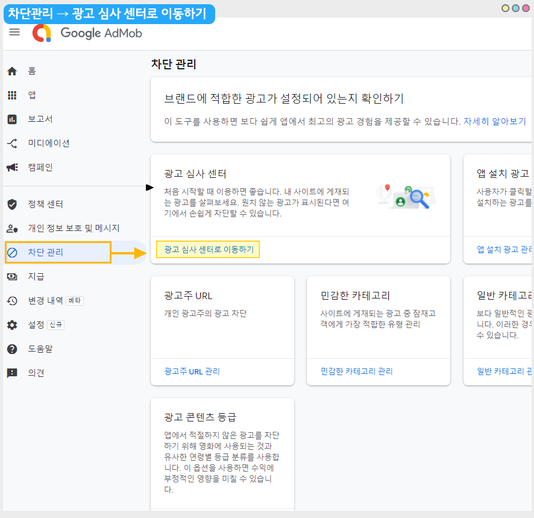
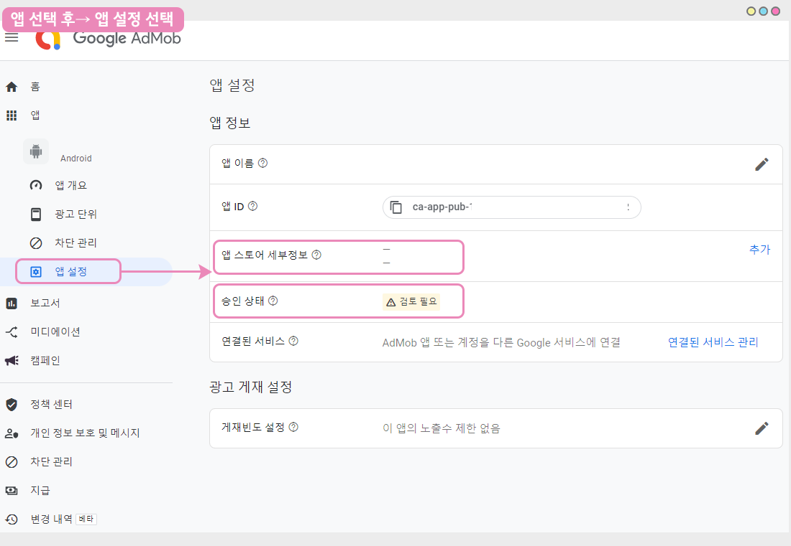
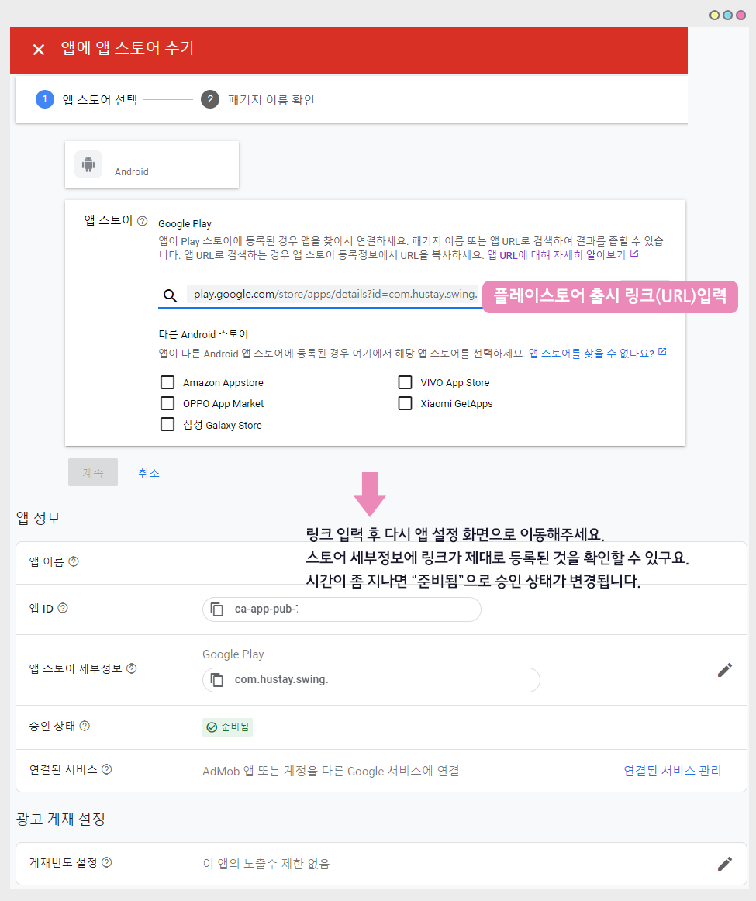

# 애드몹 광고 셋팅 주의사항

<figure><figcaption></figcaption></figure>

애드몹 플러그인에서 셋팅을 완료했는데도 앱에서 광고가 바로 뜨지 않아서 어려움을 겪는 분들도 계실텐데요.

스윙투앱에서 알려드리는 내용들을 한번 더 체크해주세요.

매뉴얼에서 안내드리는 순서는 상관이 없습니다. 모든 내용들을 체크해주시기 바랍니다.

<figure><figcaption></figcaption></figure>

### 1. 애드몹 플러그인에 광고 아이디, 앱 아이디가 정확히 들어갔는지 체크해주세요.

가장 간단하면서도 중요하죠!

스윙투앱 애드몹 플러그인 설정 화면에서 사용자가 만든 광고 단위 아이디, 앱 아이디를 입력하는데요.

전면, 배너 광고 단위 아이디를 바꿔서 입력하는 경우도 있고 앱 아이디가 들어갈 자리에 광고 단위 아이디를 잘못 입력하는 경우도 있어요.

따라서 <mark style="color:purple;">**광고 단위 아이디, 앱 아이디가 맞게 잘 입력되었는지 한번 더 확인해주세요!**</mark>

안드로이드, 아이폰용 따로 광고 단위 아이디를 만들어야 하기 때문에 두 개가 섞이지 않았는지도 확인해주시구요.

그리고처음 애드몹 플러그인 셋팅을 완료했다면 반드시 \[앱제작요청] 버튼 눌러서, 새 버전으로 앱 업데이트 꼭! 해주셔야 합니다.

스윙투앱 애드몹 플러그인 설정 이용방법은 아래 매뉴얼을 참고해주세요!

**☞**[**애드몹 플러그인 설정 이용방법 보러가기**](admob-apply.md)

<figure><figcaption></figcaption></figure>

### 2. 광고 송출 시간은 일주일 이상 소요될 수 있습니다.

<mark style="color:red;">\*해당 경우가 광고가 바로 노출되지 않는 가장 대표적인 사례입니다.(일반적인 사례)</mark>

광고 송출은 구글에서 해당 사용자의 애드몹 계정, 연결된 앱을 확인하여 광고를 배포하는 것을 말해요.

심사 까지는 아니지만 정해진 단계이기 때문에 이러한 송출 때문에 앱에서 광고가 배포되기 까지 일반적인 시간이 소요됩니다.

그러나 송출의 경우도 바로 완료되어 앱에서 광고가 보여지는 케이스도 있기 때문에 편차가 있어요.

구글 애드몹 계정을 새로 만들었거나, 앱 아이디를 신규로 만들었다면 평소보다 더 시간이 걸릴 수 있습니다.

**광고 송출 시간은 정상적이며, 평균 일주일 이상 걸릴 수 있으니 기다려주시기 바랍니다.**

<figure><figcaption></figcaption></figure>

### 3. 애드몹 대시보드에서 ‘결제 프로필’ 입력을 모두 완료했나요?

해당 내용은 애드몹을 처음 이용하시는 분들, 즉 애드몹 가입을 처음 진행하신 분들에게 해당 됩니다.

애드몹에서 계정을 만든 다음 광고 수익을 정산 받을 결제 프로필 입력을 완료해야 하는데요.

결제 프로필 입력이 완료되지 않으면, 광고 아이디를 만들고 앱에 셋팅해도 반영이 되지 않습니다.

따라서 첫 가입을 하신 분들은 반드시! <mark style="color:purple;">**\*애드몹 대시보드에서 결제프로필을 입력했는지 확인해주시기 바랍니다.**</mark>

<mark style="color:orange;">– 계정 승인이 완료되었으며, 광고 게재 사용이 설정되었습니다-</mark>&#x20;

<mark style="color:orange;">라는 메시지가 표시되어야 완료된 것입니다!</mark>

<figure><figcaption></figcaption></figure>

### 4. 광고 검토 – 미검토, 차단된 광고가 없는지 모두 확인하셨나요?

애드몹 대시보드의 차단 관리에서 미검토 광고가 없는지 확인해주셔야 합니다.

<figure><figcaption></figcaption></figure>

애드몹 대시보드 왼쪽 카테고리에서 \[차단관리] 선택 → \[광고 심사 센터로 이동하기] 선택합니다.

광고 게시가 될 수 있도록 차단 관리에서 미검토 광고와 차단된 광고가 없는지 확인해주세요

광고 검토는 계속해서 사용자분께서 관리해주셔야 해요.

처음 광고 검토했다고 끝나는 것이 아니라 수시로 접속하여 미검토가 된 광고가 없는지, 차단이 된 광고가 없는지 체크해주셔야 합니다.

<mark style="color:red;">\*미검토 광고가 많을 경우 그만큼 앱으로 배포되는 광고가 없어서 앱에서 광고가 안보이는 것이구요.</mark>

<mark style="color:red;">미검토 처리시 앱 반영시간이 일주일 이상 소요될 수 있습니다.</mark>

애드몹 결제정보 추가, 미검토 광고 검토 방법은 아래 매뉴얼을 보시면 상세히 확인 가능합니다!

☞ [**\[스윙투앱 애드몹 운영 주의사항 보러가기\]**](admob-operation.md)

<figure><figcaption></figcaption></figure>

### 5. 앱설정 - 승인 상태 및 스토어 세부정보 확인

<figure><figcaption></figcaption></figure>

앱 승인상태를 확인해주세요.

앱 선택 후→ 앱 설정으로 이동해주세요.

승인 상태에 현재 광고 승인 여부를 확인할 수 있습니다.&#x20;

<figure><figcaption></figcaption></figure>

<mark style="color:blue;">-준비됨 상태가 되어야 앱에서 광고가 실제로 송출이 됩니다.</mark>&#x20;

<mark style="color:blue;">-준비 중: 준비 중 상태라면 조금만 기다려 주시면 곧 광고가 송출 됩니다.</mark>

<mark style="color:blue;">-주의 필요 : 어떤 문제가 있는지 확인 후 해결해주셔야 합니다.</mark>&#x20;

<mark style="color:blue;">-검토 필요: 아직 앱 자체가 검토되지 않은 상태입니다. 앱 스토어에 연결하여 앱 검토를 요청해야 합니다.</mark>

첨부된 이미지에 보시면 "앱 스토어 세부정보" 란에 출시 링크를 연결해야 하는데 링크 연결이 안 되었을 경우 이렇게 빈 공란으로 표시되며, 검토 필요 상태가 되는 것입니다.&#x20;

검토 필요로 기재되어 있다면, 앱 스토어 세부 정보에서 \[추가] 버튼을 선택해주세요.&#x20;

<figure><figcaption></figcaption></figure>

앱 스토어 추가 화면에서 출시된 플레이스토어 출시 링크를 넣고 등록해주세요.

링크 입력 후 다시 앱 정보 화면으로 이동해주세요.

스토어 세부정보에 플레이스토어 출시 링크가 잘 연결된 것을 확인할 수 있구요,

승인 상태는 처음에는 "준비중"으로 표시되다가, 시간이 지나면 "준비됨"으로 변경됩니다.

이때부터 실제 앱에서 광고가 송출됩니다.


출시 링크는 처음 앱 연결시 링크를 연결했다면, 문제가 되지 않아요.

그런데처음에 링크를 연결하지 않았을 경우 보시는 것처럼 승인 상태에서 앱이 검토되지 않아 광고가 송출되지 않는 케이스입니다.

처음 앱 연결시 링크 연결을 깜빡했다면, 앱 설정으로 가서 다시 연결해주시기 바랍니다.


<figure><figcaption></figcaption></figure>

### 6. 부정클릭, 무효크래픽 정책 위반이 발생되지 않았는지 확인해주세요.

부정클릭 무효크래픽은 모두 애드몹 광고를 인위적으로 많이 클릭하여 정책상 위반이 발생한 경우입니다.

물론 처음 애드몹 광고를 만들어서 사용하는 분들은 광고 자체가 아직 생성이 안되었기 때문에 이러한 위반이 발생되지는 않는데요.

만약 <mark style="color:purple;">**\*애드몹 계정 내에서 다른 앱에 적용된 광고 아이디가 정책 위반으로 정지가 되었다면, 계정도 정지가 될 수 있어요.**</mark>

광고 단위 아이디만 정지가 되는 것이 아니라, 경우에 따라 애드몹 계정 까지도 정지가 됩니다.

따라서 정책위반이 발생되지 않았는지 체크해주시구요.

보통 이러한 정책 위반의 경우 다른 조치는 할 수 없으며, 구글에서 다시 승인을 할 때까지 기다리는 방법밖에는 없습니다.

평균 1주일 \~2주일 이상 소요될 수 있기 때문에 시간이 좀 걸릴 수 있습니다.

이외에도 애드몹 다른 정책 위반이 발생되지 않았는지 메일, 애드몹 대시보드를 확인해주세요.

<mark style="color:red;">\*정책 위반으로 정지가 될 경우는 정지가 풀릴 때까지 기다려 주셔야 합니다.</mark>

<figure><figcaption></figcaption></figure>

### **7**. 애드몹 테스트 광고 확인하기

<mark style="color:red;">\*해당 방법은 스윙투앱에서 제작한 앱 자체에 문제가 있거나 스윙투앱에서 제공하는 애드몹 서버에 문제는 없는지 사용자분께서 직접 확인하는 방법이에요.</mark>

애드몹 플러그인에서 테스트용 아이디를 적용하여 앱에서 테스트용 애드몹 광고는 잘 뜨는지 확인할 수 있습니다.

<mark style="color:blue;">**\[테스트용  애드몹 광고 설정하는 방법]**</mark>

애드몹 플러그인 설정 화면에서 아이디 입력란에 기재된 아이디를 모두 지우고, 공란으로 두고 저장해주세요.

공란으로 두시면 아래 <mark style="color:red;">빨간 메시지로 “테스트용 아이디가 사용중입니다”</mark> 라고 표시될 거에요.

해당 메시지가 표시되어야 테스트광고 셋팅이 완료된것입니다.

저장 한 뒤 앱을 다시 실행해볼게요. **(앱을 완전히 종료한 뒤, 재실행해주세요)**

<mark style="color:blue;">**핸드폰 앱 실행) 테스트용 애드몹 광고 화면**</mark>

앱에서 테스트용 전면, 배너 광고가 뜨는 것을 확인할 수 있습니다.

이렇게 앱에서 애드몹 테스트용 광고가 잘 뜬다면 스윙투앱에서 제작한 앱이나, 스윙투앱 서버 자체에서의 문제는 없는 것입니다.

위에서 알려드린 방법들을 확인해주셔야 하구요.

일반적으로 광고 송출 시간 때문에 광고가 앱으로 배포되기까지 통상적인 시간이 걸리는 것일 수 있어요.

<figure><figcaption></figcaption></figure>

### **8**. 안내사항

<mark style="color:blue;">-애드몹은 앱내에 탑재된 광고를 사용자들이 클릭해야 수익이 발생이 됩니다.​ 단순히 광고만 거는 것으로 수익이 발생되는 것이 아니니 충분히 고려해주세요.​</mark>

<mark style="color:blue;">-애드몹으로 수익을 내기 위해서는 앱설치를 많이 유도하셔야 합니다. ​</mark>

<mark style="color:blue;">-애드몹 운영 앱 중 평균적으로 앱 사용자 수는 1만명 이상을 보유하고 있습니다. ​</mark>

<mark style="color:blue;">1)애드몹에 관련된 광고 수익비 , 운영방법, 정책사항 등 애드몹 운영에 관련된 내용은 스윙투앱에서 제공하지 않습니다.</mark>

구글 애드몹 공식 사이트에서 내용 및 주의사항을 충분히 확인 후 신청해주세요.

\*스윙투앱은 앱에 애드몹 광고 셋팅만 해드리기 때문에 애드몹 운영과 관련된 상담은 해드리지 않아요.

2\)앱에 애드몹을 적용하는 내용에 대해서 문의가 있으시다면 고객센터로 문의 후 진행해주시기 바랍니다.

3\)결제 후 애드몹 플러그인 셋팅이 완료되면 도중에 애드몹 중단이나 결제한 내역을 환불 할 수 없으니 충분히 고려 후 진행해주세요.

4\)광고는 사용자가 선택할 수 없으며 구글에서 랜덤으로 표시가 됩니다.

5\)광고 셋팅은- 전면광고, 배너 광고로 진행되며, 전면광고는 노출 패턴을 앱 운영자가 직접 설정할 수 있습니다.

6\)광고 셋팅은 안드로이드+아이폰 통합으로 적용되며, 안드로이드 혹은 아이폰 하나의 플랫폼으로도 적용이 가능합니다.

(하나의 플랫폼으로만 적용해도, 애드몹 적용 가격은 동일합니다.)

7\) 애드몹 가입 및 광고 단위 아이디 생성은 스윙투앱에서 대행해드리지 않습니다.

사용자분께서 매뉴얼을 확인하여 직접 등록해주시기 바랍니다.

8\)애드몹이 적용된 앱은 광고를 인위로 누르지 마세요. 인위적인 횟수가 증가될 경우 구글에서 광고를 내립니다.

9\) 애드몹을 적용한 앱은 플레이스토어, 앱스토어에 출시해야 앱 광고 수익이 발생됩니다.

애드몹 적용 후에는 반드시 앱을 스토어에 출시해서 이용해주세요.

10\) 애드몹은 단순히 앱에 설치만 한다고해서 광고 수익을 바로 내는 것이 아닙니다.

여러 조건들이 있으며, 앱을 많이 설치할 수 있도록 홍보 및 사용자들의 이용을 이끌어내야 합니다.

<mark style="color:red;">-앱 광고 수익은 실제로 광고를 클릭했을때 수익이 발생됩니다. (광고를 클릭하여 해당 광고 페이지로 이동해야 수익이 인정됨)</mark>

<mark style="color:red;">-어느 정도의 앱 설치율이 있어야 하며, 일정 수익을 내야 정산을 받을 수 있습니다.</mark>

<mark style="color:red;">-앱 설치 및 이용이 저조할 경우 앱 광고가 내려갈 수 있으며, 구글에서 광고를 송출을 제재할 수 있습니다. (트래픽 저조 등)</mark>

<mark style="color:red;">-따라서 애드몹 공식 사이트에서 내용을 충분히 숙지해주셔야 합니다.</mark>

<figure><figcaption></figcaption></figure>

스윙투앱에서 제공하는 애드몹 플러그인 설정은 스윙투앱의 ‘애드몹 적용 플러그인(22만원)’ 상품을 구매해야 이용가능합니다.

애드몹 광고 셋팅 방법은 ☞[애드몹 플러그인 설정 이용방법 보러가기](admob-apply.md) 참고해주시기 바랍니다.

만약 테스트용 아이디를 적용했는데도 앱에서 애드몹 테스트 광고가 뜨지 않거나

위의 방법들을 모두 확인하였고, 시간이 많이 지났는데도 앱에서 광고가 뜨지 않는다면 스윙투앱 고객센터로 문의 주세요.

확인하여 안내 도와드리겠습니다.

