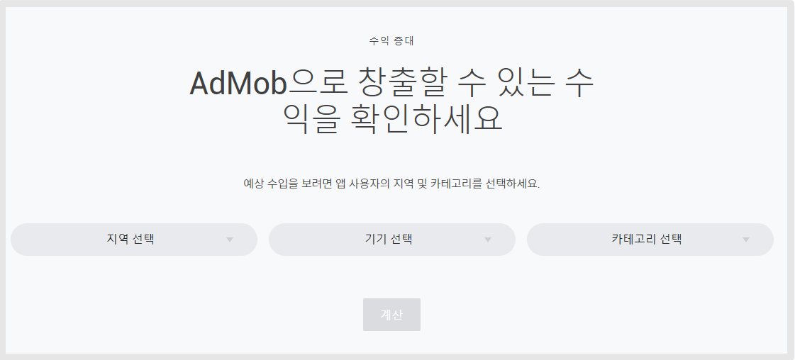
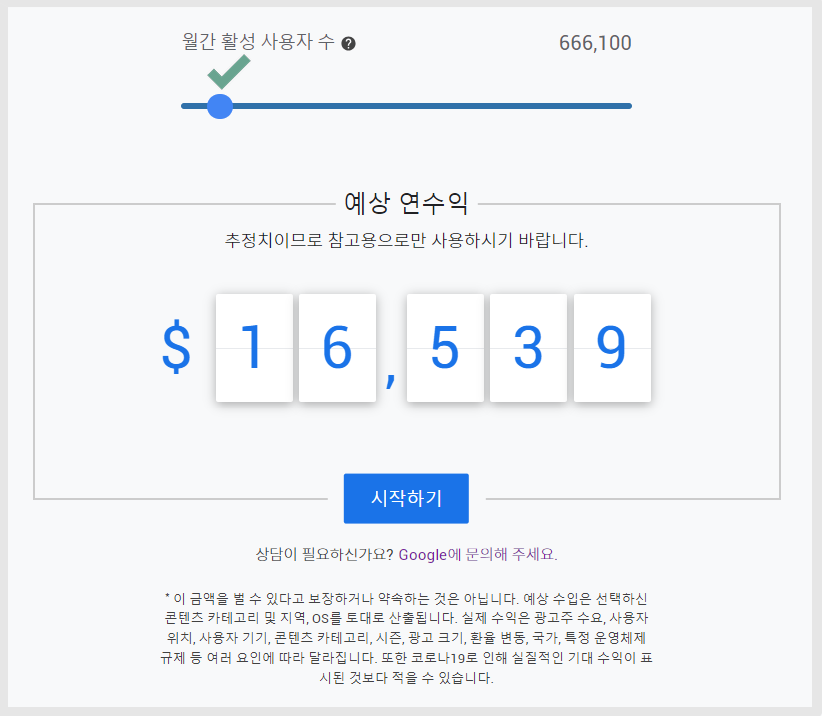
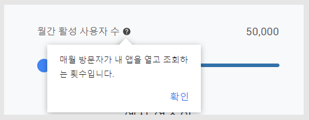
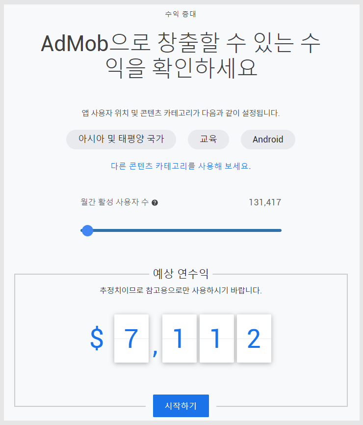
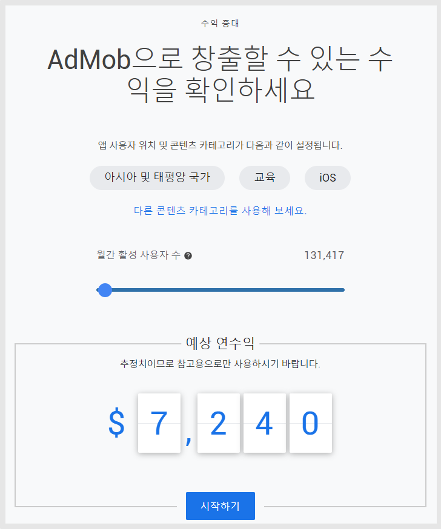
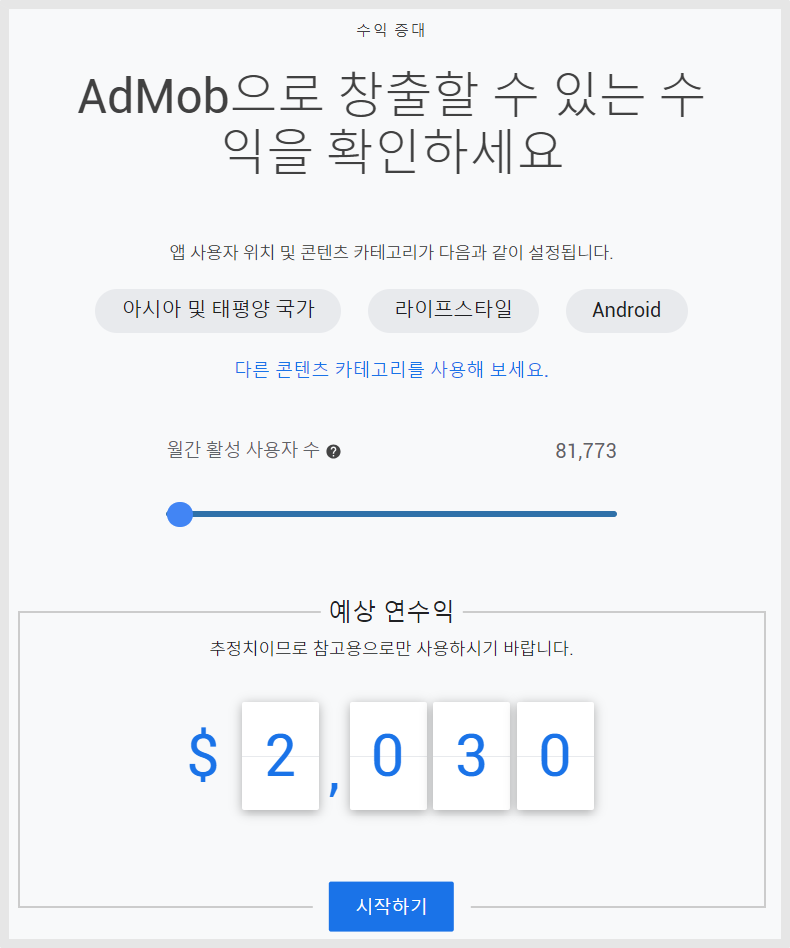

# Copy of 애드몹 예상 수익 계산기

***

애드몹 광고로 어느 정도 수익을 창출할 수 있는지 궁금하다면?

내 앱에 광고를 넣은 애드몹을 이용하고 싶다면,&#x20;

가장 먼저 애드몹 광고로 과연 어느 정도 돈을 벌 수 있을지가 가장 궁금하죠!

그런데 정확히 알 수 없다는 점 때문에 항상 리스크가 있죠 ,,

이럴 때 구글 애드몹 공식 사이트에서 제공하는 애드몹 예상 수익 계산기를 이용해보세요.

이미 애드몹 예상 수익 계산기를 확인했으나 전혀 감이 안와요! 하실 수 있어요.

왜냐면, 앱 사용자 수를 예상값으로 넣어 수익을 예상하는 것인데 아직 앱도 만들지 않은 상태에서 내 앱에 몇 명이 다운을 받고 몇 명이 이용을 할지라는 감이 없기 때문이죠.

따라서 이 궁금증을 저희 스윙투앱에서 확실히 알려드릴게요.&#x20;

***

## 1.애드몹 예산 수익 계산기&#x20;

1\)구글 애드몹 공식 사이트 접속



2\)본문에서 스크롤해서 조금 내리면 수익 창출 확인방법 안내창이 나옵니다.&#x20;

<figure><figcaption></figcaption></figure>

3\)지역 선택(나라선택), 기기선택(안드로이드, 아이폰), 카테고리 선택(출시 예정이라면 앱 콘텐츠가 가장 잘 맞는 카테고리 선택)

4\)내용을 모두 입력 후 \[계산] 버튼을 선택하면, 아래 처럼 수익 계산표가 열립니다.&#x20;

<figure><figcaption></figcaption></figure>

5\)월간 활성 사용자수 그래프에 마우스를 클릭하여 숫자를 대략 맞춰 놓으면  예상 연수익이 계산되어 나옵니다.&#x20;

이 방법으로 광고 수익을 예측할 수 있습니다.&#x20;

<mark style="color:red;">\*용어 설명: 월간 활성 사용자 수란?</mark>

<figure><figcaption></figcaption></figure>

매월 방문자가 내 앱을 열고 조회하는 모든 횟수를 말합니다.&#x20;

앱이 출시된 스토어- 구글 플레이스토어&앱스토어에서 해당 정보는 확인이 가능하구요.

스윙투앱 내 통계 메뉴에서도 페이지뷰 수로 확인이 가능합니다.&#x20;

단, 스윙투앱은 페이지뷰 수가 일간으로 나오기 때문에 대략적인 평균값을 설정해서 30일로 곱한 뒤 확인해주세요.&#x20;

**\*달러로 표시되며, 연 수익입니다.**

**\*예상 수익은 선택하신 카테고리, 지역, 기기에 따라 조금씩 다르게 나옵니다.**&#x20;

<mark style="color:red;">그런데 문제는, 월간 활성 사용자 수가 뭔지 몰라서 해봐도 잘 모르겠다 라는 분들이 대부분이에요!</mark>

<mark style="color:red;">따라서 스윙투앱에서 제작한 앱으로 어떻게 확인이 가능한지 알려드릴게요</mark>

***

## 2.앱 실제 케이스 계산

아래 내용은 스윙투앱에 의뢰하여 제작하신 사용자 분의 앱 케이스로 설명드립니다.

해당 사용자분의 앱은 교육과 라이프스타일 컨텐츠로 제작되었구요.

실제 앱제작 의뢰 및 애드몹 광고 적용 등 모든 과정을 저희 스윙투앱에 의뢰하여 맡겨주셨습니다.


월간 활성 사용자 수는 스윙투앱에서 제공하는 일간 페이지뷰 수를 한달(30일)로 계산하여 수익을 측정했습니다.

사용자의 앱마다 이 수치는 모두 다 다르기 때문에 반드시 본인의 앱 활성화 수를 확인하여 계산해야 합니다.&#x20;

매뉴얼 제작을 위해 적용한 시나리오로, 정확한 수치가 아님을 다시 한번 알려드립니다.


### **1)A앱  광고 수익 계산**

\-카테고리: 교육 &#x20;

\-플레이스토어&앱스토어 모두 출시

\-플레이스토어 다운로드 수: 1만

\-앱스토어 다운로드 수 : 8천

\-페이지뷰(하루 기준) :9,000 / 한달 페이지뷰 수: 270,000

\-특이사항: 전 국가로 출시되어 있으나 앱 이용 주요국가는 대한민국

<mark style="color:blue;">**\[수익 계산기 입력 방법]**</mark>

\-국가: 아시아 및 태평양선택

\-기기: Android 와 iOS 각각 선택

\-카테고리: 교육

\-월간 활성 사용자 수: 기기별로 나눠서 측정해야 함으로 전체 페이지뷰를 반으로 나눠서 측정해주세요.

135,000 이지만, 사용자수핀이 정확한 금액으로 고정되지 않아 비슷한 금액대로 설정했습니다.&#x20;

**(1)Android 수익 확인**

<figure><figcaption></figcaption></figure>

안드로이드계산시 나오는 예상 연수익은 $7,112 달러 →한국 원화로 환전시 약 943만원(환율에 따라 다름)이 수익이 발생됩니다.

**(2) IOS 수익 확인**

<figure><figcaption></figcaption></figure>

아이폰 계산시 나오는 예상 연수익은 $7,240달러 →한국 원화로 환전시 약 961만원(환율에 따라 다름)이 수익이 발생됩니다.


<mark style="color:blue;">**플레이스토어 1만명 앱 설치, 앱스토어 8천명 앱 설치한 경우**</mark>

<mark style="color:blue;">**앱 광고 수익은 연간 10,904,000원(1,904만원) 예상할 수 있습니다.**</mark>&#x20;


### 2)B앱 광고 수익 계산

\-카테고리: 라이프스타일

\-플레이스토어만출시

\-플레이스토어 다운로드 수: 5천 조금 넘음

\-페이지뷰(하루 기준) : 3,000 / 한달로 계산시 90,000

\-특이사항: 전 국가로 출시되어 있으나 앱 이용 주요국가는 대한민국

<mark style="color:blue;">**\[수익계산기 입력 방법]**</mark>

국가: 아시아 및 태평양선택

기기: Android 선택

카테고리: 라이프 스타일

월간 활성 사용자 수: 정확히 9만으로 설정이 되지 않아 81,773으로 설정했습니다.&#x20;

<figure><figcaption></figcaption></figure>

계산시 나오는 예상 연수익은 $2,030 달러→ 한국 원화로 환전시 약 269만원(환율에 따라 다름)이 나옵니다.


<mark style="color:blue;">**플레이스토어에만 앱 이용 중이며,**</mark>

&#x20;<mark style="color:blue;">**5천명 앱을 설치 받은 경우 앱 광고 수익은 연간 269만원으로 예상할 수 있습니다.**</mark>&#x20;


***

애드몹 광고 앱을 제작 및 배포 준비 중이라면 꼭 기억해주세요.

## 3.주의사항


1\)사용자분의 앱에 따라 다운로드 수(앱 설치 수)가 동일 해도, 활성 사용자 수가 다 다르기 때문에 동일한 금액을 예측할 수 없습니다.

2\)이금액을 벌 수 있다고 보장하거나 약속하는 것은 아닙니다.&#x20;

3\)예상 수입은 선택하신 콘텐츠 카테고리 및 지역, OS를 토대로 산출됩니다.&#x20;

4\)실제 수익은 광고주 수요, 사용자 위치, 사용자 기기, 콘텐츠 카테고리, 시즌, 광고 크기, 환율 변동, 국가, 특정 운영체제 규제 등 여러 요인에 따라 달라집니다.&#x20;

5\)또한 코로나19로 인해 실질적인 기대 수익이 표시된 것보다 적을 수 있습니다.



#### 운영 TIP

1\)애드몹은 앱내에 탑재된 광고를 사용자들이 클릭해야 수익이 발생이 됩니다.​&#x20;

단순히 광고만 거는 것으로 수익이 발생되는 것이 아니니 충분히 고려해주세요.​

2\)애드몹으로 수익을 내기 위해서는 앱설치를 많이 유도하셔야 합니다. ​

\-애드몹 운영 앱 중 평균적으로 앱 사용자 수는 1만명 이상을 보유하고 있습니다. ​

3\)애드몹에 관련된 광고 수익비 , 운영방법, 정책사항 등 애드몹 운영에 관련된 내용은 스윙투앱에서 제공하지 않습니다.

구글 애드몹 공식 사이트에서 내용 및 주의사항을 충분히 확인 후 신청해주세요.

\*스윙투앱은 앱에 애드몹 광고 셋팅방법만 제공해드리며, 애드몹 운영과 관련된 상담은 해드리지 않아요.

4\)앱스토어(아이폰)에도 함께 출시를 해야 수익이 더욱 높아집니다.

일반적으로 동일한 조건 하에, 안드로이드에서 계산되는 광고 수익보다 아이폰에서 계산되는 광고 수익이 더 높습니다.&#x20;

5\)결제 후 애드몹 플러그인 셋팅이 완료되면 도중에 애드몹 중단이나 결제한 내역을 환불 할 수 없으니 충분히 고려 후 진행해주세요.

6\)광고는 사용자가 선택할 수 없으며 구글에서 랜덤으로 표시가 됩니다.

7\)광고 셋팅은- 전면광고, 배너 광고로 진행되며, 전면광고는 노출 패턴을 앱 운영자가 직접 설정할 수 있습니다.

\*웹앱(웹뷰, 푸시앱)은 전면광고 노출 패턴 설정 불가

8\)광고 셋팅은 안드로이드+아이폰 통합으로 적용되며, 안드로이드 혹은 아이폰 하나의 플랫폼으로도 적용이 가능합니다.

(하나의 플랫폼으로만 적용해도, 애드몹 적용 가격은 동일합니다.)

9\) 애드몹 가입 및 광고 단위 아이디 생성은 스윙투앱에서 대행해드리지 않습니다.

사용자분께서 매뉴얼을 확인하여 직접 등록해주시기 바랍니다.

10\)애드몹이 적용된 앱은 광고를 인위로 누르지 마세요. 인위적인 횟수가 증가될 경우 구글에서 광고를 내립니다.

11\) 애드몹을 적용한 앱은 플레이스토어, 앱스토어에 출시해야 앱 광고 수익이 발생됩니다.

애드몹 적용 후에는 반드시 앱을 스토어에 출시해서 이용해주세요.

12\) 애드몹은 단순히 앱에 설치만 한다고해서 광고 수익을 바로 내는 것이 아닙니다.

여러 조건들이 있으며, 앱을 많이 설치할 수 있도록 홍보 및 사용자들의 이용을 이끌어내야 합니다.

<mark style="color:red;">-앱 광고 수익은 실제로 광고를 클릭했을때 수익이 발생됩니다. (광고를 클릭하여 해당 광고 페이지로 이동해야 수익이 인정됨)</mark>

<mark style="color:red;">-어느 정도의 앱 설치율이 있어야 하며, 일정 수익을 내야 정산을 받을 수 있습니다.</mark>

<mark style="color:red;">-앱 설치 및 이용이 저조할 경우 앱 광고가 내려갈 수 있으며, 구글에서 광고를 송출을 제재할 수 있습니다. (트래픽 저조 등)</mark>

<mark style="color:red;">-따라서 애드몹 공식 사이트에서 내용을 충분히 숙지해주셔야 합니다.</mark>


***

