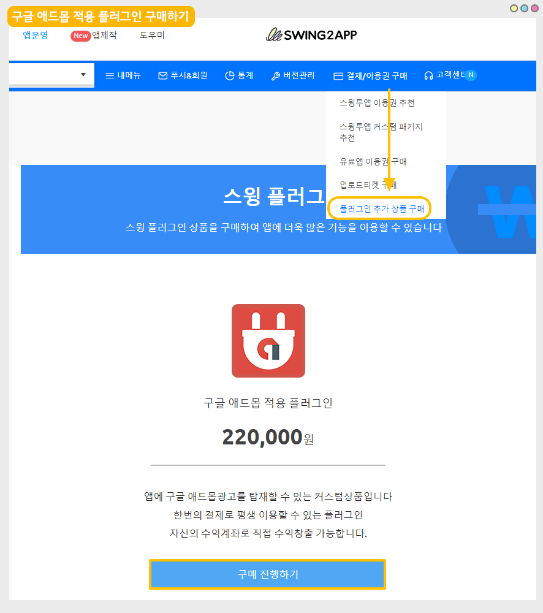
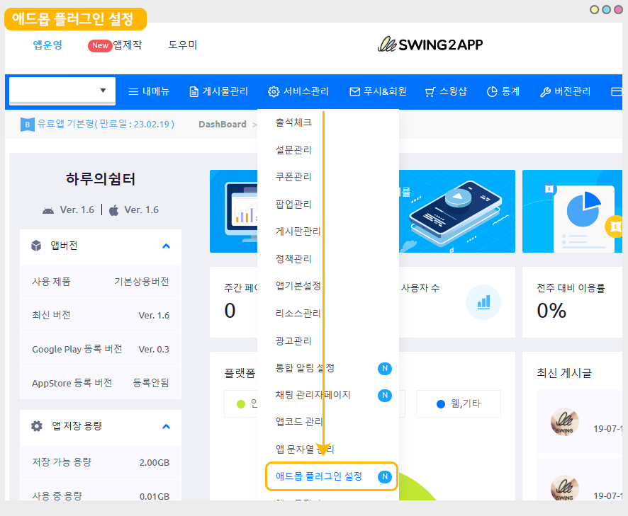
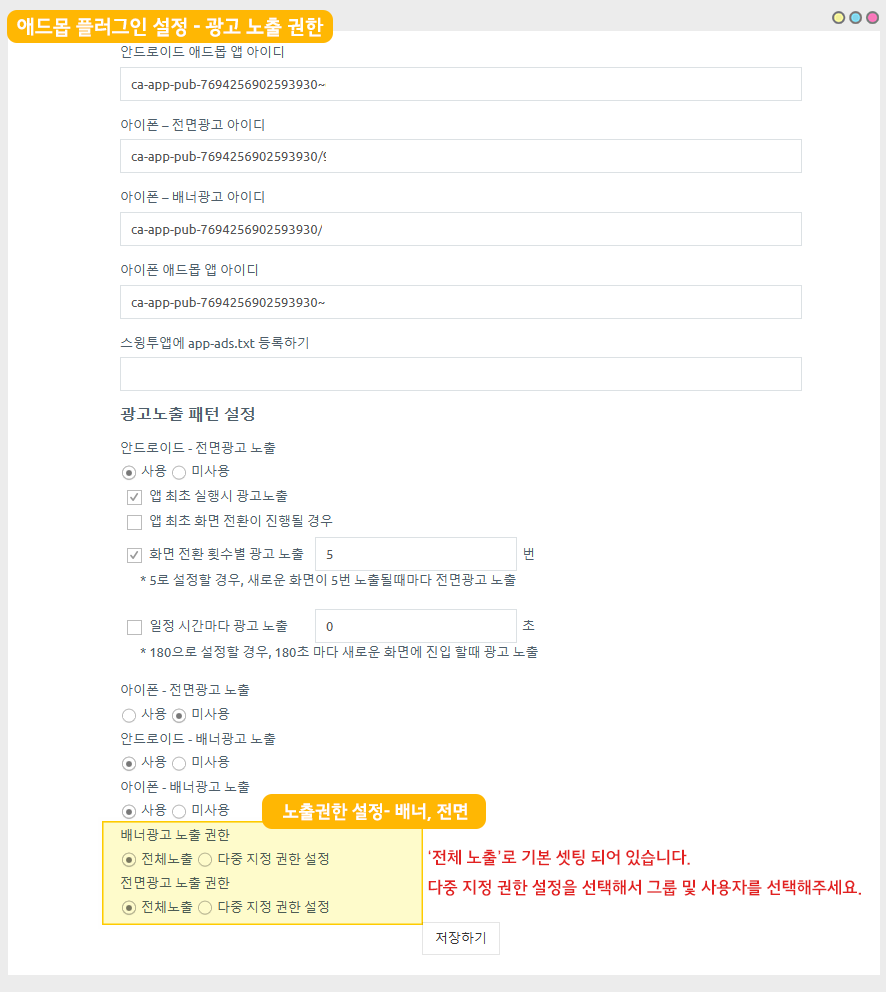
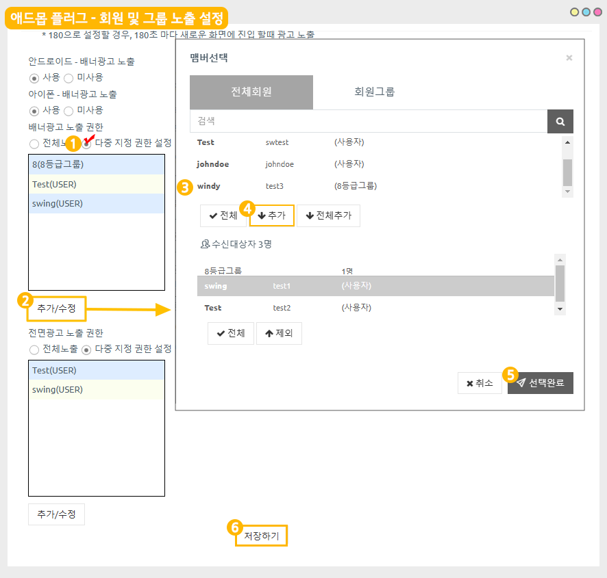

# 애드몹 - 광고 노출 권한 설정

<figure><figcaption></figcaption></figure>

<mark style="color:blue;">**구글 애드몹(Admob)이란,**</mark>

앱에 광고를 탑재할 수 있는 서비스로, 구글에서 운영하는 광고 플랫폼입니다.

스윙투앱으로 제작한 앱에 구글 애드몹 광고를 셋팅할 수 있으며, 앱에서 광고 수익을 얻을 수 있습니다.

<mark style="color:blue;">**애드몹 광고 노출 지정 권한 설정이란,**</mark>

광고는 별도의 접근 권한 없이 앱을 설치한 모든 사용자들에게 노출이 되는 구조이나, 노출 권한을 이용하면 배너 광고와 전면 광고 각각 노출이 되거나 노출이 되지 않는 범위를 설정할 수 있습니다.

앱 운영자가 애드몹 광고 노출 범위를 지정하여 특정 그룹 혹은 특정 사용자에게만 노출되거나 노출되지 않도록 설정할 수 있습니다.

<mark style="color:red;">\*노출 권한을 설정하지 않으면(전체노출 설정), 앱을 설치한 모든 사용자에게 광고가 노출됩니다.</mark>

<mark style="color:red;">\*노출 권한 설정은 일반 프로토타입으로 제작한 앱에서만 이용 가능합니다.</mark>

<mark style="color:red;">웹사이트를 연결한 웹앱-웹뷰, 푸시앱은 지정 불가합니다.</mark>

<figure><figcaption></figcaption></figure>

## 1.이용방법

###

### <mark style="color:blue;">Case 1. 신규앱 애드몹 적용 (스토어 출시 전,애드몹 첫 셋팅)</mark>

1\)앱제작 화면으로 이동한 뒤 앱을 한번 업데이트 해주세요. \[앱 업데이트] 버튼 선택

\*업데이트 된 애드몹 광고 기능은, 앱제작 V3버전에서만 이용 가능합니다. V2 이용중이라면 V3 로 전환하여 이용해주세요.

스토어에 출시 전 신규 앱이기 때문에 업데이트 표시 옵션은 어떻게 설정해도 무관합니다.

2\)앱 제작이 완료되면, 구글 애드몹 적용 플러그인 상품을 구매해주세요.

애드몹 플러그인 상품은 [결제/이용권 구매 - 플러그인 추가 상품 구매 페이지](http://www.swing2app.co.kr/view/new\_product\_list\_by\_plugin)에서 구매 가능합니다.

스토어 출시를 위한 유료앱 이용권, 스토어 업로드티켓은 애드몹 적용 후 구매하셔도 되고 함께 구매해도 됩니다.

<figure><figcaption></figcaption></figure>

3\)애드몹 플러그인을 구매하면, 앱운영- 서비스관리- 애드몹 설정 플러그인 메뉴가 생성됩니다.

[애드몹 플러그인 설정](http://www.swing2app.co.kr/view/app\_plugin\_by\_admob)으로 이동해주세요. (플러그인 구매시에만 이동 가능)

<figure><figcaption></figcaption></figure>

4\)애드몹 설정화면 - 배너, 전면 광고에 \[노출 권한 설정] 입력 항목이 추가 된 것을 확인할 수 있습니다.

전면광고, 배너 광고 , 앱 아이디 등은 아래 애드몹 광고 셋팅 매뉴얼을 보시고 적용해주세요.



<figure><figcaption></figcaption></figure>

5\)배너, 전면광고에 노출권한을 설정해주세요.

\-전체 노출로 기본 셋팅되어 있으며, '다중 지정 권한 설정'을 선택해서 추가할 수 있습니다.

<figure><figcaption></figcaption></figure>

(1)'다중 지정 권한 설정' 선택

(2)\[추가/수정 버튼] 선택

(3)광고를 노출할 회원 (멤버) 선택

(4)추가 버튼 선택

(5)선택 완료

(6)저장하기 버튼을 누르면 설정 완료됩니다.

회원이 아닌 그룹으로 선택하는 방법도 동일합니다.

<mark style="color:orange;">→별도 권한 설정을 하지 않을 경우 “전체노출”로 설정해주시면 됩니다.</mark>

<mark style="color:orange;">→지정 권한설정에 추가 되어 있는 그룹 및 사용자에게 광고가 노출 됩니다.</mark>

6\)저장한 뒤 새로 제작된(업데이트 한) 앱 버전으로 확인해주세요.

\*핸드폰에 다운 받은 앱이 설치되어 있다면, 삭제 후 업데이트 된 버전의 앱으로 새로 설치해주세요.&#x20;

\*아이폰은 테스트 불가, 앱스토어에 업데이트 해야 확인 가능합니다.

7\)테스트에서 정상적으로 권한별로 노출이 된다면 스토어에 앱 등록을 진행합니다.

\-이용권, 업로드티켓 구매 전이면 구매 후 업로드를 진행해주세요.

\-앱스토어는 업로드 대행만 가능하기 때문에, 당사로 앱스토어 업로드 신청주시기 바랍니다.

\-플레이스토어는 직접 앱 등록 가능하며, 대행 요청 시 동일하게 플레이스토어 업로드 신청 주시면 됩니다.


<mark style="color:red;">**\*주의\***</mark>

스토어에 출시되지 않은 앱은 테스트에서 바로 광고가 뜨지 않을 수 있어요. \_ 광고 송출에 시간이 소요됩니다.

광고가 뜨지 않는다면 테스트용 아이디를 셋팅해두고 확인할 수 있습니다.

[\[애드몹 테스트 광고 확인하기\]](https://documentation.swing2app.co.kr/knowledgebase/admob/testad)


### <mark style="color:blue;">Case 2. 기존 애드몹 이용 사용자</mark>

1\)앱제작 화면으로 이동한 뒤 앱을 한번 업데이트 해주세요. \[앱 업데이트] 버튼 선택

\*업데이트 된 애드몹 광고 기능은, 앱제작 V3버전에서만 이용 가능합니다. V2 이용중이라면 V3 로 전환하여 이용해주세요.

2\)업데이트 표시 옵션은 '업데이트 표시 안함'으로 우선 선택해주세요.

3\)앱 제작이 완료되면, 애드몹 플러그인 설정으로 이동해주세요.

4\)애드몹 설정화면 - 배너, 전면 광고에 \[노출 권한 설정] 입력 항목이 추가 된 것을 확인할 수 있습니다.

<figure><figcaption></figcaption></figure>

5\)다중 지정 권한 설정을 선택한 뒤, \[추가/수정 버튼] 선택

<figure><figcaption></figcaption></figure>

(1)다중 지정 권한 설정을 선택

(2)\[추가/수정 버튼] 선택

(3)광고를 노출할 회원 (멤버) 선택

(4)추가 버튼 선택

(5)선택 완료

(6)저장하기 버튼을 누르면 설정 완료됩니다.

회원이 아닌 그룹으로 선택하는 방법도 동일합니다.

<mark style="color:orange;">→별도 권한 설정을 하지 않을 경우 “전체노출”로 설정해주시면 됩니다.</mark>

<mark style="color:orange;">→지정 권한설정에 추가 되어 있는 그룹 및 사용자에게 광고가 노출 됩니다.</mark>

6\)저장한 뒤, 새로 제작된 앱(업데이트 버전 앱)을 다시 다운받아 확인해주세요.

\*핸드폰에 플레이스토어에서 다운 받은 앱이 설치되어 있다면, 삭제 후 업데이트 된 버전의 앱으로 새로 설치해주세요.

\*아이폰은 테스트 불가, 앱스토어에 업데이트 해야 확인 가능합니다.

7\)테스트 후 문제 없으면, 앱이 출시된 각 스토어에 업데이트 버전의 앱으로 심사 제출해야 합니다.

\-앱스토어는 업로드 대행만 가능하기 때문에, 당사로 앱스토어 업로드 신청주시기 바랍니다.

\-플레이스토어는 직접 업데이트 가능하며, 대행 요청 시 동일하게 플레이스토어 업로드 신청 주시면 됩니다.

8\)업데이트 설정은 다시 수정이 가능합니다.

스토어 업데이트 전 테스트를 위해 업데이트 설정을 “업데이트 표시 안함”으로 설정했기 때문에, 사용자의 앱에서 앱 업데이트 메시지 창이 뜨도록 수정해주세요.

[앱운영-버전관리-앱제작이력](https://documentation.swing2app.co.kr/knowledgebase/admob/testad) 페이지 이동, 업데이트 설정: “필수 업데이트(재설치)”로 선택합니다.

<figure><figcaption></figcaption></figure>

## 2. 애드몹 노출 지정 권한 운영방법 TIP

앱 내에서 유료 회원권 등의 상품을 구매하는 경우, 회원권을 구매한 유료 사용자에게는 앱 광고가 노출되지 않게 설정할 수 있습니다.

광고 노출이 앱 이용에 방해가 될 수 있기 때문에, VIP 등의 등급에게는 광고가 제거된 버전으로 이용이 가능하도록 운영할 수 있습니다.

또한 회원가입을 하지 않은 손님에게는 광고가 모두 노출되고, 회원가입을 할 경우 광고가 노출되지 않도록 설정할 수도 있습니다.

이처럼 앱 이용 목적에 맞게 광고 노출 범위를 운영자가 직접 설정할 수 있습니다.

<figure><figcaption></figcaption></figure>

## 3. 안내사항

1\)해당 기능은 ‘구글 애드몹 적용 플러그인’ 상품을 구매한 사용자만 이용 가능합니다.

애드몹 플러그인 상품은 [결제/이용권 구매 - 플러그인 추가 상품 구매 페이지](https://documentation.swing2app.co.kr/knowledgebase/admob/testad)에서 구매 가능합니다.

2\)광고 노출 권한은 일반 프로토타입으로 제작한 앱에서만 이용 가능한 기능입니다.

웹사이트를 연결한 **웹앱 - 푸시앱, 웹뷰앱은 광고 노출 권한 설정이 불가합니다.**

3\)광고 노출 권한 기능을 이용하기 위해서는 앱 업데이트를 먼저 해주셔야 합니다.

앱 업데이트를 해야 애드몹 광고 플러그인 화면에 신규 기능이 노출됩니다.

4\)앱을 업데이트 하기 때문에, 스토어에 출시된 앱도 새 버전으로 다시 업데이트 해주셔야 합니다.

스토어에 업데이트를 하지 않으면 앱을 다운 받은 사용자들은 이용이 불가합니다.

5\)업데이트 후 광고 노출 권한 수정은 수정 후 저장만 해주시면 앱에 자동 반영됩니다.

최초 반영 이후는 업데이트를 따로 하지 않아도 됩니다.

6\)기능 업데이트일 기준 2023년 1월 20일 이후 신규 앱제작 혹은 앱 업데이트를 하고 애드몹 플러그인 구매시, 애드몹 플러그인 설정 화면에 광고 노출 권한 설정 기능을 즉시 확인할 수 있습니다.

<figure><figcaption></figcaption></figure>

