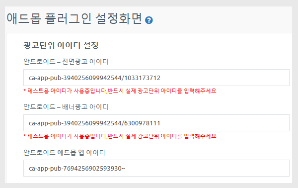

# 애드몹 - 테스트 아이디 설정

<figure><figcaption></figcaption></figure>

**애드몹 테스트용 아이디 설정이란,**

**애드몹 광고 송출 및 앱 노출에 시간이 소요되기 때문에, 그 전에 앱에 광고 셋팅이 잘 되었는지 확인 할 수 있는 기능입니다.**

애드몹 플러그인 화면에서 테스트용 광고 아이디를 연결하여 앱에광고가 어떻게 뜨는지 확인할 수 있습니다.

아래 광고 테스트용 아이디 셋팅 방법을 확인해주세요.

### 1. 테스트용 아이디 셋팅방법

<figure><figcaption></figcaption></figure>

[애드몹 플러그인 설정](http://www.swing2app.co.kr/view/app\_plugin\_by\_admob) 화면에서 안드로이드 전면, 배너 광고 아이디 입력란에 기재된 아이디를 모두 지워주세요.

입력란을 공란으로 두시면, 아래 빨간 메시지로 “테스트용 아이디가 사용중입니다” 라고 표시될 거에요.

해당 메시지가 표시되어야 테스트광고 셋팅이 완료된것입니다.

아래 \[저장하기] 버튼을 선택해주세요.

앱을 완전히 종료한 뒤, 다시 실행하면 테스트 광고가 뜨는 것을 확인할 수 있습니다.

\*애드몹 플러그인 이용은 - 구글 애드몹 적용 플러그인 상품을 구매한 사용자만 이용이 가능합니다.

<figure><figcaption></figcaption></figure>

### 2. 앱 실행) 테스트용 애드몹 광고 화면

<figure><figcaption></figcaption></figure>

​

이렇게 앱에서 애드몹 테스트용 광고가 잘 뜬다면 스윙투앱에서 제작한 앱에 애드몹 플러그인 셋팅은 잘 되신거구요.

스윙투앱 서버 자체에서의 문제는 없는 것이기 때문에, 다시 사용자분의 광고 아이디로 변경하여 저장해주시구요.

플레이스토어, 앱스토어 등에 앱 등록 진행해주시면 됩니다.

일반적으로 스토어 출시 후 광고가 송출되어, 앱에서 노출이 됩니다.

<figure><figcaption></figcaption></figure>

### 3. 테스트용 광고 확인이 왜 필요한가요?

​

일반적으로 아직 스토어에 배포를 하지 않은 앱은(신규 제작 앱)구글에서 광고를 노출하는데 시간이 소요됩니다.

구글에서도 해당 앱에 광고를 송출해도 되는지를 판단하게 되는데 신규로 제작된 앱은 - 앱 이용자 수, 설치 수도 없고, 스토어 배포 이력도 없기 때문에 앱에 대한 신뢰가 없죠.

따라서 앱을 확인하는데 시간이 소요되는 것입니다.

​

광고 아이디를 연결했다고해서 앱에 바로 광고가 뜨는 것은 아니며, 광고 송출 승인이 완료되어야 노출이 됩니다.

광고가 뜨기 전까지 테스트용 아이디를 통해 앱에 광고가 잘 셋팅되었는지 확인을 해주시면 되구요.

스토어 출시 후에 정상적으로 광고가 노출되는 것을 확인할 수 있습니다.

​

<mark style="color:red;">주의)</mark> 스토어 출시 후에도 광고가 정상적으로 노출되지 않는다면 여러 문제가 있는 것입니다.

아래 애드몹 설정 후 광고 미노출 안내 사항 매뉴얼을 확인해주세요.



