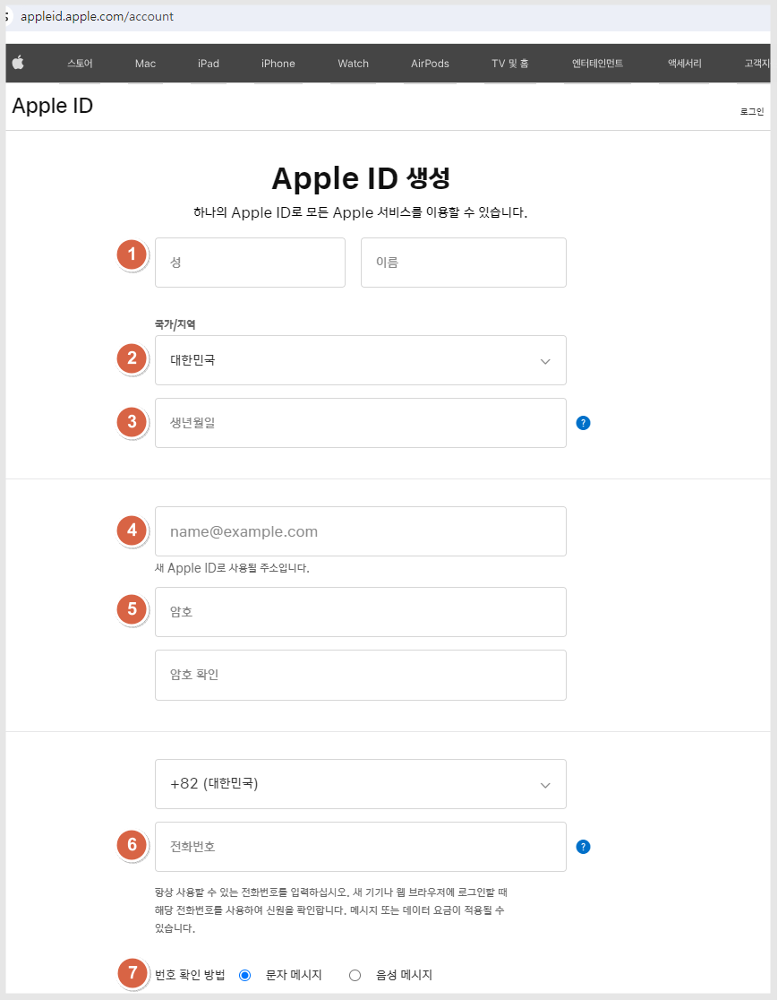
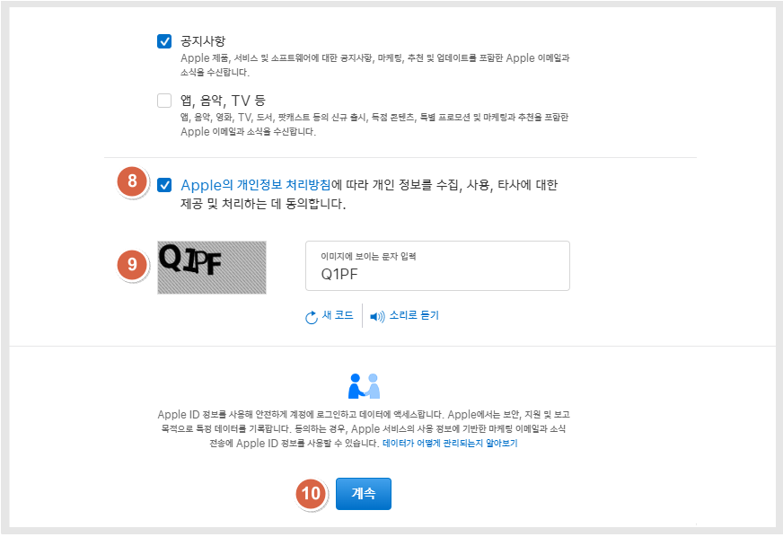
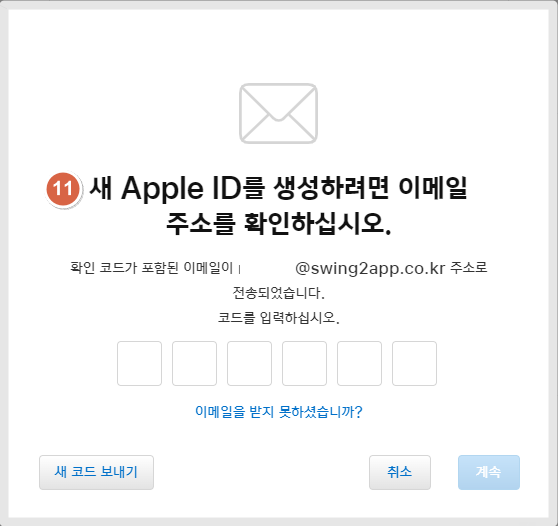
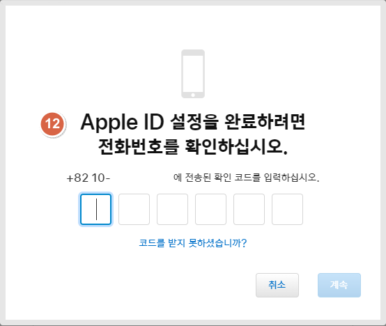
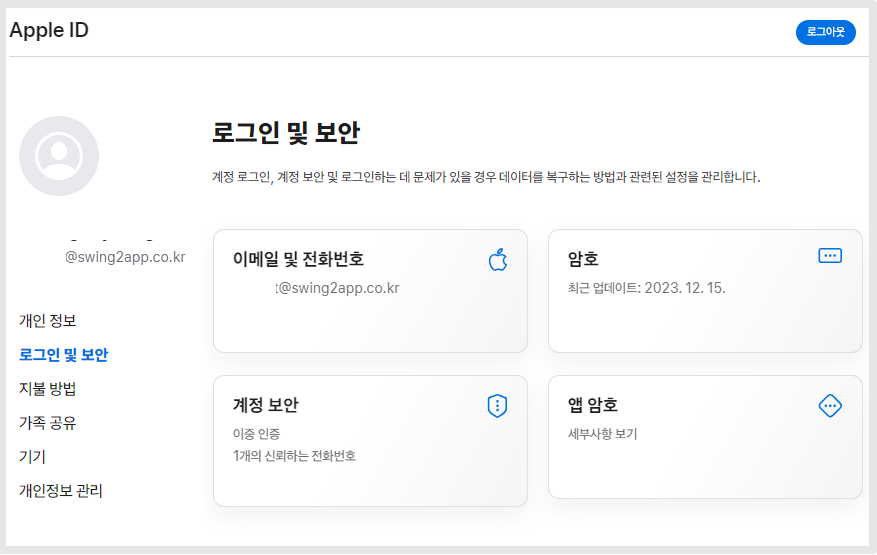

# 애플 계정 만들기

***

&#x20;

## **애플 계정- 아이디 만들기**

애플 계정이 없을 경우 애플 ID 생성 홈페이지에서 가입 후 이용할 수 있습니다.

해당 계정은 추후 애플 개발자 계정 등록시 연결하여 사용이 가능합니다.

\*아래 사이트에 접속해주세요.

[**애플 ID 생성하기**](https://appleid.apple.com/account)



<figure><figcaption></figcaption></figure>

1\)성, 이름 입력 \*모두 영어로 입력합니다.

2\)대한민국 선택

3\)생년월일 입력

4\)애플 아이디로 사용할 이메일주소 입력합니다.


\*주의) 엔터프라이즈 계정으로 이용할 아이디라면, 반드시 회사 웹사이트 도메인으로 된 이메일주소를 사용하셔야 합니다.

일반 이메일은 엔터프라이즈로 이용 불가합니다.&#x20;


6\)핸드폰 번호 입력 \*인증받아야 하기 때문에 실제 이용 가능한 번호로 입력합니다.

7\)번호 확인 방법: 문자메시지로 체크해주세요.

<figure><figcaption></figcaption></figure>

8\)동의 내용 체크

9\)보안 문자

10\)\[계속] 버튼 선택합니다.

<figure><figcaption></figcaption></figure>

11\)입력한 이메일주소로 인증 코드가 발송됩니다.

<figure><figcaption></figcaption></figure>

12\)입력한 핸드폰번호로 인증 코드가 발송됩니다.

문자 메시지를 확인하여 6자리 코드를 입력해주세요.

<figure><figcaption></figcaption></figure>

13\)모든 인증이 완료되면, 아이디 생성이 완료됩니다.

\
