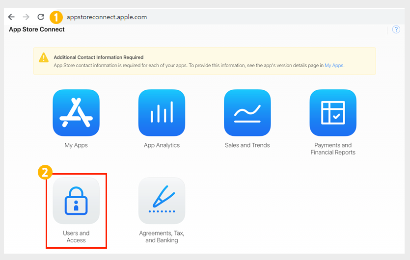
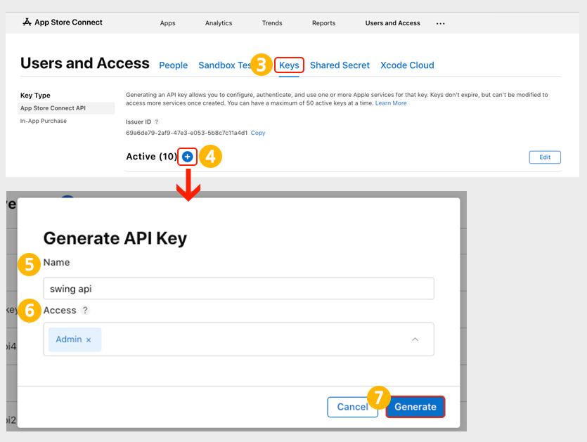
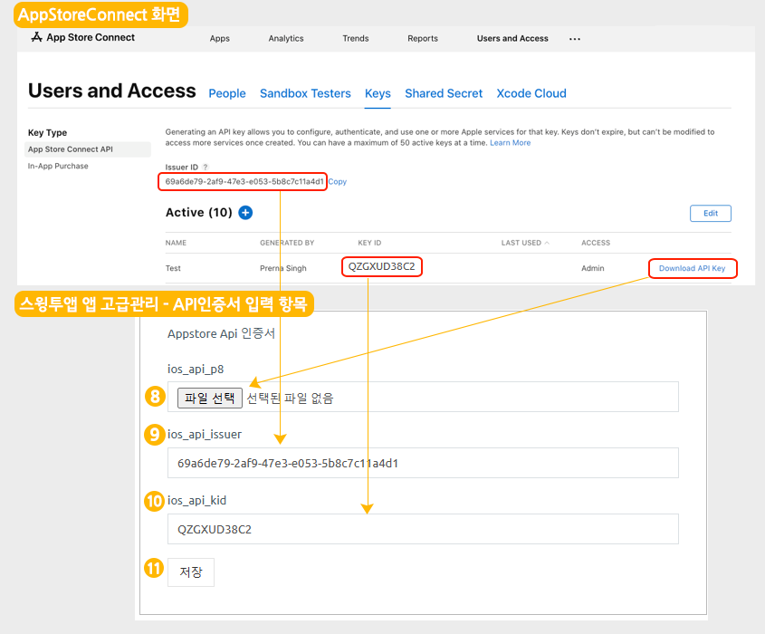

# 앱스토어 API  인증서 등록하기

<figure><figcaption></figcaption></figure>

**앱스토어 API 인증서 등록이란?**

스윙투앱에서 제작한 앱을 앱스토어에 연동하는 작업입니다.&#x20;

아이폰에서 앱에서 사용되는 모든 기능을 연동하는 것이기 때문에 필수로 작업이 되어야 합니다.

**사용자분의 애플 개발자 계정으로 앱스토어에  등록하는 경우, 직접 API 키를 등록해주셔야 합니다.** &#x20;

&#x20;스윙투앱 계정으로 대리 등록하는 경우는 해당 사항 없습니다.&#x20;

<figure><figcaption></figcaption></figure>

**앱스토어 커넥트 사이트 접속**

<figure><figcaption></figcaption></figure>

1.앱스토어 커넥트 사이트 접속 및 로그인



2.커넥트 메인 화면에서 \[User and Access] 선택합니다.&#x20;

(한국어로 보시는 분들은 \[사용자 및 액세스] 선택)

<figure><figcaption></figcaption></figure>

3.Key(키)선택&#x20;

4.Active(활성화됨)옆에 \[+]모양 아이콘 선택

5.Name(이름): 'swing api' 입력

6.Acces(액세스): 'Admin(관리자)' 선택

마우스 커서로 오른쪽 내림 화살표 버튼 선택하시면 Admin(관리자) 선택 가능합니다.&#x20;

7.Generate(생성) 선택

**스윙투앱 사이트 접속하신 뒤 앱 고급관리 화면을 열어주세요.**&#x20;

<figure><figcaption></figcaption></figure>

[스윙투앱 앱운영 - 서비스관리-앱 고급 관리](https://www.swing2app.co.kr/view/app\_advanced\_management) 화면 이동하시면, 화면 가장 아래에 앱스토어 API인증서 입력란을 확인할 수 있습니다.&#x20;

**이제 앱스토어 커넥트 화면과, 스윙투앱 앱 고급관리-앱스토어 API 인증서 화면함께 열어주세요.**&#x20;

<figure><figcaption></figcaption></figure>

8.\[다운로드 API KEY] 버튼을 선택하여 파일 다운받아 주세요. (파일은 열지 말고 저장만 해주세요)

앱스토어 API 인증서 \[파일 선택]을 눌러 다운받은 파일을 등록해주세요.

9.\[Issuer ID] Copy 선택&#x20;

복사한 ID 값을 앱스토어 API 인증서 ios\_api\_issuer 입력란에 붙여넣기 해주세요.&#x20;

10.\[KEY ID] Copy 선택&#x20;

복사한 KEY ID 값을 앱스토어 API 인증서 ios\_api\_kid 입력란에 붙여넣기 해주세요.&#x20;

11.\[저장] 버튼 선택하면 완료됩니다.&#x20;

