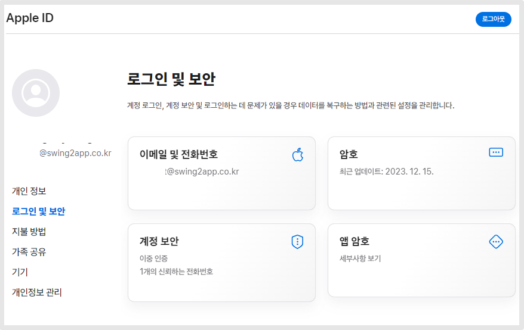
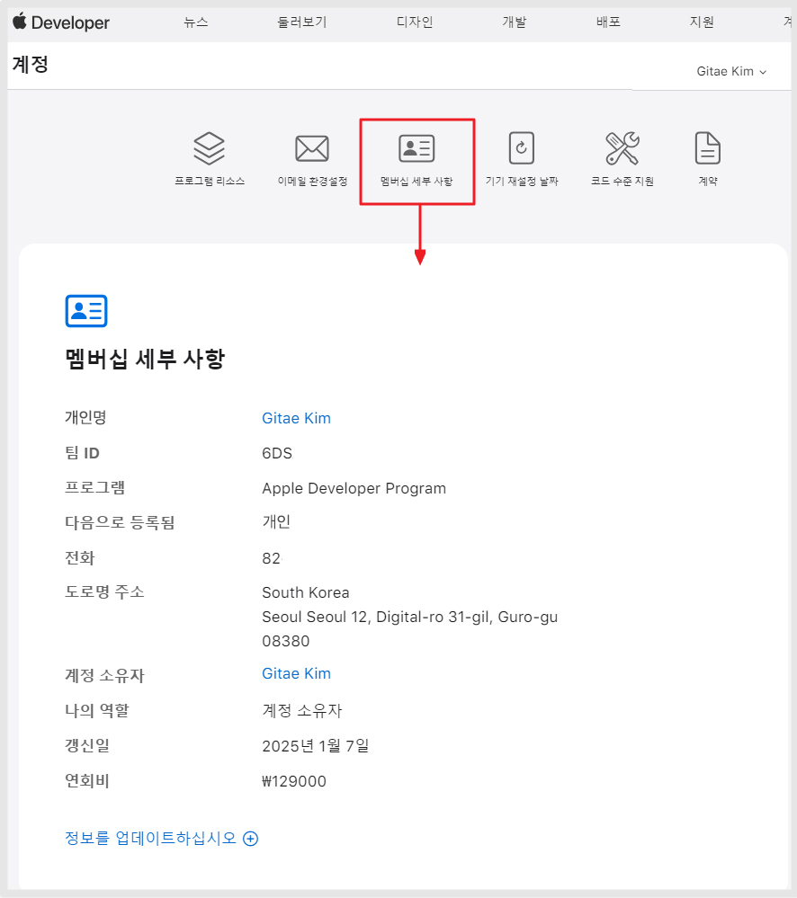

# 앱스토어 애플 개발자계정 등록(개인)

***

앱스토어 앱 출시를 위해서는 애플 개발자 계정을 갖고 있어야 하는데요

먼저 애플 아이디를 갖고 있어야 하며, 해당 계정으로 developer 사이트에 로그인하여 만들 수 있습니다,

만약 애플 아이디가 없다면 Apple account 사이트에서 먼저 가입하여 만들어 주세요.

아이폰 사용 등 이미 아이디가 있다면 바로 Appple developer사이트에 로그인하여 가입을 할 수 있습니다.

해당 매뉴얼은 개인용애플 개발자 계정을 가입하는 방법입니다.

기업 - 애플 개발자 계정 가입 방법은 아래 매뉴얼을 확인해주세요.




**애플 개발자 등록비 1년 129,000원**

**1년마다 등록비 갱신해주셔야 합니다.**&#x20;

멤버십 갱신이 안되면 앱이 앱스토어에서 내려갑니다.

따라서 1년마다 등록비를 결제해서 멤버십 기간을 잘 유지해주시기 바랍니다.&#x20;


***

### <mark style="color:red;">**\*진행 전 먼저 확인해주세요!**</mark>

### <mark style="color:blue;">1.애플 ID가 있나요?</mark>&#x20;

애플 계정은 아이폰 사용자라면 아이폰에 설정된 아이디를 쓰셔도 되며, 애플에 직접 가입한 계정 모두 가능합니다.&#x20;

계정이 있다면 바로 "**STEP1. Apple Developer 로그인" 챕터로 이동하여 가이드대로 진행해주세요.**&#x20;

### <mark style="color:blue;">**2.애플 ID가  없나요?**</mark>

애플 계정이 없다면 먼저 만들어주세요.&#x20;

**애플 ID 생성하기** [**https://appleid.apple.com/account**](https://appleid.apple.com/account)

<figure><figcaption></figcaption></figure>

1\)성, 이름 입력  \*모두 영어로 입력합니다.

2\)대한민국 선택

3\)생년월일 선택: YYYY년MM월DD일

4\)애플 아이디로 사용할 이메일주소 입력합니다.

\*실제 이용 가능한 메일주소여야 합니다.

5\)암호(비밀번호)입력

6\)핸드폰 번호 입력 \*인증받아야 하기 때문에 실제 이용 가능한 번호로 입력합니다.

7\)번호 확인 방법: 문자메시지로 체크해주세요.

<figure><figcaption></figcaption></figure>

8\)동의 내용 체크

9\)보안 문자 입력&#x20;

10\)\[계속] 버튼 선택합니다.&#x20;

<figure><figcaption></figcaption></figure>

11\)입력한 이메일주소로 인증 코드가 발송됩니다.&#x20;

메일을 확인하여 6자리 코드를 입력해주세요.

<figure><figcaption></figcaption></figure>

12\)입력한 핸드폰번호로 인증 코드가 발송됩니다.

문자 메시지를 확인하여  6자리 코드를 입력해주세요.

<figure><figcaption></figcaption></figure>

13\)모든 인증이 완료되면, 아이디 생성이 완료됩니다.

***

## **STEP1.**  Apple Developer **로그인**

애플 개발자 사이트:  [**https://developer.apple.com/**](https://developer.apple.com/)&#x20;

**애플 개발자 사이트로 들어가서, 오른쪽 상단의 \[계정] 버튼을 선택해주세요.**

<figure><figcaption></figcaption></figure>

애플 계정을 소유한 분들 또는 위에서 만든 애플 계정으로 로그인해주세요.

아이디, 비밀번호를 입력해서 로그인해주세요.

<mark style="color:red;">계정이 없다면, 먼저 위에 설명드린 방법으로 애플 사이트에서 ID 생성을 먼저 해주세요.</mark>&#x20;

&#x20;<mark style="color:blue;">**개발자 계약 동의**</mark>

<figure><figcaption></figcaption></figure>

애플 개발자 계약에 동의하는지 확인해주세요.

동의에 체크하고 \[제출] 버튼을 선택합니다.

***

## **STEP2. 가입하기**

<figure><figcaption></figcaption></figure>

Apple Developer Program 가입

&#x20;**\[오늘 등록]** 버튼 선택 합니다.

<figure><figcaption></figcaption></figure>

웹에서 등록 계속 진행하기 선택 (Apple Developer 앱을 통해서도 등록 가능합니다)

<figure><figcaption></figcaption></figure>

가입하는 사용자분의 개인정보를 입력합니다. \*신분증에 기재된 정보와 동일하게 입력해주시면 됩니다.

이름,주소는 모두 영문으로 작성해주세요.

입력 후 \[계속] 버튼을 선택합니다.&#x20;

<figure><figcaption></figcaption></figure>

어떤 자격으로 가입할지 선택해주세요.

개인으로 등록할 경우 개인/개인사업자 선택,    &#x20;

회사 법인 계정으로 등록한다면 회사/기관으로 선택할 수 있습니다.

#### <mark style="color:blue;">**개인/개인사업자 선택 후 \[계속] 버튼 선택**</mark>

<mark style="color:orange;">**다음 가이드에서 법인 등록하는 방법도 안내드리겠습니다.**</mark>&#x20;

<figure><figcaption></figcaption></figure>

<figure><figcaption></figcaption></figure>

동의함에 체크하고 **\[계속] 버튼** 선택합니다.

***

## **STEP3. 결제하기**

<figure><figcaption></figcaption></figure>

\[Purchase] 선택

결제 페이지&#x20;

<figure><figcaption></figcaption></figure>

청구 주소 입력, 연락처 정보를 입력 한뒤 카드 정보를 입력하여 결제를 완료할 수 있습니다.&#x20;


<mark style="color:red;">**\*중요 안내**</mark>&#x20;

<mark style="color:red;">사용자에 따라 카드 결제시 바로 개발자 계정이 승인되는 경우도 있으나,</mark>

<mark style="color:red;">계정이 활성화 되기 까지 시간이 소요되는 경우도 있습니다</mark>.

만약 결제 후 승인이 바로 안되었다면 기다려 주시구요. \*일반적으로 \~48시간 소요됩니다.&#x20;

&#x20;승인이 완료되면 메일이 발송되기 때문에 메일을 받고 앱을 등록할 수 있습니다.&#x20;

\*\* 경우에 따라 애플에서  ‘신분증 제출 요청’ 메일을 보내기도 해요.

모두 발송하는 것은 아니구요. 간혹 개인 확인을 위해 신분증을 요청하기도 합니다.

해당 메일을 받으셨다면, 안내링크를 눌러서 제출해야만 계정 생성과 앱스토어 개발자 등록 절차가 완료됩니다.


&#x20;

***

## **STEP4. 멤버십 등록 완료**

<figure><figcaption></figcaption></figure>

정상적으로 결제가 완료되면, 멤버십 항목이 생성됩니다.

멤버십 세부사항을 선택하면 가입된 정보를 확인할 수 있습니다.&#x20;

개발자 등록한 개인 정보가 표시되며, 갱신일 등의 정보를 확인할 수 있습니다.

멤버십 정보가 표시되어야 정상적으로 등록이 완료된 것입니다.

<figure><figcaption></figcaption></figure>

<figure><figcaption></figcaption></figure>

만약 승인 대기 중 등의 메시지가 뜬 다면 승인완료까지더 기다려 주셔야 합니다.

<figure><figcaption></figcaption></figure>

앱스토어 앱 등록은[ 앱스토어 커넥트 사이트](https://appstoreconnect.apple.com/)로 이동하여 이용할 수 있습니다.




\-앱 등록 및 앱 관리는 모두 App Store Cnnect 사이트에서 이용해주셔야 하구요.

\-개발자 계정 관리는 Apple developer 사이트에서 이용해주시면 됩니다.&#x20;



**1)애플 개발자 등록비 1년 129,000원 , 1년마다 등록비 갱신해주셔야 합니다.**&#x20;

멤버십 갱신이 안되면 앱이 앱스토어에서 내려갑니다.

따라서 1년마다 등록비를 결제해서 멤버십 기간을 잘 유지해주시기 바랍니다.&#x20;

멤버십 연장도 Apple developer 사이트에서 재결제 해주시면 됩니다.&#x20;

**2)개인으로 등록시, 개발자 이름 변경은 불가합니다.**

가입시 등록한 이름(영문)으로만 이용 가능하구요.

개인에서 → 기업으로 변경하는 것은 가능하며, 변경을 원하시면 애플 고객센터를 통해서 요청주셔야 합니다.

3\)애플 developer 고객센터

[https://developer.apple.com/contact/#!/topic/select](https://developer.apple.com/contact/#!/topic/select)

