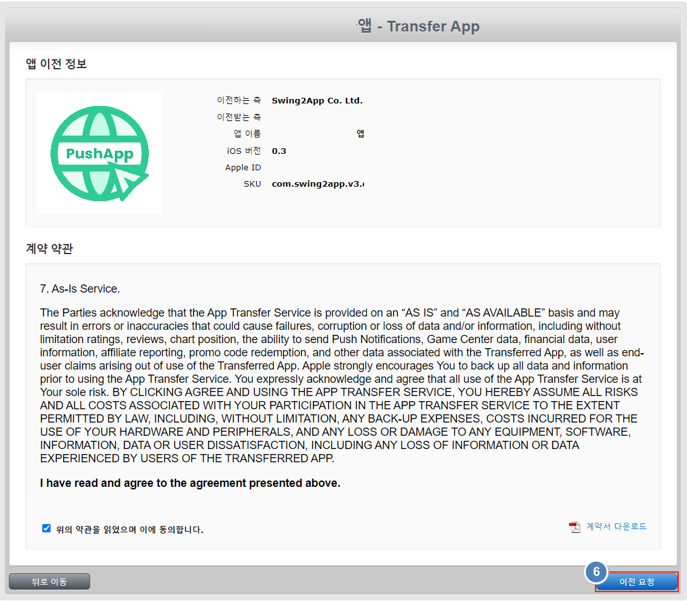

# 앱스토어 앱 이전

***

앱스토어에 앱을 출시하여 사용하는 도중 다른 개발자 계정으로 옮겨야 할 때가 있는데요.

이때 애플에서는 출시된 앱을 그대로 다른 계정으로 옮길 수 있는 앱 이전 서비스를 제공하고 있습니다.

스윙투앱 도움말을 참고하여서, 다른 계정으로 앱을 이전하는 방법을 확인해주세요.&#x20;


### 안내사항

1.앱 이전은, 앱이 앱스토어에 출시가 되어야 있어야 가능합니다.

\*앱 심사 거절 되었거나, 스토어에서 삭제, 애플 개발자 계정 멤버십 종료 등의 상태는 이전이 불가합니다.&#x20;

2.옮기고자 하는 계정이 활성화 되어 있어야 합니다.

개발자 계정으로 아직 등록이 안되어 있거나, 멤버십이 종료되었을 경우 이전이 불가합니다.

3.앱 이전은 계정 소유자가 진행할 수 있습니다.&#x20;



### 앱스토어 앱 이전 준비해야 하는 정보

**1)현재 앱이 등록된 계정 정보(아이디, 비밀번호)**

앱스토어 커넥트에 직접 로그인하여 작업 진행합니다.&#x20;

**2)앱을 이전(옮기고자 하는 계정) 하는 계정 정보 (아이디, 비밀번호),  팀 ID**

계정으로 직접로그인 후 작업 가능하며, 직접 로그인이 불가하면 관리자로 초대가 되어 있어도 작업이 가능합니다.&#x20;


***

[앱스토어 커넥트 사이트](https://appstoreconnect.apple.com/) 접속 후, 옮길 앱 선택

### 1.일반정보 탭에서 '앱 정보' 선택

### 2.화면 하단 추가정보 탭에서 '앱 이전' 선택

<figure><figcaption></figcaption></figure>

***

### 3.이중 인증 번호 입력

<figure><figcaption></figcaption></figure>

\*계정에 따라 이중 인증번호가 생략되기도합니다.&#x20;

만약 매뉴얼에서처럼 이중인증 번호가 뜨면 등록된 계정 소유자의 핸드폰번호로 번호가 전송되오니 인증번호 확인하여 입력해주세요.&#x20;

***

### 4.앱 이전 기준 충족 화면 \[계속] 버튼 선택

<figure><figcaption></figcaption></figure>

앱 이전에 필요한 기준이 모두 충족하는지 화면이 뜹니다.

\*기재된 모든 내용의 기준이 충족해야 다음으로 넘어갑니다.

만약 기준 미달 항목이 있다면 내용 확인 후 완료 후 진행해주세요.

***

### 5.앱 이전 정보 입력 후 \[계속] 버튼 선택

<figure><figcaption></figcaption></figure>

이전 받는 팀 정보를 입력합니다.

1\)이전 받는 측 계정애소유자의 애플 ID 입력

2\)팀 ID입력

<mark style="color:red;">\*팀 ID 확인하는 방법</mark>

[developer.apple](https://developer.apple.com/account) 애플 개발자 사이트 접속-화면 아래 스크롤 "멤버십 세부 사항" 챕터에서 팀ID 확인이 가능합니다.&#x20;

<figure><figcaption>
애플 팀 ID 확인하는 방법
</figcaption></figure>

***

### 6.계약서 '동의합니다' 체크 후 \[이전 요청] 선택

<figure><figcaption></figcaption></figure>

***

<mark style="color:blue;">**--다음은 앱 이전을 받는 계정에서 진행해야 하는 내용입니다.**</mark>

이전 받는 계정으로 로그인 후 [Appstore Connect](https://appstoreconnect.apple.com/)에 접속합니다.&#x20;

### 7.계약, 세금 및 금융거래 선택

<figure><figcaption></figcaption></figure>

커넥트 화면 상단에 앱 이전 요청 수락 대기중 배너를 확인할 수 있습니다.&#x20;

파란색으로 된 "계약, 세금 및 금융거래" 탭해주세요.&#x20;

***

### 8.개발자 이름 선택

<figure><figcaption></figcaption></figure>

비지니스 화면으로 이동합니다.&#x20;

여기서파란색으로 된 개발자 이름을 선택해주세요.&#x20;

***

### 9.검토 선택

<figure><figcaption></figcaption></figure>

화면 하단으로 스크롤, 가장 아래에 보면 \[앱 이전] 항목을 확인할 수 있습니다.

\[검토] 선택합니다.

***

### 10.앱이전에 필요한 정보 입력

### 11.앱이 수집하는 개인정보 : '기존 답변 유지' 체크

### 12.계약 및 이용약관 동의 체크

### 13.화면 상단\[승인]버튼 선택

<figure><figcaption></figcaption></figure>

<mark style="color:blue;">**1)신규 앱 메타 데이터**</mark>

(1)지원 URL 입력 : 홈페이지 링크 입력

(2)마케팅 URL입력:홈페이지 링크 입력&#x20;

<mark style="color:red;">\*홈페이지가 없다면 블로그 등 다른 웹사이트 링크를 입력해주세요.</mark>

<mark style="color:red;">입력하지 않을 경우 다음 단계로 넘어가지 않습니다.</mark>&#x20;

(3)개인정보 처리방침 URL입력&#x20;

<mark style="color:blue;">**2)앱 심사 연락처 정보**</mark>

(1)이름: 계정 소유자 이름 '이름' 영문 입력

(2)성: 계정 소유자 이름 '성' 영문 입력

(3)전화번호 : 국가번호+82 포함하여 핸드폰번호 입력 +821011112222

(4)이메일 주소 입력

<mark style="color:red;">위의 정보는 앱 이전을 받는 계정 소유자 정보로 입력합니다.</mark>&#x20;

<mark style="color:red;">위의 정보는 모두 빠짐없이 입력을 해야 다음 단계로 이동하오니 누락되지 않게 입력을 완료해주세요.</mark>&#x20;

***

### 14.활성화됨

<figure><figcaption></figcaption></figure>

완료되면, 앱 이전 항목에 '활성화됨' 상태를 확인할 수 있습니다.

***

### 15.이전  완료메일

<figure><figcaption></figcaption></figure>

그리고 애플에서 앱 이전 승인이 완료되었다는 내용의 메일을 발송합니다.

해당 메일 까지 받으시면 정상적으로 앱 이전 작업이 모두 완료된 것입니다.&#x20;

앱이전 소요시간은 애플에서 제공하는 매뉴얼에는 48시간 내에 이전이 된다고 안내하고 있구요.

실제 진행시 문제가 없을 경우 작업 후 1시간 이내로는 바로 이전이 됩니다.

다른 애플개발자 계정으로 앱 이전이 필요할 경우 위의 프로세스대로 진행할 수 있습니다.&#x20;

