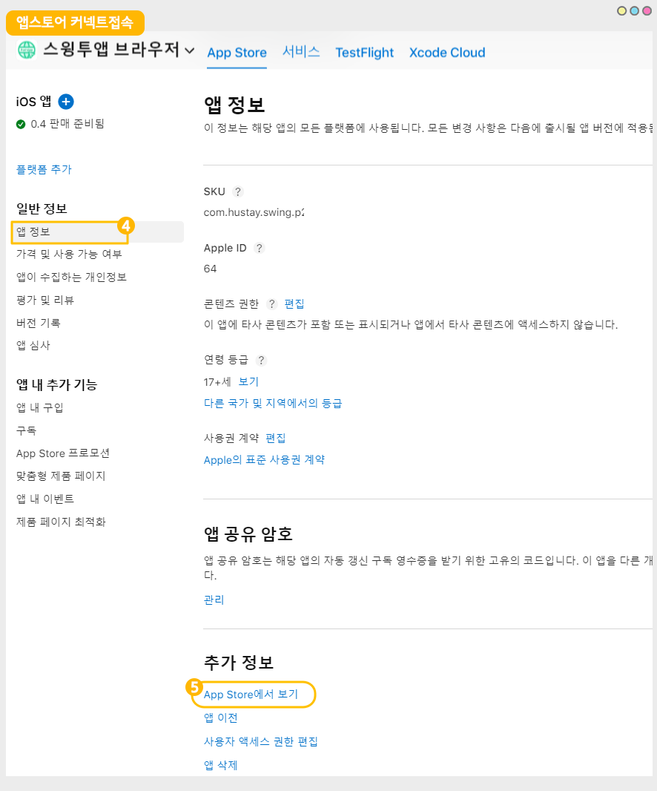

# 앱스토어 앱 출시 링크 확인하는 방법

<figure><figcaption></figcaption></figure>


1\)앱스토어 커넥트 접속 및 로그인 [https://appstoreconnect.apple.com/](https://appstoreconnect.apple.com/)

2\)나의 앱 선택

3\)출시된 앱 선택

4\)왼쪽 카테고리에서 일반정보:앱 정보 선택

5\)화면에서 스크롤해서 아래로 내리면 ‘App Store에서 보기’를 확인할 수 있습니다.

6\)해당 메뉴 선택시 출시 화면으로 이동하며, 상단 사이트 주소란에 보여지는 주소가 해당 앱의 출시 링크입니다.


<figure><figcaption></figcaption></figure>

1\)앱스토어 커넥트 접속 및 로그인 [https://appstoreconnect.apple.com/](https://appstoreconnect.apple.com/)

2\)나의 앱 선택

<figure><figcaption></figcaption></figure>

3\)출시된 앱 선택

<figure><figcaption></figcaption></figure>

4\)왼쪽 카테고리에서 일반정보:앱 정보 선택

5\)화면에서 스크롤해서 아래로 내리면 ‘App Store에서 보기’를 확인할 수 있습니다.

<figure><figcaption></figcaption></figure>

6\)해당 메뉴 선택시 출시 화면으로 이동하며, 상단 사이트 주소란에 보여지는 주소가 해당 앱의 출시 링크입니다.

<figure><figcaption></figcaption></figure>

앱스토어 출시 링크는 앱 이름으로 링크 주소값이 형성되기 때문에 한글로 앱 이름을 설정했다면 주소가 굉장히 길게 나옵니다.

위의 예시로 든 스윙투앱 브라우저 앱의 앱스토어 출시 링크도 아래와 같습니다.

[https://apps.apple.com/us/app/%EC%8A%A4%EC%9C%99%ED%88%AC%EC%95%B1-%EB%B8%8C%EB%9D%BC%EC%9A%B0%EC%A0%80/id6450099622?platform=iphone](https://apps.apple.com/us/app/%EC%8A%A4%EC%9C%99%ED%88%AC%EC%95%B1-%EB%B8%8C%EB%9D%BC%EC%9A%B0%EC%A0%80/id6450099622?platform=iphone)

{% embed url="https://apps.apple.com/us/app/%EC%8A%A4%EC%9C%99%ED%88%AC%EC%95%B1-%EB%B8%8C%EB%9D%BC%EC%9A%B0%EC%A0%80/id6450099622?platform=iphone" %}

URL이 길어서 불편하다면 URL단축 서비스 등을 이용하여  URL길이를 줄일 수 있습니다.

일반적으로 Bitly, TinyURL, Rebrandly 등과 같은 서비스를 사용하여 URL을 단축할 수 있습니다.

단축 예시)[https://bit.ly/3jzXAnA](https://bit.ly/3jzXAnA)



