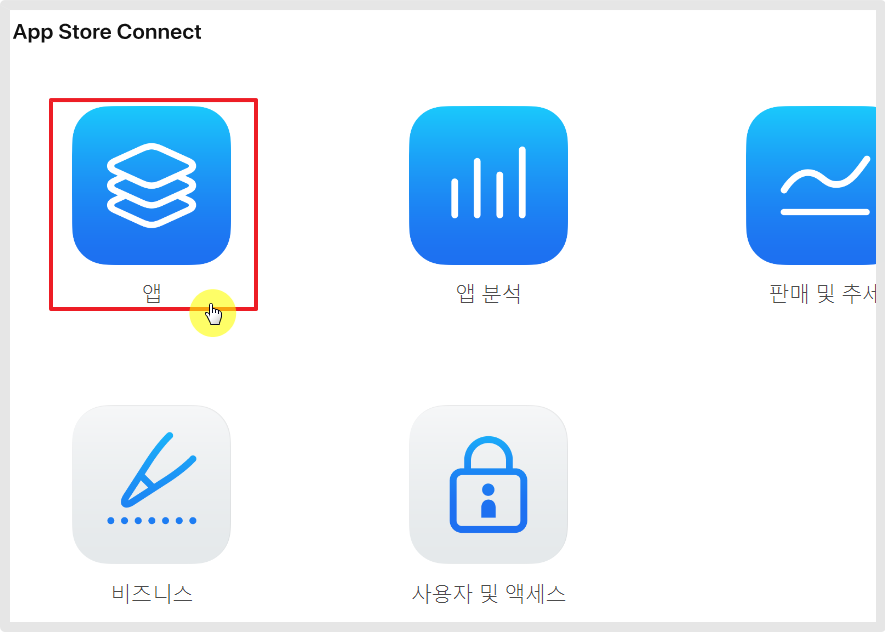
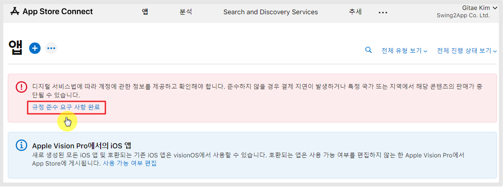
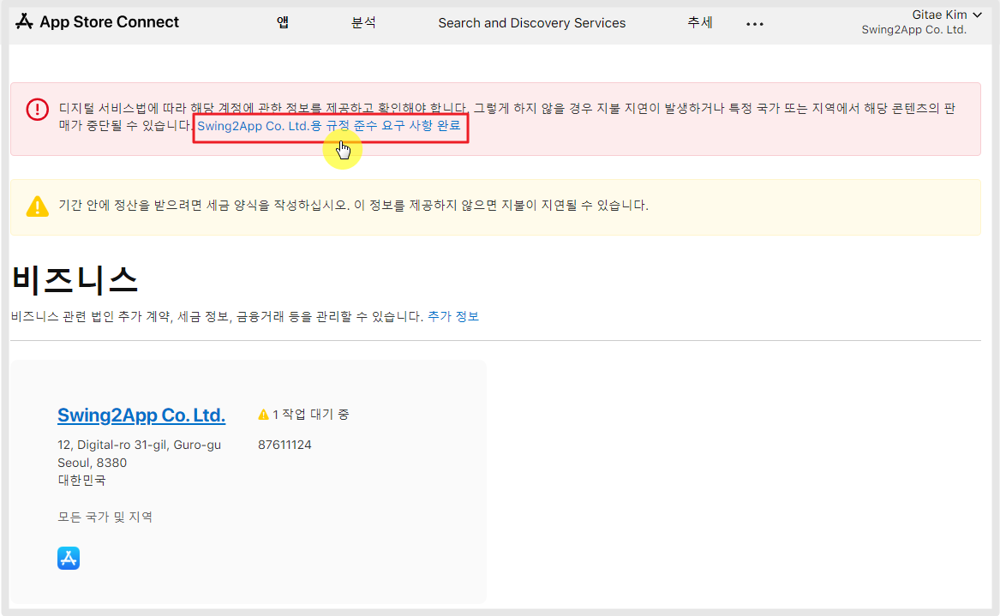
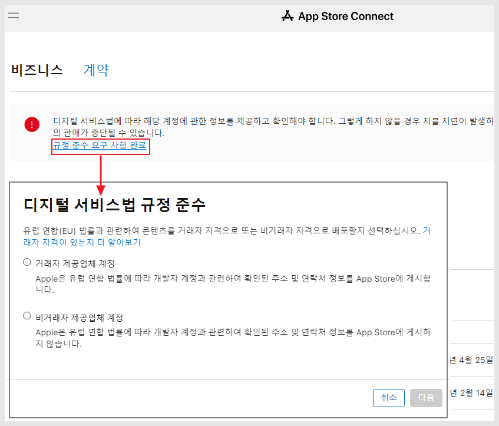
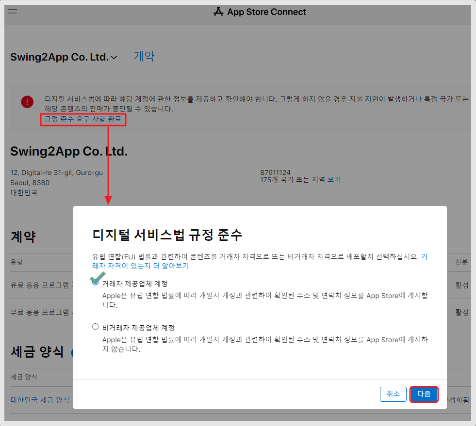
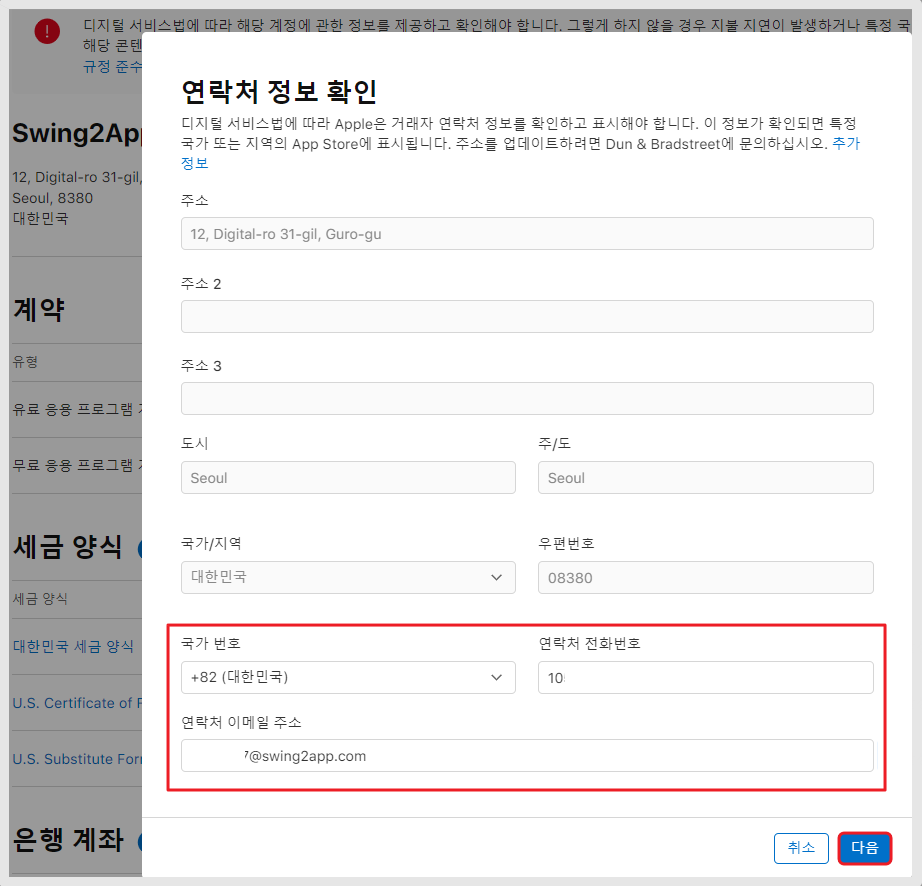
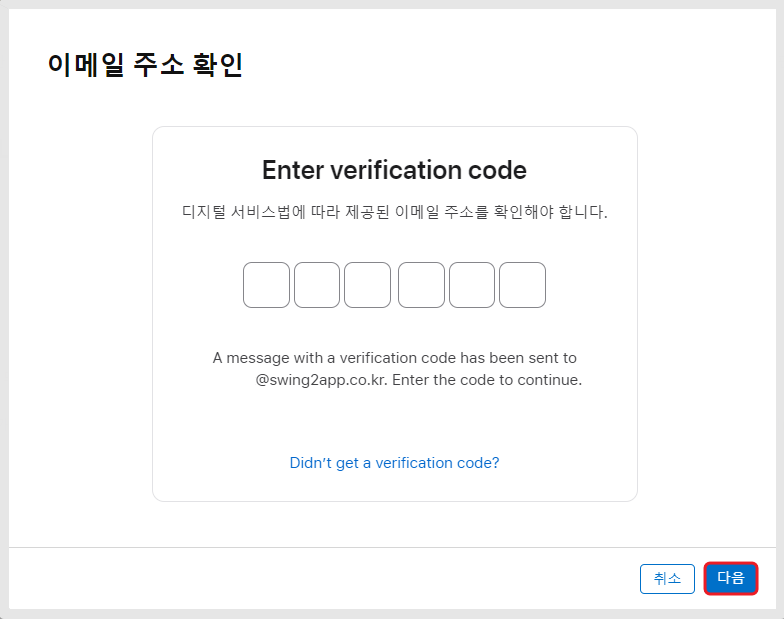
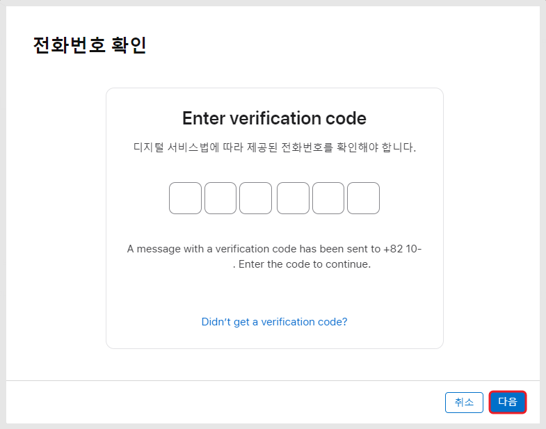
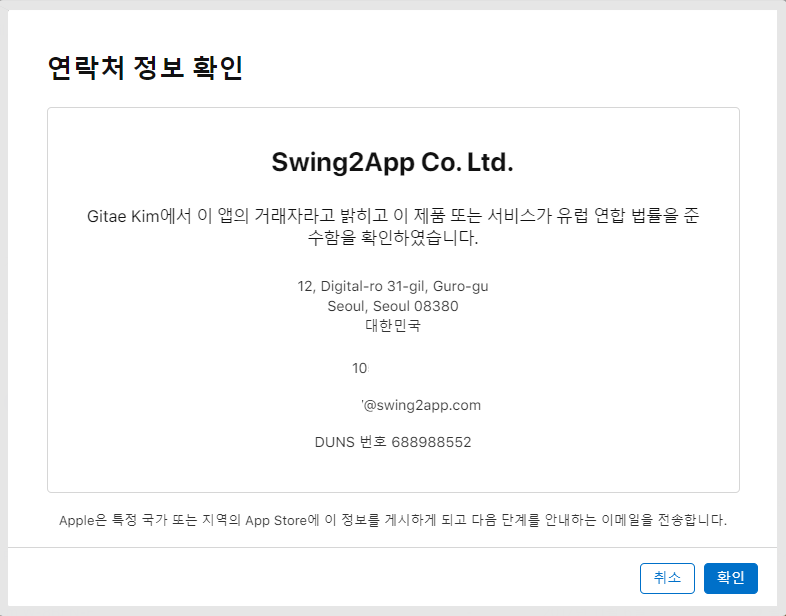
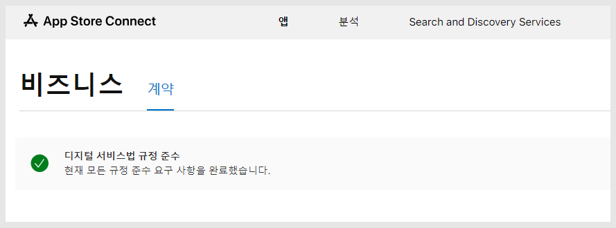

# 앱스토어 '디지털 서비스법 규정' 조치방법 안내

***

애플 앱스토어의 디지털 서비스법이 개정되어, 개발자 분들은 해당 계약건에 대해서 승인 및 추가 조치가 필요합니다.

계정 정보 요청 및 인증 등의 작업을 해주셔야 합니다.

디지털 서비스법 규정 요구사항에 조치 하지 않을 경우 앱스토어에 앱이 삭제될 수 있습니다.

따라서 앱스토어 커넥트 사이트에 로그인했는데 이러한 메시지가 떠있다면, 반드시 빠른 시일 내 조치해주시기 바랍니다.

조치방법은 어렵지 않기 때문에 프로세스를 보시고 진행하실 수 있습니다.

***

## [App Store Connect ](https://appstoreconnect.apple.com/) 접속

<figure><figcaption></figcaption></figure>

[앱스토어 커넥트 사이트](https://appstoreconnect.apple.com/) 접속 후 '앱' 메뉴를 탭해주세요.

<figure><figcaption></figcaption></figure>

앱 대시보드 상단에 경고 조치 메시지를 볼 수 있습니다.&#x20;

**\[규정 준수 요구 사항 완료]**배너를 탭해주세요.


<mark style="color:blue;">**무슨 내용인가요?**</mark>

"디지털 서비스법에 따라 계정에 관한 정보를 제공하고 확인해야 합니다.

않을 경우 결제 지연이 발생하거나 특정 국가 또는 지역에서 해당 콘텐츠의 판매가 중단될 수 있습니다."

\=앱스토어에서 새로운 디지털 서비스법 개정안에 발표되었습니다.

새로운 계약 조건에 따라 개발자는 정보 제공 및 계약에 승인해야 한다는 내용입니다.

이 정책에 조치하지 않을 경우 앱이 삭제됩니다.


<figure><figcaption></figcaption></figure>

다음 페이지에서 **\[OOO용 규정 준수 요구 사항 완료]** 배너 탭 합니다.

​

<figure><figcaption></figcaption></figure>

다음 페이지에서도 **\[규정 준수 요구 사항 완료]** 배너를 탭해주세요.

이때 "디지털 서비스법 규정 준수" 팝업 메시지가 뜨는데요.

거래자 혹은 비거래자 중에서 선택을 해야 합니다.


<mark style="color:orange;">**거래자 or 비거래자? 어떻게 선택해야 하나요?**</mark>

​

1\)애플 개발자 계정 내에 **유료앱이 있어요, 인앱 결제 상품이 있어요, 수익이 발생되거나, 은행 계좌가 연결 되어 있어요, 세금 양식 계약서를 가지고 있어요..**

\=모두 "거래자 제공업체 계정"으로 선택해야 합니다.

​

2\)위의 내용에 해당 되는 것이 없고 무료앱으로만 운영되고 있다면&#x20;

\=모두 "비거래자 제공업체 계정"으로 선택하면 됩니다.


***

## 1.비거래자 제공업체 계정

<figure><figcaption></figcaption></figure>

**"비거래자 제공업체 제공"에 체크하고 \[완료] 버튼만 누르면 끝! 입니다.**&#x20;

더이상 하셔야 할 작업은 없습니다.

거래자 제공업체는 입력해야 할 내용이 더 많기 때문에 아래 프로세스대로 진행해주세요.

***

## 2.거래자 제공업체 계정

<figure><figcaption></figcaption></figure>

'거래자 제공업체 계정' 체크하고 \[다음] 버튼 탭해주세요.

### 1)연락처 정보 확인

<figure><figcaption></figcaption></figure>

\-국가번호 선택 +82

\-핸드폰번호 입력 \*인증번호 받아야 하기 때문에 핸드폰번호를 입력합니다.

\-이메일주소 입력 \*인증번호 받아야 하기 때문에 실제 이용중인 이메일주소로 입력해주세요.

\-\[다음] 버튼

### 2)이메일 주소 확인

<figure><figcaption></figcaption></figure>

입력한 이메일로 인증번호가 발송됩니다. 6자리 입력해주세요.

​

### 3)전화번호 확인

<figure><figcaption></figcaption></figure>

이메일 인증이 완료되면, 이어서 입력한 전화번호 - 인증번호가 발송됩니다. 6자리 입력해주세요.

​

### 4)연락처 정보 확인

<figure><figcaption></figcaption></figure>

인증이 완료되면 연락처 정보 확인 창이 뜹니다.

\[확인] 버튼을 누르면 완료됩니다.

### 5)완료

<figure><figcaption></figcaption></figure>

계약 탭 확인시 \[디지털 서비스법 규정 준수]에 모든 사항을 완료했다는 메시지가 뜹니다.

이렇게 작업하면 완료됩니다.

