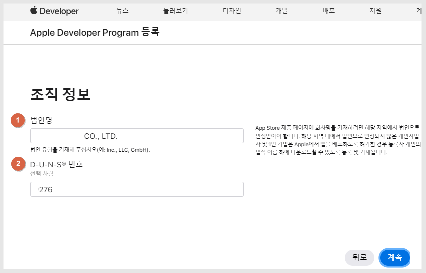
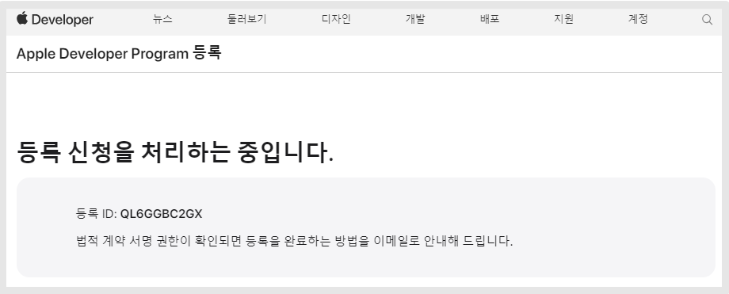
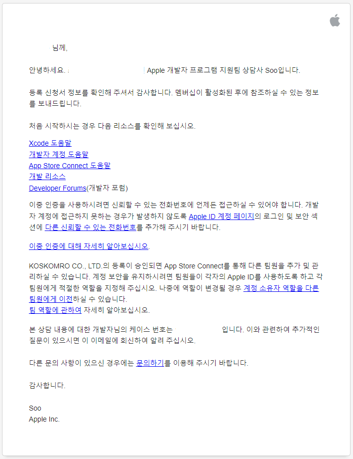
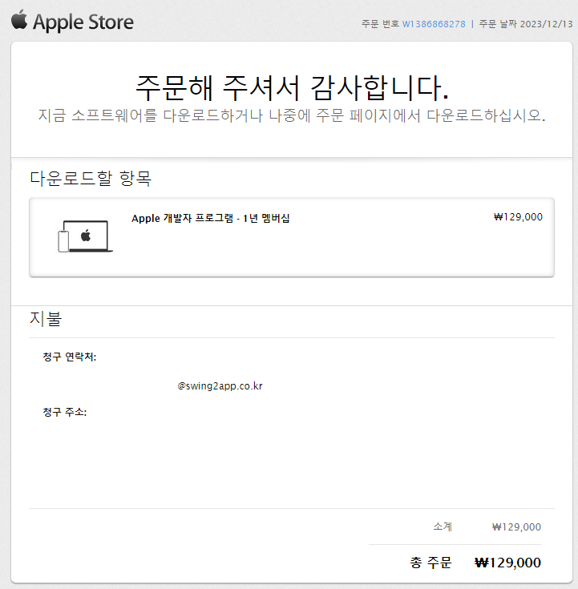
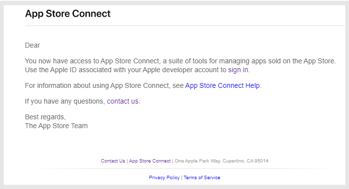

# 앱스토어 애플 개발자계정 등록(기업)

***

앱스토어 앱 출시를 위해서는 애플 개발자 계정을 갖고 있어야 하는데요

먼저 애플 아이디를 갖고 있어야 하며, 해당 계정으로 developer 사이트에 로그인하여 만들 수 있습니다,

만약 애플 아이디가 없다면 Apple account 사이트에서 먼저 가입하여 만들어 주세요.

아이폰 사용 등 이미 아이디가 있다면 바로 Appple developer사이트에 로그인하여 가입을 할 수 있습니다.

해당 매뉴얼은 기업으로 애플 개발자 계정을 가입하는 방법입니다.

개인 가입 방법은 아래 매뉴얼을 확인해주세요.




\*기업 개발자 계정 등록 전 준비해주세요!

기업 개발자는 DUNS넘버를 먼저 받아야 합니다.

DUNS넘버 발행을 받지 않았다면 아래 포스팅을 확인하여 발급받아주세요.

[**DUNS 넘버 발행 방법**](https://blog.naver.com/swing2app/223285873006)

\*최대 일주일이 소요될 수 있으므로 미리 준비해주세요.


***

## _<mark style="color:red;">진행 전 먼저 확인해주세요!</mark>_

### <mark style="color:blue;">**​1.애플 ID가 있나요?**</mark>

아이폰 사용자라면 아이폰에 설정된 아이디를 쓰셔도 되며, 애플에 직접 가입한 계정 모두 가능합니다.

**계정이 있다면 바로 "STEP1. Apple Developer 로그인" 챕터로 이동하여 가이드대로 진행해주세요.**

### <mark style="color:blue;">**2.애플 ID가 없나요?**</mark>

애플 아이디가 없다면 먼저 만들어주세요. [애플 ID 생성하기](https://appleid.apple.com/account)

1\)성, 이름 입력 \*모두 영어로 입력합니다.

4\)애플 아이디로 사용할 이메일주소 입력합니다.

6\)핸드폰 번호 입력 \*인증받아야 하기 때문에 실제 이용 가능한 번호로 입력합니다.

7\)번호 확인 방법: 문자메시지로 체크해주세요.

8\)동의 내용 체크

9\)보안 문자

10\)\[계속] 버튼 선택합니다.

11\)입력한 이메일주소로 인증 코드가 발송됩니다.

12\)입력한 핸드폰번호로 인증 코드가 발송됩니다.

문자 메시지를 확인하여 6자리 코드를 입력해주세요.

13\)모든 인증이 완료되면, 아이디 생성이 완료됩니다.

***

## **STEP1.** Apple Developer **로그인** 

[Apple developer 사이트](https://developer.apple.com/) **접속, 오른쪽 상단의 \[계정] 버튼을 선택해주세요.**

애플 계정을 소유한 분들 또는 위에서 만든 애플 계정으로 로그인해주세요.

계정이 없다면, 먼저 위에 설명드린 방법으로 애플 사이트에서 ID 생성을 먼저 해주세요.

<mark style="color:blue;">**개발자 계약 동의**</mark>

​애플 개발자 계약에 동의하는지 확인해주세요.

모든 항목 동의에 체크하고 \[Submit] 버튼을 선택합니다.

***

## STEP2. 가입하기

Apple Developer Program 가입

\[오늘 등록] 버튼 선택 합니다.

웹에서 등록 계속 진행하기 선택 (Apple Developer 앱을 통해서도 등록 가능합니다)

가입하는 사용자분의 개인정보를 작성합니다. \*신분증에 기재된 정보와 동일하게 입력해주시면 됩니다.

이름, 주소는 모두 영문으로 작성해주세요.

\[계속] 버튼을 선택합니다.

어떤 자격으로 가입할지 선택해주세요.

개인으로 가입한다면, 개인/개인사업자 선택

회사 법인 계정으로 가입한다면 회사/기관으로 선택할 수 있습니다.

​

해당 매뉴얼은 기업용 개발자 등록방법이기 때문에 "회사/기관"을 선택해서 진행할게요.

선택 후 \[계속] 버튼을 선택합니다.

<mark style="color:blue;">**+조직정보**</mark>

<figure><figcaption></figcaption></figure>

1\)법인명을 영문으로 기재해주세요. \*DUNS넘버 발급시 입력된 이름으로 등록합니다.

예를 들어 기업명이 Swing2app이라도 DUNS넘버 발급시 기업명이 Swing2app.CO,LTD.로 표시됩니다.

2\)DUNS넘버 9자리를 기재합니다.

내용 기재 후 \[계속] 버튼을 선택해주세요.


<mark style="color:red;">**\*주의**</mark>

기업은 DUNS넘버를 먼저 받아야 합니다.

DUNS넘버 발행을 받지 않았다면 아래 매뉴얼을 확인하여 발급받아주세요.

[**DUNS넘버 발행 방법 보러가기**](https://documentation.swing2app.co.kr/storedeveloper/duns)

\*최대 일주일이 소요될 수 있으므로 미리 준비해주세요.


<figure><figcaption></figcaption></figure>

조직 정보를 입력해주세요.

모든 내용은 영문으로 입력합니다.

​

1\)법인명

2\)D-U-N-S 번호

3\)주소 (시, 주/도, 우편번호)

4\)지역

5\)웹사이트

6\)전화번호

7\)이메일주소

\*이메일은 웹사이트 도메인명으로 된 메일로 입력해야 합니다.

<mark style="color:purple;">예시)</mark>

도메인: swing2app.co.kr

이메일주소: help@swing2app.do.kr

내용 입력이 완료되면 \[제출] 버튼을 선택해주세요.

​

<figure><figcaption></figcaption></figure>

내용 입력이 완료되면, 등록 신청 처리 중이라는 메시지가 뜨구요.

애플에서 다음 단계 진행방법을 메일로 발송을 해요.

​

<figure><figcaption>
애플에서 발송하는 메일
</figcaption></figure>

가입한 계정 이메일로 애플에서 발송된 메일을 확인하여 마지막 작업을 진행해주셔야 합니다.

***

​

## STEP3. 멤버십 결제하기

메일을 받고 다시 개발자 프로그램에 로그인하시면 아래 처럼 멤버십 구매 페이지가 연동이 됩니다.

<figure><figcaption></figcaption></figure>

\[Purchase] 선택

​

<mark style="color:blue;">**+결제 페이지**</mark>

청구 주소, 연락처 정보를 제출 한뒤 카드 정보를 입력하여 결제를 완료할 수 있습니다.

모든 내용은 영어로 기재해주셔야 하며, 항목이 모두 완료되면 \[주문 검토] 선택합니다.

<mark style="color:blue;">**+결제 완료**</mark>

<figure><figcaption></figcaption></figure>

<figure><figcaption></figcaption></figure>

결제 완료되면 구매 완료 영수증이 발송되구요.

바로 이어서 앱스토어 커넥트 사이트에 접속하여 앱 등록이 가능하다는 메일도 발송됩니다.


**\*중요 안내**

사용자에 따라 카드 결제시 바로 계정이 승인되는 경우도 있으나, 개발자로 활성화 되기 까지 시간이 소요되는 경우도 있습니다.

만약 결제 후 승인이 바로 안되었다면 기다려 주시구요. \*일반적으로 \~48시간 소요됩니다.

승인이 완료되면 메일이 발송되기 때문에 메일을 받고 앱을 출시 할 수 있습니다.

\*\* 경우에 따라 ‘신분증 제출 요청’ 메일을 보내기도 해요.

모두 발송하는 것은 아니구요. 간혹 개인 확인을 위해 신분증을 요청하기도 합니다.

해당 메일을 받으셨다면, 안내링크를 눌러서 제출해야만 계정 생성과 앱스토어 개발자 절차가 완료됩니다.


***

## STEP4. 멤버십 등록 완료

.jpg?alt=media\&token=cad8f7e3-62ed-4701-8b55-b1b9d895eda1)

정상적으로 결제가 완료되면, 멤버십 항목이 생성됩니다.

멤버십 세부사항을 선택하면 가입된 정보를 확인할 수 있습니다.

개발자 등록한 개인 정보가 표시되며, 갱신일 등의 정보를 확인할 수 있습니다.

멤버십 정보가 표시되어야 정상적으로 등록이 완료된 것입니다.

<mark style="color:red;">만약 승인 대기 중 등의 메시지가 뜬 다면 승인완료까지더 기다려 주셔야 합니다.</mark>

앱스토어 앱 출시는 앱스토어 커넥트 사이트로 이동하여 이용할 수 있습니다.


\-앱 등록 및 앱 관리는 모두 [App Store Cnnect](https://appstoreconnect.apple.com/login) 사이트에서 이용해주셔야 하구요.

\-개발자 계정 관리는 [Apple developer](https://developer.apple.com/) 사이트에서 이용해주시면 됩니다.



**1)애플 개발자 멤버십 1년 129,000원 , 1년마다 멤버십 연장(갱신)해주셔야 합니다.**

멤버십 갱신이 안되면 앱이 앱스토어에서 내려갑니다.

따라서 1년마다 멤버십을 결제해서 멤버십 기간을 잘 유지해주시기 바랍니다.

멤버십 연장도 Apple developer 사이트에서 재결제 해주시면 됩니다.

**2)개인으로 등록시, 개발자 이름 변경은 불가합니다.**

가입시 등록한 이름(영문)으로만 이용 가능하구요.

**개인에서 → 기업으로 변경하는 것은 가능하며, 변경을 원하시면 Apple developer 고객센터를 통해서 요청주셔야 합니다.**

**3)기업으로 등록시, 반드시 DUNS 넘버 먼저 발급하여 진행 부탁드립니다.**


